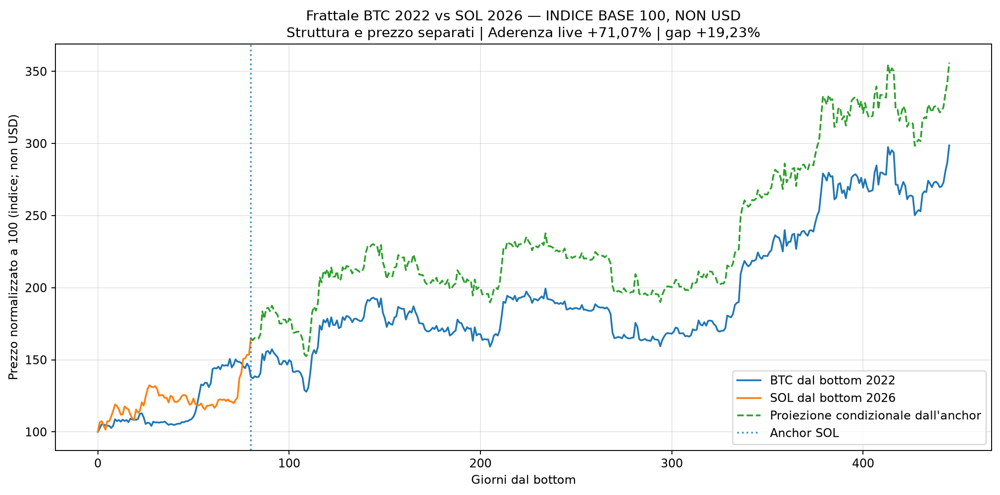
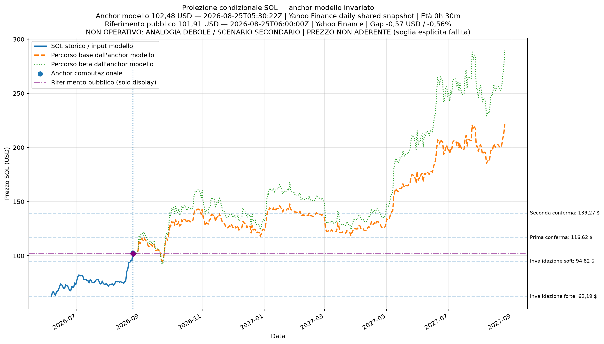
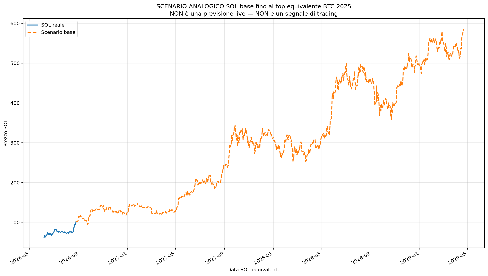
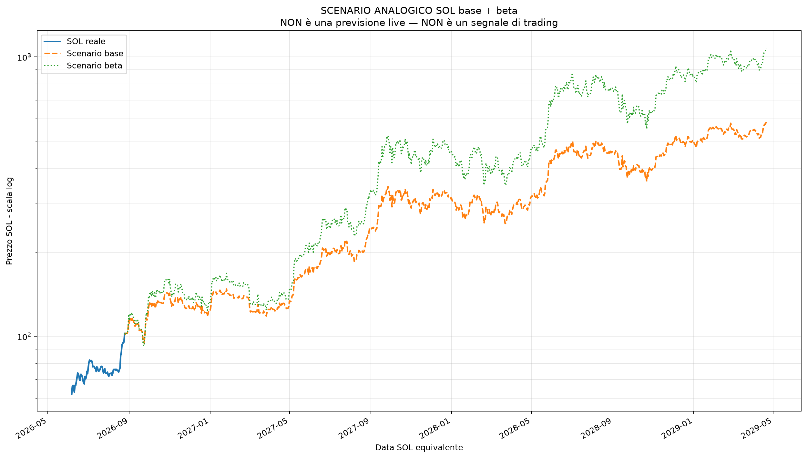
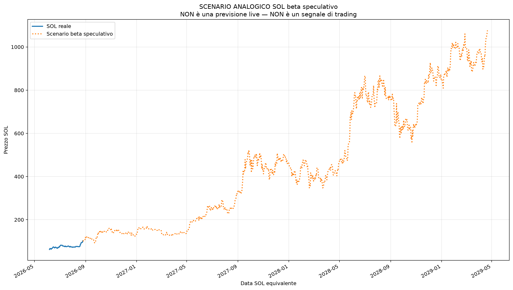
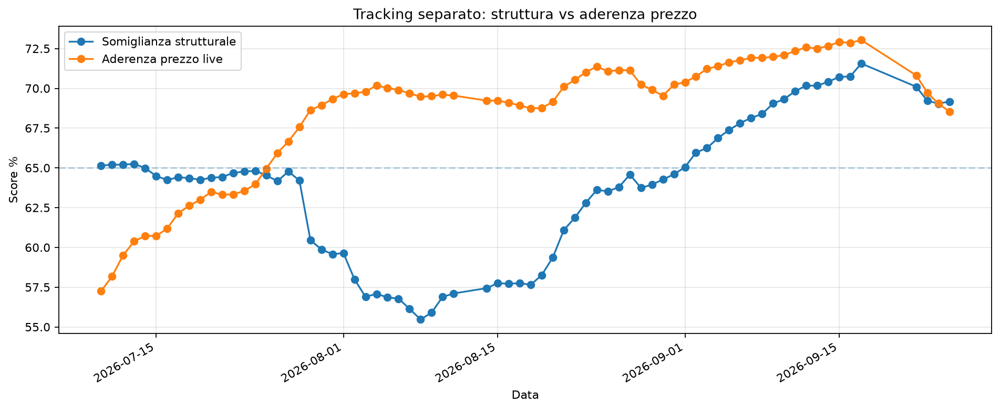

# Frattale mirato: BTC novembre 2022 vs SOL giugno 2026

Generato: **2026-08-25 08:00:28 CEST**
UTC: **2026-08-25 06:00:28 UTC**

Ultima candela SOL usata: **25 agosto 2026**

## SOL PRICE CONTEXT

| Voce | Valore | Provenienza / significato |
| --- | --- | --- |
| Anchor computazionale | 102,48 $ | 2026-08-25T05:30:22Z \| Yahoo Finance daily shared snapshot \| Close 1d |
| Candela anchor completata | NO | Stato esplicito; il valore non viene sostituito dal prezzo pubblico. |
| Riferimento pubblico corrente | 101,91 $ | 2026-08-25T06:00:00Z \| Yahoo Finance \| solo display |
| Età anchor alla generazione | 0h 30m | WITHIN_DAILY_REPORT_CADENCE |
| Gap corrente vs anchor | -0,57000 $ | -0,56% |
| Validità input modello | REPRODUCIBLE_SHARED_SNAPSHOT | Non è una dichiarazione di validità del segnale/trading. |

```text
COMPUTATIONAL_ANCHOR_PRICE=102.4800033569336
COMPUTATIONAL_ANCHOR_FIELD=Close
COMPUTATIONAL_ANCHOR_TIMESTAMP=2026-08-25T05:30:22Z
COMPUTATIONAL_ANCHOR_SYMBOL=SOL-USD
COMPUTATIONAL_ANCHOR_PROVIDER=Yahoo Finance daily shared snapshot
COMPUTATIONAL_ANCHOR_TIMEFRAME=1d
COMPUTATIONAL_ANCHOR_COMPLETED=NO
CURRENT_PUBLIC_REFERENCE_PRICE=101.91000366210938
CURRENT_PUBLIC_REFERENCE_TIMESTAMP=2026-08-25T06:00:00Z
CURRENT_PUBLIC_REFERENCE_ACQUIRED_AT=2026-08-25T06:00:28Z
CURRENT_PUBLIC_REFERENCE_SYMBOL=SOL-USD
CURRENT_PUBLIC_REFERENCE_PROVIDER=Yahoo Finance
CURRENT_PUBLIC_REFERENCE_FIELD=Close
CURRENT_PUBLIC_REFERENCE_TIMEFRAME=1m
CURRENT_PUBLIC_REFERENCE_STATUS=AVAILABLE
ANCHOR_AGE_SECONDS=1806.602413
ANCHOR_AGE_HOURS=0.5018340036111111
CURRENT_VS_ANCHOR_GAP_USD=-0.5699996948242188
CURRENT_VS_ANCHOR_GAP_PCT=-0.5562057729827874
```

Correzione metodologica: questo report separa **somiglianza strutturale** e **aderenza reale del prezzo**.
Un 70% di forma simile non significa che il prezzo sia vicino al percorso BTC scalato.

## Verdetto diretto

**SOL sta seguendo BTC 2022?**

### ANALOGIA DEBOLE / SCENARIO SECONDARIO

**Sintesi:** Esistono alcuni elementi comuni, ma non abbastanza per una conferma.

**Somiglianza strutturale:** +63,53%

**Aderenza prezzo live:** +71,07%

**Errore medio live:** +14,47%

**Gap corrente:** +19,23%

**Fase attuale:** FRATTALE SOLO DI CONTESTO

**Lettura fase:** Il paragone non ha ancora forza operativa.

**Rischio fase:** ALTO

**Prossimo step:** Proiezione condizionale, non conferma operativa: **Spinta rialzista abbastanza pulita.** Zona bassa **101,69 $** intorno al **26 agosto 2026**; zona alta **116,62 $** intorno al **5 settembre 2026**; fine step circa **112,48 $** entro il **8 settembre 2026**.

**Cosa fare:** Osserva soltanto; non usarlo per leva o decisioni principali.

**Affidabilità:** BASSA

### Perché

- Somiglianza strutturale +63,53%.
- Aderenza prezzo live +71,07%.
- Errore medio live +14,47%.
- Gap corrente SOL vs BTC scalato +19,23%.

### Livelli pratici

| Livello | Prezzo / soglia | Significato |
| --- | --- | --- |
| Rientro gap | entro ±12% | Condizione necessaria per tornare operativo. |
| Prima conferma prezzo | 116,62 $ | Rottura iniziale, da accompagnare al rientro del gap. |
| Seconda conferma | 139,27 $ | Scenario più credibile. |
| Invalidazione soft | 94,82 $ | Il setup si indebolisce. |
| Invalidazione forte | 62,19 $ | Il paragone è quasi rotto. |

Per tornare operativo non basta salire: il gap rispetto al BTC scalato deve rientrare circa entro ±12%. La prima conferma di prezzo è 116,62 $, mentre l'invalidazione soft è 94,82 $.

### Metadata aderenza prezzo

```text
OPERATIONAL_VERDICT_REASON=ANALOGIA DEBOLE / SCENARIO SECONDARIO
PRICE_ADHERENCE_FAILED=YES
PRICE_ADHERENCE_LIVE_AVG_GAP_FAILED=NO
PRICE_ADHERENCE_LAST_GAP_FAILED=YES
PRICE_ADHERENCE_LIVE_AVG_GAP_THRESHOLD_PCT=15.0
PRICE_ADHERENCE_LAST_GAP_THRESHOLD_PCT=18.0
PRICE_ADHERENCE_OBSERVED_LIVE_AVG_GAP_PCT=14.465999213913786
PRICE_ADHERENCE_OBSERVED_LAST_GAP_PCT=19.231703560210377
```

## Somiglianza prima e dopo inizio programma

Questa sezione separa la somiglianza della forma dall'aderenza reale del prezzo.

- **Inizio programma/scanner:** 3 luglio 2026
- **Prima del programma** = backtest retroattivo.
- **Da inizio programma** = verifica live: è la parte più importante per l'uso operativo.

| Periodo | Date | Giorni | Aderenza prezzo | Errore medio | Gap ultimo | Stato |
| --- | --- | --- | --- | --- | --- | --- |
| Prima del programma | 6 giugno 2026 -> 2 luglio 2026 | 27 | +87,95% | +6,02% | +21,89% | ABBASTANZA ALLINEATO |
| Da inizio programma | 3 luglio 2026 -> 25 agosto 2026 | 54 | +71,07% | +14,47% | +19,23% | DEVIAZIONE MODERATA |
| Totale dal bottom | 6 giugno 2026 -> 25 agosto 2026 | 81 | +76,70% | +11,65% | +19,23% | DEVIAZIONE MODERATA |

Nota: un frattale può avere una forma simile ma un prezzo distante. In quel caso non è operativo finché il gap non rientra.

## Lettura operativa

Il frattale resta non operativo. Motivo effettivo: ANALOGIA DEBOLE / SCENARIO SECONDARIO.

| Voce | Risposta | Perché |
| --- | --- | --- |
| Uso operativo | NO | Peso 0 per il verdetto: ANALOGIA DEBOLE / SCENARIO SECONDARIO. |
| Aderenza live | +71,07% | Errore medio live +14,47%. |
| Gap corrente | +19,23% | Prezzo non aderente: superata almeno una soglia canonica (15% medio / 18% ultimo). |
| Prima conferma prezzo | 116,62 $ | Serve anche miglioramento del gap, non solo una candela sopra il livello. |
| Seconda conferma | 139,27 $ | Rende più credibile il percorso, ma non sostituisce l'aderenza. |
| Invalidazione soft | 94,82 $ | Sotto questa zona il quadro peggiora. |
| Invalidazione forte | 62,19 $ | Sotto il bottom il paragone è quasi rotto. |

## Tracking giornaliero

**Stato struttura:** STRUTTURA STABILE

Variazione strutturale -0,09%.

| Data | Prezzo SOL | Struttura | Aderenza live | Gap | Verdetto |
| --- | --- | --- | --- | --- | --- |
| 2026-08-19 | 76,92 $ | +58,26% | +68,77% | -16,73% | ANALOGIA DEBOLE / SCENARIO SECONDARIO |
| 2026-08-20 | 84,87 $ | +59,37% | +69,15% | -7,66% | ANALOGIA DEBOLE / SCENARIO SECONDARIO |
| 2026-08-21 | 89,55 $ | +61,09% | +70,11% | -0,97% | ANALOGIA DEBOLE / SCENARIO SECONDARIO |
| 2026-08-22 | 93,70 $ | +61,86% | +70,53% | +4,51% | ANALOGIA DEBOLE / SCENARIO SECONDARIO |
| 2026-08-23 | 93,19 $ | +62,81% | +71,02% | +1,69% | ANALOGIA DEBOLE / SCENARIO SECONDARIO |
| 2026-08-24 | 94,05 $ | +63,62% | +71,37% | +4,08% | ANALOGIA DEBOLE / SCENARIO SECONDARIO |
| 2026-08-25 | 102,48 $ | +63,53% | +71,07% | +19,23% | ANALOGIA DEBOLE / SCENARIO SECONDARIO |

## Grafici

### Frattale sovrapposto

**Scala:** indice normalizzato, base 100. I valori non sono prezzi USD.



### Proiezione condizionale SOL

Blu e proiezioni usano l'anchor computazionale; l'eventuale riferimento pubblico è un marker separato, solo display.



### Ciclo base fino al top BTC 2025

**Scenario analogico in USD: non è una previsione live e non è un segnale di trading.**



### Base + beta in scala logaritmica



### Beta speculativo separato



### Tracking struttura vs aderenza




## Proiezione fino al top BTC 2025

| Voce | Valore | Lettura |
| --- | --- | --- |
| Stato | CONTESTO MACRO, NON OPERATIVO | Non è un segnale d'ingresso. |
| Top BTC 2025 usato | 6 ottobre 2025 - 124.753 $ | Massimo close BTC nella finestra 2025. |
| Data SOL equivalente | 21 aprile 2029 | Data analogica, non previsione certa. |
| Target base dal bottom | 491,43 $ | Scenario base. |
| Target base dall'anchor modello | 585,94 $ | Scenario condizionale dall'input computazionale, non dal riferimento live. |
| Massimo percorso base | 585,94 $ (21 aprile 2029) | Massimo base nel percorso. |
| Massimo beta | 1.077 $ (21 aprile 2029) | Scenario speculativo, non target principale. |

## Prossimi step condizionali

| Step | Date SOL | BTC fine | SOL fine base | Zona bassa | Zona alta | Lettura |
| --- | --- | --- | --- | --- | --- | --- |
| Step 1 - prossime 2 settimane | 25 agosto 2026 -> 8 settembre 2026 | +9,76% | 112,48 $ | 101,69 $ (26 agosto 2026) | 116,62 $ (5 settembre 2026) | Spinta rialzista abbastanza pulita. |
| Step 2 - primo mese | 9 settembre 2026 -> 24 settembre 2026 | -5,44% | 96,91 $ | 94,82 $ (23 settembre 2026) | 111,06 $ (14 settembre 2026) | Prima spike, poi scarico. |
| Step 3 - secondo mese | 25 settembre 2026 -> 24 ottobre 2026 | +35,90% | 139,27 $ | 104,10 $ (25 settembre 2026) | 139,27 $ (24 ottobre 2026) | Spinta rialzista abbastanza pulita. |
| Step 4 - terzo mese | 25 ottobre 2026 -> 23 novembre 2026 | +26,59% | 129,73 $ | 128,11 $ (4 novembre 2026) | 143,19 $ (28 ottobre 2026) | Spinta rialzista abbastanza pulita. |
| Step 5 - quarto mese | 24 novembre 2026 -> 23 dicembre 2026 | +21,36% | 124,37 $ | 120,99 $ (19 dicembre 2026) | 131,91 $ (11 dicembre 2026) | Spinta rialzista abbastanza pulita. |
| Step 6 - estensione 6 mesi | 24 dicembre 2026 -> 21 febbraio 2027 | +36,42% | 139,80 $ | 118,01 $ (28 dicembre 2026) | 147,84 $ (26 gennaio 2027) | Spinta rialzista abbastanza pulita. |

## Proiezione standard a giorni fissi

Queste proiezioni partono dall'anchor computazionale SOL e replicano i movimenti futuri del BTC equivalente. Il riferimento pubblico corrente è solo contesto e non modifica i percorsi.

| Orizzonte | Data SOL | Data BTC eq. | BTC fece | SOL base | SOL beta | Min percorso | Max percorso |
| --- | --- | --- | --- | --- | --- | --- | --- |
| 7 giorni | 1 settembre 2026 | 2023-02-16 | +8,27% | 110,96 $ | 114,07 $ | 101,69 $ | 114,17 $ |
| 14 giorni | 8 settembre 2026 | 2023-02-23 | +9,76% | 112,48 $ | 116,19 $ | 101,69 $ | 116,62 $ |
| 30 giorni | 24 settembre 2026 | 2023-03-11 | -5,44% | 96,91 $ | 95,03 $ | 94,82 $ | 116,62 $ |
| 60 giorni | 24 ottobre 2026 | 2023-04-10 | +35,90% | 139,27 $ | 155,01 $ | 94,82 $ | 139,27 $ |
| 90 giorni | 23 novembre 2026 | 2023-05-10 | +26,59% | 129,73 $ | 140,86 $ | 94,82 $ | 143,19 $ |
| 120 giorni | 23 dicembre 2026 | 2023-06-09 | +21,36% | 124,37 $ | 133,06 $ | 94,82 $ | 143,19 $ |
| 180 giorni | 21 febbraio 2027 | 2023-08-08 | +36,42% | 139,80 $ | 155,80 $ | 94,82 $ | 147,84 $ |
| 365 giorni | 25 agosto 2027 | 2024-02-09 | +116,08% | 221,44 $ | 289,73 $ | 94,82 $ | 221,44 $ |

## Dati base

| Voce | Data | Valore |
| --- | --- | --- |
| BTC bottom usato | 2022-11-21 | 15.787 $ |
| SOL bottom usato | 2026-06-06 | 62,19 $ |
| Anchor computazionale SOL | 25 agosto 2026 | 102,48 $ |
| Giorni SOL dal bottom | - | 80 |
| Data BTC equivalente | 2023-02-09 | - |
| BTC normalizzato equivalente | - | 138,21 |
| SOL normalizzato oggi | - | 164,79 |
| Gap SOL vs BTC equivalente | - | +19,23% |
| Lettura gap | - | SOL è molto sopra il percorso BTC equivalente: la forma può essere simile, ma il prezzo non è aderente. |
| Somiglianza forma prezzo | - | +71,26% |
| Somiglianza ritmo/rendimenti | - | +35,71% |
| Somiglianza RSI | - | +68,02% |
| Somiglianza medie | - | +71,52% |
| Somiglianza strutturale | - | +63,53% |
| Beta volatilità SOL/BTC | - | 1,35 |

## Regola di lettura

- **Struttura alta + aderenza alta** = frattale utile.
- **Struttura alta + aderenza bassa** = forma simile, ma non conferma operativa.
- **Gap oltre ±15/18%** = il prezzo è troppo staccato per assegnare punti al Global.
- **Rientro del gap entro circa ±12%** = primo requisito per rivalutare il frattale.
