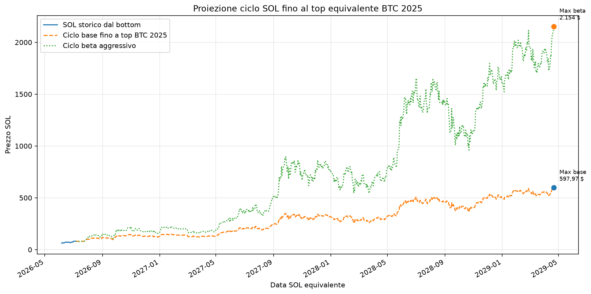

# Frattale mirato: BTC novembre 2022 vs SOL giugno 2026

Generato: **2026-07-06 13:00:16 CEST**  
UTC: **2026-07-06 11:00:16 UTC**

Ultima candela SOL usata: **6 luglio 2026**

Questo report risponde a cinque domande:

1. **SOL sta seguendo il frattale di Bitcoin post-bottom novembre 2022?**
2. **In che fase siamo: anticipo, conferma, o rischio inseguimento?**
3. **Se lo sta seguendo, quali dovrebbero essere i prossimi step con date precise?**
4. **Quanto proietta SOL nel primo anno equivalente?**
5. **Quanto proietta SOL se estendiamo il ciclo fino al top BTC 2025?**

## Verdetto diretto

**SOL sta seguendo BTC 2022?**

### PARZIALMENTE SÌ

**Sintesi:** SOL sta seguendo abbastanza il frattale BTC 2022, ma non in modo perfetto.

**Fase attuale:** FASE ANTICIPATA

**Lettura fase:** Il prezzo è ancora prima della conferma. Qui il potenziale è migliore, ma la certezza è bassa.

**Rischio fase:** MEDIO / ALTO

**Prossimo step:** Prossimo step previsto dal frattale: **Laterale / movimento non forte.** Zona bassa stimata: **79,32 $** intorno al **16 luglio 2026**. Zona alta stimata: **81,10 $** intorno al **11 luglio 2026**. Fine step: circa **80,83 $** entro il **20 luglio 2026**.

**Cosa fare con questa informazione:** Le proiezioni sono utili, ma vanno confermate con i prossimi livelli.

**Affidabilità del frattale:** MEDIA

### Perché

- La forma del prezzo è abbastanza simile.
- La forza RSI conferma abbastanza il paragone.
- La posizione rispetto alle medie mobili è coerente.
- SOL è più avanti o più forte rispetto al BTC equivalente.

### Livelli pratici

| Livello | Prezzo | Significato |
| --- | --- | --- |
| Prima conferma | 108,69 $ | Se SOL rompe questa zona, il frattale BTC 2022 migliora. |
| Seconda conferma | 118,11 $ | Se rompe anche questa, lo scenario rialzista diventa più credibile. |
| Invalidazione soft | 79,32 $ | Se perde questa zona, il frattale si indebolisce. |
| Invalidazione forte | 62,19 $ | Se perde il bottom usato, il paragone con BTC 2022 è quasi rotto. |

La prima zona da controllare è il minimo percorso previsto nei primi 30 giorni. Se SOL perde anche il bottom usato come ancoraggio, il frattale BTC 2022 è praticamente invalidato.

## Lettura operativa

Fase anticipata: ingresso migliore come prezzo, ma certezza ancora bassa. Ha senso ragionare a tranche, non tutto insieme.

| Voce | Risposta | Perché |
| --- | --- | --- |
| Spot anticipato | SÌ, ma a tranche | La zona è ancora prima della conferma piena. |
| Aggiunta su conferma | SÌ | Aggiunta sensata se rompe e tiene 108,69 $. |
| Seconda conferma | 118,11 $ | Sopra questa zona il frattale diventa molto più credibile. |
| Rischio inseguimento | BASSO / MEDIO | Non sei ancora troppo in ritardo, ma serve invalidazione chiara. |
| Invalidazione soft | 79,32 $ | Sotto questa zona il frattale si indebolisce. |
| Invalidazione forte | 62,19 $ | Sotto questa zona il frattale è quasi rotto. |

## Tracking giornaliero del frattale

**Stato tracking:** STORICO INIZIALE

Ho iniziato ora a registrare lo storico. Da domani potrò dire se il frattale migliora o peggiora.

| Data | Prezzo SOL | Somiglianza | Fase | Verdetto |
| --- | --- | --- | --- | --- |
| 2026-07-06 | 80,61 $ | +74,94% | FASE ANTICIPATA | PARZIALMENTE SÌ |

## Grafici

### Grafico 1 - Frattale sovrapposto BTC 2022 vs SOL 2026

Questo grafico normalizza entrambi i prezzi a 100 dal rispettivo bottom. I marker +7g, +14g, +30g, ecc. indicano dove andrebbe SOL se continuasse a seguire BTC.

### Grafico 2 - Proiezione SOL in dollari a 365 giorni

Questo grafico mostra SOL storico, il punto di oggi, i livelli chiave e la proiezione futura in dollari.

### Grafico 3 - Proiezione ciclo fino al top BTC 2025

Questo grafico estende il frattale fino al top BTC 2025 trovato automaticamente.

## Proiezione fino al top bull market BTC 2025

Questa sezione estende il frattale oltre i 365 giorni e cerca automaticamente il massimo BTC nel 2025.

| Voce | Valore | Lettura |
| --- | --- | --- |
| Top BTC 2025 usato | 6 ottobre 2025 - 124.753 $ | Massimo close BTC nella finestra 2025. |
| Moltiplicatore BTC bottom → top | 7,90x | Quanto BTC ha fatto dal bottom 2022 al top 2025. |
| Data SOL equivalente del top | 21 aprile 2029 | Quando cadrebbe il top se SOL seguisse gli stessi tempi. |
| Target ciclo base dal bottom SOL | 491,43 $ | Proiezione pulita bottom-to-top. |
| Target ciclo beta dal bottom SOL | 1.843 $ | Scenario aggressivo, amplificato dalla volatilità SOL. |
| Target ciclo base da oggi | 597,97 $ | Proiezione da prezzo attuale al top equivalente. |
| Target ciclo beta da oggi | 2.154 $ | Scenario molto aggressivo da prezzo attuale. |
| Massimo percorso base | 597,97 $ (21 aprile 2029) | Massimo base lungo tutto il percorso fino al top. |
| Massimo percorso beta | 2.154 $ (21 aprile 2029) | Massimo aggressivo lungo tutto il percorso. |

## Prossimi step se il frattale resta valido

Questa è la parte più pratica: non dice solo il target finale, ma il percorso a step con le date reali per SOL.

| Step | Date SOL previste | Periodo | BTC data equiv. | BTC fine step | SOL fine base | SOL fine beta | Zona bassa + data | Zona alta + data | Lettura |
| --- | --- | --- | --- | --- | --- | --- | --- | --- | --- |
| Step 1 - prossime 2 settimane | 6 luglio 2026 → 20 luglio 2026 | 0-14 giorni | 2023-01-04 | +0,27% | 80,83 $ | 80,97 $ | 79,32 $ (16 luglio 2026) | 81,10 $ (11 luglio 2026) | Laterale / movimento non forte. |
| Step 2 - primo mese | 21 luglio 2026 → 5 agosto 2026 | 15-30 giorni | 2023-01-20 | +34,84% | 108,69 $ | 131,59 $ | 80,70 $ (21 luglio 2026) | 108,69 $ (5 agosto 2026) | Spinta rialzista abbastanza pulita. |
| Step 3 - secondo mese | 6 agosto 2026 → 4 settembre 2026 | 31-60 giorni | 2023-02-19 | +44,66% | 116,61 $ | 147,66 $ | 103,78 $ (26 agosto 2026) | 118,11 $ (3 settembre 2026) | Spinta rialzista abbastanza pulita. |
| Step 4 - terzo mese | 5 settembre 2026 → 4 ottobre 2026 | 61-90 giorni | 2023-03-21 | +67,54% | 135,05 $ | 187,85 $ | 96,76 $ (23 settembre 2026) | 135,05 $ (4 ottobre 2026) | Spinta rialzista abbastanza pulita. |
| Step 5 - quarto mese | 5 ottobre 2026 → 3 novembre 2026 | 91-120 giorni | 2023-04-20 | +67,96% | 135,39 $ | 188,62 $ | 130,09 $ (10 ottobre 2026) | 146,12 $ (28 ottobre 2026) | Spinta rialzista abbastanza pulita. |
| Step 6 - estensione 6 mesi | 4 novembre 2026 → 2 gennaio 2027 | 121-180 giorni | 2023-06-19 | +59,66% | 128,70 $ | 173,59 $ | 120,43 $ (28 dicembre 2026) | 141,56 $ (18 novembre 2026) | Spinta rialzista abbastanza pulita. |

## Proiezione standard a giorni fissi

- **Data SOL prevista**: il giorno reale futuro, per esempio fra 7 / 14 / 30 giorni.
- **Data BTC equivalente**: il giorno del frattale BTC 2022 che corrisponde a quella proiezione.
- **SOL base**: SOL replica la percentuale di BTC.
- **SOL beta**: SOL replica BTC ma con volatilità SOL/BTC.
- **Min percorso**: quanto potrebbe scendere prima di arrivare al prezzo finale dello scenario.
- **Max percorso**: quale zona alta potrebbe toccare durante lo stesso tratto.

| Orizzonte | Data SOL prevista | Data BTC equivalente | BTC fece | SOL base | SOL beta | Min percorso | Min % | Max percorso | Max % |
| --- | --- | --- | --- | --- | --- | --- | --- | --- | --- |
| 7 giorni | 13 luglio 2026 | 2022-12-28 | -1,58% | 79,34 $ | 78,54 $ | 79,34 $ | -1,58% | 81,10 $ | +0,61% |
| 14 giorni | 20 luglio 2026 | 2023-01-04 | +0,27% | 80,83 $ | 80,97 $ | 79,32 $ | -1,61% | 81,10 $ | +0,61% |
| 30 giorni | 5 agosto 2026 | 2023-01-20 | +34,84% | 108,69 $ | 131,59 $ | 79,32 $ | -1,61% | 108,69 $ | +34,84% |
| 60 giorni | 4 settembre 2026 | 2023-02-19 | +44,66% | 116,61 $ | 147,66 $ | 79,32 $ | -1,61% | 118,11 $ | +46,52% |
| 90 giorni | 4 ottobre 2026 | 2023-03-21 | +67,54% | 135,05 $ | 187,85 $ | 79,32 $ | -1,61% | 135,05 $ | +67,54% |
| 120 giorni | 3 novembre 2026 | 2023-04-20 | +67,96% | 135,39 $ | 188,62 $ | 79,32 $ | -1,61% | 146,12 $ | +81,27% |
| 180 giorni | 2 gennaio 2027 | 2023-06-19 | +59,66% | 128,70 $ | 173,59 $ | 79,32 $ | -1,61% | 146,12 $ | +81,27% |
| 365 giorni | 6 luglio 2027 | 2023-12-21 | +160,85% | 210,27 $ | 388,20 $ | 79,32 $ | -1,61% | 211,70 $ | +162,62% |

## Dati base

| Voce | Data | Valore |
| --- | --- | --- |
| BTC bottom usato | 2022-11-21 | 15.787 $ |
| SOL bottom usato | 2026-06-06 | 62,19 $ |
| Ultima data SOL usata | 6 luglio 2026 | - |
| Prezzo SOL attuale | - | 80,61 $ |
| Giorni SOL dal bottom | - | 30 |
| Data BTC equivalente | 2022-12-21 | - |
| BTC normalizzato al giorno equivalente | - | 106,53 |
| SOL normalizzato oggi | - | 129,62 |
| Gap SOL vs BTC equivalente | - | +21,68% |
| Lettura fase | - | SOL è più forte / più avanti del BTC equivalente. |
| Giorni confrontati | - | 31 |
| Somiglianza prezzo | - | +69,49% |
| Somiglianza RSI | - | +83,22% |
| Somiglianza medie | - | +82,91% |
| Somiglianza totale | - | +74,94% |
| Qualità frattale | - | MEDIA |
| Beta volatilità SOL/BTC | - | 1,64 |

## Come leggerlo semplice

- **Fase anticipata**: prezzo migliore, ma certezza bassa.
- **Conferma iniziale**: il frattale sta migliorando, ma una parte della mossa è già partita.
- **Conferma forte**: frattale più chiaro, ma aumenta il rischio di inseguire.
- **Sotto pressione / rotto**: il paragone con BTC 2022 perde valore.
- **Top ciclo BTC 2025**: è una proiezione macro, non un segnale di entrata giornaliero.

La certezza arriva sempre tardi. La parte utile è capire quando il frattale è abbastanza plausibile e dove si invalida.
