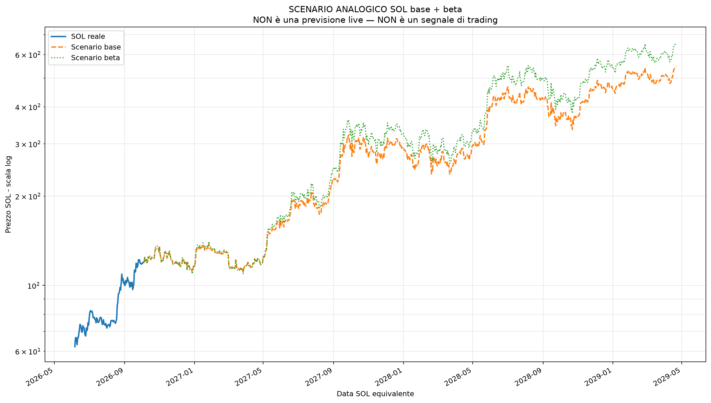
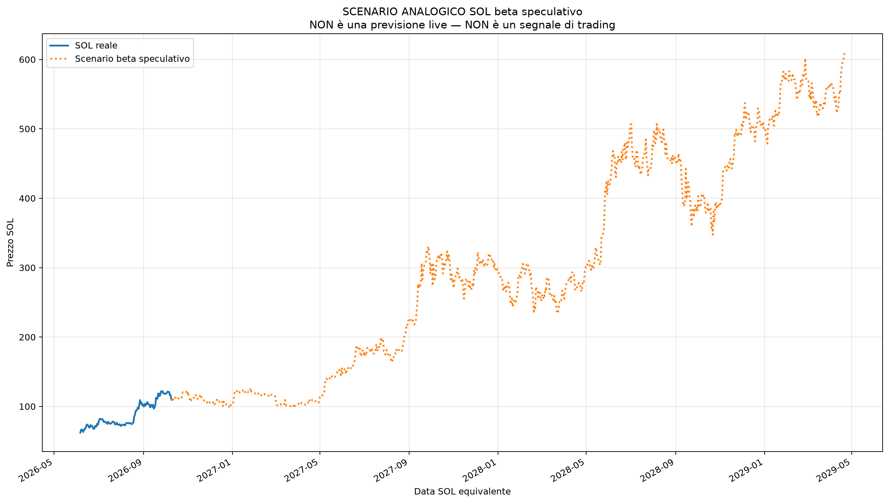

# Frattale mirato: BTC novembre 2022 vs SOL giugno 2026

Generato: **2026-10-06 07:32:18 CEST**
UTC: **2026-10-06 05:32:18 UTC**

Ultima candela SOL usata: **6 ottobre 2026**

## SOL PRICE CONTEXT

| Voce | Valore | Provenienza / significato |
| --- | --- | --- |
| Anchor computazionale | 120,12 $ | 2026-10-06T05:30:21Z \| Yahoo Finance daily shared snapshot \| Close 1d |
| Candela anchor completata | NO | Stato esplicito; il valore non viene sostituito dal prezzo pubblico. |
| Riferimento pubblico corrente | 120,05 $ | 2026-10-06T05:32:00Z \| Yahoo Finance \| solo display |
| Età anchor alla generazione | 0h 1m | WITHIN_DAILY_REPORT_CADENCE |
| Gap corrente vs anchor | -0,07000 $ | -0,06% |
| Validità input modello | REPRODUCIBLE_SHARED_SNAPSHOT | Non è una dichiarazione di validità del segnale/trading. |

```text
COMPUTATIONAL_ANCHOR_PRICE=120.12000274658203
COMPUTATIONAL_ANCHOR_FIELD=Close
COMPUTATIONAL_ANCHOR_TIMESTAMP=2026-10-06T05:30:21Z
COMPUTATIONAL_ANCHOR_SYMBOL=SOL-USD
COMPUTATIONAL_ANCHOR_PROVIDER=Yahoo Finance daily shared snapshot
COMPUTATIONAL_ANCHOR_TIMEFRAME=1d
COMPUTATIONAL_ANCHOR_COMPLETED=NO
CURRENT_PUBLIC_REFERENCE_PRICE=120.05000305175781
CURRENT_PUBLIC_REFERENCE_TIMESTAMP=2026-10-06T05:32:00Z
CURRENT_PUBLIC_REFERENCE_ACQUIRED_AT=2026-10-06T05:32:18Z
CURRENT_PUBLIC_REFERENCE_SYMBOL=SOL-USD
CURRENT_PUBLIC_REFERENCE_PROVIDER=Yahoo Finance
CURRENT_PUBLIC_REFERENCE_FIELD=Close
CURRENT_PUBLIC_REFERENCE_TIMEFRAME=1m
CURRENT_PUBLIC_REFERENCE_STATUS=AVAILABLE
ANCHOR_AGE_SECONDS=117.632157
ANCHOR_AGE_HOURS=0.032675599166666666
CURRENT_VS_ANCHOR_GAP_USD=-0.06999969482421875
CURRENT_VS_ANCHOR_GAP_PCT=-0.058274802883495624
```

Correzione metodologica: questo report separa **somiglianza strutturale** e **aderenza reale del prezzo**.
Un 70% di forma simile non significa che il prezzo sia vicino al percorso BTC scalato.

## Verdetto diretto

**SOL sta seguendo BTC 2022?**

### STRUTTURA ANALOGA, PREZZO NON ADERENTE

**Sintesi:** La geometria ricorda BTC 2022, ma SOL è troppo distante dal percorso scalato per usarlo come conferma operativa.

**Somiglianza strutturale:** +72,32%

**Aderenza prezzo live:** +68,71%

**Errore medio live:** +15,64%

**Gap corrente:** +7,62%

**Fase attuale:** FRATTALE NON CONFERMATO DAL PREZZO

**Lettura fase:** La forma è simile, ma il livello di prezzo è troppo distante. Non è una fase d'ingresso basata sul frattale.

**Rischio fase:** ALTO

**Prossimo step:** Proiezione condizionale, non conferma operativa: **Laterale / movimento non forte.** Zona bassa **115,06 $** intorno al **10 ottobre 2026**; zona alta **120,73 $** intorno al **14 ottobre 2026**; fine step circa **118,89 $** entro il **20 ottobre 2026**.

**Cosa fare:** Non assegnare punti operativi al frattale finché il gap non rientra circa entro ±12% e l'aderenza live non migliora.

**Affidabilità:** BASSA / NON OPERATIVO

### Perché

- Somiglianza strutturale +72,32%.
- Aderenza prezzo live +68,71%.
- Errore medio live +15,64%.
- Gap corrente SOL vs BTC scalato +7,62%.

### Livelli pratici

| Livello | Prezzo / soglia | Significato |
| --- | --- | --- |
| Rientro gap | entro ±12% | Condizione necessaria per tornare operativo. |
| Prima conferma prezzo | 126,13 $ | Rottura iniziale, da accompagnare al rientro del gap. |
| Seconda conferma | 134,53 $ | Scenario più credibile. |
| Invalidazione soft | 114,11 $ | Il setup si indebolisce. |
| Invalidazione forte | 62,19 $ | Il paragone è quasi rotto. |

Per tornare operativo non basta salire: il gap rispetto al BTC scalato deve rientrare circa entro ±12%. La prima conferma di prezzo è 126,13 $, mentre l'invalidazione soft è 114,11 $.

### Metadata aderenza prezzo

```text
OPERATIONAL_VERDICT_REASON=STRUTTURA ANALOGA, PREZZO NON ADERENTE
PRICE_ADHERENCE_FAILED=YES
PRICE_ADHERENCE_LIVE_AVG_GAP_FAILED=YES
PRICE_ADHERENCE_LAST_GAP_FAILED=NO
PRICE_ADHERENCE_LIVE_AVG_GAP_THRESHOLD_PCT=15.0
PRICE_ADHERENCE_LAST_GAP_THRESHOLD_PCT=18.0
PRICE_ADHERENCE_OBSERVED_LIVE_AVG_GAP_PCT=15.643292998805897
PRICE_ADHERENCE_OBSERVED_LAST_GAP_PCT=7.62077148068625
```

## Somiglianza prima e dopo inizio programma

Questa sezione separa la somiglianza della forma dall'aderenza reale del prezzo.

- **Inizio programma/scanner:** 3 luglio 2026
- **Prima del programma** = backtest retroattivo.
- **Da inizio programma** = verifica live: è la parte più importante per l'uso operativo.

| Periodo | Date | Giorni | Aderenza prezzo | Errore medio | Gap ultimo | Stato |
| --- | --- | --- | --- | --- | --- | --- |
| Prima del programma | 6 giugno 2026 -> 2 luglio 2026 | 27 | +87,95% | +6,02% | +21,89% | ABBASTANZA ALLINEATO |
| Da inizio programma | 3 luglio 2026 -> 6 ottobre 2026 | 96 | +68,71% | +15,64% | +7,62% | STACCATO / NON ADERENTE |
| Totale dal bottom | 6 giugno 2026 -> 6 ottobre 2026 | 123 | +72,94% | +13,53% | +7,62% | DEVIAZIONE MODERATA |

Nota: un frattale può avere una forma simile ma un prezzo distante. In quel caso non è operativo finché il gap non rientra.

## Lettura operativa

Il frattale resta non operativo. Motivo effettivo: STRUTTURA ANALOGA, PREZZO NON ADERENTE.

| Voce | Risposta | Perché |
| --- | --- | --- |
| Uso operativo | NO | Peso 0 per il verdetto: STRUTTURA ANALOGA, PREZZO NON ADERENTE. |
| Aderenza live | +68,71% | Errore medio live +15,64%. |
| Gap corrente | +7,62% | Prezzo non aderente: superata almeno una soglia canonica (15% medio / 18% ultimo). |
| Prima conferma prezzo | 126,13 $ | Serve anche miglioramento del gap, non solo una candela sopra il livello. |
| Seconda conferma | 134,53 $ | Rende più credibile il percorso, ma non sostituisce l'aderenza. |
| Invalidazione soft | 114,11 $ | Sotto questa zona il quadro peggiora. |
| Invalidazione forte | 62,19 $ | Sotto il bottom il paragone è quasi rotto. |

## Tracking giornaliero

**Stato struttura:** STRUTTURA STABILE

Variazione strutturale +0,24%.

| Data | Prezzo SOL | Struttura | Aderenza live | Gap | Verdetto |
| --- | --- | --- | --- | --- | --- |
| 2026-09-29 | 117,81 $ | +70,73% | +67,72% | +19,38% | STRUTTURA ANALOGA, PREZZO NON ADERENTE |
| 2026-09-30 | 119,12 $ | +70,80% | +67,91% | +10,27% | STRUTTURA ANALOGA, PREZZO NON ADERENTE |
| 2026-10-02 | 122,43 $ | +71,48% | +68,14% | +10,85% | STRUTTURA ANALOGA, PREZZO NON ADERENTE |
| 2026-10-03 | 119,53 $ | +71,59% | +68,36% | +9,28% | STRUTTURA ANALOGA, PREZZO NON ADERENTE |
| 2026-10-04 | 121,45 $ | +71,87% | +68,49% | +9,42% | STRUTTURA ANALOGA, PREZZO NON ADERENTE |
| 2026-10-05 | 120,09 $ | +72,09% | +68,61% | +11,64% | STRUTTURA ANALOGA, PREZZO NON ADERENTE |
| 2026-10-06 | 120,12 $ | +72,32% | +68,71% | +7,62% | STRUTTURA ANALOGA, PREZZO NON ADERENTE |

## Grafici

### Frattale sovrapposto

**Scala:** indice normalizzato, base 100. I valori non sono prezzi USD.


### Proiezione condizionale SOL

Blu e proiezioni usano l'anchor computazionale; l'eventuale riferimento pubblico è un marker separato, solo display.


### Ciclo base fino al top BTC 2025

**Scenario analogico in USD: non è una previsione live e non è un segnale di trading.**


### Base + beta in scala logaritmica



### Beta speculativo separato



### Tracking struttura vs aderenza


## Proiezione fino al top BTC 2025

| Voce | Valore | Lettura |
| --- | --- | --- |
| Stato | CONTESTO MACRO, NON OPERATIVO | Non è un segnale d'ingresso. |
| Top BTC 2025 usato | 6 ottobre 2025 - 124.753 $ | Massimo close BTC nella finestra 2025. |
| Data SOL equivalente | 21 aprile 2029 | Data analogica, non previsione certa. |
| Target base dal bottom | 491,43 $ | Scenario base. |
| Target base dall'anchor modello | 528,88 $ | Scenario condizionale dall'input computazionale, non dal riferimento live. |
| Massimo percorso base | 528,88 $ (21 aprile 2029) | Massimo base nel percorso. |
| Massimo beta | 629,09 $ (21 aprile 2029) | Scenario speculativo, non target principale. |

## Prossimi step condizionali

| Step | Date SOL | BTC fine | SOL fine base | Zona bassa | Zona alta | Lettura |
| --- | --- | --- | --- | --- | --- | --- |
| Step 1 - prossime 2 settimane | 6 ottobre 2026 -> 20 ottobre 2026 | -1,02% | 118,89 $ | 115,06 $ (10 ottobre 2026) | 120,73 $ (14 ottobre 2026) | Laterale / movimento non forte. |
| Step 2 - primo mese | 21 ottobre 2026 -> 5 novembre 2026 | -1,82% | 117,93 $ | 115,64 $ (4 novembre 2026) | 129,24 $ (28 ottobre 2026) | Prima spike, poi scarico. |
| Step 3 - secondo mese | 6 novembre 2026 -> 5 dicembre 2026 | -5,23% | 113,83 $ | 113,42 $ (4 dicembre 2026) | 125,21 $ (18 novembre 2026) | Prima spike, poi scarico. |
| Step 4 - terzo mese | 6 dicembre 2026 -> 4 gennaio 2027 | +5,98% | 127,30 $ | 106,51 $ (28 dicembre 2026) | 127,30 $ (4 gennaio 2027) | Prima retest / debolezza, poi recupero. |
| Step 5 - quarto mese | 5 gennaio 2027 -> 3 febbraio 2027 | +5,56% | 126,80 $ | 126,30 $ (2 febbraio 2027) | 133,44 $ (26 gennaio 2027) | Leggera continuazione rialzista. |
| Step 6 - estensione 6 mesi | 4 febbraio 2027 -> 4 aprile 2027 | -3,96% | 115,36 $ | 106,68 $ (27 marzo 2027) | 127,54 $ (5 febbraio 2027) | Prima spike, poi scarico. |

## Proiezione standard a giorni fissi

Queste proiezioni partono dall'anchor computazionale SOL e replicano i movimenti futuri del BTC equivalente. Il riferimento pubblico corrente è solo contesto e non modifica i percorsi.

| Orizzonte | Data SOL | Data BTC eq. | BTC fece | SOL base | SOL beta | Min percorso | Max percorso |
| --- | --- | --- | --- | --- | --- | --- | --- |
| 7 giorni | 13 ottobre 2026 | 2023-03-30 | -1,06% | 118,85 $ | 118,70 $ | 115,06 $ | 120,18 $ |
| 14 giorni | 20 ottobre 2026 | 2023-04-06 | -1,02% | 118,89 $ | 118,75 $ | 115,06 $ | 120,73 $ |
| 30 giorni | 5 novembre 2026 | 2023-04-22 | -1,82% | 117,93 $ | 117,68 $ | 115,06 $ | 129,24 $ |
| 60 giorni | 5 dicembre 2026 | 2023-05-22 | -5,23% | 113,83 $ | 113,12 $ | 113,42 $ | 129,24 $ |
| 90 giorni | 4 gennaio 2027 | 2023-06-21 | +5,98% | 127,30 $ | 128,17 $ | 106,51 $ | 129,24 $ |
| 120 giorni | 3 febbraio 2027 | 2023-07-21 | +5,56% | 126,80 $ | 127,60 $ | 106,51 $ | 133,44 $ |
| 180 giorni | 4 aprile 2027 | 2023-09-19 | -3,96% | 115,36 $ | 114,81 $ | 106,51 $ | 133,44 $ |
| 365 giorni | 6 ottobre 2027 | 2024-03-22 | +125,10% | 270,39 $ | 297,33 $ | 106,51 $ | 309,83 $ |

## Dati base

| Voce | Data | Valore |
| --- | --- | --- |
| BTC bottom usato | 2022-11-21 | 15.787 $ |
| SOL bottom usato | 2026-06-06 | 62,19 $ |
| Anchor computazionale SOL | 6 ottobre 2026 | 120,12 $ |
| Giorni SOL dal bottom | - | 122 |
| Data BTC equivalente | 2023-03-23 | - |
| BTC normalizzato equivalente | - | 179,47 |
| SOL normalizzato oggi | - | 193,15 |
| Gap SOL vs BTC equivalente | - | +7,62% |
| Lettura gap | - | SOL è sopra il percorso BTC equivalente. |
| Somiglianza forma prezzo | - | +86,93% |
| Somiglianza ritmo/rendimenti | - | +38,86% |
| Somiglianza RSI | - | +70,70% |
| Somiglianza medie | - | +69,48% |
| Somiglianza strutturale | - | +72,32% |
| Beta volatilità SOL/BTC | - | 1,12 |

## Regola di lettura

- **Struttura alta + aderenza alta** = frattale utile.
- **Struttura alta + aderenza bassa** = forma simile, ma non conferma operativa.
- **Gap oltre ±15/18%** = il prezzo è troppo staccato per assegnare punti al Global.
- **Rientro del gap entro circa ±12%** = primo requisito per rivalutare il frattale.
