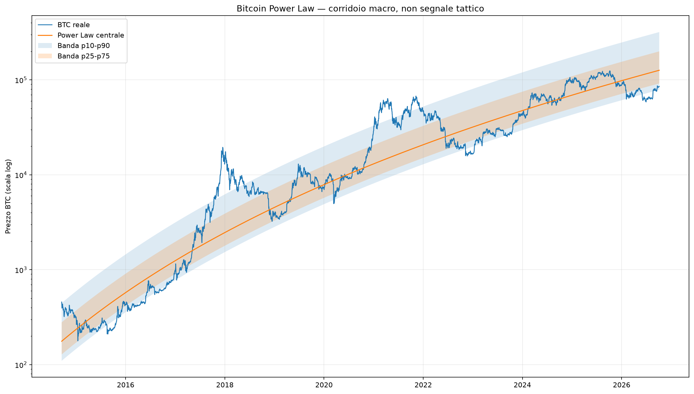
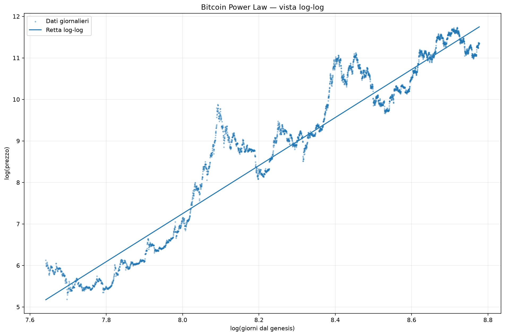
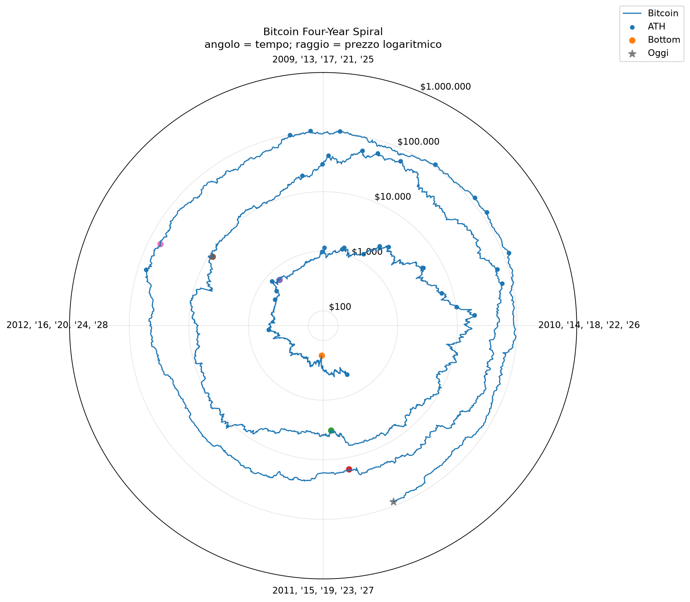
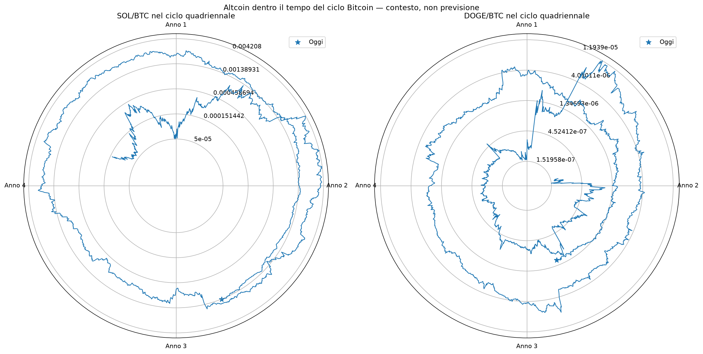

# Bitcoin Macro Cycle — Power Law e Four-Year Spiral

Generato: 2026-10-05 05:33 UTC

Questo modulo descrive il contesto macro di Bitcoin. Non genera entrate tattiche, non autorizza leva e pesa **0** nel Global Confluence.

## Sintesi

| Voce | Valore | Lettura |
| --- | --- | --- |
| Prezzo BTC | 85.471 $ | prezzo corrente |
| Power Law centrale | 126.345 $ | deviazione -32,35% |
| Banda p10-p90 | 78.622 $ / 319.104 $ | BASSA NEL CORRIDOIO |
| Percentile residuo | 18,02% | posizione storica nel corridoio |
| Esponente β | 5,7885 | R² log-log 91,94% |
| Stabilità β | BASSA | range 1,3159 cambiando finestra |
| Ultimo halving | 2024-04-19 | 899 giorni fa |
| Fase ciclo | 61,53% | percentuale indicativa del ciclo quadriennale |
| Peso Global | 0 | CONTESTO MACRO / DIAGNOSTICO |

La Power Law viene trattata come regressione empirica, non come legge fisica. Il report mostra quanto cambia l'esponente usando finestre iniziali diverse e la confronta con il benchmark ingenuo 'prezzo invariato'.

## Bitcoin Power Law

- Campione: 2014-09-17 → 2026-10-05 (4401 osservazioni)
- Formula stimata: prezzo ≈ exp(-38.9357) × giorni^5.7885
- Prezzo centrale oggi: **126.345 $**
- Posizione corrente: **BASSA NEL CORRIDOIO**, percentile 18,02%
- Scarto dal centro: **-32,35%**

### Stabilità dell'esponente

| Inizio campione | β | R² log-log |
| --- | --- | --- |
| 2014 | 5,7885 | 91,94% |
| 2015 | 5,8688 | 91,48% |
| 2016 | 5,5511 | 87,76% |
| 2017 | 4,8266 | 83,03% |
| 2018 | 4,5529 | 78,60% |

### Backtest walk-forward contro prezzo invariato

| Orizzonte | Controlli | Vittorie vs naive | Errore mediano modello | Errore mediano naive |
| --- | --- | --- | --- | --- |
| 90g | 81 | 28,40% | 50,97% | 20,89% |
| 180g | 81 | 41,98% | 59,41% | 47,18% |
| 365g | 81 | 58,02% | 72,28% | 81,57% |
| 730g | 81 | 58,02% | 72,72% | 108,81% |

## Bitcoin Four-Year Spiral

Nel grafico l'angolo rappresenta il tempo dentro una finestra di quattro anni e il raggio rappresenta il prezzo in scala logaritmica. ATH, bottom storici e halving sono marker descrittivi: la spirale rende visibili le ricorrenze, ma non dimostra che il ciclo futuro debba ripetersi.

## Stessa fase dei cicli halving precedenti

| Ciclo | Data analoga | +30g | +90g | +180g | +365g |
| --- | --- | --- | --- | --- | --- |
| 2012-11-28 → 2016-07-09 | 2015-02-18 | +10,76% | -1,85% | +9,16% | +78,72% |
| 2016-07-09 → 2020-05-11 | 2018-11-19 | -23,10% | -24,58% | +49,26% | +68,45% |
| 2020-05-11 → 2024-04-19 | 2022-10-13 | -13,33% | -7,47% | +55,99% | +38,59% |

Campione molto piccolo: questi rendimenti sono contesto di ciclo, non probabilità affidabili.

## SOL/BTC e DOGE/BTC dentro il tempo Bitcoin

| Asset | Coppia | Forza vs BTC | Score raw | Candidato | 30g | Peso Global |
| --- | --- | --- | --- | --- | --- | --- |
| SOL | SOL/BTC | SOVRAPERFORMA BTC | 6 | 1 | 9.765626847411157 | 0 |
| DOGE | DOGE/BTC | RELATIVA MISTA / NON CONFERMATA | -2 | 0 | 4.277045416255043 | 0 |

## Tracker live Power Law

| Orizzonte | Controlli | Vittorie vs naive | Errore modello | Errore naive | Stato |
| --- | --- | --- | --- | --- | --- |
| 90g | 0 | n/a | n/a | n/a | RACCOLTA LIVE / PESO 0 |
| 180g | 0 | n/a | n/a | n/a | RACCOLTA LIVE / PESO 0 |
| 365g | 0 | n/a | n/a | n/a | RACCOLTA LIVE / PESO 0 |

Il modulo resta a peso 0 anche con un buon backtest. Prima si osserva la verifica live, poi si decide se usarlo soltanto per il rischio macro di lungo periodo. Le fotografie live della Power Law vengono salvate una sola volta per mese, così non si contano come indipendenti previsioni giornaliere quasi identiche.

## File prodotti

- `reports/btc_power_law_metrics.csv`
- `reports/btc_power_law_backtest.csv`
- `reports/btc_cycle_phase_metrics.csv`
- `reports/btc_macro_cycle_history.csv`
- `reports/btc_macro_cycle_tracker_metrics.csv`
