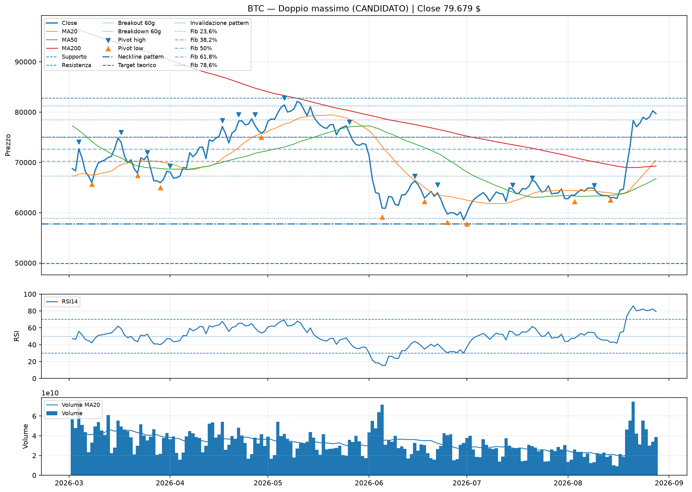
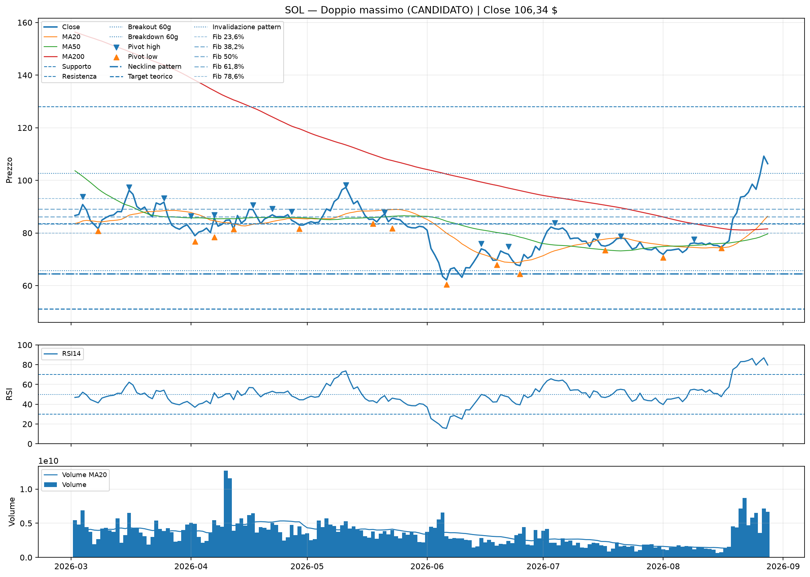
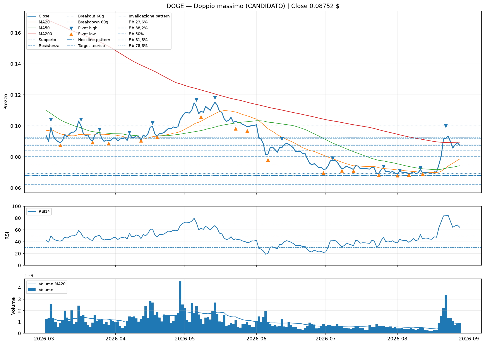

# Classic technical visual report

Generato: 2026-08-28 08:02 UTC

Questo report crea grafici visivi dei pattern tecnici principali. Serve per vedere il grafico e il ciclo di vita dei pattern; non aggiunge automaticamente punteggio al Global.

Regola anti-pattern-zombie: dopo il breakout un pattern passa da ATTIVO a CONFERMATO RECENTE, poi a MATURO. Quando raggiunge il target o viene invalidato vale 0 e non resta confermato per sempre.

Pattern controllati:

- doppio minimo
- doppio massimo
- testa e spalle
- testa e spalle inverso
- triangolo / compressione
- candela giornaliera principale
- pivot high / pivot low
- supporto, resistenza, breakout e breakdown 60 giorni
- data breakout, età, target teorico, progresso e invalidazione
- livelli Fibonacci 23,6 / 38,2 / 50 / 61,8 / 78,6 letti dal Technical Structure

## Sintesi visiva

| Asset | Prezzo | Pattern principale | Stato | Famiglia | Breakout | Target | Progresso | Distanza neckline | Fibonacci | Stato prezzo | Supporto |
| --- | --- | --- | --- | --- | --- | --- | --- | --- | --- | --- | --- |
| BTC | 79.679 $ | Doppio massimo | CANDIDATO | ribassista | n/a | 49.952 $ | n/a | 37,98% | Fib 78,6% TESTATO (0) @ 78.447 $ | NEL RANGE | 74.959 $ |
| SOL | 106,34 $ | Doppio massimo | CANDIDATO | ribassista | n/a | 51,22 $ | n/a | 65,08% | Fib 78,6% RECUPERATO (0) @ 93,12 $ | BREAKOUT 60G | 83,52 $ |
| DOGE | 0.08752 $ | Doppio massimo | CANDIDATO | ribassista | n/a | 0.06214 $ | n/a | 28,76% | Fib 38,2% TESTATO (0) @ 0.08775 $ | NEL RANGE | 0.08744 $ |

## BTC

- Pattern principale: **Doppio massimo**
- Stato pattern: **CANDIDATO** (0)
- Famiglia: **ribassista**
- Confidenza lifecycle: **TECHNICAL STRUCTURE**
- Formazione: **2026-06-22 -> 2026-08-09**
- Età formazione: **19 giorni**
- Breakout pattern: **n/a**
- Età breakout: **n/a**
- Neckline: **57.748 $**
- Target teorico: **49.952 $**
- Progresso verso target: **n/a**
- Distanza dalla neckline: **37,98%**
- Fonte lifecycle: **technical_structure_metrics.csv**
- Fibonacci: **Fib 78,6% TESTATO (0) @ 78.447 $** — Swing DOWN 2026-05-06 82.792 -> 2026-08-14 62.488; livello più vicino 78.6% a 78.447; stato TESTATO; confluenza: nessuna confluenza indipendente.
- Invalidazione: **58.903 $**
- Relazione prezzo/neckline: **sopra neckline**
- Dettaglio: Due massimi simili vicino a 65.544 tra 2026-06-22 e 2026-08-09. Neckline ribassista stimata: 57.748. Stato: CANDIDATO; la neckline non è ancora stata rotta con un margine di almeno 0.50%. Età della formazione: 19 giorni. Fonte lifecycle: technical_structure_metrics.csv.
- Candela più recente: **Nessuna candela forte**
- Stato prezzo: **NEL RANGE**
- Supporto: **74.959 $**
- Resistenza: **82.792 $**
- Breakout 60g: **81.235 $**
- Breakdown 60g: **57.748 $**
- RSI14: **79.27**
- ATR14: **3,35%**
- Volume ratio 20g: **1.23**
- Rendimento 30g: **+24,68%**
- Rendimento 90g: **+8,03%**

### Pattern trovati

| Pattern | Stato | Score | Famiglia | Neckline | Breakout | Età | Target | Progresso | Distanza neckline | Invalidazione | Dettaglio |
| --- | --- | --- | --- | --- | --- | --- | --- | --- | --- | --- | --- |
| Triangolo ascendente possibile | CANDIDATO | 0 | rialzista | n/a | n/a | n/a | n/a | n/a | n/a | n/a | Resistenza quasi piatta e minimi crescenti. Stato: CANDIDATO; il pattern non ha una neckline univoca da usare per il lifecycle. |
| Doppio massimo | CANDIDATO | 0 | ribassista | 62.227 $ | n/a | n/a | 58.946 $ | n/a | 28,05% | 63.471 $ | Due massimi simili a 65.508 $ e 65.402 $. Neckline circa 62.227 $. Stato: CANDIDATO; la neckline non è ancora stata rotta con un margine di almeno 0.50%. Età formazione: 19 giorni. |
| Doppio minimo | TARGET RAGGIUNTO | 0 | rialzista | 65.402 $ | 2026-08-19 | 9g | 68.577 $ | 449,68% | n/a | 64.094 $ | Due minimi simili a 62.227 $ e 62.488 $. Neckline circa 65.402 $. Breakout neckline: 2026-08-19 (9 giorni fa). Stato: TARGET RAGGIUNTO. Target teorico: 68.577 $; progresso: 449,68%; prezzo sopra neckline. |

## SOL

- Pattern principale: **Doppio massimo**
- Stato pattern: **CANDIDATO** (0)
- Famiglia: **ribassista**
- Confidenza lifecycle: **TECHNICAL STRUCTURE**
- Formazione: **2026-06-22 -> 2026-08-09**
- Età formazione: **19 giorni**
- Breakout pattern: **n/a**
- Età breakout: **n/a**
- Neckline: **64,42 $**
- Target teorico: **51,22 $**
- Progresso verso target: **n/a**
- Distanza dalla neckline: **65,08%**
- Fonte lifecycle: **technical_structure_metrics.csv**
- Fibonacci: **Fib 78,6% RECUPERATO (0) @ 93,12 $** — Swing DOWN 2026-05-11 98,27 -> 2026-08-16 74,20; livello più vicino 78.6% a 93,12; stato RECUPERATO; confluenza: nessuna confluenza indipendente.
- Invalidazione: **65,71 $**
- Relazione prezzo/neckline: **sopra neckline**
- Dettaglio: Due massimi simili vicino a 77,62 tra 2026-06-22 e 2026-08-09. Neckline ribassista stimata: 64,42. Stato: CANDIDATO; la neckline non è ancora stata rotta con un margine di almeno 0.50%. Età della formazione: 19 giorni. Fonte lifecycle: technical_structure_metrics.csv.
- Candela più recente: **Nessuna candela forte**
- Stato prezzo: **BREAKOUT 60G**
- Supporto: **83,52 $**
- Resistenza: **127,97 $**
- Breakout 60g: **102,59 $**
- Breakdown 60g: **64,42 $**
- RSI14: **79.68**
- ATR14: **5,00%**
- Volume ratio 20g: **1.88**
- Rendimento 30g: **+44,49%**
- Rendimento 90g: **+28,82%**

### Pattern trovati

| Pattern | Stato | Score | Famiglia | Neckline | Breakout | Età | Target | Progresso | Distanza neckline | Invalidazione | Dettaglio |
| --- | --- | --- | --- | --- | --- | --- | --- | --- | --- | --- | --- |
| Triangolo discendente possibile | CANDIDATO | 0 | ribassista | n/a | n/a | n/a | n/a | n/a | n/a | n/a | Massimi decrescenti e supporto quasi piatto. Stato: CANDIDATO; il pattern non ha una neckline univoca da usare per il lifecycle. |
| Doppio massimo | CANDIDATO | 0 | ribassista | 70,69 $ | n/a | n/a | 62,66 $ | n/a | 50,42% | 72,11 $ | Due massimi simili a 78,73 $ e 77,62 $. Neckline circa 70,69 $. Stato: CANDIDATO; la neckline non è ancora stata rotta con un margine di almeno 0.50%. Età formazione: 19 giorni. |
| Testa e spalle inverso | TARGET RAGGIUNTO | 0 | rialzista | 78,17 $ | 2026-08-19 | 9g | 85,65 $ | 376,72% | n/a | 76,61 $ | Spalla sinistra 73,40 $, testa 70,69 $, spalla destra 74,20 $. Neckline circa 78,17 $. Breakout neckline: 2026-08-19 (9 giorni fa). Stato: TARGET RAGGIUNTO. Target teorico: 85,65 $; progresso: 376,72%; prezzo sopra neckline. |
| Doppio minimo | TARGET RAGGIUNTO | 0 | rialzista | 78,73 $ | 2026-08-19 | 9g | 84,05 $ | 518,65% | n/a | 77,15 $ | Due minimi simili a 73,40 $ e 74,20 $. Neckline circa 78,73 $. Breakout neckline: 2026-08-19 (9 giorni fa). Stato: TARGET RAGGIUNTO. Target teorico: 84,05 $; progresso: 518,65%; prezzo sopra neckline. |

## DOGE

- Pattern principale: **Doppio massimo**
- Stato pattern: **CANDIDATO** (0)
- Famiglia: **ribassista**
- Confidenza lifecycle: **TECHNICAL STRUCTURE**
- Formazione: **2026-07-26 -> 2026-08-11**
- Età formazione: **17 giorni**
- Breakout pattern: **n/a**
- Età breakout: **n/a**
- Neckline: **0.06797 $**
- Target teorico: **0.06214 $**
- Progresso verso target: **n/a**
- Distanza dalla neckline: **28,76%**
- Fonte lifecycle: **technical_structure_metrics.csv**
- Fibonacci: **Fib 38,2% TESTATO (0) @ 0.08775 $** — Swing UP 2026-08-01 0.06797 -> 2026-08-22 0.09998; livello più vicino 38.2% a 0.08775; stato TESTATO; confluenza: nessuna confluenza indipendente.
- Invalidazione: **0.06933 $**
- Relazione prezzo/neckline: **sopra neckline**
- Dettaglio: Due massimi simili vicino a 0.07380 tra 2026-07-26 e 2026-08-11. Neckline ribassista stimata: 0.06797. Stato: CANDIDATO; la neckline non è ancora stata rotta con un margine di almeno 0.50%. Età della formazione: 17 giorni. Fonte lifecycle: technical_structure_metrics.csv.
- Candela più recente: **Nessuna candela forte**
- Stato prezzo: **NEL RANGE**
- Supporto: **0.08744 $**
- Resistenza: **0.09169 $**
- Breakout 60g: **0.09998 $**
- Breakdown 60g: **0.06797 $**
- RSI14: **64.48**
- ATR14: **5,92%**
- Volume ratio 20g: **1.03**
- Rendimento 30g: **+24,90%**
- Rendimento 90g: **-12,82%**

### Pattern trovati

| Pattern | Stato | Score | Famiglia | Neckline | Breakout | Età | Target | Progresso | Distanza neckline | Invalidazione | Dettaglio |
| --- | --- | --- | --- | --- | --- | --- | --- | --- | --- | --- | --- |
| Doppio massimo | CANDIDATO | 0 | ribassista | 0.06797 $ | n/a | n/a | 0.06214 $ | n/a | 28,76% | 0.06933 $ | Due massimi simili a 0.07380 $ e 0.07286 $. Neckline circa 0.06797 $. Stato: CANDIDATO; la neckline non è ancora stata rotta con un margine di almeno 0.50%. Età formazione: 17 giorni. |
| Doppio minimo | TARGET RAGGIUNTO | 0 | rialzista | 0.07923 $ | 2026-08-20 | 8g | 0.08952 $ | 80,58% | n/a | 0.07765 $ | Due minimi simili a 0.06961 $ e 0.06895 $. Neckline circa 0.07923 $. Breakout neckline: 2026-08-20 (8 giorni fa). Stato: TARGET RAGGIUNTO. Target teorico: 0.08952 $; progresso: 80,58%; prezzo sopra neckline. |

## Stati del ciclo di vita

- **CANDIDATO**: geometria presente, ma neckline non ancora rotta; score 0.
- **ATTIVO**: breakout avvenuto da 0 a 3 giorni; score prudente ±1.
- **CONFERMATO RECENTE**: breakout da 4 a 14 giorni; score ±2.
- **MATURO**: breakout più vecchio di 14 giorni e ancora valido; score ridotto ±1.
- **TARGET RAGGIUNTO**: movimento teorico già completato; score 0.
- **INVALIDATO**: due chiusure consecutive oltre la soglia opposta; score 0.

## Come leggerlo

- Il grafico in alto mostra prezzo, MA20, MA50, MA200, supporti, resistenze, neckline, target, invalidazione e livelli Fibonacci.
- Il pannello centrale mostra RSI14.
- Il pannello basso mostra volume e media volume 20 giorni.
- Un pattern CANDIDATO non è un segnale operativo: il progresso target resta n/a e viene mostrata soltanto la distanza dalla neckline.
- TARGET RAGGIUNTO e INVALIDATO restano visibili per memoria storica, ma valgono 0.
- Il pattern principale usa come fonte autorevole il lifecycle di technical_structure_metrics.csv; il detector visuale resta di supporto grafico.
- Fibonacci non crea un segnale autonomo: pesa al massimo ±1 nel Technical Structure solo con una confluenza indipendente.

Nota: questi pattern sono riconosciuti con regole algoritmiche semplici. Sono utili per visualizzare il grafico, ma vanno sempre controllati a occhio.
