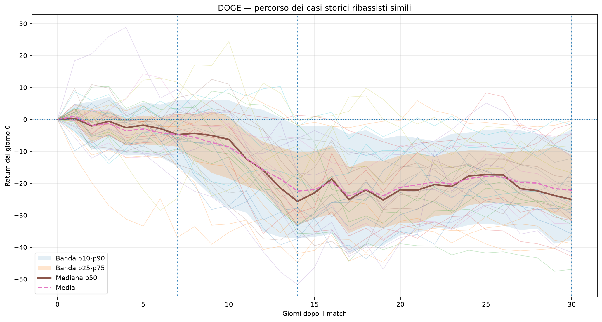

# Extreme cases path report

Generato: 2026-07-10 00:30 UTC

Questo report crea grafici solo quando lo scanner mostra una percentuale estrema: casi positivi o negativi almeno pari a **80%**.

Obiettivo: non guardare solo la percentuale finale, ma vedere **come si sono mossi dopo** i casi storici simili.

Fonte match: **CSV completo: latest_scanner_matches.csv**

## Trigger estremi

| Asset | Direzione | Trigger | Percentuale | Motivo | Match disponibili | Casi usati nel grafico |
| --- | --- | --- | --- | --- | --- | --- |
| BTC | NESSUNO | NO | 72,50% | Nessun lato sopra soglia estrema | 40 | 0 |
| SOL | NESSUNO | NO | 57,50% | Nessun lato sopra soglia estrema | 40 | 0 |
| DOGE | NEGATIVO / RIBASSISTA | SI | 87,50% | Casi negativi 87,50% >= 80% | 40 | 35 |

## DOGE — casi ribassisti

- Trigger: **Casi negativi 87,50% >= 80%**
- Casi disponibili: **40**
- Casi usati nei grafici: **35**
- Return mediano 7g: **-4,77%**
- Return mediano 14g: **-25,68%**
- Return mediano 30g: **-25,05%**
- Return medio 30g: **-22,14%**
- Drawdown mediano durante il percorso: **-29,24%**
- Max gain mediano durante il percorso: **+4,26%**

### Distribuzione 30 giorni

| P10 | P25 | P50 | P75 | P90 |
| --- | --- | --- | --- | --- |
| -37,75% | -31,63% | -25,05% | -11,06% | -3,17% |

### Match usati

| Asset storico | Start | End | Similarity | Return 30g report | Drawdown report | Max gain report | Return path calcolato |
| --- | --- | --- | --- | --- | --- | --- | --- |
| DASH-USD | 2022-02-20 | 2022-05-30 | 88,63% | -29,45% | -33,95% | +2,32% | -29,45% |
| NEAR-USD | 2022-03-02 | 2022-06-09 | 88,50% | -25,05% | -39,10% | +0,00% | -25,05% |
| VET-USD | 2022-02-22 | 2022-06-01 | 87,39% | -27,52% | -29,00% | +4,39% | -27,52% |
| QTUM-USD | 2022-02-20 | 2022-05-30 | 87,30% | -31,65% | -37,87% | +0,00% | -31,65% |
| ZEC-USD | 2019-05-17 | 2019-08-24 | 87,28% | -11,71% | -11,71% | +5,15% | -11,71% |
| 1INCH-USD | 2022-02-22 | 2022-06-01 | 86,51% | -31,62% | -42,19% | +0,00% | -31,62% |
| OMG-USD | 2022-02-20 | 2022-05-30 | 86,49% | -32,46% | -37,50% | +0,00% | -32,46% |
| CHZ-USD | 2022-02-24 | 2022-06-03 | 86,13% | -19,17% | -28,71% | +5,97% | -19,17% |
| AVAX-USD | 2025-08-14 | 2025-11-21 | 86,00% | -8,75% | -14,04% | +12,94% | -8,75% |
| XTZ-USD | 2025-12-06 | 2026-03-15 | 85,93% | -10,41% | -12,14% | +4,26% | -10,41% |
| ENJ-USD | 2022-02-25 | 2022-06-04 | 85,77% | -16,55% | -33,46% | +5,00% | -16,55% |
| ETH-USD | 2022-02-25 | 2022-06-04 | 85,35% | -36,11% | -44,85% | +3,20% | -36,11% |
| BCH-USD | 2022-02-20 | 2022-05-30 | 85,29% | -46,95% | -47,58% | +3,48% | -46,95% |
| INJ-USD | 2022-02-22 | 2022-06-01 | 85,21% | -42,93% | -42,93% | +3,20% | -42,93% |
| NEO-USD | 2022-02-20 | 2022-05-30 | 85,18% | -26,97% | -27,65% | +3,34% | -26,97% |
| ADA-USD | 2022-02-20 | 2022-05-30 | 85,15% | -18,34% | -19,98% | +12,55% | -18,34% |
| OP-USD | 2025-12-02 | 2026-03-11 | 85,07% | -4,42% | -15,36% | +14,28% | -4,42% |
| HBAR-USD | 2020-07-02 | 2020-10-09 | 84,96% | -12,18% | -17,30% | +0,27% | -12,18% |
| SOL-USD | 2022-02-28 | 2022-06-07 | 84,92% | -2,33% | -28,51% | +7,34% | -2,33% |
| BAT-USD | 2018-09-19 | 2018-12-27 | 84,84% | -1,76% | -6,08% | +10,32% | -1,76% |

## Come leggerlo

- Ogni linea sottile nel grafico è un vecchio caso storico simile.
- Giorno 0 = giorno in cui il vecchio grafico assomigliava al grafico attuale.
- Giorni 1-30 = cosa è successo dopo quel vecchio match.
- La linea mediana mostra il percorso centrale.
- Le bande p25-p75 e p10-p90 mostrano quanto erano dispersi i percorsi.
- Per uno scenario ribassista forte, conta molto se la mediana scende subito o solo dopo uno spike.

Nota: questo report è visivo e diagnostico. Non modifica il Global Confluence e non autorizza leva.
