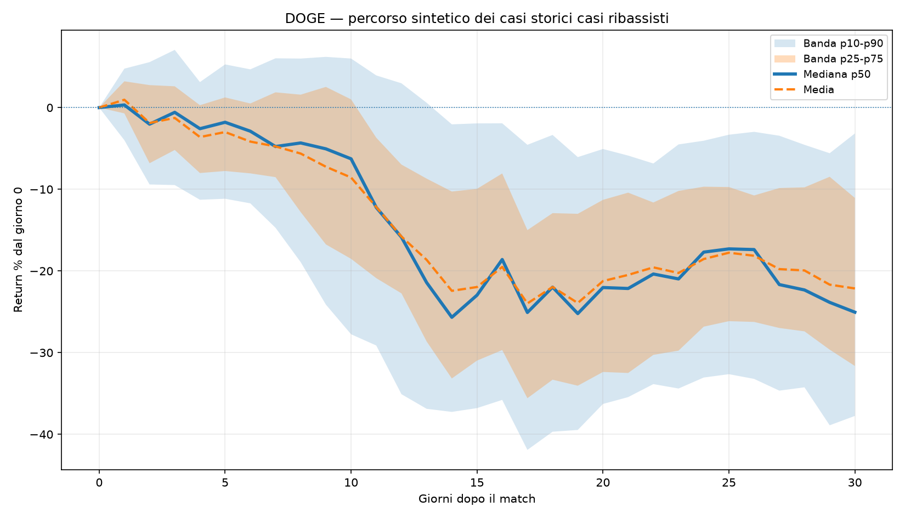
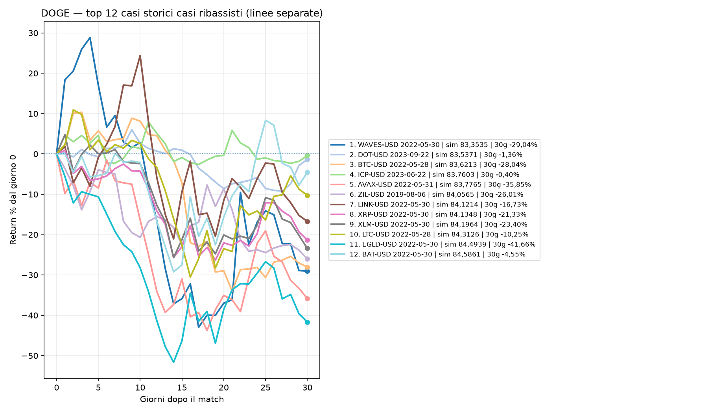
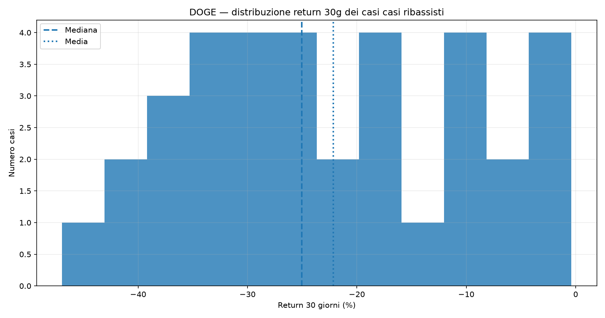

# Extreme cases path report

Generato: 2026-07-10 00:56 UTC

La sezione si attiva quando almeno **80%** dei 40 casi puliti dello scanner punta nella stessa direzione a 30 giorni.

## DOGE

- Direzione dominante: **CASI RIBASSISTI**
- Percentuale direzionale: **87,50%**
- Match totali filtrati: **35**
- Casi visualizzati con linee separate: **12**
- Drawdown mediano durante il percorso: **-29,24%**
- Max gain mediano durante il percorso: **4,26%**

### Distribuzione 30 giorni

| P10 | P25 | P50 | P75 | P90 |
|----:|----:|----:|----:|----:|
| -37,75% | -31,63% | -25,05% | -11,06% | -3,17% |

### Grafico pulito di sintesi

### Top casi separati con colori diversi

### Istogramma distribuzione return 30g

### Casi mostrati nel grafico a linee

| # | Asset storico | Data match | Similarità | Return 30g |
|--:|:--------------|:-----------|-----------:|-----------:|
| 1 | WAVES-USD | 2022-05-30 | 83,3535 | -29,04% |
| 2 | DOT-USD | 2023-09-22 | 83,5371 | -1,36% |
| 3 | BTC-USD | 2022-05-28 | 83,6213 | -28,04% |
| 4 | ICP-USD | 2023-06-22 | 83,7603 | -0,40% |
| 5 | AVAX-USD | 2022-05-31 | 83,7765 | -35,85% |
| 6 | ZIL-USD | 2019-08-06 | 84,0565 | -26,01% |
| 7 | LINK-USD | 2022-05-30 | 84,1214 | -16,73% |
| 8 | XRP-USD | 2022-05-30 | 84,1348 | -21,33% |
| 9 | XLM-USD | 2022-05-30 | 84,1964 | -23,40% |
| 10 | LTC-USD | 2022-05-28 | 84,3126 | -10,25% |
| 11 | EGLD-USD | 2022-05-30 | 84,4939 | -41,66% |
| 12 | BAT-USD | 2022-05-30 | 84,5861 | -4,55% |

### Come leggerlo

- Il **grafico pulito** mostra solo il corridoio statistico, senza spaghetti plot confuso.
- Il **grafico top casi** mostra solo i casi più simili, ciascuno con colore diverso, per vedere meglio chi sale e chi scende.
- L'**istogramma** riassume dove cadono i return a 30 giorni.
- Usa il grafico pulito per il quadro generale e quello a linee colorate per il confronto caso per caso.
