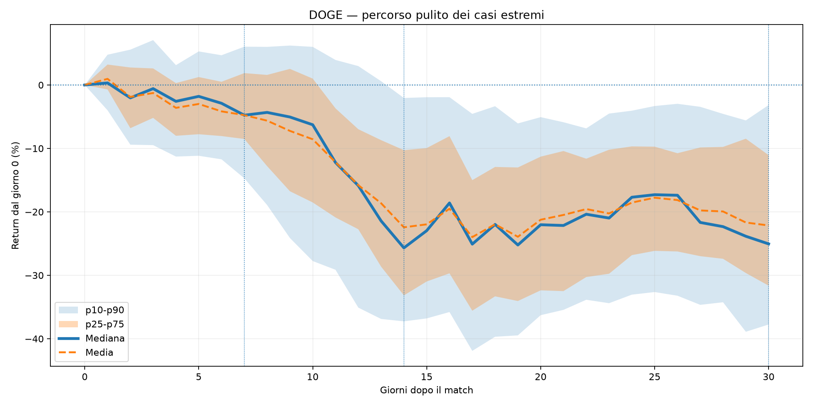
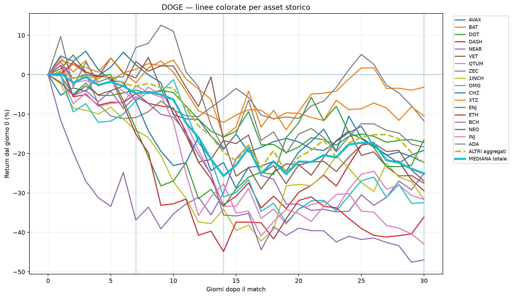
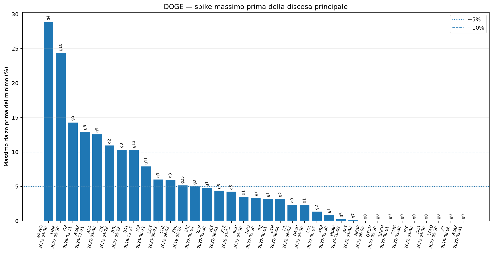
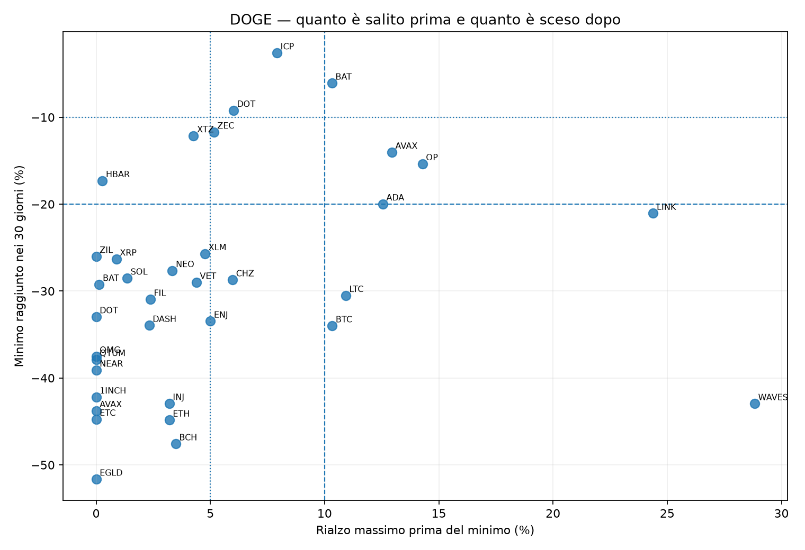
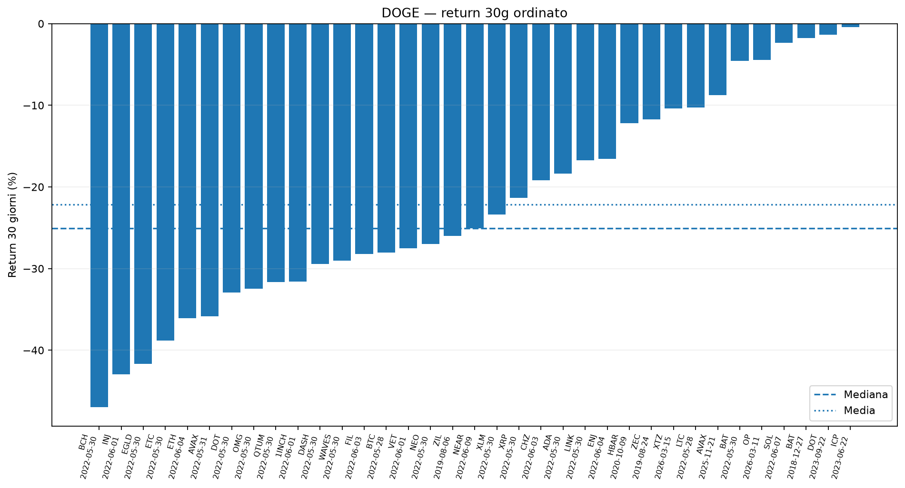

# Extreme cases path report

Generato: 2026-07-10 01:34 UTC

Questo report si attiva quando i casi positivi o negativi sono almeno **80%**.

Ora misura anche il **rialzo massimo prima della discesa principale**, quindi distingue uno spike iniziale da una discesa quasi immediata.

## Trigger estremi

| Asset   | Direzione             | Trigger   | Percentuale   | Motivo                           |   Match disponibili |
|:--------|:----------------------|:----------|:--------------|:---------------------------------|--------------------:|
| BTC     | NESSUNO               | NO        | +72,50%       | Nessun lato sopra soglia estrema |                  40 |
| SOL     | NESSUNO               | NO        | +57,50%       | Nessun lato sopra soglia estrema |                  40 |
| DOGE    | NEGATIVO / RIBASSISTA | SI        | +87,50%       | Casi negativi 87.50% >= 80%      |                  40 |

## DOGE — casi ribassisti

- Trigger: **Casi negativi 87.50% >= 80%**
- Casi usati nei grafici: **35**
- Return mediano 7g: **-4,77%**
- Return mediano 14g: **-25,68%**
- Return mediano 30g: **-25,05%**
- Drawdown mediano: **-29,24%**
- Max gain mediano: **+4,26%**

### Quanto salivano prima di scendere

- Spike massimo mediano prima del minimo: **+3,34%**
- Spike massimo medio prima del minimo: **+5,39%**
- Spike p75 prima del minimo: **+6,96%**
- Giorno mediano dello spike: **giorno 2**
- Giorno mediano del minimo: **giorno 18**
- Scarico mediano dal picco al minimo: **-32,73%**
- Casi con almeno +5% prima del minimo: **+37,14%**
- Casi con almeno +10% prima del minimo: **+22,86%**
- Casi con almeno +15% prima del minimo: **+5,71%**
- Discesa quasi immediata: **+0,00%**

Un segnale ribassista a 30 giorni non significa necessariamente discesa immediata: alcuni casi fanno prima uno spike e poi scaricano.

### Distribuzione 30 giorni

| P10     | P25     | P50     | P75     | P90    |
|:--------|:--------|:--------|:--------|:-------|
| -37,75% | -31,63% | -25,05% | -11,06% | -3,17% |

### Grafico pulito: bande + mediana

### Grafico asset per asset

### Spike massimo prima della discesa

La sigla `g7` sopra una barra significa che il massimo rialzo è avvenuto al giorno 7.

### Spike iniziale contro minimo successivo

### Casi ordinati per risultato finale

### Casi con spike maggiore prima del dump

| Asset storico   | End        | Similarity   | Spike prima del minimo   |   Giorno spike | Minimo 30g   |   Giorno minimo | Dump dal picco   | Return 30g   | Sequenza                      |
|:----------------|:-----------|:-------------|:-------------------------|---------------:|:-------------|----------------:|:-----------------|:-------------|:------------------------------|
| WAVES-USD       | 2022-05-30 | +83,38%      | +28,83%                  |              4 | -42,96%      |              17 | -55,72%          | -29,04%      | SPIKE PRIMA DEL DUMP          |
| LINK-USD        | 2022-05-30 | +84,14%      | +24,39%                  |             10 | -21,06%      |              14 | -36,54%          | -16,73%      | SPIKE PRIMA DEL DUMP          |
| OP-USD          | 2026-03-11 | +85,08%      | +14,28%                  |              5 | -15,36%      |              18 | -25,94%          | -4,42%       | SPIKE PRIMA DEL DUMP          |
| AVAX-USD        | 2025-11-21 | +85,96%      | +12,94%                  |              6 | -14,04%      |              27 | -23,89%          | -8,75%       | SPIKE PRIMA DEL DUMP          |
| ADA-USD         | 2022-05-30 | +85,17%      | +12,55%                  |              9 | -19,98%      |              19 | -28,90%          | -18,34%      | SPIKE PRIMA DEL DUMP          |
| LTC-USD         | 2022-05-28 | +84,28%      | +10,92%                  |              2 | -30,51%      |              16 | -37,36%          | -10,25%      | SPIKE PRIMA DEL DUMP          |
| BTC-USD         | 2022-05-28 | +83,61%      | +10,33%                  |              3 | -34,00%      |              21 | -40,18%          | -28,04%      | SPIKE PRIMA DEL DUMP          |
| BAT-USD         | 2018-12-27 | +84,84%      | +10,32%                  |             13 | -6,08%       |              17 | -14,87%          | -1,76%       | PERCORSO RIBASSISTA MISTO     |
| ICP-USD         | 2023-06-22 | +83,77%      | +7,92%                   |             11 | -2,60%       |              17 | -9,75%           | -0,40%       | PERCORSO RIBASSISTA MISTO     |
| DOT-USD         | 2023-09-22 | +83,53%      | +6,01%                   |              9 | -9,22%       |              27 | -14,37%          | -1,36%       | PERCORSO RIBASSISTA MISTO     |
| CHZ-USD         | 2022-06-03 | +86,15%      | +5,97%                   |              3 | -28,71%      |              15 | -32,73%          | -19,17%      | RIALZO MODESTO PRIMA DEL DUMP |
| ZEC-USD         | 2019-08-24 | +87,27%      | +5,15%                   |             25 | -11,71%      |              30 | -16,03%          | -11,71%      | RIALZO MODESTO PRIMA DEL DUMP |
| ENJ-USD         | 2022-06-04 | +85,77%      | +5,00%                   |              2 | -33,46%      |              14 | -36,63%          | -16,55%      | RIALZO MODESTO PRIMA DEL DUMP |
| XLM-USD         | 2022-05-30 | +84,23%      | +4,76%                   |              1 | -25,70%      |              14 | -29,08%          | -23,40%      | RIALZO MODESTO PRIMA DEL DUMP |
| VET-USD         | 2022-06-01 | +87,40%      | +4,39%                   |              8 | -29,00%      |              17 | -31,99%          | -27,52%      | RIALZO MODESTO PRIMA DEL DUMP |
| XTZ-USD         | 2026-03-15 | +85,97%      | +4,26%                   |              5 | -12,14%      |              14 | -15,73%          | -10,41%      | RIALZO MODESTO PRIMA DEL DUMP |
| BCH-USD         | 2022-05-30 | +85,30%      | +3,48%                   |              1 | -47,58%      |              29 | -49,34%          | -46,95%      | RIALZO MODESTO PRIMA DEL DUMP |
| NEO-USD         | 2022-05-30 | +85,21%      | +3,34%                   |              7 | -27,65%      |              19 | -29,99%          | -26,97%      | RIALZO MODESTO PRIMA DEL DUMP |
| INJ-USD         | 2022-06-01 | +85,20%      | +3,20%                   |              1 | -42,93%      |              30 | -44,70%          | -42,93%      | RIALZO MODESTO PRIMA DEL DUMP |
| ETH-USD         | 2022-06-04 | +85,34%      | +3,20%                   |              2 | -44,85%      |              14 | -46,56%          | -36,11%      | RIALZO MODESTO PRIMA DEL DUMP |

## Come leggerlo

- **Grafico pulito**: mostra il percorso centrale.
- **Asset per asset**: mostra le differenze tra gli analoghi storici.
- **Spike prima della discesa**: risponde a quanto poteva salire prima di scendere.
- **Spike contro minimo**: mostra quanto rialzo iniziale è stato poi seguito da quale discesa.

Questo report è diagnostico e non modifica il Global Confluence.
