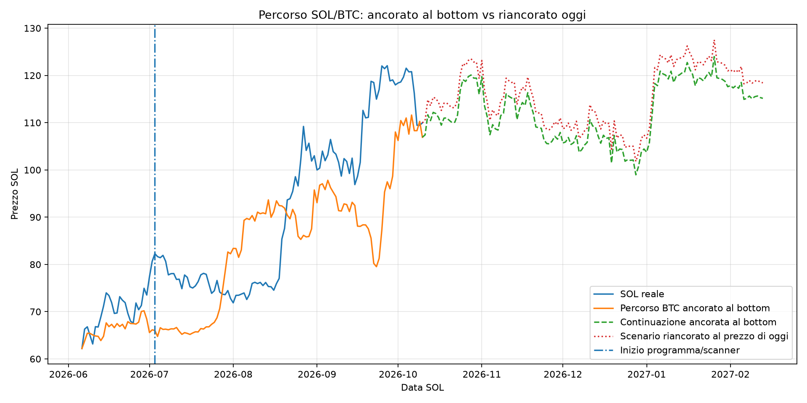
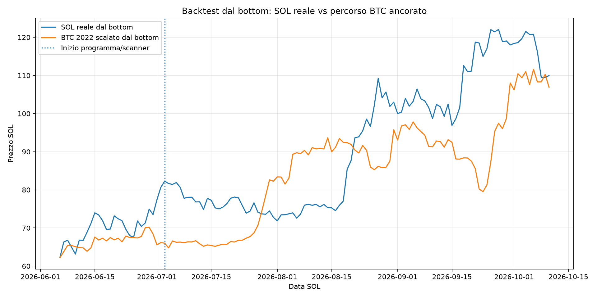
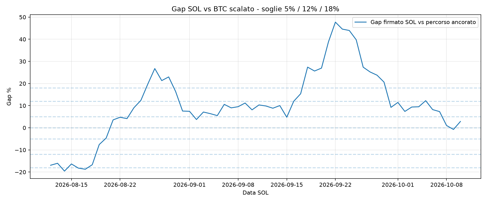

<!-- FRACTAL_PATH_TRACKER_START -->
# Tracking percorso frattale SOL/BTC

Generato: 2026-10-10 05:32 UTC

Questo modulo separa due percorsi che prima potevano essere confusi:

- **percorso ancorato al bottom**: continua la scala originale BTC 2022 -> SOL 2026 e misura l'aderenza reale;
- **scenario riancorato oggi**: parte dal prezzo SOL corrente e replica solo i movimenti futuri di BTC; e uno scenario condizionale, non una conferma del frattale.

## Stato letto dal frattale principale

- Fonte metadati: **structured_csv**
- Data corrente: **2026-10-10**
- Bottom SOL usato: **2026-06-06**
- Bottom BTC equivalente: **2022-11-21**
- Giorno BTC equivalente: **2023-03-27**
- Inizio programma/scanner: **2026-07-03**
- Prezzo SOL corrente: **109,96 $**
- Verdetto principale: **STRUTTURA ANALOGA, PREZZO NON ADERENTE**
- Somiglianza strutturale: **+73,29%**
- Aderenza live principale: **+69,73%**
- Errore medio live principale: **15,14%**
- Peso operativo suggerito: **0**
- Fase: **FRATTALE NON CONFERMATO DAL PREZZO**
- Rischio fase: **ALTO**

## Aderenza del percorso ancorato

- Giorno corrente dal bottom: **126**
- Osservazioni inclusive dal bottom: **127**
- Osservazioni da inizio programma/scanner: **100**
- Errore assoluto medio dal bottom: **13,20%**
- Errore assoluto medio da inizio programma: **15,14%**
- Gap firmato medio ultimi 7 giorni: **+5,77%**
- Errore assoluto medio ultimi 7 giorni: **5,99%**
- Gap ultimo giorno: **+2,85%**
- Stato aderenza: **IN DEVIAZIONE**

## Grafico completo: due percorsi distinti

La linea **ancorata al bottom** serve a verificare il frattale originale. La linea **riancorata oggi** serve soltanto come scenario futuro condizionale.

## Grafico backtest dal bottom

## Grafico gap SOL vs BTC scalato

### Lettura rapida gap

- Ultimo gap firmato: **+2,85%**
- Gap firmato medio 7g: **+5,77%**
- Errore assoluto medio 7g: **5,99%**
- Variazione recente gap: **-4,46%**
- Stato gap: **VICINO AL FRATTALE**
- Trend gap: **SOL resta sopra il percorso ancorato, ma sta riducendo il distacco**

Soglie operative del grafico:

- entro **±5%**: percorso vicino;
- tra **±5% e ±12%**: deviazione gestibile;
- oltre **±12%**: frattale non abbastanza aderente per conferma operativa;
- oltre **±18%**: disallineamento marcato.

## Ultimi giorni del confronto ancorato

|   Giorno | Data SOL   | Data BTC eq.   | SOL reale   | Percorso ancorato   | Gap firmato   | Fase                |
|---------:|:-----------|:---------------|:------------|:--------------------|:--------------|:--------------------|
| 117 | 2026-10-01 | 2023-03-18 | 118,40 $ | 106,22 $ | +11,46% | da inizio programma |
| 118 | 2026-10-02 | 2023-03-19 | 118,62 $ | 110,45 $ | +7,39% | da inizio programma |
| 119 | 2026-10-03 | 2023-03-20 | 119,65 $ | 109,38 $ | +9,38% | da inizio programma |
| 120 | 2026-10-04 | 2023-03-21 | 121,53 $ | 110,99 $ | +9,49% | da inizio programma |
| 121 | 2026-10-05 | 2023-03-22 | 120,75 $ | 107,57 $ | +12,25% | da inizio programma |
| 122 | 2026-10-06 | 2023-03-23 | 120,79 $ | 111,61 $ | +8,22% | da inizio programma |
| 123 | 2026-10-07 | 2023-03-24 | 116,22 $ | 108,30 $ | +7,31% | da inizio programma |
| 124 | 2026-10-08 | 2023-03-25 | 109,44 $ | 108,31 $ | +1,05% | da inizio programma |
| 125 | 2026-10-09 | 2023-03-26 | 109,44 $ | 110,28 $ | -0,76% | da inizio programma |
| 126 | 2026-10-10 | 2023-03-27 | 109,96 $ | 106,91 $ | +2,85% | da inizio programma |

## Proiezione futura salvata

| Orizzonte   | Data target   | Percorso ancorato   | Scenario riancorato oggi   | Min/max riancorato   | Controllato   | Prezzo reale   | Errore riancorato   | Errore ancorato   |
|:------------|:--------------|:--------------------|:---------------------------|:---------------------|:--------------|:---------------|:--------------------|:------------------|
| 7g | 2026-10-17 | 109,47 $ | 112,59 $ | 109,96 $ / 115,38 $ | no | n/a | n/a | n/a |
| 14g | 2026-10-24 | 116,81 $ | 120,14 $ | 109,96 $ / 120,14 $ | no | n/a | n/a | n/a |
| 21g | 2026-10-31 | 115,99 $ | 119,30 $ | 109,96 $ / 123,52 $ | no | n/a | n/a | n/a |
| 28g | 2026-11-07 | 108,43 $ | 111,52 $ | 109,96 $ / 123,52 $ | no | n/a | n/a | n/a |
| 35g | 2026-11-14 | 110,66 $ | 113,82 $ | 109,96 $ / 123,52 $ | no | n/a | n/a | n/a |
| 42g | 2026-11-21 | 109,09 $ | 112,21 $ | 109,96 $ / 123,52 $ | no | n/a | n/a | n/a |
| 49g | 2026-11-28 | 107,12 $ | 110,17 $ | 108,52 $ / 123,52 $ | no | n/a | n/a | n/a |
| 56g | 2026-12-05 | 105,77 $ | 108,79 $ | 108,40 $ / 123,52 $ | no | n/a | n/a | n/a |
| 63g | 2026-12-12 | 109,30 $ | 112,42 $ | 106,70 $ / 123,52 $ | no | n/a | n/a | n/a |
| 70g | 2026-12-19 | 101,48 $ | 104,37 $ | 104,37 $ / 123,52 $ | no | n/a | n/a | n/a |
| 77g | 2026-12-26 | 102,04 $ | 104,95 $ | 104,37 $ / 123,52 $ | no | n/a | n/a | n/a |
| 84g | 2027-01-02 | 105,77 $ | 108,79 $ | 101,80 $ / 123,52 $ | no | n/a | n/a | n/a |
| 91g | 2027-01-09 | 119,25 $ | 122,65 $ | 101,80 $ / 124,37 $ | no | n/a | n/a | n/a |
| 98g | 2027-01-16 | 122,73 $ | 126,23 $ | 101,80 $ / 126,23 $ | no | n/a | n/a | n/a |
| 105g | 2027-01-23 | 119,81 $ | 123,23 $ | 101,80 $ / 126,23 $ | no | n/a | n/a | n/a |
| 112g | 2027-01-30 | 118,75 $ | 122,14 $ | 101,80 $ / 127,53 $ | no | n/a | n/a | n/a |
| 119g | 2027-02-06 | 114,93 $ | 118,21 $ | 101,80 $ / 127,53 $ | no | n/a | n/a | n/a |
| 126g | 2027-02-13 | 115,14 $ | 118,43 $ | 101,80 $ / 127,53 $ | no | n/a | n/a | n/a |

La colonna **Percorso ancorato** continua la scala dal bottom. La colonna **Scenario riancorato oggi** riparte dal prezzo corrente e non cancella, nei controlli, il gap gia accumulato.

## Accuratezza storica della proiezione futura

| Orizzonte   |   Controlli | Dentro banda riancorata   | Errore ass. riancorato   | Errore ass. ancorato   |
|:------------|------------:|:--------------------------|:-------------------------|:-----------------------|
| 7g | 81 | 38,27% | 11,69% | 14,10% |
| 14g | 75 | 24,00% | 17,65% | 14,35% |
| 21g | 70 | 28,57% | 20,83% | 15,67% |
| 28g | 65 | 29,23% | 21,54% | 15,33% |
| 35g | 58 | 37,93% | 22,47% | 15,07% |
| 42g | 51 | 49,02% | 21,74% | 13,90% |
| 49g | 44 | 50,00% | 23,50% | 15,92% |
| 56g | 37 | 43,24% | 22,27% | 16,98% |
| 63g | 32 | 34,38% | 16,66% | 18,08% |
| 70g | 25 | 40,00% | 10,30% | 20,49% |
| 77g | 18 | 61,11% | 9,27% | 13,51% |
| 84g | 11 | 100,00% | 7,93% | 6,52% |
| 91g | 4 | 100,00% | 13,92% | 1,80% |
| 98g | 0 | n/a | n/a | n/a |
| 105g | 0 | n/a | n/a | n/a |
| 112g | 0 | n/a | n/a | n/a |
| 119g | 0 | n/a | n/a | n/a |
| 126g | 0 | n/a | n/a | n/a |

## Regola di lettura

- La somiglianza strutturale descrive la forma.
- Il gap ancorato descrive la distanza reale dal percorso.
- Lo scenario riancorato non dimostra che il frattale sia valido.
- Prima di pesare il modulo servono milestone maturate e un errore ancorato accettabile.
<!-- FRACTAL_PATH_TRACKER_END -->
