<!-- COMPACT_REPORT_HEADER_START -->
> **Vista compatta:** Decisione operativa, Global Confluence e cambiamenti giornalieri restano aperti. Tocca il titolo di una sezione per mostrare o nascondere i dettagli.  
> Tutte le tabelle e tutti i dati restano nel file: copiando il Markdown raw viene copiato tutto.
<!-- COMPACT_REPORT_HEADER_END -->

<!-- COMPACT_SECTION_START:decision -->
<details open>
<summary><strong>🧭 Decisione operativa — da leggere per prima</strong></summary>

<!-- DECISION_REPORT_START -->

# Decisione operativa sintetica

Generato: 2026-10-02 14:08 UTC

Report separato completo: [decision_report.md](decision_report.md)

Sintesi automatica dello scanner: l'azione spot viene copiata direttamente dal Global Confluence; long, short e rischio restano filtri separati e più prudenti.

| Asset | Global | Direzione | Spot | Long leva | Short leva | Max long | Max short | Rischio |
| --- | --- | --- | --- | --- | --- | --- | --- | --- |
| BTC | +6 | BULLISH | ACCUMULA A TRANCHE SU PULLBACK / NON INSEGUIRE | LONG PRUDENTE | NO SHORT | max 2x isolated | nessuna | MEDIO |
| SOL | +1 | NEUTRALE / INCERTO | HOLD LEGGERO / ATTESA CONFERME | NO LONG A LEVA | NO SHORT | nessuna | nessuna | MOLTO ALTO |
| DOGE | +3 | NEUTRALE / COSTRUTTIVO | SOLO TRANCHE PICCOLE / NO LEVA | NO LONG A LEVA | NO SHORT | nessuna | nessuna | MOLTO ALTO |

## Lettura immediata

- **BTC**: Global = **+6**, spot = **ACCUMULA A TRANCHE SU PULLBACK / NON INSEGUIRE**, long = **LONG PRUDENTE**, short = **NO SHORT**, rischio = **MEDIO**.
- **SOL**: Global = **+1**, spot = **HOLD LEGGERO / ATTESA CONFERME**, long = **NO LONG A LEVA**, short = **NO SHORT**, rischio = **MOLTO ALTO**.
- **DOGE**: Global = **+3**, spot = **SOLO TRANCHE PICCOLE / NO LEVA**, long = **NO LONG A LEVA**, short = **NO SHORT**, rischio = **MOLTO ALTO**.

## Dettaglio logica

### BTC

- Global Confluence: **+6**
- Confluenza: **MODERATAMENTE POSITIVA**
- Bias Global: **Costruttivo prudente**
- Direzione decisionale: **BULLISH**
- Azione spot dal Global: **ACCUMULA A TRANCHE SU PULLBACK / NON INSEGUIRE**
- Long leva: **LONG PRUDENTE**
- Short leva: **NO SHORT**
- Rischio: **MEDIO**
- Conferme: Prima resistenza sopra 87.364; conferma del doppio minimo sopra 82.262.
- Invalidazioni: Sotto 82.571 il quadro tecnico peggiora.

### SOL

- Global Confluence: **+1**
- Confluenza: **MISTA / PARZIALE**
- Bias Global: **Neutrale / misto**
- Direzione decisionale: **NEUTRALE / INCERTO**
- Azione spot dal Global: **HOLD LEGGERO / ATTESA CONFERME**
- Long leva: **NO LONG A LEVA**
- Short leva: **NO SHORT**
- Rischio: **MOLTO ALTO**
- Conferme: Doppio minimo target raggiunto finché mantiene 107,12; nuova conferma tecnica sopra 124,62; milestone analogiche 128,55 / 137,12, valide soltanto se rientra anche il gap frattale.
- Invalidazioni: Allarmi sotto 116,31 / 96,23 / 62,19.

### DOGE

- Global Confluence: **+3**
- Confluenza: **MODERATAMENTE POSITIVA**
- Bias Global: **Costruttivo prudente**
- Direzione decisionale: **NEUTRALE / COSTRUTTIVO**
- Azione spot dal Global: **SOLO TRANCHE PICCOLE / NO LEVA**
- Long leva: **NO LONG A LEVA**
- Short leva: **NO SHORT**
- Rischio: **MOLTO ALTO**
- Conferme: Sopra 0.10528 migliora; sopra 0.07997 viene invalidato il pattern ribassista dominante.
- Invalidazioni: Sotto 0.07841 il rischio ribassista aumenta.

## Nota semplice

- **Spot** = usa la stessa azione del Global Confluence, senza una seconda mappatura che possa produrre frasi diverse.
- **Zona alta storica** = zona dove non inseguire troppo; può essere zona da prendere profitto.
- **Zona bassa storica** = zona di rischio; con leva la liquidazione non dovrebbe stare lì vicino.
- **BTC leva** = nessun long a leva finché il prezzo snapshot non supera **67.248 $**; sotto quella soglia resta solo l'azione spot indicata dal Global.
- **Lifecycle EMA200** = per SOL resta solo contesto, peso Global 0; score interno 1; EMA200 circa 111,43 $; upside verso EMA200 -8,60%. Non autorizza leva e non aggiunge punti automatici.
- **NO LONG** non significa automaticamente **SHORT**. Lo short ha senso solo se il quadro è bearish o se lo spike viene spesso scaricato.
- Per SOL, se il Global è da **+3 in su**, la decisione non deve diventare bearish solo perché lo scanner grezzo a 30 giorni è incerto.

<!-- DECISION_REPORT_END -->

</details>
<!-- COMPACT_SECTION_END:decision -->

<!-- COMPACT_SECTION_START:module_accuracy -->
<details>
<summary><strong>🧪 Accuratezza moduli e raccolta dati</strong></summary>

<!-- MODULE_ACCURACY_START -->
# Accuratezza moduli / autocalibrazione allargata

Generato: 2026-10-02 14:08 UTC

Questo report salva ogni giorno i segnali dei moduli e controlla ogni giorno quali orizzonti sono maturati.

La calibrazione ora controlla questi orizzonti:

- **1g / 2g / 3g** = feedback rapidissimo
- **5g / 7g / 10g** = feedback settimanale
- **14g / 21g** = feedback swing
- **30g / 45g / 60g** = feedback più serio

Moduli controllati:

- Global Confluence = benchmark dell'aggregato finale
- **Famiglia statistica Scanner + Market Regime = modulo calibrabile reale**
- Scanner grezzo = diagnostico, già incluso nella famiglia statistica
- Market Regime grezzo = diagnostico, già incluso nella famiglia statistica
- Struttura tecnica
- Classic technical confirmation
- Microstruttura exchange, OI/funding/taker flow/order book
- Frattale SOL/BTC, solo per SOL

Regola anti-doppio-conteggio: **Scanner e Market Regime continuano a essere misurati separatamente solo per diagnosi, ma non devono ricevere due modifiche di peso autonome**. La calibrazione dei pesi deve agire sulla Famiglia statistica.

Nota: i controlli vengono aggiornati **ogni giorno**, ma i pesi del Global non devono cambiare automaticamente sotto 30 controlli. Prima si osserva, poi si calibra.

Segnali totali salvati: **234**.

Backfill storico Famiglia statistica: **3 righe totali già completate nel diario**; righe completate in questa esecuzione: **0**. Per le righe retroattive è stato usato soltanto lo Scanner grezzo, senza inventare un bonus Market Regime storico.

Politica snapshot giornaliero: **la prima fotografia per data e asset resta congelata**. Un rerun nello stesso giorno non sovrascrive prezzo, punteggi o azione; può soltanto completare campi realmente mancanti.

## Ultimi segnali salvati

| Data | Asset | Prezzo | Global | Famiglia stat. | Scanner grezzo | Market grezzo | Tecnico | Classic | Frattale | Azione |
| --- | --- | --- | --- | --- | --- | --- | --- | --- | --- | --- |
| 2026-10-02 | BTC | 86.570,73 | +6 | +1 | +1 | 0 | +3 | +1 | 0 | ACCUMULA A TRANCHE SU PULLBACK / NON INSEGUIRE |
| 2026-10-02 | DOGE | 0.09654 | +3 | -1 | -1 | 0 | +3 | +1 | 0 | SOLO TRANCHE PICCOLE / NO LEVA |
| 2026-10-02 | SOL | 121,92 | +1 | -2 | -2 | 0 | +2 | +1 | 0 | HOLD LEGGERO / ATTESA CONFERME |
| 2026-09-30 | BTC | 83.418,75 | +3 | 0 | 0 | 0 | +2 | 0 | 0 | ACCUMULA A TRANCHE SU PULLBACK / NON INSEGUIRE |
| 2026-09-30 | DOGE | 0.09397 | +3 | -1 | -1 | 0 | +3 | 0 | 0 | SOLO TRANCHE PICCOLE / NO LEVA |
| 2026-09-30 | SOL | 119,28 | +1 | -1 | -1 | 0 | +2 | +1 | 0 | HOLD LEGGERO / ATTESA CONFERME |
| 2026-09-29 | BTC | 83.140,92 | +1 | -1 | -1 | 0 | +2 | 0 | 0 | HOLD / ATTESA CONFERME |
| 2026-09-29 | DOGE | 0.09319 | +2 | -1 | -1 | 0 | +3 | 0 | 0 | STAI ALLA FINESTRA |
| 2026-09-29 | SOL | 117,59 | +1 | -1 | -1 | 0 | +2 | +1 | 0 | HOLD LEGGERO / ATTESA CONFERME |
| 2026-09-28 | BTC | 82.981,23 | +1 | -1 | -1 | 0 | +2 | 0 | 0 | HOLD / ATTESA CONFERME |
| 2026-09-28 | DOGE | 0.09299 | +2 | -1 | -1 | 0 | +3 | 0 | 0 | STAI ALLA FINESTRA |
| 2026-09-28 | SOL | 118,67 | +4 | 0 | 0 | 0 | +2 | +1 | 0 | HOLD / TRANCHE PICCOLE, NO LEVA |

## Stato controlli per orizzonte

| Asset | Segnali salvati | 1g | 2g | 3g | 5g | 7g | 10g | 14g | 21g | 30g | 45g | 60g |
| --- | --- | --- | --- | --- | --- | --- | --- | --- | --- | --- | --- | --- |
| BTC | 78 | 77 | 77 | 76 | 74 | 72 | 70 | 69 | 63 | 54 | 39 | 26 |
| SOL | 78 | 77 | 77 | 76 | 74 | 72 | 70 | 69 | 63 | 54 | 39 | 26 |
| DOGE | 78 | 77 | 77 | 76 | 74 | 72 | 70 | 69 | 63 | 54 | 39 | 26 |

## Prossimi controlli in arrivo

| Asset | Segnale | Orizzonte | Data target | Quando |
| --- | --- | --- | --- | --- |
| BTC | 2026-08-04 | 60g | 2026-10-03 | domani |
| SOL | 2026-08-04 | 60g | 2026-10-03 | domani |
| DOGE | 2026-08-04 | 60g | 2026-10-03 | domani |

## Lettura rapida Global Confluence

| Asset | Orizzonte | Controlli | Accuratezza direzione | Return medio | Return corretto direzione | Stato |
| --- | --- | --- | --- | --- | --- | --- |
| BTC | 1g | 72 | 52,78% | +0,38% | +0,36% | UTILE |
| BTC | 2g | 72 | 52,78% | +0,68% | +0,62% | UTILE |
| BTC | 3g | 71 | 46,48% | +0,85% | +0,75% | UTILE |
| BTC | 5g | 69 | 43,48% | +1,70% | +1,51% | UTILE |
| BTC | 7g | 69 | 53,62% | +2,47% | +2,32% | UTILE |
| BTC | 10g | 67 | 62,69% | +3,59% | +3,45% | UTILE |
| BTC | 14g | 66 | 62,12% | +5,13% | +5,08% | UTILE |
| BTC | 21g | 60 | 71,67% | +8,25% | +8,14% | UTILE |
| BTC | 30g | 51 | 94,12% | +13,52% | +12,67% | PRIMA CALIBRAZIONE |
| BTC | 45g | 36 | 91,67% | +24,89% | +21,22% | PRIMA CALIBRAZIONE |
| BTC | 60g | 24 | 87,50% | +26,98% | +20,73% | FEEDBACK RAPIDO |
| SOL | 1g | 69 | 50,72% | +0,41% | +0,32% | UTILE |
| SOL | 2g | 69 | 49,28% | +1,09% | +0,98% | UTILE |
| SOL | 3g | 68 | 52,94% | +1,79% | +1,66% | UTILE |
| SOL | 5g | 66 | 56,06% | +3,09% | +3,01% | UTILE |
| SOL | 7g | 64 | 62,50% | +4,55% | +4,64% | UTILE |
| SOL | 10g | 62 | 67,74% | +6,76% | +6,88% | UTILE |
| SOL | 14g | 61 | 75,41% | +9,69% | +10,29% | UTILE |
| SOL | 21g | 56 | 82,14% | +14,87% | +14,23% | PRIMA CALIBRAZIONE |
| SOL | 30g | 47 | 78,72% | +22,11% | +17,90% | PRIMA CALIBRAZIONE |
| SOL | 45g | 32 | 65,62% | +42,41% | +18,35% | PRIMA CALIBRAZIONE |
| SOL | 60g | 20 | 45,00% | +44,32% | +0,50% | FEEDBACK RAPIDO |
| DOGE | 1g | 73 | 45,21% | +0,25% | -0,10% | UTILE |
| DOGE | 2g | 73 | 45,21% | +0,55% | -0,13% | UTILE |
| DOGE | 3g | 72 | 40,28% | +0,86% | -0,02% | UTILE |
| DOGE | 5g | 70 | 42,86% | +1,80% | +0,02% | UTILE |
| DOGE | 7g | 68 | 48,53% | +2,68% | +0,38% | UTILE |
| DOGE | 10g | 66 | 45,45% | +3,67% | +0,51% | UTILE |
| DOGE | 14g | 65 | 58,46% | +5,69% | +3,65% | UTILE |
| DOGE | 21g | 59 | 66,10% | +8,17% | +3,93% | PRIMA CALIBRAZIONE |
| DOGE | 30g | 50 | 78,00% | +13,13% | +6,92% | PRIMA CALIBRAZIONE |
| DOGE | 45g | 37 | 45,95% | +25,15% | +3,54% | PRIMA CALIBRAZIONE |
| DOGE | 60g | 25 | 20,00% | +26,08% | -12,21% | FEEDBACK RAPIDO |

## Accuratezza direzionale per modulo

| Asset | Orizzonte | Modulo | Ruolo | Controlli | Accuratezza direzione | Return medio | Return corretto direzione | Drawdown medio | Max gain medio | Stato |
| --- | --- | --- | --- | --- | --- | --- | --- | --- | --- | --- |
| BTC | 1g | Global confluence | BENCHMARK | 72 | 52,78% | +0,38% | +0,36% | -0,19% | +0,90% | UTILE |
| BTC | 1g | Famiglia statistica | CALIBRABILE | 76 | 51,32% | +0,32% | +0,33% | -0,20% | +0,84% | UTILE |
| BTC | 1g | Scanner grezzo | DIAGNOSTICO | 76 | 51,32% | +0,32% | +0,33% | -0,20% | +0,84% | UTILE |
| BTC | 1g | Market regime grezzo | DIAGNOSTICO | 35 | 54,29% | +0,25% | +0,25% | -0,10% | +0,70% | PRIMA CALIBRAZIONE |
| BTC | 1g | Tecnico | CALIBRABILE | 70 | 42,86% | +0,34% | +0,05% | -0,14% | +0,87% | UTILE |
| BTC | 1g | Classic technical | CALIBRABILE | 29 | 37,93% | +0,73% | +0,06% | -0,13% | +1,26% | FEEDBACK RAPIDO |
| BTC | 1g | Microstruttura exchange | CALIBRABILE / NON PESATO FINO AL GATE | 7 | 42,86% | -0,24% | -0,24% | -0,87% | +0,25% | FEEDBACK RAPIDO |
| BTC | 2g | Global confluence | BENCHMARK | 72 | 52,78% | +0,68% | +0,62% | -0,14% | +1,37% | UTILE |
| BTC | 2g | Famiglia statistica | CALIBRABILE | 76 | 52,63% | +0,66% | +0,66% | -0,09% | +1,36% | UTILE |
| BTC | 2g | Scanner grezzo | DIAGNOSTICO | 76 | 52,63% | +0,66% | +0,66% | -0,09% | +1,36% | UTILE |
| BTC | 2g | Market regime grezzo | DIAGNOSTICO | 35 | 54,29% | +0,52% | +0,52% | -0,02% | +1,18% | PRIMA CALIBRAZIONE |
| BTC | 2g | Tecnico | CALIBRABILE | 70 | 44,29% | +0,66% | +0,07% | +0,01% | +1,36% | UTILE |
| BTC | 2g | Classic technical | CALIBRABILE | 29 | 41,38% | +1,20% | +0,02% | +0,19% | +1,90% | FEEDBACK RAPIDO |
| BTC | 2g | Microstruttura exchange | CALIBRABILE / NON PESATO FINO AL GATE | 7 | 28,57% | -0,04% | -0,04% | -0,90% | +1,02% | FEEDBACK RAPIDO |
| BTC | 3g | Global confluence | BENCHMARK | 71 | 46,48% | +0,85% | +0,75% | -1,18% | +2,56% | UTILE |
| BTC | 3g | Famiglia statistica | CALIBRABILE | 76 | 51,32% | +1,02% | +0,91% | -1,17% | +2,70% | UTILE |
| BTC | 3g | Scanner grezzo | DIAGNOSTICO | 76 | 51,32% | +1,02% | +0,91% | -1,17% | +2,70% | UTILE |
| BTC | 3g | Market regime grezzo | DIAGNOSTICO | 35 | 57,14% | +0,91% | +0,91% | -1,00% | +2,36% | PRIMA CALIBRAZIONE |
| BTC | 3g | Tecnico | CALIBRABILE | 69 | 36,23% | +1,07% | -0,15% | -1,09% | +2,75% | UTILE |
| BTC | 3g | Classic technical | CALIBRABILE | 29 | 37,93% | +1,95% | -0,51% | -0,85% | +3,41% | FEEDBACK RAPIDO |
| BTC | 3g | Microstruttura exchange | CALIBRABILE / NON PESATO FINO AL GATE | 7 | 28,57% | -0,39% | -0,39% | -1,79% | +1,42% | FEEDBACK RAPIDO |
| BTC | 5g | Global confluence | BENCHMARK | 69 | 43,48% | +1,70% | +1,51% | -1,80% | +4,03% | UTILE |
| BTC | 5g | Famiglia statistica | CALIBRABILE | 74 | 47,30% | +1,89% | +1,79% | -1,77% | +4,23% | UTILE |
| BTC | 5g | Scanner grezzo | DIAGNOSTICO | 74 | 47,30% | +1,89% | +1,79% | -1,77% | +4,23% | UTILE |
| BTC | 5g | Market regime grezzo | DIAGNOSTICO | 35 | 48,57% | +2,08% | +2,08% | -1,57% | +4,07% | PRIMA CALIBRAZIONE |
| BTC | 5g | Tecnico | CALIBRABILE | 67 | 41,79% | +1,82% | -0,71% | -1,70% | +4,20% | UTILE |
| BTC | 5g | Classic technical | CALIBRABILE | 29 | 41,38% | +4,06% | -2,25% | -1,22% | +6,21% | FEEDBACK RAPIDO |
| BTC | 5g | Microstruttura exchange | CALIBRABILE / NON PESATO FINO AL GATE | 7 | 14,29% | -1,43% | -1,43% | -2,57% | +1,68% | FEEDBACK RAPIDO |
| BTC | 7g | Global confluence | BENCHMARK | 69 | 53,62% | +2,47% | +2,32% | -2,11% | +5,23% | UTILE |
| BTC | 7g | Famiglia statistica | CALIBRABILE | 72 | 58,33% | +2,72% | +2,72% | -2,08% | +5,45% | UTILE |
| BTC | 7g | Scanner grezzo | DIAGNOSTICO | 72 | 58,33% | +2,72% | +2,72% | -2,08% | +5,45% | UTILE |
| BTC | 7g | Market regime grezzo | DIAGNOSTICO | 35 | 60,00% | +3,17% | +3,17% | -1,80% | +5,49% | PRIMA CALIBRAZIONE |
| BTC | 7g | Tecnico | CALIBRABILE | 65 | 43,08% | +2,80% | -1,13% | -2,01% | +5,50% | UTILE |
| BTC | 7g | Classic technical | CALIBRABILE | 29 | 37,93% | +5,44% | -4,00% | -1,49% | +8,41% | FEEDBACK RAPIDO |
| BTC | 7g | Microstruttura exchange | CALIBRABILE / NON PESATO FINO AL GATE | 7 | 28,57% | -1,74% | -1,74% | -3,24% | +1,77% | FEEDBACK RAPIDO |
| BTC | 10g | Global confluence | BENCHMARK | 67 | 62,69% | +3,59% | +3,45% | -2,37% | +6,58% | UTILE |
| BTC | 10g | Famiglia statistica | CALIBRABILE | 70 | 65,71% | +3,71% | +3,71% | -2,36% | +6,76% | UTILE |
| BTC | 10g | Scanner grezzo | DIAGNOSTICO | 70 | 65,71% | +3,71% | +3,71% | -2,36% | +6,76% | UTILE |
| BTC | 10g | Market regime grezzo | DIAGNOSTICO | 35 | 62,86% | +4,42% | +4,42% | -2,02% | +6,89% | PRIMA CALIBRAZIONE |
| BTC | 10g | Tecnico | CALIBRABILE | 63 | 50,79% | +3,88% | -0,34% | -2,29% | +6,94% | UTILE |
| BTC | 10g | Classic technical | CALIBRABILE | 28 | 42,86% | +5,84% | -4,46% | -1,59% | +9,49% | FEEDBACK RAPIDO |
| BTC | 10g | Microstruttura exchange | CALIBRABILE / NON PESATO FINO AL GATE | 6 | 50,00% | -1,01% | -1,01% | -3,64% | +2,39% | FEEDBACK RAPIDO |
| BTC | 14g | Global confluence | BENCHMARK | 66 | 62,12% | +5,13% | +5,08% | -2,59% | +8,79% | UTILE |
| BTC | 14g | Famiglia statistica | CALIBRABILE | 69 | 62,32% | +5,20% | +5,20% | -2,57% | +8,87% | UTILE |
| BTC | 14g | Scanner grezzo | DIAGNOSTICO | 69 | 62,32% | +5,20% | +5,20% | -2,57% | +8,87% | UTILE |
| BTC | 14g | Market regime grezzo | DIAGNOSTICO | 35 | 68,57% | +6,60% | +6,60% | -2,13% | +9,78% | PRIMA CALIBRAZIONE |
| BTC | 14g | Tecnico | CALIBRABILE | 62 | 58,06% | +5,55% | +1,64% | -2,50% | +9,26% | UTILE |
| BTC | 14g | Classic technical | CALIBRABILE | 28 | 25,00% | +5,37% | -4,20% | -1,80% | +9,90% | FEEDBACK RAPIDO |
| BTC | 14g | Microstruttura exchange | CALIBRABILE / NON PESATO FINO AL GATE | 5 | 40,00% | +0,29% | +0,29% | -4,46% | +3,38% | FEEDBACK RAPIDO |
| BTC | 21g | Global confluence | BENCHMARK | 60 | 71,67% | +8,25% | +8,14% | -2,87% | +12,13% | UTILE |
| BTC | 21g | Famiglia statistica | CALIBRABILE | 63 | 76,19% | +8,18% | +8,18% | -2,85% | +12,09% | UTILE |
| BTC | 21g | Scanner grezzo | DIAGNOSTICO | 63 | 76,19% | +8,18% | +8,18% | -2,85% | +12,09% | UTILE |
| BTC | 21g | Market regime grezzo | DIAGNOSTICO | 35 | 74,29% | +11,25% | +11,25% | -2,21% | +14,88% | PRIMA CALIBRAZIONE |
| BTC | 21g | Tecnico | CALIBRABILE | 58 | 55,17% | +8,75% | +0,90% | -2,71% | +12,71% | PRIMA CALIBRAZIONE |
| BTC | 21g | Classic technical | CALIBRABILE | 24 | 54,17% | +8,85% | -4,04% | -2,32% | +12,73% | FEEDBACK RAPIDO |
| BTC | 21g | Microstruttura exchange | CALIBRABILE / NON PESATO FINO AL GATE | 5 | 80,00% | +1,57% | +1,57% | -4,51% | +6,24% | FEEDBACK RAPIDO |
| BTC | 30g | Global confluence | BENCHMARK | 51 | 94,12% | +13,52% | +12,67% | -2,62% | +17,59% | PRIMA CALIBRAZIONE |
| BTC | 30g | Famiglia statistica | CALIBRABILE | 54 | 90,74% | +13,41% | +13,41% | -2,61% | +17,62% | PRIMA CALIBRAZIONE |
| BTC | 30g | Scanner grezzo | DIAGNOSTICO | 54 | 90,74% | +13,41% | +13,41% | -2,61% | +17,62% | PRIMA CALIBRAZIONE |
| BTC | 30g | Market regime grezzo | DIAGNOSTICO | 35 | 88,57% | +16,14% | +16,14% | -2,21% | +20,84% | PRIMA CALIBRAZIONE |
| BTC | 30g | Tecnico | CALIBRABILE | 49 | 57,14% | +13,49% | -0,11% | -2,42% | +17,91% | PRIMA CALIBRAZIONE |
| BTC | 30g | Classic technical | CALIBRABILE | 22 | 63,64% | +13,93% | -2,86% | -2,38% | +18,25% | FEEDBACK RAPIDO |
| BTC | 30g | Microstruttura exchange | CALIBRABILE / NON PESATO FINO AL GATE | 3 | 100,00% | +5,40% | +5,40% | -4,01% | +8,64% | FEEDBACK RAPIDO |
| BTC | 45g | Global confluence | BENCHMARK | 36 | 91,67% | +24,89% | +21,22% | -2,64% | +29,70% | PRIMA CALIBRAZIONE |
| BTC | 45g | Famiglia statistica | CALIBRABILE | 39 | 100,00% | +25,05% | +25,05% | -2,63% | +29,71% | PRIMA CALIBRAZIONE |
| BTC | 45g | Scanner grezzo | DIAGNOSTICO | 39 | 100,00% | +25,05% | +25,05% | -2,63% | +29,71% | PRIMA CALIBRAZIONE |
| BTC | 45g | Market regime grezzo | DIAGNOSTICO | 34 | 100,00% | +25,23% | +25,23% | -2,48% | +30,05% | PRIMA CALIBRAZIONE |
| BTC | 45g | Tecnico | CALIBRABILE | 34 | 35,29% | +25,65% | -6,65% | -2,36% | +30,35% | PRIMA CALIBRAZIONE |
| BTC | 45g | Classic technical | CALIBRABILE | 8 | 0,00% | +27,13% | -27,13% | -0,83% | +34,28% | FEEDBACK RAPIDO |
| BTC | 45g | Microstruttura exchange | CALIBRABILE / NON PESATO FINO AL GATE | 1 | 100,00% | +20,42% | +20,42% | -3,06% | +26,73% | FEEDBACK RAPIDO |
| BTC | 60g | Global confluence | BENCHMARK | 24 | 87,50% | +26,98% | +20,73% | -2,93% | +32,07% | FEEDBACK RAPIDO |
| BTC | 60g | Famiglia statistica | CALIBRABILE | 26 | 100,00% | +26,79% | +26,79% | -2,98% | +31,96% | FEEDBACK RAPIDO |
| BTC | 60g | Scanner grezzo | DIAGNOSTICO | 26 | 100,00% | +26,79% | +26,79% | -2,98% | +31,96% | FEEDBACK RAPIDO |
| BTC | 60g | Market regime grezzo | DIAGNOSTICO | 22 | 100,00% | +27,55% | +27,55% | -2,71% | +33,00% | FEEDBACK RAPIDO |
| BTC | 60g | Tecnico | CALIBRABILE | 21 | 23,81% | +27,08% | -16,20% | -2,63% | +32,52% | FEEDBACK RAPIDO |
| BTC | 60g | Classic technical | CALIBRABILE | 4 | 0,00% | +33,67% | -33,67% | -1,55% | +38,08% | FEEDBACK RAPIDO |
| BTC | 60g | Microstruttura exchange | CALIBRABILE / NON PESATO FINO AL GATE | 1 | 100,00% | +26,03% | +26,03% | -3,06% | +28,15% | FEEDBACK RAPIDO |
| DOGE | 1g | Global confluence | BENCHMARK | 73 | 45,21% | +0,25% | -0,10% | -0,55% | +1,29% | UTILE |
| DOGE | 1g | Famiglia statistica | CALIBRABILE | 76 | 56,58% | +0,17% | +0,46% | -0,63% | +1,15% | UTILE |
| DOGE | 1g | Scanner grezzo | DIAGNOSTICO | 76 | 56,58% | +0,17% | +0,46% | -0,63% | +1,15% | UTILE |
| DOGE | 1g | Market regime grezzo | DIAGNOSTICO | 38 | 55,26% | +0,15% | +0,26% | -0,32% | +0,87% | PRIMA CALIBRAZIONE |
| DOGE | 1g | Tecnico | CALIBRABILE | 70 | 51,43% | +0,09% | +0,15% | -0,74% | +1,07% | UTILE |
| DOGE | 1g | Classic technical | CALIBRABILE | 43 | 39,53% | +0,09% | -0,68% | -0,78% | +0,85% | PRIMA CALIBRAZIONE |
| DOGE | 1g | Microstruttura exchange | CALIBRABILE / NON PESATO FINO AL GATE | 11 | 63,64% | +2,82% | +2,53% | +0,75% | +3,68% | FEEDBACK RAPIDO |
| DOGE | 2g | Global confluence | BENCHMARK | 73 | 45,21% | +0,55% | -0,13% | -0,61% | +1,94% | UTILE |
| DOGE | 2g | Famiglia statistica | CALIBRABILE | 76 | 57,89% | +0,40% | +0,74% | -0,73% | +1,72% | UTILE |
| DOGE | 2g | Scanner grezzo | DIAGNOSTICO | 76 | 57,89% | +0,40% | +0,74% | -0,73% | +1,72% | UTILE |
| DOGE | 2g | Market regime grezzo | DIAGNOSTICO | 38 | 50,00% | +0,36% | +0,74% | -0,26% | +1,41% | PRIMA CALIBRAZIONE |
| DOGE | 2g | Tecnico | CALIBRABILE | 70 | 52,86% | +0,09% | +0,15% | -1,06% | +1,40% | UTILE |
| DOGE | 2g | Classic technical | CALIBRABILE | 43 | 41,86% | +0,42% | -1,35% | -0,82% | +1,40% | PRIMA CALIBRAZIONE |
| DOGE | 2g | Microstruttura exchange | CALIBRABILE / NON PESATO FINO AL GATE | 11 | 45,45% | +2,89% | +2,65% | +1,08% | +5,67% | FEEDBACK RAPIDO |
| DOGE | 3g | Global confluence | BENCHMARK | 72 | 40,28% | +0,86% | -0,02% | -2,25% | +4,03% | UTILE |
| DOGE | 3g | Famiglia statistica | CALIBRABILE | 75 | 54,67% | +0,72% | +1,01% | -2,34% | +3,74% | UTILE |
| DOGE | 3g | Scanner grezzo | DIAGNOSTICO | 75 | 54,67% | +0,72% | +1,01% | -2,34% | +3,74% | UTILE |
| DOGE | 3g | Market regime grezzo | DIAGNOSTICO | 38 | 55,26% | +0,84% | +1,55% | -1,48% | +3,36% | PRIMA CALIBRAZIONE |
| DOGE | 3g | Tecnico | CALIBRABILE | 69 | 44,93% | +0,06% | -0,01% | -2,60% | +3,02% | UTILE |
| DOGE | 3g | Classic technical | CALIBRABILE | 43 | 30,23% | +0,67% | -2,36% | -2,59% | +3,92% | PRIMA CALIBRAZIONE |
| DOGE | 3g | Microstruttura exchange | CALIBRABILE / NON PESATO FINO AL GATE | 11 | 54,55% | +2,81% | +2,62% | -1,35% | +6,66% | FEEDBACK RAPIDO |
| DOGE | 5g | Global confluence | BENCHMARK | 70 | 42,86% | +1,80% | +0,02% | -3,29% | +6,49% | UTILE |
| DOGE | 5g | Famiglia statistica | CALIBRABILE | 73 | 52,05% | +1,69% | +1,37% | -3,32% | +6,26% | UTILE |
| DOGE | 5g | Scanner grezzo | DIAGNOSTICO | 73 | 52,05% | +1,69% | +1,37% | -3,32% | +6,26% | UTILE |
| DOGE | 5g | Market regime grezzo | DIAGNOSTICO | 38 | 55,26% | +2,45% | +3,08% | -2,17% | +5,74% | PRIMA CALIBRAZIONE |
| DOGE | 5g | Tecnico | CALIBRABILE | 67 | 50,75% | +0,86% | -0,69% | -3,73% | +5,48% | UTILE |
| DOGE | 5g | Classic technical | CALIBRABILE | 43 | 32,56% | +2,13% | -4,81% | -3,64% | +6,91% | PRIMA CALIBRAZIONE |
| DOGE | 5g | Microstruttura exchange | CALIBRABILE / NON PESATO FINO AL GATE | 11 | 36,36% | +2,17% | +2,02% | -2,50% | +9,16% | FEEDBACK RAPIDO |
| DOGE | 7g | Global confluence | BENCHMARK | 68 | 48,53% | +2,68% | +0,38% | -3,81% | +8,69% | UTILE |
| DOGE | 7g | Famiglia statistica | CALIBRABILE | 71 | 54,93% | +2,70% | +1,41% | -3,83% | +8,50% | UTILE |
| DOGE | 7g | Scanner grezzo | DIAGNOSTICO | 71 | 54,93% | +2,70% | +1,41% | -3,83% | +8,50% | UTILE |
| DOGE | 7g | Market regime grezzo | DIAGNOSTICO | 38 | 63,16% | +3,59% | +4,60% | -2,54% | +8,00% | PRIMA CALIBRAZIONE |
| DOGE | 7g | Tecnico | CALIBRABILE | 65 | 46,15% | +1,69% | -0,99% | -4,31% | +7,47% | UTILE |
| DOGE | 7g | Classic technical | CALIBRABILE | 43 | 27,91% | +3,41% | -6,38% | -4,15% | +8,99% | PRIMA CALIBRAZIONE |
| DOGE | 7g | Microstruttura exchange | CALIBRABILE / NON PESATO FINO AL GATE | 11 | 45,45% | +0,88% | +0,78% | -3,00% | +9,56% | FEEDBACK RAPIDO |
| DOGE | 10g | Global confluence | BENCHMARK | 66 | 45,45% | +3,67% | +0,51% | -4,34% | +10,98% | UTILE |
| DOGE | 10g | Famiglia statistica | CALIBRABILE | 69 | 49,28% | +3,58% | +0,90% | -4,33% | +10,79% | UTILE |
| DOGE | 10g | Scanner grezzo | DIAGNOSTICO | 69 | 49,28% | +3,58% | +0,90% | -4,33% | +10,79% | UTILE |
| DOGE | 10g | Market regime grezzo | DIAGNOSTICO | 38 | 63,16% | +3,79% | +5,36% | -2,91% | +9,59% | PRIMA CALIBRAZIONE |
| DOGE | 10g | Tecnico | CALIBRABILE | 63 | 50,79% | +2,24% | -1,28% | -4,88% | +9,24% | UTILE |
| DOGE | 10g | Classic technical | CALIBRABILE | 41 | 31,71% | +4,20% | -7,07% | -4,70% | +11,63% | PRIMA CALIBRAZIONE |
| DOGE | 10g | Microstruttura exchange | CALIBRABILE / NON PESATO FINO AL GATE | 11 | 54,55% | +0,96% | +0,68% | -3,98% | +10,03% | FEEDBACK RAPIDO |
| DOGE | 14g | Global confluence | BENCHMARK | 65 | 58,46% | +5,69% | +3,65% | -4,87% | +14,65% | UTILE |
| DOGE | 14g | Famiglia statistica | CALIBRABILE | 68 | 60,29% | +5,28% | +2,62% | -4,85% | +14,22% | UTILE |
| DOGE | 14g | Scanner grezzo | DIAGNOSTICO | 68 | 60,29% | +5,28% | +2,62% | -4,85% | +14,22% | UTILE |
| DOGE | 14g | Market regime grezzo | DIAGNOSTICO | 38 | 76,32% | +5,76% | +8,06% | -3,33% | +13,70% | PRIMA CALIBRAZIONE |
| DOGE | 14g | Tecnico | CALIBRABILE | 62 | 51,61% | +3,22% | -0,78% | -5,45% | +11,54% | UTILE |
| DOGE | 14g | Classic technical | CALIBRABILE | 41 | 41,46% | +5,35% | -5,10% | -5,18% | +13,82% | PRIMA CALIBRAZIONE |
| DOGE | 14g | Microstruttura exchange | CALIBRABILE / NON PESATO FINO AL GATE | 10 | 50,00% | +6,54% | +2,61% | -3,97% | +15,08% | FEEDBACK RAPIDO |
| DOGE | 21g | Global confluence | BENCHMARK | 59 | 66,10% | +8,17% | +3,93% | -5,27% | +18,79% | PRIMA CALIBRAZIONE |
| DOGE | 21g | Famiglia statistica | CALIBRABILE | 62 | 62,90% | +8,53% | +5,72% | -5,28% | +18,98% | UTILE |
| DOGE | 21g | Scanner grezzo | DIAGNOSTICO | 62 | 62,90% | +8,53% | +5,72% | -5,28% | +18,98% | UTILE |
| DOGE | 21g | Market regime grezzo | DIAGNOSTICO | 38 | 89,47% | +10,54% | +13,52% | -3,55% | +20,95% | PRIMA CALIBRAZIONE |
| DOGE | 21g | Tecnico | CALIBRABILE | 56 | 62,50% | +6,34% | -0,95% | -6,01% | +15,77% | PRIMA CALIBRAZIONE |
| DOGE | 21g | Classic technical | CALIBRABILE | 35 | 51,43% | +5,33% | -6,48% | -5,56% | +14,63% | PRIMA CALIBRAZIONE |
| DOGE | 21g | Microstruttura exchange | CALIBRABILE / NON PESATO FINO AL GATE | 9 | 66,67% | +6,54% | +0,57% | -4,75% | +18,76% | FEEDBACK RAPIDO |
| DOGE | 30g | Global confluence | BENCHMARK | 50 | 78,00% | +13,13% | +6,92% | -4,73% | +26,43% | PRIMA CALIBRAZIONE |
| DOGE | 30g | Famiglia statistica | CALIBRABILE | 53 | 79,25% | +13,37% | +9,28% | -4,74% | +26,94% | PRIMA CALIBRAZIONE |
| DOGE | 30g | Scanner grezzo | DIAGNOSTICO | 53 | 79,25% | +13,37% | +9,28% | -4,74% | +26,94% | PRIMA CALIBRAZIONE |
| DOGE | 30g | Market regime grezzo | DIAGNOSTICO | 38 | 94,74% | +13,46% | +15,20% | -3,59% | +28,09% | PRIMA CALIBRAZIONE |
| DOGE | 30g | Tecnico | CALIBRABILE | 47 | 59,57% | +11,84% | -3,57% | -5,58% | +24,39% | PRIMA CALIBRAZIONE |
| DOGE | 30g | Classic technical | CALIBRABILE | 31 | 48,39% | +10,82% | -8,72% | -5,10% | +22,58% | PRIMA CALIBRAZIONE |
| DOGE | 30g | Microstruttura exchange | CALIBRABILE / NON PESATO FINO AL GATE | 8 | 87,50% | +21,36% | +13,45% | -4,45% | +31,96% | FEEDBACK RAPIDO |
| DOGE | 45g | Global confluence | BENCHMARK | 37 | 45,95% | +25,15% | +3,54% | -3,82% | +42,38% | PRIMA CALIBRAZIONE |
| DOGE | 45g | Famiglia statistica | CALIBRABILE | 39 | 58,97% | +24,97% | +8,75% | -3,86% | +42,26% | PRIMA CALIBRAZIONE |
| DOGE | 45g | Scanner grezzo | DIAGNOSTICO | 39 | 58,97% | +24,97% | +8,75% | -3,86% | +42,26% | PRIMA CALIBRAZIONE |
| DOGE | 45g | Market regime grezzo | DIAGNOSTICO | 37 | 62,16% | +24,80% | +10,75% | -3,86% | +42,30% | PRIMA CALIBRAZIONE |
| DOGE | 45g | Tecnico | CALIBRABILE | 33 | 6,06% | +22,77% | -18,67% | -4,39% | +40,97% | PRIMA CALIBRAZIONE |
| DOGE | 45g | Classic technical | CALIBRABILE | 26 | 0,00% | +24,68% | -24,68% | -4,15% | +41,65% | FEEDBACK RAPIDO |
| DOGE | 45g | Microstruttura exchange | CALIBRABILE / NON PESATO FINO AL GATE | 4 | 75,00% | +37,31% | +15,91% | -1,31% | +47,38% | FEEDBACK RAPIDO |
| DOGE | 60g | Global confluence | BENCHMARK | 25 | 20,00% | +26,08% | -12,21% | -5,18% | +42,58% | FEEDBACK RAPIDO |
| DOGE | 60g | Famiglia statistica | CALIBRABILE | 26 | 38,46% | +26,46% | +1,36% | -5,24% | +42,65% | FEEDBACK RAPIDO |
| DOGE | 60g | Scanner grezzo | DIAGNOSTICO | 26 | 38,46% | +26,46% | +1,36% | -5,24% | +42,65% | FEEDBACK RAPIDO |
| DOGE | 60g | Market regime grezzo | DIAGNOSTICO | 24 | 41,67% | +25,37% | +4,77% | -5,36% | +42,16% | FEEDBACK RAPIDO |
| DOGE | 60g | Tecnico | CALIBRABILE | 26 | 0,00% | +26,46% | -26,46% | -5,24% | +42,65% | FEEDBACK RAPIDO |
| DOGE | 60g | Classic technical | CALIBRABILE | 20 | 0,00% | +24,92% | -24,92% | -5,27% | +41,80% | FEEDBACK RAPIDO |
| DOGE | 60g | Microstruttura exchange | CALIBRABILE / NON PESATO FINO AL GATE | 2 | 100,00% | +44,94% | +44,94% | -1,85% | +50,90% | FEEDBACK RAPIDO |
| SOL | 1g | Global confluence | BENCHMARK | 69 | 50,72% | +0,41% | +0,32% | -0,33% | +1,30% | UTILE |
| SOL | 1g | Famiglia statistica | CALIBRABILE | 71 | 54,93% | +0,39% | +0,44% | -0,45% | +1,27% | UTILE |
| SOL | 1g | Scanner grezzo | DIAGNOSTICO | 74 | 54,05% | +0,42% | +0,38% | -0,41% | +1,29% | UTILE |
| SOL | 1g | Market regime grezzo | DIAGNOSTICO | 34 | 55,88% | +0,27% | +0,39% | -0,30% | +0,87% | PRIMA CALIBRAZIONE |
| SOL | 1g | Tecnico | CALIBRABILE | 69 | 46,38% | +0,39% | -0,01% | -0,51% | +1,24% | UTILE |
| SOL | 1g | Classic technical | CALIBRABILE | 51 | 47,06% | +0,63% | +0,08% | -0,42% | +1,58% | PRIMA CALIBRAZIONE |
| SOL | 1g | Microstruttura exchange | CALIBRABILE / NON PESATO FINO AL GATE | 5 | 60,00% | +0,64% | +0,64% | +0,16% | +3,12% | FEEDBACK RAPIDO |
| SOL | 1g | Frattale SOL | CALIBRABILE | 1 | 0,00% | -0,10% | -0,10% | -0,21% | +0,02% | FEEDBACK RAPIDO |
| SOL | 2g | Global confluence | BENCHMARK | 69 | 49,28% | +1,09% | +0,98% | -0,19% | +2,18% | UTILE |
| SOL | 2g | Famiglia statistica | CALIBRABILE | 71 | 47,89% | +0,96% | +0,69% | -0,45% | +1,91% | UTILE |
| SOL | 2g | Scanner grezzo | DIAGNOSTICO | 74 | 47,30% | +0,94% | +0,64% | -0,43% | +1,94% | UTILE |
| SOL | 2g | Market regime grezzo | DIAGNOSTICO | 34 | 50,00% | +0,76% | +0,78% | -0,00% | +1,60% | PRIMA CALIBRAZIONE |
| SOL | 2g | Tecnico | CALIBRABILE | 69 | 43,48% | +0,77% | -0,01% | -0,40% | +1,93% | UTILE |
| SOL | 2g | Classic technical | CALIBRABILE | 51 | 50,98% | +0,89% | +0,41% | -0,44% | +1,98% | PRIMA CALIBRAZIONE |
| SOL | 2g | Microstruttura exchange | CALIBRABILE / NON PESATO FINO AL GATE | 5 | 40,00% | +2,12% | +2,12% | +0,59% | +4,38% | FEEDBACK RAPIDO |
| SOL | 2g | Frattale SOL | CALIBRABILE | 1 | 0,00% | -0,28% | -0,28% | -0,31% | +0,05% | FEEDBACK RAPIDO |
| SOL | 3g | Global confluence | BENCHMARK | 68 | 52,94% | +1,79% | +1,66% | -1,73% | +4,21% | UTILE |
| SOL | 3g | Famiglia statistica | CALIBRABILE | 70 | 51,43% | +1,59% | +1,24% | -1,90% | +4,00% | UTILE |
| SOL | 3g | Scanner grezzo | DIAGNOSTICO | 73 | 50,68% | +1,54% | +1,18% | -1,87% | +3,97% | UTILE |
| SOL | 3g | Market regime grezzo | DIAGNOSTICO | 34 | 50,00% | +1,43% | +1,38% | -1,48% | +3,53% | PRIMA CALIBRAZIONE |
| SOL | 3g | Tecnico | CALIBRABILE | 68 | 45,59% | +1,14% | -0,17% | -1,92% | +3,51% | UTILE |
| SOL | 3g | Classic technical | CALIBRABILE | 50 | 50,00% | +1,16% | +0,59% | -1,87% | +3,49% | PRIMA CALIBRAZIONE |
| SOL | 3g | Microstruttura exchange | CALIBRABILE / NON PESATO FINO AL GATE | 5 | 60,00% | +2,46% | +2,46% | -1,34% | +7,31% | FEEDBACK RAPIDO |
| SOL | 3g | Frattale SOL | CALIBRABILE | 1 | 0,00% | -1,97% | -1,97% | -2,74% | +1,96% | FEEDBACK RAPIDO |
| SOL | 5g | Global confluence | BENCHMARK | 66 | 56,06% | +3,09% | +3,01% | -2,48% | +6,57% | UTILE |
| SOL | 5g | Famiglia statistica | CALIBRABILE | 69 | 53,62% | +2,79% | +2,08% | -2,63% | +6,26% | UTILE |
| SOL | 5g | Scanner grezzo | DIAGNOSTICO | 72 | 52,78% | +2,70% | +1,97% | -2,60% | +6,17% | UTILE |
| SOL | 5g | Market regime grezzo | DIAGNOSTICO | 34 | 55,88% | +2,66% | +2,88% | -2,09% | +5,82% | PRIMA CALIBRAZIONE |
| SOL | 5g | Tecnico | CALIBRABILE | 66 | 45,45% | +2,38% | -0,52% | -2,69% | +5,69% | UTILE |
| SOL | 5g | Classic technical | CALIBRABILE | 48 | 52,08% | +1,65% | +0,86% | -2,66% | +4,92% | PRIMA CALIBRAZIONE |
| SOL | 5g | Microstruttura exchange | CALIBRABILE / NON PESATO FINO AL GATE | 5 | 60,00% | +2,38% | +2,38% | -1,81% | +7,31% | FEEDBACK RAPIDO |
| SOL | 5g | Frattale SOL | CALIBRABILE | 1 | 0,00% | -3,96% | -3,96% | -4,95% | +1,96% | FEEDBACK RAPIDO |
| SOL | 7g | Global confluence | BENCHMARK | 64 | 62,50% | +4,55% | +4,64% | -2,90% | +8,55% | UTILE |
| SOL | 7g | Famiglia statistica | CALIBRABILE | 67 | 61,19% | +4,17% | +3,23% | -3,05% | +8,18% | UTILE |
| SOL | 7g | Scanner grezzo | DIAGNOSTICO | 70 | 61,43% | +3,99% | +3,10% | -3,04% | +8,00% | UTILE |
| SOL | 7g | Market regime grezzo | DIAGNOSTICO | 34 | 61,76% | +4,35% | +4,41% | -2,45% | +7,76% | PRIMA CALIBRAZIONE |
| SOL | 7g | Tecnico | CALIBRABILE | 64 | 40,62% | +3,12% | -1,35% | -3,16% | +7,22% | UTILE |
| SOL | 7g | Classic technical | CALIBRABILE | 46 | 47,83% | +1,67% | +0,94% | -3,19% | +5,80% | PRIMA CALIBRAZIONE |
| SOL | 7g | Microstruttura exchange | CALIBRABILE / NON PESATO FINO AL GATE | 5 | 60,00% | +3,38% | +3,38% | -2,33% | +9,16% | FEEDBACK RAPIDO |
| SOL | 7g | Frattale SOL | CALIBRABILE | 1 | 0,00% | -2,59% | -2,59% | -4,95% | +1,96% | FEEDBACK RAPIDO |
| SOL | 10g | Global confluence | BENCHMARK | 62 | 67,74% | +6,76% | +6,88% | -3,20% | +11,01% | UTILE |
| SOL | 10g | Famiglia statistica | CALIBRABILE | 65 | 64,62% | +6,36% | +5,65% | -3,40% | +10,43% | UTILE |
| SOL | 10g | Scanner grezzo | DIAGNOSTICO | 68 | 63,24% | +6,07% | +5,41% | -3,40% | +10,14% | UTILE |
| SOL | 10g | Market regime grezzo | DIAGNOSTICO | 34 | 64,71% | +6,91% | +6,75% | -2,80% | +10,27% | PRIMA CALIBRAZIONE |
| SOL | 10g | Tecnico | CALIBRABILE | 62 | 48,39% | +4,63% | -1,48% | -3,57% | +8,96% | UTILE |
| SOL | 10g | Classic technical | CALIBRABILE | 44 | 54,55% | +2,14% | +1,25% | -3,66% | +6,82% | PRIMA CALIBRAZIONE |

## Come leggerlo

- **CALIBRABILE** = modulo reale sul quale, con dati maturi, si può valutare una modifica di peso.
- **DIAGNOSTICO** = resta misurato, ma è già incluso in una famiglia e il suo peso separato deve restare 0.
- **BENCHMARK** = risultato complessivo del Global; serve per confrontare l'aggregato, non è un peso interno.
- **Controlli** = segnali non neutrali già verificati su quell'orizzonte.
- **Accuratezza direzione** = quante volte un segnale positivo ha avuto return positivo o un segnale negativo ha avuto return negativo.
- **Return medio** = rendimento reale medio dell'asset su quell'orizzonte.
- **Return corretto direzione** = return visto dal lato del modulo: se il modulo era ribassista, un calo conta positivo.
- **Drawdown medio** = peggior discesa media durante l'orizzonte.
- **Max gain medio** = massimo rialzo medio durante l'orizzonte.

Regole operative:

- Sotto **30 controlli**: solo osservazione, nessuna modifica ai pesi.
- Da **30 controlli**: possibile calibrazione leggera.
- Da **60 controlli**: lettura più utile.
- Da **100+ controlli**: possibile revisione più seria dei pesi.

Questo report non cambia ancora automaticamente i pesi del Global Confluence. Produce però i metadati `calibratable` e `calibration_role`, così il report di calibrazione può escludere Scanner e Market dalle proposte di peso separate.

Nota tecnica: le colonne data sono forzate come testo, quindi non deve più apparire l'errore `Invalid value 'YYYY-MM-DD' for dtype 'float64'`.
<!-- MODULE_ACCURACY_END -->

</details>
<!-- COMPACT_SECTION_END:module_accuracy -->

<!-- COMPACT_SECTION_START:global_weight_calibration -->
<details>
<summary><strong>⚖️ Calibrazione pesi Global Confluence</strong></summary>

<!-- GLOBAL_WEIGHT_CALIBRATION_START -->
# Calibrazione pesi Global Confluence

Generato: 2026-10-02 14:08 UTC

Report completo: [global_weight_calibration_report.md](global_weight_calibration_report.md)

Questo blocco controlla se, col tempo, i moduli reali del Global Confluence meritano più peso, meno peso o peso invariato.

Correzione anti-doppio-conteggio: **la Famiglia statistica Scanner + Market Regime è il modulo calibrabile**. Scanner grezzo e Market Regime grezzo restano visibili solo come diagnostica e non ricevono proposte di peso separate.

Regola principale:

- sotto **30 controlli**: osservazione, nessuna modifica pesi
- da **30 controlli**: prima calibrazione leggera
- da **60 controlli**: lettura utile
- da **100+ controlli**: possibile proposta prudente di modifica pesi

Il file continua a produrre solo raccomandazioni: **non modifica automaticamente** `global_confluence_report.py`.

## Sintesi per asset

| Asset | Segnali salvati | Stato | Controlli max | Righe 30+ | Righe 60+ | Righe 100+ | Miglior modulo calibrabile | Orizzonte | Accuratezza | Return corretto direzione | Lettura |
| --- | --- | --- | --- | --- | --- | --- | --- | --- | --- | --- | --- |
| BTC | 78 | UTILE | 76 | 20 | 15 | 0 | Famiglia statistica | 2g | 52,63% | +0,66% | campione utile, valutare con prudenza |
| SOL | 78 | UTILE | 71 | 29 | 14 | 0 | Famiglia statistica | 1g | 54,93% | +0,44% | campione utile, valutare con prudenza |
| DOGE | 78 | UTILE | 76 | 29 | 15 | 0 | Famiglia statistica | 2g | 57,89% | +0,74% | campione utile, valutare con prudenza |

## Raccomandazioni per moduli calibrabili

| Asset | Orizzonte | Famiglia | Modulo | Controlli | Accuratezza | Return corretto direzione | Return medio | Drawdown medio | Max gain medio | Raccomandazione | Δ peso suggerito | Confidenza |
| --- | --- | --- | --- | --- | --- | --- | --- | --- | --- | --- | --- | --- |
| BTC | 1g | BREVE | Classic technical | 29 | 37,93% | +0,06% | +0,73% | -0,13% | +1,26% | OSSERVA | 0,0 | BASSA |
| BTC | 1g | BREVE | Famiglia statistica | 76 | 51,32% | +0,33% | +0,32% | -0,20% | +0,84% | NON AUMENTARE | 0,0 | MEDIA / ALTA |
| BTC | 1g | BREVE | Microstruttura exchange | 7 | 42,86% | -0,24% | -0,24% | -0,87% | +0,25% | OSSERVA | 0,0 | BASSA |
| BTC | 1g | BREVE | Tecnico | 70 | 42,86% | +0,05% | +0,34% | -0,14% | +0,87% | NON AUMENTARE | 0,0 | MEDIA / ALTA |
| BTC | 2g | BREVE | Classic technical | 29 | 41,38% | +0,02% | +1,20% | +0,19% | +1,90% | OSSERVA | 0,0 | BASSA |
| BTC | 2g | BREVE | Famiglia statistica | 76 | 52,63% | +0,66% | +0,66% | -0,09% | +1,36% | NON AUMENTARE | 0,0 | MEDIA / ALTA |
| BTC | 2g | BREVE | Microstruttura exchange | 7 | 28,57% | -0,04% | -0,04% | -0,90% | +1,02% | OSSERVA | 0,0 | BASSA |
| BTC | 2g | BREVE | Tecnico | 70 | 44,29% | +0,07% | +0,66% | +0,01% | +1,36% | NON AUMENTARE | 0,0 | MEDIA / ALTA |
| BTC | 3g | BREVE | Classic technical | 29 | 37,93% | -0,51% | +1,95% | -0,85% | +3,41% | OSSERVA | 0,0 | BASSA |
| BTC | 3g | BREVE | Famiglia statistica | 76 | 51,32% | +0,91% | +1,02% | -1,17% | +2,70% | NON AUMENTARE | 0,0 | MEDIA / ALTA |
| BTC | 3g | BREVE | Microstruttura exchange | 7 | 28,57% | -0,39% | -0,39% | -1,79% | +1,42% | OSSERVA | 0,0 | BASSA |
| BTC | 3g | BREVE | Tecnico | 69 | 36,23% | -0,15% | +1,07% | -1,09% | +2,75% | POSSIBILE RIDUZIONE PESO | -0,50 | MEDIA / ALTA |
| BTC | 5g | SETTIMANALE | Classic technical | 29 | 41,38% | -2,25% | +4,06% | -1,22% | +6,21% | OSSERVA | 0,0 | BASSA |
| BTC | 5g | SETTIMANALE | Famiglia statistica | 74 | 47,30% | +1,79% | +1,89% | -1,77% | +4,23% | NON AUMENTARE | 0,0 | MEDIA / ALTA |
| BTC | 5g | SETTIMANALE | Microstruttura exchange | 7 | 14,29% | -1,43% | -1,43% | -2,57% | +1,68% | OSSERVA | 0,0 | BASSA |
| BTC | 5g | SETTIMANALE | Tecnico | 67 | 41,79% | -0,71% | +1,82% | -1,70% | +4,20% | POSSIBILE RIDUZIONE PESO | -0,50 | MEDIA / ALTA |
| BTC | 7g | SETTIMANALE | Classic technical | 29 | 37,93% | -4,00% | +5,44% | -1,49% | +8,41% | OSSERVA | 0,0 | BASSA |
| BTC | 7g | SETTIMANALE | Famiglia statistica | 72 | 58,33% | +2,72% | +2,72% | -2,08% | +5,45% | MANTIENI / OSSERVA | 0,0 | MEDIA / ALTA |
| BTC | 7g | SETTIMANALE | Microstruttura exchange | 7 | 28,57% | -1,74% | -1,74% | -3,24% | +1,77% | OSSERVA | 0,0 | BASSA |
| BTC | 7g | SETTIMANALE | Tecnico | 65 | 43,08% | -1,13% | +2,80% | -2,01% | +5,50% | NON AUMENTARE | 0,0 | MEDIA / ALTA |
| BTC | 10g | SETTIMANALE | Classic technical | 28 | 42,86% | -4,46% | +5,84% | -1,59% | +9,49% | OSSERVA | 0,0 | BASSA |
| BTC | 10g | SETTIMANALE | Famiglia statistica | 70 | 65,71% | +3,71% | +3,71% | -2,36% | +6,76% | MANTIENI / OSSERVA | 0,0 | MEDIA / ALTA |
| BTC | 10g | SETTIMANALE | Microstruttura exchange | 6 | 50,00% | -1,01% | -1,01% | -3,64% | +2,39% | OSSERVA | 0,0 | BASSA |
| BTC | 10g | SETTIMANALE | Tecnico | 63 | 50,79% | -0,34% | +3,88% | -2,29% | +6,94% | NON AUMENTARE | 0,0 | MEDIA / ALTA |
| BTC | 14g | SWING | Classic technical | 28 | 25,00% | -4,20% | +5,37% | -1,80% | +9,90% | OSSERVA | 0,0 | BASSA |
| BTC | 14g | SWING | Famiglia statistica | 69 | 62,32% | +5,20% | +5,20% | -2,57% | +8,87% | MANTIENI / OSSERVA | 0,0 | MEDIA / ALTA |
| BTC | 14g | SWING | Microstruttura exchange | 5 | 40,00% | +0,29% | +0,29% | -4,46% | +3,38% | OSSERVA | 0,0 | BASSA |
| BTC | 14g | SWING | Tecnico | 62 | 58,06% | +1,64% | +5,55% | -2,50% | +9,26% | MANTIENI / OSSERVA | 0,0 | MEDIA / ALTA |
| BTC | 21g | SWING | Classic technical | 24 | 54,17% | -4,04% | +8,85% | -2,32% | +12,73% | OSSERVA | 0,0 | BASSA |
| BTC | 21g | SWING | Famiglia statistica | 63 | 76,19% | +8,18% | +8,18% | -2,85% | +12,09% | POSSIBILE AUMENTO LEGGERO | +0,50 | MEDIA / ALTA |
| BTC | 21g | SWING | Microstruttura exchange | 5 | 80,00% | +1,57% | +1,57% | -4,51% | +6,24% | OSSERVA | 0,0 | BASSA |
| BTC | 21g | SWING | Tecnico | 58 | 55,17% | +0,90% | +8,75% | -2,71% | +12,71% | PESO OK | 0,0 | MEDIA |
| BTC | 30g | MEDIO | Classic technical | 22 | 63,64% | -2,86% | +13,93% | -2,38% | +18,25% | OSSERVA | 0,0 | BASSA |
| BTC | 30g | MEDIO | Famiglia statistica | 54 | 90,74% | +13,41% | +13,41% | -2,61% | +17,62% | POSSIBILE AUMENTO LEGGERO | +0,25 | MEDIA |
| BTC | 30g | MEDIO | Microstruttura exchange | 3 | 100,00% | +5,40% | +5,40% | -4,01% | +8,64% | OSSERVA | 0,0 | BASSA |
| BTC | 30g | MEDIO | Tecnico | 49 | 57,14% | -0,11% | +13,49% | -2,42% | +17,91% | NON AUMENTARE | 0,0 | MEDIA |
| BTC | 45g | MEDIO | Classic technical | 8 | 0,00% | -27,13% | +27,13% | -0,83% | +34,28% | OSSERVA | 0,0 | BASSA |
| BTC | 45g | MEDIO | Famiglia statistica | 39 | 100,00% | +25,05% | +25,05% | -2,63% | +29,71% | POSSIBILE AUMENTO LEGGERO | +0,25 | MEDIA |
| BTC | 45g | MEDIO | Microstruttura exchange | 1 | 100,00% | +20,42% | +20,42% | -3,06% | +26,73% | OSSERVA | 0,0 | BASSA |
| BTC | 45g | MEDIO | Tecnico | 34 | 35,29% | -6,65% | +25,65% | -2,36% | +30,35% | POSSIBILE RIDUZIONE LEGGERA | -0,25 | MEDIA |
| BTC | 60g | MEDIO | Classic technical | 4 | 0,00% | -33,67% | +33,67% | -1,55% | +38,08% | OSSERVA | 0,0 | BASSA |
| BTC | 60g | MEDIO | Famiglia statistica | 26 | 100,00% | +26,79% | +26,79% | -2,98% | +31,96% | OSSERVA | 0,0 | BASSA |
| BTC | 60g | MEDIO | Microstruttura exchange | 1 | 100,00% | +26,03% | +26,03% | -3,06% | +28,15% | OSSERVA | 0,0 | BASSA |
| BTC | 60g | MEDIO | Tecnico | 21 | 23,81% | -16,20% | +27,08% | -2,63% | +32,52% | OSSERVA | 0,0 | BASSA |
| DOGE | 1g | BREVE | Classic technical | 43 | 39,53% | -0,68% | +0,09% | -0,78% | +0,85% | POSSIBILE RIDUZIONE LEGGERA | -0,25 | MEDIA |
| DOGE | 1g | BREVE | Famiglia statistica | 76 | 56,58% | +0,46% | +0,17% | -0,63% | +1,15% | MANTIENI / OSSERVA | 0,0 | MEDIA / ALTA |
| DOGE | 1g | BREVE | Microstruttura exchange | 11 | 63,64% | +2,53% | +2,82% | +0,75% | +3,68% | OSSERVA | 0,0 | BASSA |
| DOGE | 1g | BREVE | Tecnico | 70 | 51,43% | +0,15% | +0,09% | -0,74% | +1,07% | NON AUMENTARE | 0,0 | MEDIA / ALTA |
| DOGE | 2g | BREVE | Classic technical | 43 | 41,86% | -1,35% | +0,42% | -0,82% | +1,40% | POSSIBILE RIDUZIONE LEGGERA | -0,25 | MEDIA |
| DOGE | 2g | BREVE | Famiglia statistica | 76 | 57,89% | +0,74% | +0,40% | -0,73% | +1,72% | MANTIENI / OSSERVA | 0,0 | MEDIA / ALTA |
| DOGE | 2g | BREVE | Microstruttura exchange | 11 | 45,45% | +2,65% | +2,89% | +1,08% | +5,67% | OSSERVA | 0,0 | BASSA |
| DOGE | 2g | BREVE | Tecnico | 70 | 52,86% | +0,15% | +0,09% | -1,06% | +1,40% | NON AUMENTARE | 0,0 | MEDIA / ALTA |
| DOGE | 3g | BREVE | Classic technical | 43 | 30,23% | -2,36% | +0,67% | -2,59% | +3,92% | POSSIBILE RIDUZIONE LEGGERA | -0,25 | MEDIA |
| DOGE | 3g | BREVE | Famiglia statistica | 75 | 54,67% | +1,01% | +0,72% | -2,34% | +3,74% | NON AUMENTARE | 0,0 | MEDIA / ALTA |
| DOGE | 3g | BREVE | Microstruttura exchange | 11 | 54,55% | +2,62% | +2,81% | -1,35% | +6,66% | OSSERVA | 0,0 | BASSA |
| DOGE | 3g | BREVE | Tecnico | 69 | 44,93% | -0,01% | +0,06% | -2,60% | +3,02% | NON AUMENTARE | 0,0 | MEDIA / ALTA |
| DOGE | 5g | SETTIMANALE | Classic technical | 43 | 32,56% | -4,81% | +2,13% | -3,64% | +6,91% | POSSIBILE RIDUZIONE LEGGERA | -0,25 | MEDIA |
| DOGE | 5g | SETTIMANALE | Famiglia statistica | 73 | 52,05% | +1,37% | +1,69% | -3,32% | +6,26% | NON AUMENTARE | 0,0 | MEDIA / ALTA |
| DOGE | 5g | SETTIMANALE | Microstruttura exchange | 11 | 36,36% | +2,02% | +2,17% | -2,50% | +9,16% | OSSERVA | 0,0 | BASSA |
| DOGE | 5g | SETTIMANALE | Tecnico | 67 | 50,75% | -0,69% | +0,86% | -3,73% | +5,48% | NON AUMENTARE | 0,0 | MEDIA / ALTA |
| DOGE | 7g | SETTIMANALE | Classic technical | 43 | 27,91% | -6,38% | +3,41% | -4,15% | +8,99% | POSSIBILE RIDUZIONE LEGGERA | -0,25 | MEDIA |
| DOGE | 7g | SETTIMANALE | Famiglia statistica | 71 | 54,93% | +1,41% | +2,70% | -3,83% | +8,50% | NON AUMENTARE | 0,0 | MEDIA / ALTA |
| DOGE | 7g | SETTIMANALE | Microstruttura exchange | 11 | 45,45% | +0,78% | +0,88% | -3,00% | +9,56% | OSSERVA | 0,0 | BASSA |
| DOGE | 7g | SETTIMANALE | Tecnico | 65 | 46,15% | -0,99% | +1,69% | -4,31% | +7,47% | NON AUMENTARE | 0,0 | MEDIA / ALTA |
| DOGE | 10g | SETTIMANALE | Classic technical | 41 | 31,71% | -7,07% | +4,20% | -4,70% | +11,63% | POSSIBILE RIDUZIONE LEGGERA | -0,25 | MEDIA |
| DOGE | 10g | SETTIMANALE | Famiglia statistica | 69 | 49,28% | +0,90% | +3,58% | -4,33% | +10,79% | NON AUMENTARE | 0,0 | MEDIA / ALTA |
| DOGE | 10g | SETTIMANALE | Microstruttura exchange | 11 | 54,55% | +0,68% | +0,96% | -3,98% | +10,03% | OSSERVA | 0,0 | BASSA |
| DOGE | 10g | SETTIMANALE | Tecnico | 63 | 50,79% | -1,28% | +2,24% | -4,88% | +9,24% | NON AUMENTARE | 0,0 | MEDIA / ALTA |
| DOGE | 14g | SWING | Classic technical | 41 | 41,46% | -5,10% | +5,35% | -5,18% | +13,82% | POSSIBILE RIDUZIONE LEGGERA | -0,25 | MEDIA |
| DOGE | 14g | SWING | Famiglia statistica | 68 | 60,29% | +2,62% | +5,28% | -4,85% | +14,22% | MANTIENI / OSSERVA | 0,0 | MEDIA / ALTA |
| DOGE | 14g | SWING | Microstruttura exchange | 10 | 50,00% | +2,61% | +6,54% | -3,97% | +15,08% | OSSERVA | 0,0 | BASSA |
| DOGE | 14g | SWING | Tecnico | 62 | 51,61% | -0,78% | +3,22% | -5,45% | +11,54% | NON AUMENTARE | 0,0 | MEDIA / ALTA |
| DOGE | 21g | SWING | Classic technical | 35 | 51,43% | -6,48% | +5,33% | -5,56% | +14,63% | NON AUMENTARE | 0,0 | MEDIA |
| DOGE | 21g | SWING | Famiglia statistica | 62 | 62,90% | +5,72% | +8,53% | -5,28% | +18,98% | MANTIENI / OSSERVA | 0,0 | MEDIA / ALTA |
| DOGE | 21g | SWING | Microstruttura exchange | 9 | 66,67% | +0,57% | +6,54% | -4,75% | +18,76% | OSSERVA | 0,0 | BASSA |
| DOGE | 21g | SWING | Tecnico | 56 | 62,50% | -0,95% | +6,34% | -6,01% | +15,77% | NON AUMENTARE | 0,0 | MEDIA |
| DOGE | 30g | MEDIO | Classic technical | 31 | 48,39% | -8,72% | +10,82% | -5,10% | +22,58% | NON AUMENTARE | 0,0 | MEDIA |
| DOGE | 30g | MEDIO | Famiglia statistica | 53 | 79,25% | +9,28% | +13,37% | -4,74% | +26,94% | POSSIBILE AUMENTO LEGGERO | +0,25 | MEDIA |
| DOGE | 30g | MEDIO | Microstruttura exchange | 8 | 87,50% | +13,45% | +21,36% | -4,45% | +31,96% | OSSERVA | 0,0 | BASSA |
| DOGE | 30g | MEDIO | Tecnico | 47 | 59,57% | -3,57% | +11,84% | -5,58% | +24,39% | NON AUMENTARE | 0,0 | MEDIA |
| DOGE | 45g | MEDIO | Classic technical | 26 | 0,00% | -24,68% | +24,68% | -4,15% | +41,65% | OSSERVA | 0,0 | BASSA |
| DOGE | 45g | MEDIO | Famiglia statistica | 39 | 58,97% | +8,75% | +24,97% | -3,86% | +42,26% | PESO OK | 0,0 | MEDIA |
| DOGE | 45g | MEDIO | Microstruttura exchange | 4 | 75,00% | +15,91% | +37,31% | -1,31% | +47,38% | OSSERVA | 0,0 | BASSA |
| DOGE | 45g | MEDIO | Tecnico | 33 | 6,06% | -18,67% | +22,77% | -4,39% | +40,97% | POSSIBILE RIDUZIONE LEGGERA | -0,25 | MEDIA |
| DOGE | 60g | MEDIO | Classic technical | 20 | 0,00% | -24,92% | +24,92% | -5,27% | +41,80% | OSSERVA | 0,0 | BASSA |
| DOGE | 60g | MEDIO | Famiglia statistica | 26 | 38,46% | +1,36% | +26,46% | -5,24% | +42,65% | OSSERVA | 0,0 | BASSA |
| DOGE | 60g | MEDIO | Microstruttura exchange | 2 | 100,00% | +44,94% | +44,94% | -1,85% | +50,90% | OSSERVA | 0,0 | BASSA |
| DOGE | 60g | MEDIO | Tecnico | 26 | 0,00% | -26,46% | +26,46% | -5,24% | +42,65% | OSSERVA | 0,0 | BASSA |
| SOL | 1g | BREVE | Classic technical | 51 | 47,06% | +0,08% | +0,63% | -0,42% | +1,58% | NON AUMENTARE | 0,0 | MEDIA |
| SOL | 1g | BREVE | Famiglia statistica | 71 | 54,93% | +0,44% | +0,39% | -0,45% | +1,27% | NON AUMENTARE | 0,0 | MEDIA / ALTA |
| SOL | 1g | BREVE | Frattale SOL | 1 | 0,00% | -0,10% | -0,10% | -0,21% | +0,02% | OSSERVA | 0,0 | BASSA |
| SOL | 1g | BREVE | Microstruttura exchange | 5 | 60,00% | +0,64% | +0,64% | +0,16% | +3,12% | OSSERVA | 0,0 | BASSA |
| SOL | 1g | BREVE | Tecnico | 69 | 46,38% | -0,01% | +0,39% | -0,51% | +1,24% | NON AUMENTARE | 0,0 | MEDIA / ALTA |
| SOL | 2g | BREVE | Classic technical | 51 | 50,98% | +0,41% | +0,89% | -0,44% | +1,98% | NON AUMENTARE | 0,0 | MEDIA |
| SOL | 2g | BREVE | Famiglia statistica | 71 | 47,89% | +0,69% | +0,96% | -0,45% | +1,91% | NON AUMENTARE | 0,0 | MEDIA / ALTA |
| SOL | 2g | BREVE | Frattale SOL | 1 | 0,00% | -0,28% | -0,28% | -0,31% | +0,05% | OSSERVA | 0,0 | BASSA |
| SOL | 2g | BREVE | Microstruttura exchange | 5 | 40,00% | +2,12% | +2,12% | +0,59% | +4,38% | OSSERVA | 0,0 | BASSA |
| SOL | 2g | BREVE | Tecnico | 69 | 43,48% | -0,01% | +0,77% | -0,40% | +1,93% | NON AUMENTARE | 0,0 | MEDIA / ALTA |
| SOL | 3g | BREVE | Classic technical | 50 | 50,00% | +0,59% | +1,16% | -1,87% | +3,49% | NON AUMENTARE | 0,0 | MEDIA |
| SOL | 3g | BREVE | Famiglia statistica | 70 | 51,43% | +1,24% | +1,59% | -1,90% | +4,00% | NON AUMENTARE | 0,0 | MEDIA / ALTA |
| SOL | 3g | BREVE | Frattale SOL | 1 | 0,00% | -1,97% | -1,97% | -2,74% | +1,96% | OSSERVA | 0,0 | BASSA |
| SOL | 3g | BREVE | Microstruttura exchange | 5 | 60,00% | +2,46% | +2,46% | -1,34% | +7,31% | OSSERVA | 0,0 | BASSA |
| SOL | 3g | BREVE | Tecnico | 68 | 45,59% | -0,17% | +1,14% | -1,92% | +3,51% | NON AUMENTARE | 0,0 | MEDIA / ALTA |
| SOL | 5g | SETTIMANALE | Classic technical | 48 | 52,08% | +0,86% | +1,65% | -2,66% | +4,92% | NON AUMENTARE | 0,0 | MEDIA |
| SOL | 5g | SETTIMANALE | Famiglia statistica | 69 | 53,62% | +2,08% | +2,79% | -2,63% | +6,26% | NON AUMENTARE | 0,0 | MEDIA / ALTA |
| SOL | 5g | SETTIMANALE | Frattale SOL | 1 | 0,00% | -3,96% | -3,96% | -4,95% | +1,96% | OSSERVA | 0,0 | BASSA |
| SOL | 5g | SETTIMANALE | Microstruttura exchange | 5 | 60,00% | +2,38% | +2,38% | -1,81% | +7,31% | OSSERVA | 0,0 | BASSA |
| SOL | 5g | SETTIMANALE | Tecnico | 66 | 45,45% | -0,52% | +2,38% | -2,69% | +5,69% | NON AUMENTARE | 0,0 | MEDIA / ALTA |
| SOL | 7g | SETTIMANALE | Classic technical | 46 | 47,83% | +0,94% | +1,67% | -3,19% | +5,80% | NON AUMENTARE | 0,0 | MEDIA |
| SOL | 7g | SETTIMANALE | Famiglia statistica | 67 | 61,19% | +3,23% | +4,17% | -3,05% | +8,18% | MANTIENI / OSSERVA | 0,0 | MEDIA / ALTA |
| SOL | 7g | SETTIMANALE | Frattale SOL | 1 | 0,00% | -2,59% | -2,59% | -4,95% | +1,96% | OSSERVA | 0,0 | BASSA |
| SOL | 7g | SETTIMANALE | Microstruttura exchange | 5 | 60,00% | +3,38% | +3,38% | -2,33% | +9,16% | OSSERVA | 0,0 | BASSA |
| SOL | 7g | SETTIMANALE | Tecnico | 64 | 40,62% | -1,35% | +3,12% | -3,16% | +7,22% | POSSIBILE RIDUZIONE PESO | -0,50 | MEDIA / ALTA |
| SOL | 10g | SETTIMANALE | Classic technical | 44 | 54,55% | +1,25% | +2,14% | -3,66% | +6,82% | NON AUMENTARE | 0,0 | MEDIA |
| SOL | 10g | SETTIMANALE | Famiglia statistica | 65 | 64,62% | +5,65% | +6,36% | -3,40% | +10,43% | MANTIENI / OSSERVA | 0,0 | MEDIA / ALTA |
| SOL | 10g | SETTIMANALE | Frattale SOL | 1 | 0,00% | -2,54% | -2,54% | -5,92% | +1,96% | OSSERVA | 0,0 | BASSA |
| SOL | 10g | SETTIMANALE | Microstruttura exchange | 5 | 80,00% | +3,41% | +3,41% | -2,87% | +9,17% | OSSERVA | 0,0 | BASSA |
| SOL | 10g | SETTIMANALE | Tecnico | 62 | 48,39% | -1,48% | +4,63% | -3,57% | +8,96% | NON AUMENTARE | 0,0 | MEDIA / ALTA |
| SOL | 14g | SWING | Classic technical | 43 | 51,16% | +1,68% | +3,73% | -4,16% | +8,54% | NON AUMENTARE | 0,0 | MEDIA |
| SOL | 14g | SWING | Famiglia statistica | 64 | 76,56% | +8,84% | +9,47% | -3,73% | +14,30% | POSSIBILE AUMENTO LEGGERO | +0,50 | MEDIA / ALTA |
| SOL | 14g | SWING | Frattale SOL | 1 | 0,00% | -1,13% | -1,13% | -5,92% | +1,96% | OSSERVA | 0,0 | BASSA |
| SOL | 14g | SWING | Microstruttura exchange | 5 | 80,00% | +8,16% | +8,16% | -3,30% | +14,31% | OSSERVA | 0,0 | BASSA |
| SOL | 14g | SWING | Tecnico | 61 | 44,26% | -2,39% | +6,96% | -3,98% | +12,10% | NON AUMENTARE | 0,0 | MEDIA / ALTA |
| SOL | 21g | SWING | Classic technical | 42 | 64,29% | -0,31% | +10,88% | -4,69% | +15,79% | NON AUMENTARE | 0,0 | MEDIA |
| SOL | 21g | SWING | Famiglia statistica | 58 | 82,76% | +14,76% | +14,81% | -4,25% | +20,29% | POSSIBILE AUMENTO LEGGERO | +0,25 | MEDIA |
| SOL | 21g | SWING | Frattale SOL | 1 | 0,00% | -5,86% | -5,86% | -7,23% | +1,96% | OSSERVA | 0,0 | BASSA |
| SOL | 21g | SWING | Microstruttura exchange | 5 | 60,00% | +8,98% | +8,98% | -3,51% | +17,86% | OSSERVA | 0,0 | BASSA |
| SOL | 21g | SWING | Tecnico | 59 | 54,24% | -5,14% | +12,51% | -4,59% | +18,02% | NON AUMENTARE | 0,0 | MEDIA |
| SOL | 30g | MEDIO | Classic technical | 35 | 45,71% | -7,92% | +23,92% | -4,23% | +29,10% | NON AUMENTARE | 0,0 | MEDIA |
| SOL | 30g | MEDIO | Famiglia statistica | 49 | 87,76% | +21,29% | +24,45% | -3,97% | +30,70% | POSSIBILE AUMENTO LEGGERO | +0,25 | MEDIA |
| SOL | 30g | MEDIO | Frattale SOL | 1 | 0,00% | -4,50% | -4,50% | -9,39% | +1,96% | OSSERVA | 0,0 | BASSA |
| SOL | 30g | MEDIO | Microstruttura exchange | 5 | 100,00% | +21,75% | +21,75% | -3,55% | +25,06% | OSSERVA | 0,0 | BASSA |
| SOL | 30g | MEDIO | Tecnico | 51 | 35,29% | -11,21% | +21,83% | -4,39% | +27,75% | POSSIBILE RIDUZIONE LEGGERA | -0,25 | MEDIA |
| SOL | 45g | MEDIO | Classic technical | 21 | 0,00% | -38,81% | +38,81% | -4,64% | +48,52% | OSSERVA | 0,0 | BASSA |
| SOL | 45g | MEDIO | Famiglia statistica | 35 | 77,14% | +28,62% | +42,15% | -4,29% | +49,88% | POSSIBILE AUMENTO LEGGERO | +0,25 | MEDIA |
| SOL | 45g | MEDIO | Frattale SOL | 1 | 100,00% | +19,26% | +19,26% | -9,39% | +23,73% | OSSERVA | 0,0 | BASSA |
| SOL | 45g | MEDIO | Microstruttura exchange | 2 | 100,00% | +44,56% | +44,56% | -5,94% | +49,24% | OSSERVA | 0,0 | BASSA |
| SOL | 45g | MEDIO | Tecnico | 37 | 10,81% | -35,27% | +40,59% | -4,69% | +48,53% | POSSIBILE RIDUZIONE LEGGERA | -0,25 | MEDIA |
| SOL | 60g | MEDIO | Classic technical | 18 | 0,00% | -52,07% | +52,07% | -5,27% | +58,54% | OSSERVA | 0,0 | BASSA |
| SOL | 60g | MEDIO | Famiglia statistica | 22 | 63,64% | +23,60% | +48,40% | -6,09% | +55,23% | OSSERVA | 0,0 | BASSA |
| SOL | 60g | MEDIO | Frattale SOL | 1 | 100,00% | +35,29% | +35,29% | -9,39% | +41,04% | OSSERVA | 0,0 | BASSA |
| SOL | 60g | MEDIO | Microstruttura exchange | 1 | 100,00% | +41,93% | +41,93% | -9,62% | +45,82% | OSSERVA | 0,0 | BASSA |
| SOL | 60g | MEDIO | Tecnico | 26 | 15,38% | -36,19% | +46,62% | -6,21% | +53,86% | OSSERVA | 0,0 | BASSA |

## Moduli esclusi dalle proposte di peso

| Modulo | Ruolo | Famiglia madre | Controlli max | Motivo esclusione |
| --- | --- | --- | --- | --- |
| Global confluence | BENCHMARK | nessuna | 73 | Risultato finale del Global: benchmark, non peso interno. |
| Market regime grezzo | DIAGNOSTICO | statistical_family | 38 | Già incluso in statistical_family; nessuna proposta di peso autonoma. |
| Scanner grezzo | DIAGNOSTICO | statistical_family | 76 | Già incluso in statistical_family; nessuna proposta di peso autonoma. |

## Sintesi per famiglia temporale

| Asset | Famiglia | Modulo calibrabile | Controlli totali | Accuratezza media ponderata | Return corretto direzione |
| --- | --- | --- | --- | --- | --- |
| BTC | BREVE | Classic technical | 87 | 39,08% | -0,14% |
| BTC | BREVE | Famiglia statistica | 228 | 51,75% | +0,63% |
| BTC | BREVE | Microstruttura exchange | 21 | 33,33% | -0,22% |
| BTC | BREVE | Tecnico | 209 | 41,15% | -0,01% |
| BTC | SETTIMANALE | Classic technical | 86 | 40,70% | -3,56% |
| BTC | SETTIMANALE | Famiglia statistica | 216 | 56,94% | +2,72% |
| BTC | SETTIMANALE | Microstruttura exchange | 20 | 30,00% | -1,41% |
| BTC | SETTIMANALE | Tecnico | 195 | 45,13% | -0,73% |
| BTC | SWING | Classic technical | 52 | 38,46% | -4,13% |
| BTC | SWING | Famiglia statistica | 132 | 68,94% | +6,62% |
| BTC | SWING | Microstruttura exchange | 10 | 60,00% | +0,93% |
| BTC | SWING | Tecnico | 120 | 56,67% | +1,28% |
| BTC | MEDIO | Classic technical | 34 | 41,18% | -12,19% |
| BTC | MEDIO | Famiglia statistica | 119 | 95,80% | +20,15% |
| BTC | MEDIO | Microstruttura exchange | 5 | 100,00% | +12,53% |
| BTC | MEDIO | Tecnico | 104 | 43,27% | -5,50% |
| DOGE | BREVE | Classic technical | 129 | 37,21% | -1,46% |
| DOGE | BREVE | Famiglia statistica | 227 | 56,39% | +0,74% |
| DOGE | BREVE | Microstruttura exchange | 33 | 54,55% | +2,60% |
| DOGE | BREVE | Tecnico | 209 | 49,76% | +0,10% |
| DOGE | SETTIMANALE | Classic technical | 127 | 30,71% | -6,07% |
| DOGE | SETTIMANALE | Famiglia statistica | 213 | 52,11% | +1,23% |
| DOGE | SETTIMANALE | Microstruttura exchange | 33 | 45,45% | +1,16% |
| DOGE | SETTIMANALE | Tecnico | 195 | 49,23% | -0,98% |
| DOGE | SWING | Classic technical | 76 | 46,05% | -5,73% |
| DOGE | SWING | Famiglia statistica | 130 | 61,54% | +4,10% |
| DOGE | SWING | Microstruttura exchange | 19 | 57,89% | +1,64% |
| DOGE | SWING | Tecnico | 118 | 56,78% | -0,86% |
| DOGE | MEDIO | Classic technical | 77 | 19,48% | -18,31% |
| DOGE | MEDIO | Famiglia statistica | 118 | 63,56% | +7,36% |
| DOGE | MEDIO | Microstruttura exchange | 14 | 85,71% | +18,65% |
| DOGE | MEDIO | Tecnico | 106 | 28,30% | -13,89% |
| SOL | BREVE | Classic technical | 152 | 49,34% | +0,36% |
| SOL | BREVE | Famiglia statistica | 212 | 51,42% | +0,79% |
| SOL | BREVE | Frattale SOL | 3 | 0,00% | -0,79% |
| SOL | BREVE | Microstruttura exchange | 15 | 53,33% | +1,74% |
| SOL | BREVE | Tecnico | 206 | 45,15% | -0,07% |
| SOL | SETTIMANALE | Classic technical | 138 | 51,45% | +1,01% |
| SOL | SETTIMANALE | Famiglia statistica | 201 | 59,70% | +3,62% |
| SOL | SETTIMANALE | Frattale SOL | 3 | 0,00% | -3,03% |
| SOL | SETTIMANALE | Microstruttura exchange | 15 | 66,67% | +3,06% |
| SOL | SETTIMANALE | Tecnico | 192 | 44,79% | -1,11% |
| SOL | SWING | Classic technical | 85 | 57,65% | +0,70% |
| SOL | SWING | Famiglia statistica | 122 | 79,51% | +11,65% |
| SOL | SWING | Frattale SOL | 2 | 0,00% | -3,49% |
| SOL | SWING | Microstruttura exchange | 10 | 70,00% | +8,57% |
| SOL | SWING | Tecnico | 120 | 49,17% | -3,74% |
| SOL | MEDIO | Classic technical | 74 | 21,62% | -27,42% |
| SOL | MEDIO | Famiglia statistica | 106 | 79,25% | +24,19% |
| SOL | MEDIO | Frattale SOL | 3 | 66,67% | +16,68% |
| SOL | MEDIO | Microstruttura exchange | 8 | 100,00% | +29,97% |
| SOL | MEDIO | Tecnico | 114 | 22,81% | -24,72% |

## Aree ancora in attesa

| Asset | Famiglia | Righe senza controlli | Stato |
| --- | --- | --- | --- |
| BTC | BREVE | 3 | in attesa di controlli maturati |
| BTC | SETTIMANALE | 3 | in attesa di controlli maturati |
| BTC | SWING | 2 | in attesa di controlli maturati |
| BTC | MEDIO | 3 | in attesa di controlli maturati |
| DOGE | BREVE | 3 | in attesa di controlli maturati |
| DOGE | SETTIMANALE | 3 | in attesa di controlli maturati |
| DOGE | SWING | 2 | in attesa di controlli maturati |
| DOGE | MEDIO | 3 | in attesa di controlli maturati |

## Come leggere le raccomandazioni

- **OSSERVA**: meno di 30 controlli, nessuna modifica.
- **PESO OK / MANTIENI**: il modulo sta aiutando, ma non serve cambiare peso.
- **NON AUMENTARE**: il modulo non dimostra ancora un vantaggio sufficiente.
- **POSSIBILE AUMENTO LEGGERO**: proposta prudente, mai automatica.
- **POSSIBILE RIDUZIONE**: modulo debole con campione già abbastanza maturo.
- **ESCLUSO**: benchmark o diagnostica già inclusa in un'altra famiglia.

Nota decisiva: **non sommare mai una modifica alla Famiglia statistica e altre modifiche separate a Scanner o Market Regime**. Scanner e Market servono soltanto a capire quale parte della famiglia sta funzionando o fallendo.

## Stato attuale

Il campione comincia a essere utile. Le proposte restano prudenti e vanno verificate tra orizzonti diversi.
<!-- GLOBAL_WEIGHT_CALIBRATION_END -->

</details>
<!-- COMPACT_SECTION_END:global_weight_calibration -->

<!-- COMPACT_SECTION_START:risk_calibration -->
<details>
<summary><strong>🛡️ Calibrazione rischio spot / leva</strong></summary>

<!-- RISK_CALIBRATION_START -->
# Calibrazione rischio spot / leva

Report completo: [risk_calibration_report.md](risk_calibration_report.md)

Questo blocco controlla se le zone di rischio previste dallo scanner vengono davvero toccate nei 30 giorni successivi.

| Asset   |   Snapshot |   Controlli 30g |   In attesa | Stato            | DD normale hit   | DD brutto hit   | DD molto brutto hit   | Bias rischio                |
|:--------|-----------:|----------------:|------------:|:-----------------|:-----------------|:----------------|:----------------------|:----------------------------|
| BTC     |         78 |              54 |          24 | OSSERVAZIONE 30+ | 0,00%            | 0,00%           | 0,00%                 | RISCHIO FORSE TROPPO SEVERO |
| SOL     |         78 |              54 |          24 | OSSERVAZIONE 30+ | 1,85%            | 0,00%           | 0,00%                 | RISCHIO FORSE TROPPO SEVERO |
| DOGE    |         78 |              54 |          24 | OSSERVAZIONE 30+ | 16,67%           | 5,56%           | 0,00%                 | RISCHIO FORSE TROPPO SEVERO |

Regola: sotto 60 controlli osserva soltanto; da 100+ controlli può diventare utile per correggere rischio spot/leva nel Decision Report.

## Ultima lettura rapida

| Asset   | Rischio spot   | Rischio leva   | Nota leva                                                               |
|:--------|:---------------|:---------------|:------------------------------------------------------------------------|
| BTC     | MEDIO          | MOLTO ALTO     | spot/tranche; se proprio leva, massimo 2x con margine molto largo       |
| SOL     | ALTO           | MOLTO ALTO     | spot/tranche; se proprio leva, massimo 2x con margine molto largo       |
| DOGE    | ALTO           | MOLTO ALTO     | spot preferibile; leva molto pericolosa anche 2x/3x senza margine largo |
<!-- RISK_CALIBRATION_END -->

</details>
<!-- COMPACT_SECTION_END:risk_calibration -->

<!-- COMPACT_SECTION_START:global_confluence -->
<details open>
<summary><strong>🌐 Global Confluence — quadro finale</strong></summary>

<!-- GLOBAL_CONFLUENCE_START -->
# Sintesi finale di confluenza

Generato: 2026-10-02 14:08 UTC

Questo report mette insieme i moduli principali dello scanner e controlla se si confermano o si contraddicono.

Moduli letti:

- Famiglia statistica Scanner + Market Regime, conteggiata una sola volta
- Scanner path / cono previsionale
- Struttura tecnica classica precedente
- Classic technical confirmation, filtro tecnico completo
- Frattale BTC 2022 vs SOL 2026, solo per SOL
- Fractal path tracker, solo per SOL
- RSI top-cycle, soprattutto per SOL
- Major alt lifecycle squeeze / EMA200 weekly, solo per SOL
- Exchange microstructure: OI, funding, taker flow, order book e liquidazioni campionate
- Futures / liquidazioni precedente, mantenuto come diagnostica
- Cambiamento giornaliero

Nota statistica: **Scanner e Market Regime non vengono più sommati come due prove indipendenti**. Lo Scanner è il punteggio principale; il Market Regime può aggiungere al massimo 1 punto di conferma con almeno 10 match. La famiglia statistica è limitata a ±4.

Nota importante: **Lifecycle EMA200 viene letto e mostrato, ma vale sempre 0 punti nel Global Confluence**. Serve come contesto, non come conferma operativa.

Nota Classic technical: **pesa massimo ±1** perché è un filtro di conferma e in parte si sovrappone alla struttura tecnica già esistente.

Nota exchange: **candidato massimo ±1, peso iniziale 0** e più conferme indipendenti. Order book, funding o una singola liquidazione non bastano da soli.

## Sintesi operativa

| Asset | Punteggio | Confluenza | Bias | Affidabilità | Azione coerente | Conferme | Invalidazioni |
| --- | --- | --- | --- | --- | --- | --- | --- |
| BTC | +6 | MODERATAMENTE POSITIVA | Costruttivo prudente | MEDIA | ACCUMULA A TRANCHE SU PULLBACK / NON INSEGUIRE | Prima resistenza sopra 87.364; conferma del doppio minimo sopra 82.262. | Sotto 82.571 il quadro tecnico peggiora. |
| SOL | +1 | MISTA / PARZIALE | Neutrale / misto | BASSA / RACCOLTA DATI | HOLD LEGGERO / ATTESA CONFERME | Doppio minimo target raggiunto finché mantiene 107,12; nuova conferma tecnica sopra 124,62; milestone analogiche 128,55 / 137,12, valide soltanto se rientra anche il gap frattale. | Allarmi sotto 116,31 / 96,23 / 62,19. |
| DOGE | +3 | MODERATAMENTE POSITIVA | Costruttivo prudente | MEDIA | SOLO TRANCHE PICCOLE / NO LEVA | Sopra 0.10528 migliora; sopra 0.07997 viene invalidato il pattern ribassista dominante. | Sotto 0.07841 il rischio ribassista aumenta. |

## Punteggi per modulo

| Asset | Scanner grezzo | Market grezzo | Famiglia statistica | Scanner path | Tecnico | Classic tech | Frattale SOL | Fractal path | RSI top-cycle | Lifecycle EMA | Exchange flow | Futures | Daily change | Totale |
| --- | --- | --- | --- | --- | --- | --- | --- | --- | --- | --- | --- | --- | --- | --- |
| BTC | +1 | 0 | +1 | 0 | +3 | +1 | 0 | 0 | 0 | 0 | 0 | 0 | +1 | +6 |
| SOL | -2 | 0 | -2 | 0 | +2 | +1 | 0 | 0 | 0 | 0 | 0 | 0 | 0 | +1 |
| DOGE | -1 | 0 | -1 | 0 | +3 | +1 | 0 | 0 | 0 | 0 | 0 | 0 | 0 | +3 |

Le colonne **Scanner grezzo** e **Market grezzo** sono diagnostiche: nel totale entra soltanto la colonna **Famiglia statistica**.

## Lettura asset per asset

### BTC

- Confluenza: **MODERATAMENTE POSITIVA**
- Bias: **Costruttivo prudente**
- Punteggio finale: **+6**
- Affidabilità: **MEDIA**
- Azione coerente: **ACCUMULA A TRANCHE SU PULLBACK / NON INSEGUIRE**

BTC è l'asset messo meglio nel breve, ma lo score statistico ora conta Scanner e Market Regime una sola volta. La struttura macro resta debole: ha più senso accumulare a tranche sui pullback che inseguire il prezzo vicino alle resistenze.

Dettaglio moduli:

- Famiglia statistica: **+1** — Scanner grezzo +1, Market Regime grezzo 0, match regime 2. Regime ignorato: meno di 5 match utili. Punteggio contato nel Global: +1.
- Scanner (diagnostico, già incluso nella Famiglia statistica): **+1** — Casi positivi 52,50%, return centrale 30g +2,84%. Direzione scanner: INCERTO. Fonte: latest_scanner_summary strutturato.
- Market regime (diagnostico, già incluso nella Famiglia statistica): **0** — Gruppo SAME_BTC_AND_ASSET_REGIME, match 2, positivi 30g 50,00%, return p50 -0,94%.
- Scanner path: **0** — Controlli disponibili 76. Il cono previsionale inizia a essere valutabile, ma resta secondario.
- Tecnico: **+3** — Score tecnico 12/12, verdetto rialzista tecnico, trend rialzista, struttura rialzista con massimi e minimi crescenti, divergenza nessuna, Wyckoff markup / fase rialzista, pattern score +2 (rialzista Doppio minimo / CONFERMATO RECENTE; ribassista Doppio massimo / CANDIDATO). Fonte: technical_structure_metrics.csv.
- Classic technical: **+1** — Score classico 9/12, verdetto COSTRUTTIVO / CONFERMA PARZIALE, stage STAGE 3 / DISTRIBUZIONE O PAUSA, struttura MASSIMI E MINIMI CRESCENTI, Wyckoff SIGN OF STRENGTH POSSIBILE, volatilità locale BASSO. Peso Global limitato a ±1 perché è un filtro di conferma.
- Frattale SOL: **0** — Non applicabile a questo asset.
- Fractal path: **0** — Non applicabile a questo asset.
- RSI top-cycle: **0** — Non applicabile a questo asset.
- Lifecycle EMA: **0** — Non applicabile a questo asset.
- Exchange flow: **0** — Flow +1.75, derivati +1.00, affollamento +0.00, liquidazioni +0.00, conferme tecniche +1.00; exchange 3/3, copertura 100%, consenso bull 1, bear 0, divergenze 0, campioni 4h 9 su 4.00h; candidato +1, peso Global +0 (LOCKED / RACCOLTA 7G). Bias POSITIVA / CANDIDATA, ANCORA NON PESATA; confidenza ALTA; fonti 3/3; KuCoin OK; copertura 100,00%. Attivazione: LOCKED / RACCOLTA 7G. Il Global usa +0; il candidato +1 resta misurato separatamente.
- Futures: **0** — Lettura futures Misto, forza 1/5.
- Daily change: **+1** — BTC: cambiamento medio in miglioramento rispetto a ieri.

Conferme: Prima resistenza sopra 87.364; conferma del doppio minimo sopra 82.262.

Invalidazioni: Sotto 82.571 il quadro tecnico peggiora.

### SOL

- Confluenza: **MISTA / PARZIALE**
- Bias: **Neutrale / misto**
- Punteggio finale: **+1**
- Affidabilità: **BASSA / RACCOLTA DATI**
- Azione coerente: **HOLD LEGGERO / ATTESA CONFERME**

SOL è ancora in zona mista. Il frattale resta soltanto uno scenario contestuale: non è confermato dal prezzo e vale 0 punti operativi finché il gap non rientra. Meglio evitare leva e ragionare solo a tranche piccole.

Dettaglio moduli:

- Famiglia statistica: **-2** — Scanner grezzo -2, Market Regime grezzo 0, match regime 2. Regime ignorato: meno di 5 match utili. Punteggio contato nel Global: -2.
- Scanner (diagnostico, già incluso nella Famiglia statistica): **-2** — Casi positivi 35,00%, return centrale 30g -6,09%. Direzione scanner: DISCESA. Fonte: latest_scanner_summary strutturato.
- Market regime (diagnostico, già incluso nella Famiglia statistica): **0** — Gruppo SAME_BTC_AND_ASSET_REGIME, match 2, positivi 30g 100,00%, return p50 +17,11%.
- Scanner path: **0** — Controlli disponibili 76. Il cono previsionale inizia a essere valutabile, ma resta secondario.
- Tecnico: **+2** — Score tecnico 5/12, verdetto costruttivo ma non confermato, trend rialzista, struttura volatilità in espansione, divergenza nessuna, Wyckoff markup / fase rialzista, pattern score 0 (rialzista Doppio minimo / TARGET RAGGIUNTO; ribassista Triplo massimo / CANDIDATO). Fonte: technical_structure_metrics.csv.
- Classic technical: **+1** — Score classico 7/12, verdetto COSTRUTTIVO / CONFERMA PARZIALE, stage STAGE 3 / DISTRIBUZIONE O PAUSA, struttura MASSIMI E MINIMI CRESCENTI, Wyckoff SIGN OF STRENGTH POSSIBILE, volatilità locale BASSO. Peso Global limitato a ±1 perché è un filtro di conferma.
- Frattale SOL: **0** — Verdetto STRUTTURA ANALOGA, PREZZO NON ADERENTE, somiglianza strutturale +71,48%, aderenza live +68,14%, errore live +15,93%, gap corrente +10,85%, peso operativo 0, tracking STRUTTURA STABILE, fase FRATTALE NON CONFERMATO DAL PREZZO, rischio ALTO.
- Fractal path: **0** — Controlli disponibili 74, ma percorso ancorato non aderente: gap +10,85%, errore live +15,93%. Peso 0.
- RSI top-cycle: **0** — Rischio top-cycle RSI: BASSO.
- Lifecycle EMA: **0** — Contesto non pesato nel Global. Lifecycle score 1, bias CONTESTO DA OSSERVARE, EMA200 111,43 $, upside EMA200 -8,60%, gap EMA50/EMA200 -4,59%, hit EMA200 12w +100,00%, trend STABILE / DA CONFERMARE. Peso Global forzato a 0.
- Exchange flow: **0** — Flow +1.75, derivati +0.00, affollamento +0.00, liquidazioni +0.00, conferme tecniche +0.50; exchange 3/3, copertura 100%, consenso bull 1, bear 2, divergenze 0, campioni 4h 9 su 4.00h; candidato +0, peso Global +0 (LOCKED / RACCOLTA 7G). Bias LEGGERMENTE POSITIVA / NON PESATA; confidenza BASSA; fonti 3/3; KuCoin OK; copertura 100,00%. Attivazione: LOCKED / RACCOLTA 7G. Il Global usa +0; il candidato +0 resta misurato separatamente.
- Futures: **0** — Lettura futures Rischio sotto, forza 2/5.
- Daily change: **0** — SOL: nessun cambiamento forte in peggioramento rispetto a ieri.

Conferme: Doppio minimo target raggiunto finché mantiene 107,12; nuova conferma tecnica sopra 124,62; milestone analogiche 128,55 / 137,12, valide soltanto se rientra anche il gap frattale.

Invalidazioni: Allarmi sotto 116,31 / 96,23 / 62,19.

### DOGE

- Confluenza: **MODERATAMENTE POSITIVA**
- Bias: **Costruttivo prudente**
- Punteggio finale: **+3**
- Affidabilità: **MEDIA**
- Azione coerente: **SOLO TRANCHE PICCOLE / NO LEVA**

DOGE non ha ancora una confluenza pulita. Serve conferma tecnica prima di trattarlo come asset forte.

Dettaglio moduli:

- Famiglia statistica: **-1** — Scanner grezzo -1, Market Regime grezzo 0, match regime 0. Regime ignorato: meno di 5 match utili. Punteggio contato nel Global: -1.
- Scanner (diagnostico, già incluso nella Famiglia statistica): **-1** — Casi positivi 37,50%, return centrale 30g -4,21%. Direzione scanner: DISCESA. Fonte: latest_scanner_summary strutturato.
- Market regime (diagnostico, già incluso nella Famiglia statistica): **0** — Gruppo SAME_BTC_AND_ASSET_REGIME, match 0, positivi 30g n/a, return p50 n/a.
- Scanner path: **0** — Controlli disponibili 76. Il cono previsionale inizia a essere valutabile, ma resta secondario.
- Tecnico: **+3** — Score tecnico 7/12, verdetto rialzista tecnico, trend rialzista, struttura volatilità in espansione, divergenza nessuna, Wyckoff markup / fase rialzista, pattern score +2 (rialzista Doppio minimo / CONFERMATO RECENTE; ribassista Doppio massimo / CANDIDATO). Fonte: technical_structure_metrics.csv.
- Classic technical: **+1** — Score classico 6/12, verdetto COSTRUTTIVO / CONFERMA PARZIALE, stage STAGE 3 / DISTRIBUZIONE O PAUSA, struttura MASSIMI E MINIMI CRESCENTI, Wyckoff SIGN OF STRENGTH POSSIBILE, volatilità locale MEDIO. Peso Global limitato a ±1 perché è un filtro di conferma.
- Frattale SOL: **0** — Non applicabile a questo asset.
- Fractal path: **0** — Non applicabile a questo asset.
- RSI top-cycle: **0** — Non applicabile a questo asset.
- Lifecycle EMA: **0** — Non applicabile a questo asset.
- Exchange flow: **0** — Flow +0.75, derivati +1.00, affollamento +0.00, liquidazioni +0.00, conferme tecniche +0.00; exchange 3/3, copertura 100%, consenso bull 1, bear 2, divergenze 0, campioni 4h 9 su 4.00h; candidato +0, peso Global +0 (LOCKED / RACCOLTA 7G). Bias LEGGERMENTE POSITIVA / NON PESATA; confidenza MEDIA; fonti 3/3; KuCoin OK; copertura 100,00%. Attivazione: LOCKED / RACCOLTA 7G. Il Global usa +0; il candidato +0 resta misurato separatamente.
- Futures: **0** — Lettura futures Rischio sotto, forza 2/5.
- Daily change: **0** — DOGE: nessun cambiamento forte in peggioramento rispetto a ieri.

Conferme: Sopra 0.10528 migliora; sopra 0.07997 viene invalidato il pattern ribassista dominante.

Invalidazioni: Sotto 0.07841 il rischio ribassista aumenta.


## Come leggere il punteggio

- +7 o più: confluenza positiva forte.
- Da +3 a +6: confluenza moderatamente positiva.
- Da 0 a +2: confluenza parziale o mista.
- Da -1 a -3: confluenza debole o fragile.
- -4 o meno: confluenza negativa.

Nota: Scanner path e Fractal path sono già integrati, ma finché hanno pochi controlli restano quasi sempre a punteggio 0.
Servono almeno 5 controlli prima di influire leggermente, e 30+ controlli prima di pesare davvero.

Nota lifecycle EMA200: il modulo Major alt lifecycle squeeze resta nel report, ma pesa **0** nel Global perché EMA50/EMA200 e target EMA200 sono contesto, non conferme dirette di prezzo.

Nota Classic technical: il modulo è utile per capire se il setup è confermato davvero, ma il suo peso resta prudente per evitare doppio conteggio con il modulo tecnico già presente.

Nota exchange: il modulo salva OI, funding, taker flow, order book e liquidazioni campionate. Il candidato è limitato a ±1; il peso Global resta 0 finché il gate storico a 7 giorni non matura.
<!-- GLOBAL_CONFLUENCE_END -->

</details>
<!-- COMPACT_SECTION_END:global_confluence -->

<!-- COMPACT_SECTION_START:btc_macro_cycle -->
<details>
<summary><strong>🌀 Bitcoin Macro Cycle — Power Law e Spiral</strong></summary>

<!-- BTC_MACRO_CYCLE_START -->
# Bitcoin Macro Cycle — Power Law e Four-Year Spiral

Generato: 2026-10-02 14:08 UTC

Questo modulo descrive il contesto macro di Bitcoin. Non genera entrate tattiche, non autorizza leva e pesa **0** nel Global Confluence.

## Sintesi

| Voce | Valore | Lettura |
| --- | --- | --- |
| Prezzo BTC | 86.571 $ | prezzo corrente |
| Power Law centrale | 126.106 $ | deviazione -31,35% |
| Banda p10-p90 | 78.457 $ / 318.457 $ | BASSA NEL CORRIDOIO |
| Percentile residuo | 19,10% | posizione storica nel corridoio |
| Esponente β | 5,7896 | R² log-log 91,94% |
| Stabilità β | BASSA | range 1,3160 cambiando finestra |
| Ultimo halving | 2024-04-19 | 896 giorni fa |
| Fase ciclo | 61,33% | percentuale indicativa del ciclo quadriennale |
| Peso Global | 0 | CONTESTO MACRO / DIAGNOSTICO |

La Power Law viene trattata come regressione empirica, non come legge fisica. Il report mostra quanto cambia l'esponente usando finestre iniziali diverse e la confronta con il benchmark ingenuo 'prezzo invariato'.

## Bitcoin Power Law

- Campione: 2014-09-17 → 2026-10-02 (4399 osservazioni)
- Formula stimata: prezzo ≈ exp(-38.9446) × giorni^5.7896
- Prezzo centrale oggi: **126.106 $**
- Posizione corrente: **BASSA NEL CORRIDOIO**, percentile 19,10%
- Scarto dal centro: **-31,35%**


### Stabilità dell'esponente

| Inizio campione | β | R² log-log |
| --- | --- | --- |
| 2014 | 5,7896 | 91,94% |
| 2015 | 5,8701 | 91,48% |
| 2016 | 5,5525 | 87,76% |
| 2017 | 4,8277 | 83,02% |
| 2018 | 4,5541 | 78,58% |

### Backtest walk-forward contro prezzo invariato

| Orizzonte | Controlli | Vittorie vs naive | Errore mediano modello | Errore mediano naive |
| --- | --- | --- | --- | --- |
| 90g | 81 | 28,40% | 50,97% | 20,89% |
| 180g | 81 | 41,98% | 59,41% | 47,18% |
| 365g | 81 | 58,02% | 72,28% | 81,57% |
| 730g | 81 | 58,02% | 72,72% | 108,81% |

## Bitcoin Four-Year Spiral

Nel grafico l'angolo rappresenta il tempo dentro una finestra di quattro anni e il raggio rappresenta il prezzo in scala logaritmica. ATH, bottom storici e halving sono marker descrittivi: la spirale rende visibili le ricorrenze, ma non dimostra che il ciclo futuro debba ripetersi.


## Stessa fase dei cicli halving precedenti

| Ciclo | Data analoga | +30g | +90g | +180g | +365g |
| --- | --- | --- | --- | --- | --- |
| 2012-11-28 → 2016-07-09 | 2015-02-15 | +21,58% | +0,57% | +13,14% | +70,42% |
| 2016-07-09 → 2020-05-11 | 2018-11-16 | -41,66% | -35,13% | +47,16% | +53,36% |
| 2020-05-11 → 2024-04-19 | 2022-10-11 | -7,69% | -9,74% | +48,72% | +41,06% |

Campione molto piccolo: questi rendimenti sono contesto di ciclo, non probabilità affidabili.

## SOL/BTC e DOGE/BTC dentro il tempo Bitcoin


| Asset | Coppia | Forza vs BTC | Score raw | Candidato | 30g | Peso Global |
| --- | --- | --- | --- | --- | --- | --- |
| SOL | SOL/BTC | SOVRAPERFORMA BTC | 5 | 1 | 8.859789044313615 | 0 |
| DOGE | DOGE/BTC | RELATIVA MISTA / NON CONFERMATA | -2 | 0 | 5.593379230350037 | 0 |

## Tracker live Power Law

| Orizzonte | Controlli | Vittorie vs naive | Errore modello | Errore naive | Stato |
| --- | --- | --- | --- | --- | --- |
| 90g | 0 | n/a | n/a | n/a | RACCOLTA LIVE / PESO 0 |
| 180g | 0 | n/a | n/a | n/a | RACCOLTA LIVE / PESO 0 |
| 365g | 0 | n/a | n/a | n/a | RACCOLTA LIVE / PESO 0 |

Il modulo resta a peso 0 anche con un buon backtest. Prima si osserva la verifica live, poi si decide se usarlo soltanto per il rischio macro di lungo periodo. Le fotografie live della Power Law vengono salvate una sola volta per mese, così non si contano come indipendenti previsioni giornaliere quasi identiche.

## File prodotti

- `reports/btc_power_law_metrics.csv`
- `reports/btc_power_law_backtest.csv`
- `reports/btc_cycle_phase_metrics.csv`
- `reports/btc_macro_cycle_history.csv`
- `reports/btc_macro_cycle_tracker_metrics.csv`
<!-- BTC_MACRO_CYCLE_END -->

</details>
<!-- COMPACT_SECTION_END:btc_macro_cycle -->

<!-- COMPACT_SECTION_START:relative_strength_btc -->
<details>
<summary><strong>₿ Forza relativa SOL/BTC e DOGE/BTC</strong></summary>

<!-- RELATIVE_STRENGTH_BTC_START -->
# Forza relativa SOL/BTC e DOGE/BTC

Generato: 2026-10-02 14:08 UTC

Questo modulo controlla se SOL e DOGE stanno davvero battendo Bitcoin. Una salita in USD accompagnata da una coppia ALT/BTC ribassista è spesso soltanto trascinamento di BTC.

**Protezione iniziale:** il candidato relativo è limitato a -1/0/+1, ma il peso nel Global resta **0**. La coppia BTC conferma o indebolisce il tecnico USD; non viene sommata come secondo modulo indipendente.

## Sintesi

| Asset | Coppia | Prezzo | Score raw | Candidato | Peso Global | Forza vs BTC | Confidenza | 30g | Tecnico USD | Lettura combinata |
| --- | --- | --- | --- | --- | --- | --- | --- | --- | --- | --- |
| SOL | SOL/BTC | 0.00141300 | +5 | +1 | 0 | SOVRAPERFORMA BTC | MEDIA | +8,86% | RIALZISTA | CONFERMA FORTE: sale in USD e batte BTC |
| DOGE | DOGE/BTC | 0.00000112 | -2 | 0 | 0 | RELATIVA MISTA / NON CONFERMATA | BASSA | +5,59% | RIALZISTA | QUADRO MISTO / NESSUNA CONFERMA RELATIVA |

## Matrice di lettura

| ALT/USD | ALT/BTC | Interpretazione |
| --- | --- | --- |
| Rialzista | Rialzista | Conferma migliore: sale e batte BTC |
| Rialzista | Ribassista | Sale soprattutto perché BTC trascina il mercato |
| Ribassista | Rialzista | Forza relativa nascosta / possibile rotazione futura |
| Ribassista | Ribassista | Debolezza completa |

## SOL/BTC

- **Verdetto relativo:** SOVRAPERFORMA BTC (+5)
- **Candidato futuro:** +1; **peso attuale Global: 0**
- **Lettura combinata USD/BTC:** CONFERMA FORTE: sale in USD e batte BTC
- **Struttura:** MASSIMI E MINIMI CRESCENTI
- **Rendimenti relativi:** 7g -2,62%; 30g +8,86%; 90g +9,20%; 180g +19,04%
- **Daily:** RSI 59.60; MA50 0.00131248; MA200 0.00119667
- **Weekly:** MA30 0.00120433; RSI 62.11
- **Livelli:** supporto 0.00127800; resistenza 0.00146600; breakout 60g 0.00146600; breakdown 60g 0.00112700
- **Pattern:** DOPPIO MINIMO / TARGET RAGGIUNTO; neckline 0.00133900; target 0.00140150
- **Fibonacci:** NON ATTIVO — 23.6% a 0.00135815
- **Fonte:** Yahoo Finance SOL-BTC (coppia diretta)
- **Motivi score:** prezzo sopra MA50 daily; prezzo sopra MA200 daily; MA50 daily in salita; prezzo sopra MA30 weekly; struttura con massimi/minimi crescenti; RSI relativo forte; MACD relativo negativo


## DOGE/BTC

- **Verdetto relativo:** RELATIVA MISTA / NON CONFERMATA (-2)
- **Candidato futuro:** 0; **peso attuale Global: 0**
- **Lettura combinata USD/BTC:** QUADRO MISTO / NESSUNA CONFERMA RELATIVA
- **Struttura:** MASSIMI E MINIMI CRESCENTI
- **Rendimenti relativi:** 7g -5,29%; 30g +5,59%; 90g -9,33%; 180g -16,63%
- **Daily:** RSI 50.06; MA50 0.00000111; MA200 0.00000123
- **Weekly:** MA30 0.00000123; RSI 42.14
- **Livelli:** supporto 0.00000110; resistenza 0.00000114; breakout 60g 0.00000131; breakdown 60g 0.00000099
- **Pattern:** DOPPIO MINIMO / TARGET RAGGIUNTO; neckline 0.00000115; target 0.00000128
- **Fibonacci:** VICINO — 23.6% a 0.00000112
- **Fonte:** Rapporto sintetico DOGE-USD / BTC-USD (sintetica)
- **Motivi score:** prezzo sopra MA50 daily; prezzo sotto MA200 daily; prezzo sotto MA30 weekly; MA30 weekly in discesa; struttura con massimi/minimi crescenti; MACD relativo negativo


## Backtest storico diagnostico

Il backtest usa soltanto indicatori disponibili alla data del segnale e campiona una volta a settimana. È utile subito, ma non sostituisce il tracker live: le soglie sono state definite prima di vedere il risultato.

| Asset | Orizzonte | Controlli | Accuratezza | Return corretto direzione | Return futuro mediano |
| --- | --- | --- | --- | --- | --- |
| SOL | 7g | 210 | 52,86% | +1,98% | -1,04% |
| SOL | 30g | 207 | 47,83% | +4,57% | +0,63% |
| SOL | 90g | 202 | 52,97% | +9,80% | +3,12% |
| DOGE | 7g | 296 | 55,41% | +1,80% | -1,66% |
| DOGE | 30g | 294 | 53,06% | +1,97% | -3,49% |
| DOGE | 90g | 289 | 54,33% | +6,90% | -9,23% |

## Tracker live e gate futuro

| Asset | Orizzonte | Controlli | Accuratezza | Return corretto | Stato | Peso Global |
| --- | --- | --- | --- | --- | --- | --- |
| SOL | 1g | 44 | 54,55% | +0,27% | LOCKED / RACCOLTA LIVE | 0 |
| SOL | 3g | 43 | 53,49% | +0,75% | LOCKED / RACCOLTA LIVE | 0 |
| SOL | 7g | 39 | 48,72% | +0,79% | LOCKED / RACCOLTA LIVE | 0 |
| SOL | 14g | 35 | 45,71% | +0,59% | LOCKED / RACCOLTA LIVE | 0 |
| SOL | 30g | 30 | 50,00% | -1,12% | LOCKED / RACCOLTA LIVE | 0 |
| DOGE | 1g | 54 | 66,67% | -0,02% | LOCKED / RACCOLTA LIVE | 0 |
| DOGE | 3g | 54 | 57,41% | +0,01% | LOCKED / RACCOLTA LIVE | 0 |
| DOGE | 7g | 54 | 53,70% | -0,56% | LOCKED / RACCOLTA LIVE | 0 |
| DOGE | 14g | 54 | 50,00% | -0,66% | LOCKED / RACCOLTA LIVE | 0 |
| DOGE | 30g | 43 | 53,49% | -0,61% | LOCKED / RACCOLTA LIVE | 0 |

Gate prudente: almeno 30 controlli live a 7 giorni, accuratezza almeno 55% e return corretto direzione positivo. Anche dopo il gate, il contributo futuro non dovrà superare ±1 e dovrà restare dentro la famiglia tecnica.

## File prodotti

- `reports/relative_strength_btc_metrics.csv`
- `reports/relative_strength_btc_history.csv`
- `reports/relative_strength_btc_tracker_metrics.csv`
- `reports/relative_strength_btc_backtest.csv`
<!-- RELATIVE_STRENGTH_BTC_END -->

</details>
<!-- COMPACT_SECTION_END:relative_strength_btc -->

<!-- COMPACT_SECTION_START:btc_sol_fractal -->
<details>
<summary><strong>🧬 Frattale mirato BTC 2022 / SOL 2026</strong></summary>

<!-- BTC_SOL_FRACTAL_START -->

---

# Frattale mirato: BTC 2022 vs SOL 2026

Report separato completo: [btc_2022_vs_sol_2026_report.md](btc_2022_vs_sol_2026_report.md)

Ultima candela SOL usata: **2 ottobre 2026**

## SOL PRICE CONTEXT

| Voce | Valore | Provenienza / significato |
| --- | --- | --- |
| Anchor computazionale | 122,43 $ | 2026-10-02T14:05:25Z \| Yahoo Finance daily shared snapshot \| Close 1d |
| Candela anchor completata | NO | Stato esplicito; il valore non viene sostituito dal prezzo pubblico. |
| Riferimento pubblico corrente | 121,91 $ | 2026-10-02T14:07:00Z \| Yahoo Finance \| solo display |
| Età anchor alla generazione | 0h 2m | WITHIN_DAILY_REPORT_CADENCE |
| Gap corrente vs anchor | -0,52000 $ | -0,42% |
| Validità input modello | REPRODUCIBLE_SHARED_SNAPSHOT | Non è una dichiarazione di validità del segnale/trading. |

```text
COMPUTATIONAL_ANCHOR_PRICE=122.43000030517578
COMPUTATIONAL_ANCHOR_FIELD=Close
COMPUTATIONAL_ANCHOR_TIMESTAMP=2026-10-02T14:05:25Z
COMPUTATIONAL_ANCHOR_SYMBOL=SOL-USD
COMPUTATIONAL_ANCHOR_PROVIDER=Yahoo Finance daily shared snapshot
COMPUTATIONAL_ANCHOR_TIMEFRAME=1d
COMPUTATIONAL_ANCHOR_COMPLETED=NO
CURRENT_PUBLIC_REFERENCE_PRICE=121.91000366210938
CURRENT_PUBLIC_REFERENCE_TIMESTAMP=2026-10-02T14:07:00Z
CURRENT_PUBLIC_REFERENCE_ACQUIRED_AT=2026-10-02T14:07:27Z
CURRENT_PUBLIC_REFERENCE_SYMBOL=SOL-USD
CURRENT_PUBLIC_REFERENCE_PROVIDER=Yahoo Finance
CURRENT_PUBLIC_REFERENCE_FIELD=Close
CURRENT_PUBLIC_REFERENCE_TIMEFRAME=1m
CURRENT_PUBLIC_REFERENCE_STATUS=AVAILABLE
ANCHOR_AGE_SECONDS=122.344633
ANCHOR_AGE_HOURS=0.03398462027777778
CURRENT_VS_ANCHOR_GAP_USD=-0.5199966430664062
CURRENT_VS_ANCHOR_GAP_PCT=-0.42472975722472883
```

## Verdetto: STRUTTURA ANALOGA, PREZZO NON ADERENTE

- **Fase attuale:** FRATTALE NON CONFERMATO DAL PREZZO
- **Somiglianza totale:** +71,48%
- **Somiglianza strutturale:** +71,48%
- **Aderenza prezzo live:** +68,14%
- **Errore medio live:** +15,93%
- **Gap prezzo corrente:** +10,85%
- **Peso operativo suggerito:** 0
- **Affidabilita:** BASSA / NON OPERATIVO
- **Rischio fase:** ALTO
- **Trend tracking:** STRUTTURA STABILE
- **Sintesi:** La geometria ricorda BTC 2022, ma SOL è troppo distante dal percorso scalato per usarlo come conferma operativa.
- **SOL è al giorno:** 118 dal bottom usato.
- **Giorno BTC equivalente:** 2023-03-19
- **Prossimo step:** Proiezione condizionale, non conferma operativa: **Laterale / movimento non forte.** Zona bassa **118,51 $** intorno al **10 ottobre 2026**; zona alta **124,35 $** intorno al **14 ottobre 2026**; fine step circa **123,13 $** entro il **16 ottobre 2026**.

### Metadata aderenza prezzo

```text
OPERATIONAL_VERDICT_REASON=STRUTTURA ANALOGA, PREZZO NON ADERENTE
PRICE_ADHERENCE_FAILED=YES
PRICE_ADHERENCE_LIVE_AVG_GAP_FAILED=YES
PRICE_ADHERENCE_LAST_GAP_FAILED=NO
PRICE_ADHERENCE_LIVE_AVG_GAP_THRESHOLD_PCT=15.0
PRICE_ADHERENCE_LAST_GAP_THRESHOLD_PCT=18.0
PRICE_ADHERENCE_OBSERVED_LIVE_AVG_GAP_PCT=15.931915887112469
PRICE_ADHERENCE_OBSERVED_LAST_GAP_PCT=10.845633488273654
```

## Somiglianza prima e dopo inizio programma

Questa sezione separa la somiglianza della forma dall'aderenza reale del prezzo.

- **Inizio programma/scanner:** 3 luglio 2026
- **Prima del programma** = backtest retroattivo.
- **Da inizio programma** = verifica live: è la parte più importante per l'uso operativo.

| Periodo | Date | Giorni | Aderenza prezzo | Errore medio | Gap ultimo | Stato |
| --- | --- | --- | --- | --- | --- | --- |
| Prima del programma | 6 giugno 2026 -> 2 luglio 2026 | 27 | +87,95% | +6,02% | +21,89% | ABBASTANZA ALLINEATO |
| Da inizio programma | 3 luglio 2026 -> 2 ottobre 2026 | 92 | +68,14% | +15,93% | +10,85% | STACCATO / NON ADERENTE |
| Totale dal bottom | 6 giugno 2026 -> 2 ottobre 2026 | 119 | +72,63% | +13,68% | +10,85% | DEVIAZIONE MODERATA |

Nota: un frattale può avere una forma simile ma un prezzo distante. In quel caso non è operativo finché il gap non rientra.

## Lettura operativa veloce

Il frattale resta non operativo. Motivo effettivo: STRUTTURA ANALOGA, PREZZO NON ADERENTE.

| Voce | Risposta | Perché |
| --- | --- | --- |
| Uso operativo | NO | Peso 0 per il verdetto: STRUTTURA ANALOGA, PREZZO NON ADERENTE. |
| Aderenza live | +68,14% | Errore medio live +15,93%. |
| Gap corrente | +10,85% | Prezzo non aderente: superata almeno una soglia canonica (15% medio / 18% ultimo). |
| Prima conferma prezzo | 128,55 $ | Serve anche miglioramento del gap, non solo una candela sopra il livello. |
| Seconda conferma | 137,12 $ | Rende più credibile il percorso, ma non sostituisce l'aderenza. |
| Invalidazione soft | 116,31 $ | Sotto questa zona il quadro peggiora. |
| Invalidazione forte | 62,19 $ | Sotto il bottom il paragone è quasi rotto. |

## Target ciclo fino al top BTC 2025

| Voce | Valore |
| --- | --- |
| Stato | CONTESTO / NON OPERATIVO |
| Top BTC 2025 | 6 ottobre 2025 - 124.753 $ |
| Data SOL equivalente | 21 aprile 2029 |
| Target ciclo base dall'anchor modello | 544,73 $ |
| Massimo percorso base | 544,73 $ (21 aprile 2029) |

## Grafici

### Grafico frattale sovrapposto

Scala normalizzata base 100; valori non USD.

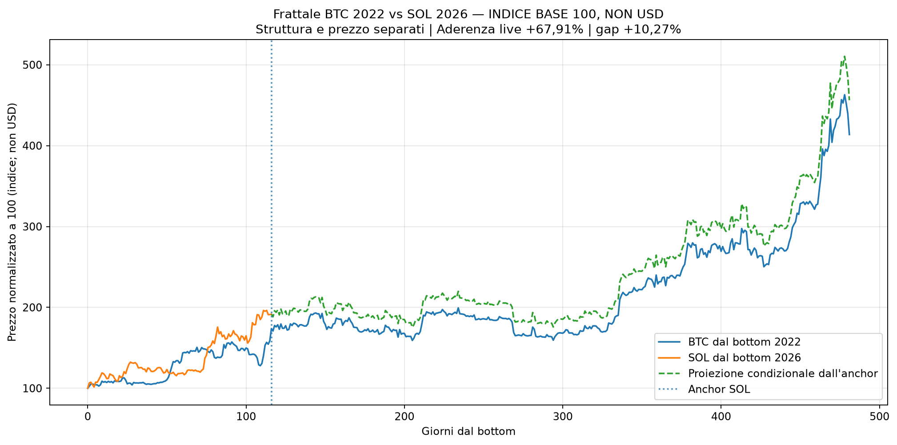

### Grafico proiezione condizionale

Serie e proiezioni ancorate all'input computazionale; riferimento pubblico separato e solo display.

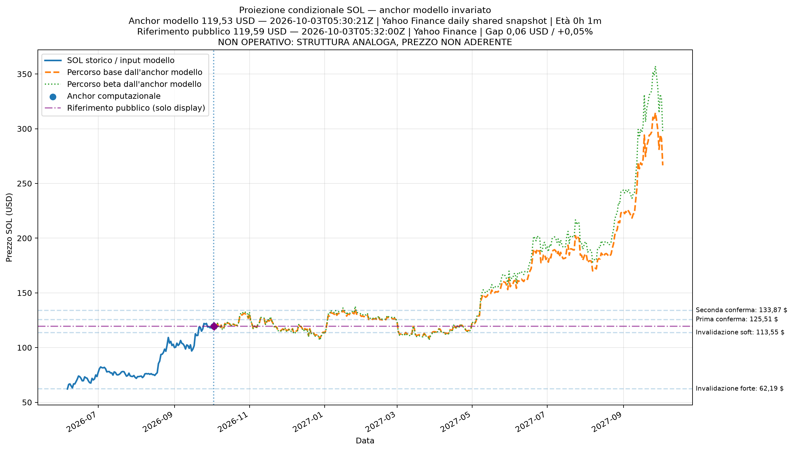

### Grafico ciclo base

Scenario analogico in USD; non previsione live e non segnale di trading.

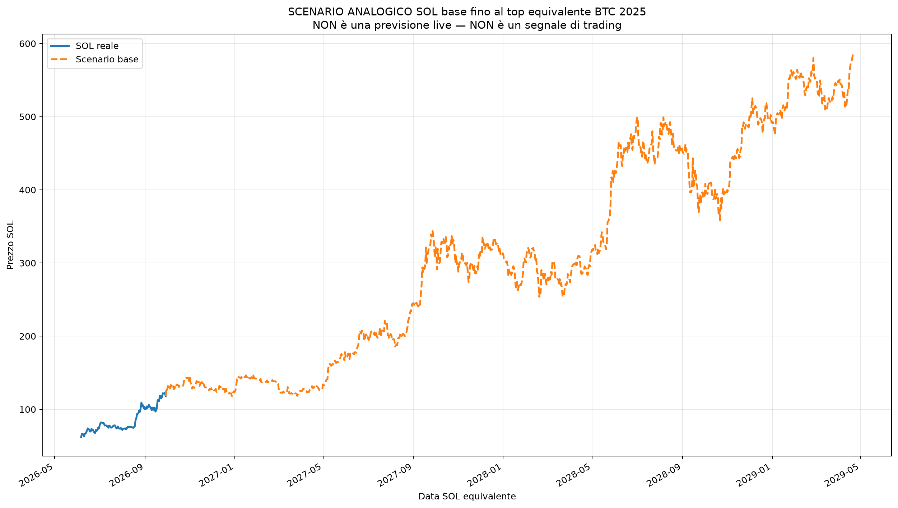

### Grafico struttura vs aderenza

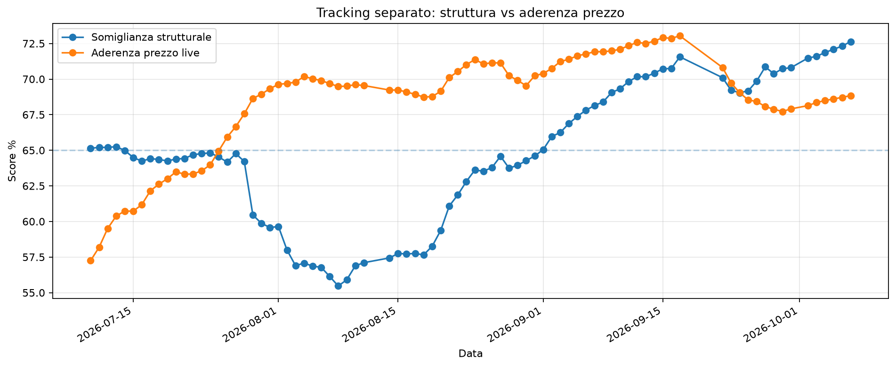

## Livelli chiave

| Livello | Prezzo / soglia | Lettura |
| --- | --- | --- |
| Rientro gap | entro ±12% | Condizione necessaria per tornare operativo. |
| Prima conferma | 128,55 $ | Deve accompagnarsi al rientro del gap. |
| Seconda conferma | 137,12 $ | Scenario più credibile. |
| Invalidazione soft | 116,31 $ | Il frattale si indebolisce. |
| Invalidazione forte | 62,19 $ | Il paragone si rompe. |

## Proiezione veloce con date SOL

| Orizzonte | Data SOL | BTC fece | SOL base | Min percorso | Max percorso |
| --- | --- | --- | --- | --- | --- |
| 7 giorni | 9 ottobre 2026 | -0,16% | 122,24 $ | 119,24 $ | 123,72 $ |
| 14 giorni | 16 ottobre 2026 | +0,57% | 123,13 $ | 118,51 $ | 124,35 $ |
| 30 giorni | 1 novembre 2026 | +8,41% | 132,73 $ | 118,51 $ | 133,11 $ |
| 60 giorni | 1 dicembre 2026 | -4,30% | 117,16 $ | 116,95 $ | 133,11 $ |
| 90 giorni | 31 dicembre 2026 | -5,45% | 115,76 $ | 109,71 $ | 133,11 $ |
| 120 giorni | 30 gennaio 2027 | +7,52% | 131,63 $ | 109,71 $ | 137,44 $ |

## Prossimi step se SOL segue BTC 2022

| Step | Date SOL | BTC fine | SOL zona bassa | SOL zona alta | SOL fine base | Lettura |
| --- | --- | --- | --- | --- | --- | --- |
| Step 1 - prossime 2 settimane | 2 ottobre 2026 -> 16 ottobre 2026 | +0,57% | 118,51 $ (10 ottobre 2026) | 124,35 $ (14 ottobre 2026) | 123,13 $ | Laterale / movimento non forte. |
| Step 2 - primo mese | 17 ottobre 2026 -> 1 novembre 2026 | +8,41% | 121,35 $ (17 ottobre 2026) | 133,11 $ (28 ottobre 2026) | 132,73 $ | Spinta rialzista abbastanza pulita. |
| Step 3 - secondo mese | 2 novembre 2026 -> 1 dicembre 2026 | -4,30% | 116,95 $ (26 novembre 2026) | 128,96 $ (18 novembre 2026) | 117,16 $ | Prima spike, poi scarico. |
| Step 4 - terzo mese | 2 dicembre 2026 -> 31 dicembre 2026 | -5,45% | 109,71 $ (28 dicembre 2026) | 122,64 $ (11 dicembre 2026) | 115,76 $ | Laterale / movimento non forte. |

Nota: le proiezioni restano condizionali; il prezzo non è aderente secondo le soglie canoniche.

<!-- BTC_SOL_FRACTAL_END -->

</details>
<!-- COMPACT_SECTION_END:btc_sol_fractal -->

<!-- COMPACT_SECTION_START:rsi_top_cycle -->
<details>
<summary><strong>📈 RSI top-cycle SOL</strong></summary>

<!-- RSI_TOP_CYCLE_START -->

---

# RSI top-cycle warning - SOL

Report separato completo: [rsi_top_cycle_report.md](rsi_top_cycle_report.md)

Filtro prudente: usa almeno 3 picchi RSI, separa vicinanza matematica e rischio reale, e non proietta la top-line oltre 12 mesi.

| Voce | Valore | Lettura |
| --- | --- | --- |
| Prezzo SOL | 122,43 $ |  |
| Weekly RSI | 65,62 / linea grezza 51,53 | LINEA NON AFFIDABILE / RISCHIO NON ATTIVO — IRREALISTICA / NON OPERATIVA |
| Monthly RSI | 50,88 / linea grezza 55,13 | RSI TROPPO BASSO PER RISCHIO TOP — VALIDA / USO PRUDENTE |
| Target ciclo base | 544,73 $ | Avanzamento +22,48% |
| Rischio top-cycle RSI | BASSO | Nessun segnale top-cycle macro attivo. Prezzo ancora lontano dal target ciclo; il filtro RSI resta solo di monitoraggio. |

## Lettura semplice

- Weekly: La top-line weekly non supera i controlli di qualità. Non viene usata per generare rischio top-cycle.
- Monthly: RSI monthly è 50,9, sotto la soglia prudente 55. Anche se fosse vicino alla linea, non è una vera zona di esaurimento ciclo.
- Confluenza prezzo + RSI: **BASSO**

Questo non è un segnale di entrata. RSI bassi o trendline non affidabili restano neutrali e non penalizzano il Global Confluence.

## Grafici RSI

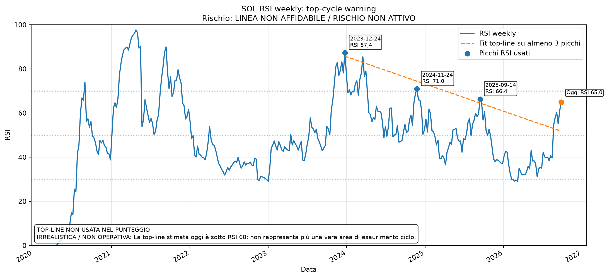

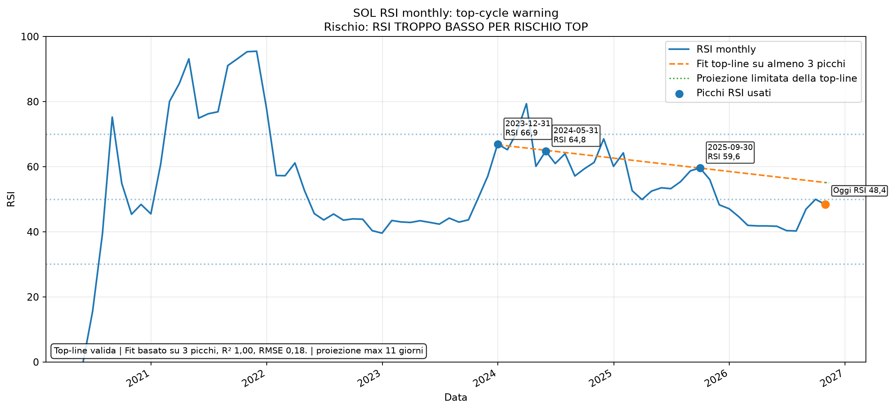

<!-- RSI_TOP_CYCLE_END -->

</details>
<!-- COMPACT_SECTION_END:rsi_top_cycle -->

<!-- COMPACT_SECTION_START:sol_onchain -->
<details>
<summary><strong>⛓️ Metriche on-chain SOL</strong></summary>

<!-- SOL_ONCHAIN_METRICS_START -->

---

# SOL on-chain metrics

Report separato completo: **[sol_onchain_metrics_report.md](sol_onchain_metrics_report.md)**

| Voce | Valore |
| --- | --- |
| Score on-chain | 1 |
| Bias | NEUTRALE / MISTA |
| Azione coerente | NESSUNA CONFERMA FORTE / LEGGERE INSIEME AL FRATTALE |
| Prezzo SOL | 122,43 $ |
| TVL Solana | 6,71 mld $ |
| TVL 7g | +3,39% |
| DEX volume 24h | 2,49 mld $ |
| Fees 24h | 17,03 mln $ |
| Stablecoin su Solana | 16,52 mld $ |
| Stake ratio | 69,41% |
| Metriche mancanti | sol_realized_price_usd, sol_mvrv, sol_holder_profit_pct, sol_exchange_netflow_24h_usd |

Lettura semplice:

**NESSUNA CONFERMA FORTE / LEGGERE INSIEME AL FRATTALE**

Questo blocco non sostituisce il frattale SOL/BTC: serve come filtro per capire se il movimento è sostenuto anche da attività on-chain.

<!-- SOL_ONCHAIN_METRICS_END -->

</details>
<!-- COMPACT_SECTION_END:sol_onchain -->

<!-- COMPACT_SECTION_START:major_alt_lifecycle -->
<details>
<summary><strong>🔄 Lifecycle squeeze / EMA200 SOL</strong></summary>

<!-- MAJOR_ALT_LIFECYCLE_SQUEEZE_START -->

---

# Major alt lifecycle squeeze - SOL

Report separato completo: **[major_alt_lifecycle_squeeze_report.md](major_alt_lifecycle_squeeze_report.md)**

| Voce                      | Valore                       |
|:--------------------------|:-----------------------------|
| Lifecycle squeeze score | 1 |
| Bias | CONTESTO DA OSSERVARE |
| Azione coerente | SOLO OSSERVAZIONE |
| Peso suggerito Global | 0 |
| Trend squeeze | STABILE / DA CONFERMARE |
| Trend squeeze score | 0 |
| Confronto precedente | 2026-09-28 |
| Fonte prezzi | Yahoo Finance SOL-USD weekly |
| Prezzo SOL | 122,43 $ |
| EMA200 weekly target | 111,43 $ |
| Upside verso EMA200 | -8,60% |
| Distanza prezzo da EMA200 | +9,41% |
| Gap EMA50/EMA200 | -4,59% |
| Stato cross | EMA50 SOTTO EMA200 |
| RSI weekly | 65,38 |
| Età SOL | 6,5 anni |
| Analoghi storici usati | 30 |
| Max analoghi per asset | 3 |
| Hit EMA200 12w analoghi | +100,00% |
| Max gain mediano 12w | +15,73% |
| Drawdown mediano 12w | -27,31% |

Lettura semplice:

**SOLO OSSERVAZIONE**

Autocontrollo: **STABILE / DA CONFERMARE**.

Questo modulo confronta SOL con altre crypto in fasi simili di età, distanza da EMA200, EMA50/EMA200 e RSI. Non usa stock market.

Nota importante: **questo modulo ora NON pesa più nel Global Confluence**. Resta solo come contesto di ciclo e come mappa verso EMA200 weekly. Il punteggio Global resta guidato da prezzo, scanner, regime, struttura tecnica, frattale, RSI e conferme reali.

Nota: se EMA50/EMA200 sono dentro ±2%, il modulo parla di medie sovrapposte / incrocio in corso, perché exchange diversi possono mostrare il cross leggermente prima o dopo.

<!-- Generato: 2026-10-02 14:07 UTC -->
<!-- MAJOR_ALT_LIFECYCLE_SQUEEZE_END -->

</details>
<!-- COMPACT_SECTION_END:major_alt_lifecycle -->

# Report giornaliero BTC / SOL / DOGE

Aggiornato il: **2026-10-02 14:05:25 UTC**

Questo report confronta il grafico attuale di Bitcoin, Solana e Dogecoin con tanti grafici storici di altre crypto.

Non è una previsione certa. È uno scanner statistico: guarda situazioni simili già successe e mostra cosa accadde dopo nei 30 giorni successivi.

<!-- COMPACT_SECTION_START:daily_change -->
<details open>
<summary><strong>🗓️ Cambiamenti rispetto a ieri</strong></summary>

<!-- DAILY_CHANGE_START -->

---

# Mini report cambiamenti da ieri

Report separato completo: [daily_change_report.md](daily_change_report.md)

- BTC: cambiamento importante in miglioramento rispetto a ieri.
- SOL: nessun cambiamento forte rispetto a ieri.
- DOGE: nessun cambiamento forte rispetto a ieri.

| Asset | Cambio | Tono | Verdetto oggi | Casi positivi oggi | Δ casi positivi |
| --- | --- | --- | --- | --- | --- |
| BTC | CAMBIAMENTO MEDIO | miglioramento | NEUTRALE / INCERTO | +52.50% | +2.50 punti |
| SOL | NESSUN CAMBIAMENTO FORTE | peggioramento | NEUTRALE / INCERTO | +35.00% | -2.50 punti |
| DOGE | NESSUN CAMBIAMENTO FORTE | peggioramento | NEUTRALE / INCERTO | +37.50% | -2.50 punti |

<!-- DAILY_CHANGE_END -->

</details>
<!-- COMPACT_SECTION_END:daily_change -->

<!-- COMPACT_SECTION_START:bounce_after_drawdown -->
<details>
<summary><strong>↕️ Sequenze rimbalzo / dump</strong></summary>

<!-- BOUNCE_AFTER_DRAWDOWN_START -->

---

# Sequenze pratiche: rimbalzo / dump

Report separato completo: [bounce_after_drawdown_report.md](bounce_after_drawdown_report.md)

Questa sezione risponde subito a due domande:

- **Se scende, è una zona di rimbalzo?**
- **Se sale forte, è una zona da prendere profitto?**

| Asset | Scende a | Target rimbalzo | % casi rimbalzo | Movimento reale | Lettura discesa | Sale a | Target dump | % casi dump | Movimento reale | Lettura spike |
| --- | --- | --- | --- | --- | --- | --- | --- | --- | --- | --- |
| BTC | 82.497 $ | 95.523 $ | +44,44% | +15,79% | rimbalzo debole | 95.523 $ | 82.497 $ | +36,67% | -13,64% | scarico possibile |
| SOL | 116,31 $ | 134,67 $ | +34,38% | +15,79% | rimbalzo poco frequente | 134,67 $ | 116,31 $ | +47,83% | -13,64% | scarico possibile |
| DOGE | 0,09222 $ | 0,10678 $ | +31,25% | +15,79% | rimbalzo poco frequente | 0,10678 $ | 0,09222 $ | +42,86% | -13,64% | scarico possibile |

## Spiegazione ultra semplice

`% casi rimbalzo` e `% casi dump` non sono percentuali assolute.

Sono percentuali **condizionate**:

- prima deve succedere la prima cosa;
- solo dopo si controlla se succede la seconda.

Esempio rimbalzo:

- prezzo iniziale 100 $
- scende a -5% = 95 $
- poi target +10% = 110 $
- da 95 $ a 110 $ il movimento reale è circa +15,79%

Quindi `poi +10%` non vuol dire +10% dal minimo. Vuol dire +10% dal prezzo iniziale.

Esempio dump:

- prezzo iniziale 100 $
- sale a +10% = 110 $
- poi target -5% = 95 $
- da 110 $ a 95 $ il movimento reale è circa -13,64%

Quindi `dump -5%` non vuol dire -5% dallo spike. Vuol dire che torna fino a 5% sotto il prezzo iniziale.

Nel report principale vedi solo la sintesi. Nel report separato ci sono anche soglie intermedie: -8%, +5%, +15%, ecc.

## Traduzione veloce

- **BTC: su 40 casi simili, 27 prima sono scesi a -5,00%. Tra quei 27, 12 poi sono rimbalzati fino a +10,00%. Percentuale: +44,44% (12/27). Dal livello -5,00% al target +10,00% il movimento reale sarebbe circa +15,79%. Lettura: rimbalzo debole.**
- **BTC: su 40 casi simili, 30 prima sono saliti a +10,00%. Tra quei 30, 11 poi sono scaricati a -5,00%. Percentuale: +36,67% (11/30). Dal livello +10,00% al target -5,00% il movimento reale sarebbe circa -13,64%. Lettura: scarico possibile.**
- **SOL: su 40 casi simili, 32 prima sono scesi a -5,00%. Tra quei 32, 11 poi sono rimbalzati fino a +10,00%. Percentuale: +34,38% (11/32). Dal livello -5,00% al target +10,00% il movimento reale sarebbe circa +15,79%. Lettura: rimbalzo poco frequente.**
- **SOL: su 40 casi simili, 23 prima sono saliti a +10,00%. Tra quei 23, 11 poi sono scaricati a -5,00%. Percentuale: +47,83% (11/23). Dal livello +10,00% al target -5,00% il movimento reale sarebbe circa -13,64%. Lettura: scarico possibile.**
- **DOGE: su 40 casi simili, 32 prima sono scesi a -5,00%. Tra quei 32, 10 poi sono rimbalzati fino a +10,00%. Percentuale: +31,25% (10/32). Dal livello -5,00% al target +10,00% il movimento reale sarebbe circa +15,79%. Lettura: rimbalzo poco frequente.**
- **DOGE: su 40 casi simili, 21 prima sono saliti a +10,00%. Tra quei 21, 9 poi sono scaricati a -5,00%. Percentuale: +42,86% (9/21). Dal livello +10,00% al target -5,00% il movimento reale sarebbe circa -13,64%. Lettura: scarico possibile.**

<!-- BOUNCE_AFTER_DRAWDOWN_END -->

</details>
<!-- COMPACT_SECTION_END:bounce_after_drawdown -->

<!-- COMPACT_SECTION_START:scanner_forecast -->
<details>
<summary><strong>🔭 Cono probabilistico dello scanner</strong></summary>

<!-- SCANNER_FORECAST_TRACKER_START -->
# Scanner forecast path / cono probabilistico

Generato: 2026-10-02 14:07:08 UTC

## Snapshot effettivamente usato

| Asset   | Snapshot prezzo   | Generazione snapshot prezzo   | Snapshot match scanner   |
|:--------|:------------------|:------------------------------|:-------------------------|
| BTC | 2026-10-02 | 2026-10-02T14:05:25Z | 2026-10-02 14:05:25 |
| SOL | 2026-10-02 | 2026-10-02T14:05:25Z | 2026-10-02 14:05:25 |
| DOGE | 2026-10-02 | 2026-10-02T14:05:25Z | 2026-10-02 14:05:25 |

La data di generazione del report non sostituisce la data degli input: se gli snapshot locali sono più vecchi, i valori restano riferiti agli snapshot indicati in tabella.

Questo report trasforma i 40 casi simili dello scanner in un cono previsionale leggibile.

Per ogni asset crea:

- banda larga p10-p90
- banda centrale p25-p75
- scenario centrale p50
- prezzo reale sovrapposto quando sono disponibili dati successivi

Correzione importante: il cono ora viene calcolato dai percorsi reali dei match storici, non solo dai percentili finali a 30 giorni. Quindi il grafico non deve più mostrare solo due puntini.

## Ultimo cono previsionale salvato

| Asset   | Data       | Prezzo iniziale   | Direzione scanner   | Casi positivi   | P10 30g     | P25 30g     | P50 30g     | P75 30g      | P90 30g      |
|:--------|:-----------|:------------------|:--------------------|:----------------|:------------|:------------|:------------|:-------------|:-------------|
| BTC | 2026-10-02 | 86.839 $ | INCERTO | 52,50% | 73.352,60 $ | 76.623,67 $ | 89.305,32 $ | 102.252,27 $ | 125.966,01 $ |
| SOL | 2026-10-02 | 122,43 $ | DISCESA | 35,00% | 97,55 $ | 104,46 $ | 114,97 $ | 130,75 $ | 159,79 $ |
| DOGE | 2026-10-02 | 0.09707 $ | DISCESA | 37,50% | 0.07139 $ | 0.08221 $ | 0.09299 $ | 0.10403 $ | 0.14399 $ |

## Confronto raw / regime-adjusted

Il cono raw continua a usare i 40 casi dello scanner. Il cono regime-adjusted sceglie una sola coorte nella gerarchia SAME_BTC_AND_ASSET_REGIME → SAME_ASSET_REGIME → SAME_BTC_REGIME. Ogni livello richiede almeno 5 match; le coorti non vengono mai combinate e ogni fallback è dichiarato.

| Asset   | Stato adjusted   | selected_regime_group   |   full_regime_matches |   same_asset_regime_matches |   same_btc_regime_matches |   selected_sample_size |   minimum_required | fallback_level        | selection_reason              | Raw p50 30g   | Adjusted p50 30g   | Raw p90 30g   | Adjusted p90 30g   |
|:--------|:-----------------|:------------------------|----------------------:|----------------------------:|--------------------------:|-----------------------:|-------------------:|:----------------------|:------------------------------|:--------------|:-------------------|:--------------|:-------------------|
| BTC | AVAILABLE | SAME_BTC_REGIME | 2 | 2 | 12 | 12 | 5 | 2_SAME_BTC_FALLBACK | FALLBACK_TO_SAME_BTC_REGIME | 89.305,32 $ | 87.585,61 $ | 125.966,01 $ | 111.637,86 $ |
| SOL | AVAILABLE | SAME_ASSET_REGIME | 2 | 6 | 12 | 6 | 5 | 1_SAME_ASSET_FALLBACK | FALLBACK_TO_SAME_ASSET_REGIME | 114,97 $ | 125,19 $ | 159,79 $ | 184,59 $ |
| DOGE | AVAILABLE | SAME_BTC_REGIME | 0 | 2 | 9 | 9 | 5 | 2_SAME_BTC_FALLBACK | FALLBACK_TO_SAME_BTC_REGIME | 0.09299 $ | 0.08983 $ | 0.14399 $ | 0.12727 $ |

## Grafici

### BTC


#### Verifica storica e discrepanza


- Cono congelato il **2026-09-02**; verificato fino al **2026-10-02**; stato **COMPLETO 30/30g**.
- Reale **86.577,81 $**; p50 previsto **83.250,64 $**; scarto **4,00%**.
- Errore medio assoluto **3,32%**; massimo **8,84%**; DENTRO p10-p90; DENTRO p25-p75.

#### Cono regime-adjusted

Gruppo selezionato: **SAME_BTC_REGIME**; fallback: **2_SAME_BTC_FALLBACK**; motivo: **FALLBACK_TO_SAME_BTC_REGIME**.

**WARNING:** coorte fallback meno stringente rispetto a SAME_BTC_AND_ASSET_REGIME.


### SOL


<!-- SOL_CONDITIONAL_ANALYSES_START -->
#### SOL — Analisi condizionata -5% → +10%

Queste analisi sono **separate dal cono SOL originale**. Il cono sopra continua a usare normalmente i **40 analoghi più simili a SOL**.

Il filtro condizionato parte proprio da quei 40 casi e conserva soltanto gli episodi che hanno toccato **prima -5%** dal proprio baseline e **successivamente +10% entro 30 giorni**.

##### A. Conditional Successor corrente — dinamico

Questo campione viene ricostruito ad ogni run dai **40 analoghi SOL correnti**. Di conseguenza il numero di episodi qualificati e gli asset possono cambiare giorno per giorno.

**Campione corrente:** 11 episodi qualificati su 40 · 11 asset distinti.


###### Confronto diretto a 30 giorni

| Modello | Vintage | N | Target | P10 | P25 | P50 | P75 | P90 |
| --- | --- | ---: | --- | ---: | ---: | ---: | ---: | ---: |
| Cono standard | 2026-10-02 | 40 | 2026-11-01 | 97.55 $ | 104.46 $ | 114.97 $ | 130.75 $ | 159.79 $ |
| Conditional corrente | 2026-10-02 | 11 | 2026-11-01 | 92.51 $ | 97.85 $ | 111.76 $ | 137.65 $ | 210.81 $ |

###### Struttura successiva dei casi correnti

| Classe | Episodi | Frequenza empirica |
| --- | ---: | ---: |
| DIRECT_CONTINUATION | 5 | 45.45% |
| SHALLOW_PULLBACK_THEN_CONTINUATION | 0 | 0.00% |
| DEEP_PULLBACK_THEN_RECOVERY | 1 | 9.09% |
| FAILURE | 5 | 45.45% |
| UNRESOLVED | 0 | 0.00% |

###### Episodi qualificati oggi

| Asset | Match window | -5% hit | +10% anchor | Classe 60d |
| --- | --- | --- | --- | --- |
| RUNE-USD | 2023-06-16 → 2023-09-23 | 2023-10-09 | 2023-10-23 | DIRECT_CONTINUATION |
| KSM-USD | 2023-09-06 → 2023-12-14 | 2023-12-15 | 2023-12-21 | DIRECT_CONTINUATION |
| BTC-USD | 2022-11-19 → 2023-02-26 | 2023-03-03 | 2023-03-17 | DIRECT_CONTINUATION |
| VET-USD | 2023-09-05 → 2023-12-13 | 2023-12-15 | 2023-12-20 | FAILURE |
| EOS-USD | 2023-09-08 → 2023-12-16 | 2023-12-19 | 2023-12-27 | FAILURE |
| AVAX-USD | 2021-06-21 → 2021-09-28 | 2021-10-10 | 2021-10-25 | DEEP_PULLBACK_THEN_RECOVERY |
| ETC-USD | 2023-09-08 → 2023-12-16 | 2023-12-19 | 2024-01-10 | DIRECT_CONTINUATION |
| DOT-USD | 2023-09-08 → 2023-12-16 | 2023-12-19 | 2023-12-21 | DIRECT_CONTINUATION |
| KAVA-USD | 2023-09-08 → 2023-12-16 | 2023-12-18 | 2023-12-26 | FAILURE |
| NEO-USD | 2020-11-12 → 2021-02-19 | 2021-02-20 | 2021-02-21 | FAILURE |
| XTZ-USD | 2023-09-08 → 2023-12-16 | 2023-12-18 | 2023-12-25 | FAILURE |

##### B. Vintage originale 18 settembre — congelato

Questo invece **non cambia più**. Conserva gli 8 episodi / 6 asset della nostra analisi originale e serve per verificare fuori campione se quella specifica previsione descrive bene SOL.

Anchor della chat: circa **$112.70** il **2026-09-18**.

**SMALL SAMPLE · SENSITIVITY UNSTABLE · DIAGNOSTIC ONLY.**


###### Percentili congelati a 30 giorni

| Modello | Vintage | N | Target | P10 | P25 | P50 | P75 | P90 |
| --- | --- | ---: | --- | ---: | ---: | ---: | ---: | ---: |
| Conditional vintage | 2026-09-18 | 8 | 2026-10-18 | 96.70 $ | 109.70 $ | 168.54 $ | 188.19 $ | 214.50 $ |

###### Verifica contro SOL reale

- Ultimo close disponibile: **2026-10-02** · SOL **121.93 $**.
- Giorno del vintage: **14/30**.
- P50 condizionato previsto per quel giorno: **122.67 $**.
- SOL reale: **DENTRO p10-p90** · **DENTRO p25-p75**.

###### Parità con l'analisi originale

| Giorno | Mediana return riprodotta |
| ---: | ---: |
| 7 | -11.51% |
| 14 | 8.85% |
| 21 | 36.80% |
| 30 | 49.55% |

###### Gli 8 episodi congelati

| Asset | Match window | -5% hit | +10% anchor |
| --- | --- | --- | --- |
| BNB-USD | 2023-10-13 → 2024-01-20 | 2024-01-23 | 2024-02-15 |
| HBAR-USD | 2020-11-04 → 2021-02-11 | 2021-02-14 | 2021-02-18 |
| RUNE-USD | 2020-03-28 → 2020-07-05 | 2020-07-06 | 2020-07-20 |
| ETH-USD | 2020-05-11 → 2020-08-18 | 2020-08-21 | 2020-09-01 |
| ADA-USD | 2020-09-08 → 2020-12-16 | 2020-12-21 | 2020-12-29 |
| BCH-USD | 2019-01-17 → 2019-04-26 | 2019-04-29 | 2019-05-03 |
| RUNE-USD | 2023-06-01 → 2023-09-08 | 2023-09-11 | 2023-09-15 |
| HBAR-USD | 2024-09-04 → 2024-12-12 | 2024-12-18 | 2024-12-24 |

**Come leggere la differenza:** il cono standard risponde a "cosa hanno fatto i 40 casi più simili?". Il Conditional Successor risponde a una domanda più stretta: "tra quei casi, cosa è successo dopo che avevano già completato -5% → +10%?". Per questo il secondo può risultare più rialzista ma anche molto più fragile statisticamente.

I due modelli **non vengono mediati**, non sostituiscono l'uno l'altro e non modificano Global Confluence, segnali o decisioni.

<!-- SOL_CONDITIONAL_ANALYSES_END -->


#### Verifica storica e discrepanza


- Cono congelato il **2026-09-02**; verificato fino al **2026-10-02**; stato **COMPLETO 30/30g**.
- Reale **121,93 $**; p50 previsto **106,97 $**; scarto **13,99%**.
- Errore medio assoluto **7,15%**; massimo **17,51%**; DENTRO p10-p90; DENTRO p25-p75.

#### Cono regime-adjusted

Gruppo selezionato: **SAME_ASSET_REGIME**; fallback: **1_SAME_ASSET_FALLBACK**; motivo: **FALLBACK_TO_SAME_ASSET_REGIME**.

**WARNING:** coorte fallback meno stringente rispetto a SAME_BTC_AND_ASSET_REGIME.


### DOGE


#### Verifica storica e discrepanza


- Cono congelato il **2026-09-02**; verificato fino al **2026-10-02**; stato **COMPLETO 30/30g**.
- Reale **0.09653 $**; p50 previsto **0.07570 $**; scarto **27,51%**.
- Errore medio assoluto **10,53%**; massimo **27,51%**; DENTRO p10-p90; FUORI p25-p75.

#### Cono regime-adjusted

Gruppo selezionato: **SAME_BTC_REGIME**; fallback: **2_SAME_BTC_FALLBACK**; motivo: **FALLBACK_TO_SAME_BTC_REGIME**.

**WARNING:** coorte fallback meno stringente rispetto a SAME_BTC_AND_ASSET_REGIME.


## Accuratezza percorso scanner

| Asset   | Giorno   |   Controlli | Dentro p10-p90   | Dentro p25-p75   | Errore medio abs vs p50   | Errore medio vs p50   |
|:--------|:---------|------------:|:-----------------|:-----------------|:--------------------------|:----------------------|
| BTC | 1g | 76 | 93,42% | 68,42% | 1,97% | 0,46% |
| BTC | 3g | 73 | 93,15% | 75,34% | 3,40% | 0,69% |
| BTC | 7g | 65 | 92,31% | 67,69% | 4,98% | 1,80% |
| BTC | 14g | 54 | 98,15% | 72,22% | 5,57% | 2,13% |
| BTC | 30g | 25 | 100,00% | 92,00% | 8,50% | 3,22% |
| SOL | 1g | 76 | 82,89% | 63,16% | 2,70% | 0,91% |
| SOL | 3g | 73 | 91,78% | 73,97% | 3,95% | 1,76% |
| SOL | 7g | 65 | 90,77% | 72,31% | 5,62% | 3,83% |
| SOL | 14g | 54 | 87,04% | 75,93% | 8,04% | 7,16% |
| SOL | 30g | 25 | 92,00% | 52,00% | 15,18% | 14,67% |
| DOGE | 1g | 76 | 88,16% | 61,84% | 3,07% | 0,57% |
| DOGE | 3g | 73 | 91,78% | 63,01% | 4,74% | 1,47% |
| DOGE | 7g | 65 | 75,38% | 73,85% | 8,70% | 6,00% |
| DOGE | 14g | 54 | 83,33% | 46,30% | 11,35% | 9,79% |
| DOGE | 30g | 25 | 92,00% | 36,00% | 17,69% | 17,69% |

## Tail / outlier audit

I casi di coda restano nel calcolo. L'audit leave-one-out quantifica la sensibilità dei percentili senza trasformare l'analisi in un filtro discrezionale.

Dettaglio completo: [scanner_forecast_tail_outlier_audit.md](scanner_forecast_tail_outlier_audit.md).

## Calibratore shadow

Il cono ufficiale resta grezzo e invariato. Il calibratore usa soltanto previsioni passate già mature, campionate una volta a settimana per ridurre la falsa indipendenza. Ogni orizzonte si attiva a 30 controlli indipendenti: parte al 25% della correzione stimata e cresce gradualmente fino al 100% a 100 controlli.

| Asset   | Orizzonte   |   Controlli indipendenti |   Soglia | Stato                  | Forza correzione   | Shift p50   |   Scala p10-p90 |
|:--------|:------------|-------------------------:|---------:|:-----------------------|:-------------------|:------------|----------------:|
| BTC | 1g | 13 | 30 | RACCOLTA (17 mancanti) | 0,0% | 0,00% | 1,000 |
| BTC | 3g | 13 | 30 | RACCOLTA (17 mancanti) | 0,0% | 0,00% | 1,000 |
| BTC | 7g | 12 | 30 | RACCOLTA (18 mancanti) | 0,0% | 0,00% | 1,000 |
| BTC | 14g | 11 | 30 | RACCOLTA (19 mancanti) | 0,0% | 0,00% | 1,000 |
| BTC | 30g | 9 | 30 | RACCOLTA (21 mancanti) | 0,0% | 0,00% | 1,000 |
| SOL | 1g | 13 | 30 | RACCOLTA (17 mancanti) | 0,0% | 0,00% | 1,000 |
| SOL | 3g | 13 | 30 | RACCOLTA (17 mancanti) | 0,0% | 0,00% | 1,000 |
| SOL | 7g | 12 | 30 | RACCOLTA (18 mancanti) | 0,0% | 0,00% | 1,000 |
| SOL | 14g | 11 | 30 | RACCOLTA (19 mancanti) | 0,0% | 0,00% | 1,000 |
| SOL | 30g | 9 | 30 | RACCOLTA (21 mancanti) | 0,0% | 0,00% | 1,000 |
| DOGE | 1g | 13 | 30 | RACCOLTA (17 mancanti) | 0,0% | 0,00% | 1,000 |
| DOGE | 3g | 13 | 30 | RACCOLTA (17 mancanti) | 0,0% | 0,00% | 1,000 |
| DOGE | 7g | 12 | 30 | RACCOLTA (18 mancanti) | 0,0% | 0,00% | 1,000 |
| DOGE | 14g | 11 | 30 | RACCOLTA (19 mancanti) | 0,0% | 0,00% | 1,000 |
| DOGE | 30g | 9 | 30 | RACCOLTA (21 mancanti) | 0,0% | 0,00% | 1,000 |

### Confronto fuori campione: grezzo vs shadow

| Asset   | Orizzonte   |   Controlli OOS | MAE grezzo   | MAE shadow   | Miglioramento   | Shadow vince   | Copertura larga grezza   | Copertura larga shadow   |
|:--------|:------------|----------------:|:-------------|:-------------|:----------------|:---------------|:-------------------------|:-------------------------|
| BTC | 1g | 0 | n/a | n/a | n/a | n/a | n/a | n/a |
| BTC | 3g | 0 | n/a | n/a | n/a | n/a | n/a | n/a |
| BTC | 7g | 0 | n/a | n/a | n/a | n/a | n/a | n/a |
| BTC | 14g | 0 | n/a | n/a | n/a | n/a | n/a | n/a |
| BTC | 30g | 0 | n/a | n/a | n/a | n/a | n/a | n/a |
| DOGE | 1g | 0 | n/a | n/a | n/a | n/a | n/a | n/a |
| DOGE | 3g | 0 | n/a | n/a | n/a | n/a | n/a | n/a |
| DOGE | 7g | 0 | n/a | n/a | n/a | n/a | n/a | n/a |
| DOGE | 14g | 0 | n/a | n/a | n/a | n/a | n/a | n/a |
| DOGE | 30g | 0 | n/a | n/a | n/a | n/a | n/a | n/a |
| SOL | 1g | 0 | n/a | n/a | n/a | n/a | n/a | n/a |
| SOL | 3g | 0 | n/a | n/a | n/a | n/a | n/a | n/a |
| SOL | 7g | 0 | n/a | n/a | n/a | n/a | n/a | n/a |
| SOL | 14g | 0 | n/a | n/a | n/a | n/a | n/a | n/a |
| SOL | 30g | 0 | n/a | n/a | n/a | n/a | n/a | n/a |

## Come leggerlo

- Se il prezzo resta dentro p10-p90, lo scanner sta ancora descrivendo bene il range largo.
- Se il prezzo resta dentro p25-p75, lo scanner sta descrivendo bene anche il range centrale.
- Se il prezzo segue p50, il percorso reale è vicino allo scenario normale.
- Se il prezzo esce da p10-p90, il modello statistico dei 40 casi sta perdendo aderenza.
- Questo non sostituisce drawdown e max gain: serve soprattutto a vedere il percorso del return previsto.

Nota: servono almeno 5 controlli prima di dare un peso minimo al cono. Sotto 5 controlli resta solo osservazione.
<!-- SCANNER_FORECAST_TRACKER_END -->

</details>
<!-- COMPACT_SECTION_END:scanner_forecast -->

<!-- COMPACT_SECTION_START:extreme_cases -->
<details>
<summary><strong>⚠️ Percorso dei casi estremi</strong></summary>

<!-- EXTREME_CASES_PATH_START -->
# Extreme cases path report

Generato: 2026-10-02 14:07 UTC

Questo report si attiva quando i casi positivi o negativi sono almeno **80%**.

Ora misura anche il **rialzo massimo prima della discesa principale**, quindi distingue uno spike iniziale da una discesa quasi immediata.

## Trigger estremi

| Asset   | Direzione   | Trigger   | Percentuale   | Motivo                           |   Match disponibili |
|:--------|:------------|:----------|:--------------|:---------------------------------|--------------------:|
| BTC     | NESSUNO     | NO        | +52,50%       | Nessun lato sopra soglia estrema |                  40 |
| SOL     | NESSUNO     | NO        | +65,00%       | Nessun lato sopra soglia estrema |                  40 |
| DOGE    | NESSUNO     | NO        | +62,50%       | Nessun lato sopra soglia estrema |                  40 |

## Come leggerlo

- **Grafico pulito**: mostra il percorso centrale.
- **Asset per asset**: mostra le differenze tra gli analoghi storici.
- **Spike prima della discesa**: risponde a quanto poteva salire prima di scendere.
- **Spike contro minimo**: mostra quanto rialzo iniziale è stato poi seguito da quale discesa.

Questo report è diagnostico e non modifica il Global Confluence.
<!-- EXTREME_CASES_PATH_END -->

</details>
<!-- COMPACT_SECTION_END:extreme_cases -->

<!-- COMPACT_SECTION_START:scanner_full_detail -->
<details>
<summary><strong>📚 Scanner statistico completo — percentili, mappe e 40 casi storici</strong></summary>

# Come leggere questo report

Leggilo sempre in questo ordine:

1. **Direzione più probabile**: ti dice se storicamente era più facile salita, discesa o incertezza.
2. **Casi positivi / negativi**: ti dice la percentuale storica di salita o discesa dopo 30 giorni.
3. **Return 30d**: ti dice dove potrebbe stare il prezzo fra 30 giorni.
4. **Drawdown 30d**: ti dice quanto potrebbe scendere durante quei 30 giorni.
5. **Max gain 30d**: ti dice quanto potrebbe salire durante quei 30 giorni.
6. **Scanner autocalibrato**: dopo abbastanza dati, confronta previsione e realtà e corregge la lettura.

La frase più importante è questa:

> **Return = prezzo finale dopo 30 giorni. Drawdown = discesa durante il mese. Max gain = rialzo durante il mese.**

---

# Scheda veloce: cosa sono i percentili

I **percentili** sono solo un modo per trasformare i 40 casi storici simili in scenari semplici.

## Traduzione semplice

- **Percentile 10%** = molto male / scenario brutto.
- **Percentile 25%** = male / scenario negativo.
- **Percentile 50%** = normale / scenario centrale. È il più importante.
- **Percentile 75%** = bene / scenario buono.
- **Percentile 90%** = molto bene / scenario molto forte.

## Cosa guardare davvero

- Per capire la situazione normale: guarda sempre il **Percentile 50%**.
- Per capire il rischio con leva: guarda **Drawdown 25%** e **Drawdown 10%**.
- Per capire un possibile take profit: guarda **Max gain 50%** e **Max gain 75%**.

## I tre tipi di percentili

- **Percentili Return 30d** = dove potrebbe stare il prezzo fra 30 giorni.
- **Percentili Drawdown 30d** = quanto potrebbe scendere durante i 30 giorni.
- **Percentili Max gain 30d** = quanto potrebbe salire durante i 30 giorni.

## Esempio semplice

Se SOL oggi vale 82 $ e il report dice:

- **Return 50% → 81 $**: fra 30 giorni lo scenario normale è circa 81 $.
- **Drawdown 50% → 77 $**: durante il mese può scendere normalmente verso 77 $.
- **Max gain 50% → 92 $**: durante il mese può fare uno spike normale verso 92 $.

Quindi può salire e scendere durante il mese, ma il **return** guarda solo dove finisce dopo 30 giorni.

---

# Lettura velocissima

Questa è la parte da leggere per prima. Ti dice subito se lo scenario è più da salita, discesa o incertezza.

## Bitcoin
- Direzione più probabile a 30 giorni: **INCERTO**
- Casi positivi / salita storica: **52,50%**
- Casi negativi / discesa storica: **47,50%**
- Quanto è netto il segnale: **molto debole / quasi pari**
- Prezzo attuale: **86.839,02 $**
- Return normale fra 30 giorni: **89.305,32 $** (2,84%)
- Drawdown normale durante il mese: **77.207,52 $** (-11,09%)
- Drawdown brutto da rispettare: **73.259,27 $** (-15,64%)
- Max gain normale durante il mese: **102.560,98 $** (18,10%)
- Max gain buono / take profit ottimistico: **120.665,92 $** (38,95%)

**Come leggerlo:** casi positivi/negativi ti dicono la direzione più probabile. Return ti dice il prezzo finale fra 30 giorni. Drawdown ti dice il rischio di discesa durante il mese. Max gain ti dice il possibile rialzo durante il mese.

## Solana
- Direzione più probabile a 30 giorni: **DISCESA**
- Casi positivi / salita storica: **35,00%**
- Casi negativi / discesa storica: **65,00%**
- Quanto è netto il segnale: **medio**
- Prezzo attuale: **122,43 $**
- Return normale fra 30 giorni: **114,97 $** (-6,09%)
- Drawdown normale durante il mese: **107,45 $** (-12,23%)
- Drawdown brutto da rispettare: **95,03 $** (-22,38%)
- Max gain normale durante il mese: **140,84 $** (15,04%)
- Max gain buono / take profit ottimistico: **155,38 $** (26,91%)

**Come leggerlo:** casi positivi/negativi ti dicono la direzione più probabile. Return ti dice il prezzo finale fra 30 giorni. Drawdown ti dice il rischio di discesa durante il mese. Max gain ti dice il possibile rialzo durante il mese.

## Dogecoin
- Direzione più probabile a 30 giorni: **DISCESA**
- Casi positivi / salita storica: **37,50%**
- Casi negativi / discesa storica: **62,50%**
- Quanto è netto il segnale: **medio**
- Prezzo attuale: **0,10 $**
- Return normale fra 30 giorni: **0,09 $** (-4,21%)
- Drawdown normale durante il mese: **0,08 $** (-14,75%)
- Drawdown brutto da rispettare: **0,08 $** (-22,60%)
- Max gain normale durante il mese: **0,11 $** (12,66%)
- Max gain buono / take profit ottimistico: **0,12 $** (25,46%)

**Come leggerlo:** casi positivi/negativi ti dicono la direzione più probabile. Return ti dice il prezzo finale fra 30 giorni. Drawdown ti dice il rischio di discesa durante il mese. Max gain ti dice il possibile rialzo durante il mese.

## Messaggio del giorno

Il quadro generale oggi è prudente/debole. Lo scanner vede più rischio di discesa che salita pulita su più asset.

---

# Mappa semplice asset per asset

# Bitcoin — mappa semplice dei prossimi 30 giorni

**Semaforo:** 🟡 GIALLO / Incerto
**Prezzo attuale:** 86.839,02 $

**Direzione più probabile a 30 giorni:** **INCERTO**
- Probabilità storica di salita: **52,50%**
- Probabilità storica di discesa: **47,50%**
- Quanto è netto il segnale: **molto debole / quasi pari**

## Come leggere questa parte

- **Probabilità storica di salita** = su 40 casi simili, quanti hanno chiuso sopra dopo 30 giorni.
- **Probabilità storica di discesa** = su 40 casi simili, quanti hanno chiuso sotto dopo 30 giorni.
- **Quanto è netto il segnale** = quanto è grande la differenza tra salita e discesa. Non vuol dire certezza, vuol dire solo che il risultato storico non è vicino al 50/50.

La lettura principale è incerta, con segnale molto debole / quasi pari. Nei casi storici simili non c'è stato un vantaggio chiaro né per salita né per discesa.

## 1. Return 30d — prezzo fra 30 giorni

**Return** significa rendimento finale. Qui guardiamo dove potrebbe stare il prezzo **alla fine dei 30 giorni**, non durante il percorso.

- Se va molto male: **73.352,60 $** (-15,53%)
- Se va male: **76.623,67 $** (-11,76%)
- Scenario normale: **89.305,32 $** (2,84%)
- Se va bene: **102.252,27 $** (17,75%)
- Se va molto bene: **125.966,01 $** (45,06%)

**Come leggerlo:** se vuoi sapere dove potrebbe trovarsi il prezzo fra 30 giorni, guarda soprattutto lo **scenario normale**.

## 2. Drawdown 30d — discesa durante i 30 giorni

**Drawdown** significa la discesa massima durante il periodo. Non è il prezzo finale: è il punto più basso che il prezzo può toccare durante il mese.

- Discesa normale: **77.207,52 $** (-11,09%)
- Discesa brutta: **73.259,27 $** (-15,64%)
- Discesa molto brutta: **67.389,49 $** (-22,40%)

**Come leggerlo:** se usi leva, questa è la parte più importante. Anche se dopo 30 giorni il prezzo recupera, durante il mese può prima scendere qui.

## 3. Max gain 30d — rialzo durante i 30 giorni

**Max gain** significa il massimo rialzo toccato durante il mese. Non è il prezzo finale: può essere anche solo uno spike temporaneo.

- Rialzo normale: **102.560,98 $** (18,10%)
- Rialzo buono: **120.665,92 $** (38,95%)
- Rialzo molto forte: **167.226,84 $** (92,57%)

**Come leggerlo:** questa parte serve per capire possibili zone di take profit. Il rialzo normale è più realistico; il rialzo molto forte è possibile ma meno comune.

## Lettura pratica finale

Scenario normale: nei casi simili, Bitcoin tendeva a muoversi tra una zona bassa intorno a **77.207,52 $** e uno spike normale intorno a **102.560,98 $**.

La chiusura a 30 giorni è incerta: salita 52,50%, discesa 47,50%. Non c'è un vantaggio netto.

Nota leva BTC: se la liquidazione è vicina a 51.000 $, guarda soprattutto la discesa brutta e molto brutta. Il prezzo può recuperare dopo, ma la leva può saltare prima.

---

# Solana — mappa semplice dei prossimi 30 giorni

**Semaforo:** 🟡 GIALLO / Incerto
**Prezzo attuale:** 122,43 $

**Direzione più probabile a 30 giorni:** **DISCESA**
- Probabilità storica di salita: **35,00%**
- Probabilità storica di discesa: **65,00%**
- Quanto è netto il segnale: **medio**

## Come leggere questa parte

- **Probabilità storica di salita** = su 40 casi simili, quanti hanno chiuso sopra dopo 30 giorni.
- **Probabilità storica di discesa** = su 40 casi simili, quanti hanno chiuso sotto dopo 30 giorni.
- **Quanto è netto il segnale** = quanto è grande la differenza tra salita e discesa. Non vuol dire certezza, vuol dire solo che il risultato storico non è vicino al 50/50.

La lettura principale è ribassista, con segnale medio. Nei casi storici simili, il prezzo ha chiuso sotto dopo 30 giorni più spesso di quanto abbia chiuso sopra.

## 1. Return 30d — prezzo fra 30 giorni

**Return** significa rendimento finale. Qui guardiamo dove potrebbe stare il prezzo **alla fine dei 30 giorni**, non durante il percorso.

- Se va molto male: **97,55 $** (-20,32%)
- Se va male: **104,46 $** (-14,68%)
- Scenario normale: **114,97 $** (-6,09%)
- Se va bene: **130,75 $** (6,79%)
- Se va molto bene: **159,79 $** (30,51%)

**Come leggerlo:** se vuoi sapere dove potrebbe trovarsi il prezzo fra 30 giorni, guarda soprattutto lo **scenario normale**.

## 2. Drawdown 30d — discesa durante i 30 giorni

**Drawdown** significa la discesa massima durante il periodo. Non è il prezzo finale: è il punto più basso che il prezzo può toccare durante il mese.

- Discesa normale: **107,45 $** (-12,23%)
- Discesa brutta: **95,03 $** (-22,38%)
- Discesa molto brutta: **87,93 $** (-28,18%)

**Come leggerlo:** se usi leva, questa è la parte più importante. Anche se dopo 30 giorni il prezzo recupera, durante il mese può prima scendere qui.

## 3. Max gain 30d — rialzo durante i 30 giorni

**Max gain** significa il massimo rialzo toccato durante il mese. Non è il prezzo finale: può essere anche solo uno spike temporaneo.

- Rialzo normale: **140,84 $** (15,04%)
- Rialzo buono: **155,38 $** (26,91%)
- Rialzo molto forte: **209,75 $** (71,32%)

**Come leggerlo:** questa parte serve per capire possibili zone di take profit. Il rialzo normale è più realistico; il rialzo molto forte è possibile ma meno comune.

## Lettura pratica finale

Scenario normale: nei casi simili, Solana tendeva a muoversi tra una zona bassa intorno a **107,45 $** e uno spike normale intorno a **140,84 $**.

La chiusura a 30 giorni era più spesso negativa: salita 35,00%, discesa 65,00%. Quindi la lettura principale è prudente/debole.

---

# Dogecoin — mappa semplice dei prossimi 30 giorni

**Semaforo:** 🟡 GIALLO / Incerto
**Prezzo attuale:** 0,10 $

**Direzione più probabile a 30 giorni:** **DISCESA**
- Probabilità storica di salita: **37,50%**
- Probabilità storica di discesa: **62,50%**
- Quanto è netto il segnale: **medio**

## Come leggere questa parte

- **Probabilità storica di salita** = su 40 casi simili, quanti hanno chiuso sopra dopo 30 giorni.
- **Probabilità storica di discesa** = su 40 casi simili, quanti hanno chiuso sotto dopo 30 giorni.
- **Quanto è netto il segnale** = quanto è grande la differenza tra salita e discesa. Non vuol dire certezza, vuol dire solo che il risultato storico non è vicino al 50/50.

La lettura principale è ribassista, con segnale medio. Nei casi storici simili, il prezzo ha chiuso sotto dopo 30 giorni più spesso di quanto abbia chiuso sopra.

## 1. Return 30d — prezzo fra 30 giorni

**Return** significa rendimento finale. Qui guardiamo dove potrebbe stare il prezzo **alla fine dei 30 giorni**, non durante il percorso.

- Se va molto male: **0,07 $** (-26,45%)
- Se va male: **0,08 $** (-15,30%)
- Scenario normale: **0,09 $** (-4,21%)
- Se va bene: **0,10 $** (7,17%)
- Se va molto bene: **0,14 $** (48,34%)

**Come leggerlo:** se vuoi sapere dove potrebbe trovarsi il prezzo fra 30 giorni, guarda soprattutto lo **scenario normale**.

## 2. Drawdown 30d — discesa durante i 30 giorni

**Drawdown** significa la discesa massima durante il periodo. Non è il prezzo finale: è il punto più basso che il prezzo può toccare durante il mese.

- Discesa normale: **0,08 $** (-14,75%)
- Discesa brutta: **0,08 $** (-22,60%)
- Discesa molto brutta: **0,06 $** (-35,17%)

**Come leggerlo:** se usi leva, questa è la parte più importante. Anche se dopo 30 giorni il prezzo recupera, durante il mese può prima scendere qui.

## 3. Max gain 30d — rialzo durante i 30 giorni

**Max gain** significa il massimo rialzo toccato durante il mese. Non è il prezzo finale: può essere anche solo uno spike temporaneo.

- Rialzo normale: **0,11 $** (12,66%)
- Rialzo buono: **0,12 $** (25,46%)
- Rialzo molto forte: **0,19 $** (96,52%)

**Come leggerlo:** questa parte serve per capire possibili zone di take profit. Il rialzo normale è più realistico; il rialzo molto forte è possibile ma meno comune.

## Lettura pratica finale

Scenario normale: nei casi simili, Dogecoin tendeva a muoversi tra una zona bassa intorno a **0,08 $** e uno spike normale intorno a **0,11 $**.

La chiusura a 30 giorni era più spesso negativa: salita 37,50%, discesa 62,50%. Quindi la lettura principale è prudente/debole.

---

# Come leggere correttamente i 30 giorni

Ogni report giornaliero è una previsione statistica sui **prossimi 30 giorni**.

Ci sono tre dati diversi:

1. **Return 30d** = dove potrebbe stare il prezzo fra 30 giorni.
2. **Drawdown 30d** = quanto potrebbe scendere durante quei 30 giorni.
3. **Max gain 30d** = quanto potrebbe salire al massimo durante quei 30 giorni.

Il prezzo può salire durante il mese e poi chiudere sotto, oppure scendere prima e poi recuperare. Per chi usa leva, il drawdown è spesso più importante del prezzo finale.

# Controllo accuratezza dello scanner

Questa sezione controlla se lo scanner sta funzionando davvero. Ogni giorno viene salvata una previsione. Dopo 30 giorni, lo scanner confronta quella previsione con quello che è successo realmente.

## Come leggerla

- **Previsioni già controllate** = quante vecchie previsioni hanno già compiuto 30 giorni.
- **Direzione corretta** = quante volte lo scanner ha indovinato salita o discesa finale a 30 giorni.
- **Errore medio scenario centrale** = quanto era distante il prezzo reale dal prezzo centrale previsto.
- **Zona rischio toccata** = quante volte il prezzo è sceso fino alla zona di rischio prevista.
- **Zona rialzo toccata** = quante volte il prezzo è salito fino alla zona rialzo prevista.

## Riassunto accuratezza

### Bitcoin

- Previsioni già controllate: **32**
- Direzione corretta: **88,00%**
- Errore medio dello scenario centrale: **7,00%**
- Zona rischio toccata: **0,00%**
- Zona rialzo media toccata: **3,12%**
- Prezzo finale dentro lo scenario 10%-90%: **100,00%**

### Dogecoin

- Previsioni già controllate: **32**
- Direzione corretta: **92,59%**
- Errore medio dello scenario centrale: **15,61%**
- Zona rischio toccata: **0,00%**
- Zona rialzo media toccata: **31,25%**
- Prezzo finale dentro lo scenario 10%-90%: **93,75%**

### Solana

- Previsioni già controllate: **32**
- Direzione corretta: **100,00%**
- Errore medio dello scenario centrale: **12,30%**
- Zona rischio toccata: **6,25%**
- Zona rialzo media toccata: **34,38%**
- Prezzo finale dentro lo scenario 10%-90%: **100,00%**

Spiegazione semplice: se col tempo la direzione corretta è bassa o l'errore medio è alto, lo scanner va preso con più cautela. Se invece molte previsioni finiscono dentro i livelli previsti, allora lo scanner sta diventando più affidabile.

---

# Scanner autocalibrato

Questa è una sezione separata dalla previsione storica grezza. La previsione grezza resta quella basata sui pattern storici. Qui invece lo scanner guarda i propri errori passati e prova a correggere leggermente la lettura.

## Come funziona

Lo scanner confronta le sue vecchie previsioni con la realtà dopo 30 giorni.

- Se in passato è stato troppo ottimista, abbassa la stima.
- Se in passato è stato troppo pessimista, alza la stima.
- Se ha sottostimato il drawdown, rende la zona rischio più prudente.
- Se ha sovrastimato gli spike, riduce la zona rialzo calibrata.

La calibrazione non modifica il codice. Crea solo una seconda lettura: **scanner grezzo** contro **scanner corretto dai suoi errori reali**.

Regola: servono almeno **30 previsioni controllate per asset** prima di applicare la calibrazione. Prima di allora mostra solo dati insufficienti.

## Bitcoin

- Previsioni controllate: **32**
- Previsioni usate per la calibrazione recente: **32**
- Affidabilità direzionale storica: **alta**
- Direzione indovinata in passato: **88,00%**

### Confronto: grezzo vs autocalibrato

- Direzione grezza oggi: **INCERTO**
- Direzione calibrata oggi: **SALITA**

### Return 30d — prezzo finale fra 30 giorni

- Grezzo: **2,84%** → **89.305,32 $**
- Correzione imparata dagli errori: **2,14%**
- Calibrato: **4,98%** → **91.161,59 $**
- Lettura: Lo scanner è stato troppo pessimista sul prezzo finale.

### Drawdown 30d — rischio di discesa durante il mese

- Grezzo: **-11,09%** → **77.207,52 $**
- Correzione imparata dagli errori: **5,01%**
- Calibrato: **-6,08%** → **81.559,51 $**
- Lettura: Lo scanner è stato troppo prudente: nella realtà il prezzo è sceso meno del previsto.

### Max gain 30d — rialzo/spike durante il mese

- Grezzo: **18,10%** → **102.560,98 $**
- Correzione imparata dagli errori: **-2,92%**
- Calibrato: **15,18%** → **100.023,08 $**
- Lettura: Lo scanner ha sovrastimato gli spike: nella realtà il prezzo è salito meno del previsto.

### Come leggerlo

La parte grezza ti dice cosa mostrano i vecchi pattern storici. La parte calibrata ti dice come cambia quella lettura dopo aver visto se lo scanner, nel mercato reale, è stato troppo ottimista o troppo pessimista.

## Solana

- Previsioni controllate: **32**
- Previsioni usate per la calibrazione recente: **32**
- Affidabilità direzionale storica: **alta**
- Direzione indovinata in passato: **100,00%**

### Confronto: grezzo vs autocalibrato

- Direzione grezza oggi: **DISCESA**
- Direzione calibrata oggi: **SALITA**

### Return 30d — prezzo finale fra 30 giorni

- Grezzo: **-6,09%** → **114,97 $**
- Correzione imparata dagli errori: **9,00%**
- Calibrato: **2,91%** → **125,99 $**
- Lettura: Lo scanner è stato troppo pessimista sul prezzo finale.

### Drawdown 30d — rischio di discesa durante il mese

- Grezzo: **-12,23%** → **107,45 $**
- Correzione imparata dagli errori: **3,30%**
- Calibrato: **-8,94%** → **111,49 $**
- Lettura: Lo scanner è stato troppo prudente: nella realtà il prezzo è sceso meno del previsto.

### Max gain 30d — rialzo/spike durante il mese

- Grezzo: **15,04%** → **140,84 $**
- Correzione imparata dagli errori: **3,37%**
- Calibrato: **18,40%** → **144,96 $**
- Lettura: Lo scanner ha sottostimato gli spike: nella realtà il prezzo è salito più del previsto.

### Come leggerlo

La parte grezza ti dice cosa mostrano i vecchi pattern storici. La parte calibrata ti dice come cambia quella lettura dopo aver visto se lo scanner, nel mercato reale, è stato troppo ottimista o troppo pessimista.

## Dogecoin

- Previsioni controllate: **32**
- Previsioni usate per la calibrazione recente: **32**
- Affidabilità direzionale storica: **alta**
- Direzione indovinata in passato: **92,59%**

### Confronto: grezzo vs autocalibrato

- Direzione grezza oggi: **DISCESA**
- Direzione calibrata oggi: **SALITA**

### Return 30d — prezzo finale fra 30 giorni

- Grezzo: **-4,21%** → **0,09 $**
- Correzione imparata dagli errori: **15,61%**
- Calibrato: **11,41%** → **0,11 $**
- Lettura: Lo scanner è stato troppo pessimista sul prezzo finale.

### Drawdown 30d — rischio di discesa durante il mese

- Grezzo: **-14,75%** → **0,08 $**
- Correzione imparata dagli errori: **14,88%**
- Calibrato: **0,13%** → **0,10 $**
- Lettura: Lo scanner è stato troppo prudente: nella realtà il prezzo è sceso meno del previsto.

### Max gain 30d — rialzo/spike durante il mese

- Grezzo: **12,66%** → **0,11 $**
- Correzione imparata dagli errori: **2,54%**
- Calibrato: **15,20%** → **0,11 $**
- Lettura: Lo scanner ha sottostimato gli spike: nella realtà il prezzo è salito più del previsto.

### Come leggerlo

La parte grezza ti dice cosa mostrano i vecchi pattern storici. La parte calibrata ti dice come cambia quella lettura dopo aver visto se lo scanner, nel mercato reale, è stato troppo ottimista o troppo pessimista.

---

# Approfondimento tecnico — Bitcoin (BTC-USD)

## Semaforo: 🟡 GIALLO / Incerto

**Prezzo attuale:** 86.839,02 $

Bitcoin è in una situazione incerta. Lo scanner non vede un vantaggio chiaro né per la salita né per la discesa. In questi casi è meglio non forzare la previsione.

## Casi positivi e negativi

- Casi positivi dopo 30 giorni: **52,50%**
- Casi negativi dopo 30 giorni: **47,50%**

**Come leggerli:** questi numeri dicono quante volte, nei 40 casi storici simili, il prezzo ha chiuso sopra o sotto dopo 30 giorni. Sono la parte più semplice per capire se storicamente era più probabile salita o discesa.

## Cosa dicono i 40 casi storici più simili

- Somiglianza media dei pattern: **87,37%**
- Rendimento medio dopo 30 giorni: **12,01%**
- Rendimento centrale dopo 30 giorni: **2,84%**
- Discesa media durante i 30 giorni: **-11,28%**
- Massimo rialzo medio durante i 30 giorni: **32,31%**

**Come leggerli:** il rendimento dopo 30 giorni guarda il prezzo finale. La discesa media guarda il rischio durante il mese. Il massimo rialzo medio guarda il possibile spike durante il mese.

## Livelli principali

- Scenario medio a 30 giorni: **97.266,23 $**
- Scenario centrale a 30 giorni: **89.305,32 $**
- Zona di rischio media: **77.042,10 $**
- Zona di rialzo media: **114.896,35 $**

**Come leggerli:** scenario centrale = prezzo finale più normale a 30 giorni. Zona rischio = dove può scendere durante il mese. Zona rialzo = dove può arrivare durante uno spike.

## Percentili return — prezzo fra 30 giorni

**Return** significa prezzo finale dopo 30 giorni rispetto al prezzo di oggi.

- **Percentile 10%**: -15,53% → **73.352,60 $**
  - Percentile 10: se va molto male, fra 30 giorni il prezzo può stare circa in questa zona.
- **Percentile 25%**: -11,76% → **76.623,67 $**
  - Percentile 25: se va male, fra 30 giorni il prezzo può stare circa in questa zona.
- **Percentile 50%**: 2,84% → **89.305,32 $**
  - Percentile 50: scenario normale. È il valore principale da guardare per il prezzo fra 30 giorni.
- **Percentile 75%**: 17,75% → **102.252,27 $**
  - Percentile 75: se va bene, fra 30 giorni il prezzo può stare circa in questa zona.
- **Percentile 90%**: 45,06% → **125.966,01 $**
  - Percentile 90: se va molto bene, fra 30 giorni il prezzo può arrivare circa in questa zona.

## Percentili drawdown — discesa durante i 30 giorni

**Drawdown** significa quanto può scendere il prezzo durante il mese, anche se poi recupera.

- **Percentile 10%**: -22,40% → **67.389,49 $**
  - Percentile 10: rischio molto brutto. Durante i 30 giorni il prezzo può scendere fino a questa zona o peggio.
- **Percentile 25%**: -15,64% → **73.259,27 $**
  - Percentile 25: rischio brutto. Durante i 30 giorni il prezzo può scendere fino a questa zona.
- **Percentile 50%**: -11,09% → **77.207,52 $**
  - Percentile 50: discesa normale durante il mese. È il drawdown centrale.
- **Percentile 75%**: -3,87% → **83.479,55 $**
  - Percentile 75: discesa contenuta. Scenario abbastanza tranquillo.
- **Percentile 90%**: -2,22% → **84.912,24 $**
  - Percentile 90: discesa molto contenuta. Scenario molto tranquillo.

## Percentili max gain — rialzo durante i 30 giorni

**Max gain** significa il massimo rialzo che il prezzo può toccare durante il mese, anche solo temporaneamente.

- **Percentile 10%**: 0,84% → **87.566,25 $**
  - Percentile 10: rialzo scarso. Durante i 30 giorni il prezzo è salito poco.
- **Percentile 25%**: 9,62% → **95.192,73 $**
  - Percentile 25: rialzo modesto. Durante i 30 giorni il prezzo ha fatto poca strada verso l'alto.
- **Percentile 50%**: 18,10% → **102.560,98 $**
  - Percentile 50: rialzo normale. È lo spike centrale più realistico.
- **Percentile 75%**: 38,95% → **120.665,92 $**
  - Percentile 75: rialzo buono. Zona interessante per possibile take profit.
- **Percentile 90%**: 92,57% → **167.226,84 $**
  - Percentile 90: rialzo molto forte. Possibile, ma meno comune.

## Dati tecnici per controllo

Questa tabella serve solo per vedere quali vecchi pattern sono stati trovati. Non è obbligatorio leggerla ogni giorno.

| similar_asset   | start_date   | end_date   |   similarity |   return_30d |   drawdown_30d |   max_gain_30d |
|:----------------|:-------------|:-----------|-------------:|-------------:|---------------:|---------------:|
| RUNE-USD        | 2023-06-16   | 2023-09-23 |        92.2  |        25.2  |         -11.23 |          25.2  |
| BTC-USD         | 2022-11-19   | 2023-02-26 |        92.18 |        15.73 |         -14.32 |          20.26 |
| TRX-USD         | 2022-11-17   | 2023-02-24 |        90.47 |        -5.36 |         -15.38 |           2.99 |
| ETH-USD         | 2022-11-17   | 2023-02-24 |        89.49 |        10.4  |         -11.14 |          12.93 |
| THETA-USD       | 2023-09-07   | 2023-12-15 |        89.11 |        -2.94 |          -2.94 |          35.89 |
| INJ-USD         | 2023-08-31   | 2023-12-08 |        88.57 |        89.93 |          -3.56 |         124.52 |
| QTUM-USD        | 2023-08-29   | 2023-12-06 |        88.31 |        -1.89 |          -4.69 |          16.2  |
| AVAX-USD        | 2021-06-21   | 2021-09-28 |        88.24 |         4.73 |         -11.64 |          13.5  |
| EGLD-USD        | 2023-09-08   | 2023-12-16 |        88.02 |       -12.39 |         -15.18 |          20    |
| DASH-USD        | 2020-09-23   | 2020-12-31 |        87.96 |         5.29 |         -12.69 |          48.97 |

---

# Approfondimento tecnico — Solana (SOL-USD)

## Semaforo: 🟡 GIALLO / Incerto

**Prezzo attuale:** 122,43 $

Solana è in una situazione incerta. Lo scanner non vede un vantaggio chiaro né per la salita né per la discesa. In questi casi è meglio non forzare la previsione.

## Casi positivi e negativi

- Casi positivi dopo 30 giorni: **35,00%**
- Casi negativi dopo 30 giorni: **65,00%**

**Come leggerli:** questi numeri dicono quante volte, nei 40 casi storici simili, il prezzo ha chiuso sopra o sotto dopo 30 giorni. Sono la parte più semplice per capire se storicamente era più probabile salita o discesa.

## Cosa dicono i 40 casi storici più simili

- Somiglianza media dei pattern: **87,08%**
- Rendimento medio dopo 30 giorni: **1,73%**
- Rendimento centrale dopo 30 giorni: **-6,09%**
- Discesa media durante i 30 giorni: **-14,22%**
- Massimo rialzo medio durante i 30 giorni: **23,19%**

**Come leggerli:** il rendimento dopo 30 giorni guarda il prezzo finale. La discesa media guarda il rischio durante il mese. Il massimo rialzo medio guarda il possibile spike durante il mese.

## Livelli principali

- Scenario medio a 30 giorni: **124,54 $**
- Scenario centrale a 30 giorni: **114,97 $**
- Zona di rischio media: **105,02 $**
- Zona di rialzo media: **150,82 $**

**Come leggerli:** scenario centrale = prezzo finale più normale a 30 giorni. Zona rischio = dove può scendere durante il mese. Zona rialzo = dove può arrivare durante uno spike.

## Percentili return — prezzo fra 30 giorni

**Return** significa prezzo finale dopo 30 giorni rispetto al prezzo di oggi.

- **Percentile 10%**: -20,32% → **97,55 $**
  - Percentile 10: se va molto male, fra 30 giorni il prezzo può stare circa in questa zona.
- **Percentile 25%**: -14,68% → **104,46 $**
  - Percentile 25: se va male, fra 30 giorni il prezzo può stare circa in questa zona.
- **Percentile 50%**: -6,09% → **114,97 $**
  - Percentile 50: scenario normale. È il valore principale da guardare per il prezzo fra 30 giorni.
- **Percentile 75%**: 6,79% → **130,75 $**
  - Percentile 75: se va bene, fra 30 giorni il prezzo può stare circa in questa zona.
- **Percentile 90%**: 30,51% → **159,79 $**
  - Percentile 90: se va molto bene, fra 30 giorni il prezzo può arrivare circa in questa zona.

## Percentili drawdown — discesa durante i 30 giorni

**Drawdown** significa quanto può scendere il prezzo durante il mese, anche se poi recupera.

- **Percentile 10%**: -28,18% → **87,93 $**
  - Percentile 10: rischio molto brutto. Durante i 30 giorni il prezzo può scendere fino a questa zona o peggio.
- **Percentile 25%**: -22,38% → **95,03 $**
  - Percentile 25: rischio brutto. Durante i 30 giorni il prezzo può scendere fino a questa zona.
- **Percentile 50%**: -12,23% → **107,45 $**
  - Percentile 50: discesa normale durante il mese. È il drawdown centrale.
- **Percentile 75%**: -5,45% → **115,76 $**
  - Percentile 75: discesa contenuta. Scenario abbastanza tranquillo.
- **Percentile 90%**: -2,01% → **119,97 $**
  - Percentile 90: discesa molto contenuta. Scenario molto tranquillo.

## Percentili max gain — rialzo durante i 30 giorni

**Max gain** significa il massimo rialzo che il prezzo può toccare durante il mese, anche solo temporaneamente.

- **Percentile 10%**: 0,00% → **122,43 $**
  - Percentile 10: rialzo scarso. Durante i 30 giorni il prezzo è salito poco.
- **Percentile 25%**: 0,65% → **123,23 $**
  - Percentile 25: rialzo modesto. Durante i 30 giorni il prezzo ha fatto poca strada verso l'alto.
- **Percentile 50%**: 15,04% → **140,84 $**
  - Percentile 50: rialzo normale. È lo spike centrale più realistico.
- **Percentile 75%**: 26,91% → **155,38 $**
  - Percentile 75: rialzo buono. Zona interessante per possibile take profit.
- **Percentile 90%**: 71,32% → **209,75 $**
  - Percentile 90: rialzo molto forte. Possibile, ma meno comune.

## Dati tecnici per controllo

Questa tabella serve solo per vedere quali vecchi pattern sono stati trovati. Non è obbligatorio leggerla ogni giorno.

| similar_asset   | start_date   | end_date   |   similarity |   return_30d |   drawdown_30d |   max_gain_30d |
|:----------------|:-------------|:-----------|-------------:|-------------:|---------------:|---------------:|
| RUNE-USD        | 2023-06-16   | 2023-09-23 |        90    |        25.2  |         -11.23 |          25.2  |
| ATOM-USD        | 2023-09-08   | 2023-12-16 |        89.7  |       -15.48 |         -21.95 |           0    |
| THETA-USD       | 2023-09-07   | 2023-12-15 |        89.08 |        -2.94 |          -2.94 |          35.89 |
| HBAR-USD        | 2022-11-19   | 2023-02-26 |        89.07 |       -20.31 |         -23.17 |           0    |
| EGLD-USD        | 2023-09-08   | 2023-12-16 |        88.99 |       -12.39 |         -15.18 |          20    |
| KSM-USD         | 2023-09-06   | 2023-12-14 |        88.66 |        43.36 |          -6.25 |          94.95 |
| CRV-USD         | 2022-11-16   | 2023-02-23 |        88.64 |       -15.24 |         -22.38 |           0    |
| KSM-USD         | 2022-11-20   | 2023-02-27 |        88.24 |       -10.55 |         -22.39 |           0    |
| MKR-USD         | 2020-11-08   | 2021-02-15 |        88.15 |       -14.55 |         -20.8  |           6.42 |
| BTC-USD         | 2022-11-19   | 2023-02-26 |        88    |        15.73 |         -14.32 |          20.26 |

---

# Approfondimento tecnico — Dogecoin (DOGE-USD)

## Semaforo: 🟡 GIALLO / Incerto

**Prezzo attuale:** 0,10 $

Dogecoin è in una situazione incerta. Lo scanner non vede un vantaggio chiaro né per la salita né per la discesa. In questi casi è meglio non forzare la previsione.

## Casi positivi e negativi

- Casi positivi dopo 30 giorni: **37,50%**
- Casi negativi dopo 30 giorni: **62,50%**

**Come leggerli:** questi numeri dicono quante volte, nei 40 casi storici simili, il prezzo ha chiuso sopra o sotto dopo 30 giorni. Sono la parte più semplice per capire se storicamente era più probabile salita o discesa.

## Cosa dicono i 40 casi storici più simili

- Somiglianza media dei pattern: **84,19%**
- Rendimento medio dopo 30 giorni: **16,96%**
- Rendimento centrale dopo 30 giorni: **-4,21%**
- Discesa media durante i 30 giorni: **-17,28%**
- Massimo rialzo medio durante i 30 giorni: **47,78%**

**Come leggerli:** il rendimento dopo 30 giorni guarda il prezzo finale. La discesa media guarda il rischio durante il mese. Il massimo rialzo medio guarda il possibile spike durante il mese.

## Livelli principali

- Scenario medio a 30 giorni: **0,11 $**
- Scenario centrale a 30 giorni: **0,09 $**
- Zona di rischio media: **0,08 $**
- Zona di rialzo media: **0,14 $**

**Come leggerli:** scenario centrale = prezzo finale più normale a 30 giorni. Zona rischio = dove può scendere durante il mese. Zona rialzo = dove può arrivare durante uno spike.

## Percentili return — prezzo fra 30 giorni

**Return** significa prezzo finale dopo 30 giorni rispetto al prezzo di oggi.

- **Percentile 10%**: -26,45% → **0,07 $**
  - Percentile 10: se va molto male, fra 30 giorni il prezzo può stare circa in questa zona.
- **Percentile 25%**: -15,30% → **0,08 $**
  - Percentile 25: se va male, fra 30 giorni il prezzo può stare circa in questa zona.
- **Percentile 50%**: -4,21% → **0,09 $**
  - Percentile 50: scenario normale. È il valore principale da guardare per il prezzo fra 30 giorni.
- **Percentile 75%**: 7,17% → **0,10 $**
  - Percentile 75: se va bene, fra 30 giorni il prezzo può stare circa in questa zona.
- **Percentile 90%**: 48,34% → **0,14 $**
  - Percentile 90: se va molto bene, fra 30 giorni il prezzo può arrivare circa in questa zona.

## Percentili drawdown — discesa durante i 30 giorni

**Drawdown** significa quanto può scendere il prezzo durante il mese, anche se poi recupera.

- **Percentile 10%**: -35,17% → **0,06 $**
  - Percentile 10: rischio molto brutto. Durante i 30 giorni il prezzo può scendere fino a questa zona o peggio.
- **Percentile 25%**: -22,60% → **0,08 $**
  - Percentile 25: rischio brutto. Durante i 30 giorni il prezzo può scendere fino a questa zona.
- **Percentile 50%**: -14,75% → **0,08 $**
  - Percentile 50: discesa normale durante il mese. È il drawdown centrale.
- **Percentile 75%**: -5,41% → **0,09 $**
  - Percentile 75: discesa contenuta. Scenario abbastanza tranquillo.
- **Percentile 90%**: -2,07% → **0,10 $**
  - Percentile 90: discesa molto contenuta. Scenario molto tranquillo.

## Percentili max gain — rialzo durante i 30 giorni

**Max gain** significa il massimo rialzo che il prezzo può toccare durante il mese, anche solo temporaneamente.

- **Percentile 10%**: 0,00% → **0,10 $**
  - Percentile 10: rialzo scarso. Durante i 30 giorni il prezzo è salito poco.
- **Percentile 25%**: 1,74% → **0,10 $**
  - Percentile 25: rialzo modesto. Durante i 30 giorni il prezzo ha fatto poca strada verso l'alto.
- **Percentile 50%**: 12,66% → **0,11 $**
  - Percentile 50: rialzo normale. È lo spike centrale più realistico.
- **Percentile 75%**: 25,46% → **0,12 $**
  - Percentile 75: rialzo buono. Zona interessante per possibile take profit.
- **Percentile 90%**: 96,52% → **0,19 $**
  - Percentile 90: rialzo molto forte. Possibile, ma meno comune.

## Dati tecnici per controllo

Questa tabella serve solo per vedere quali vecchi pattern sono stati trovati. Non è obbligatorio leggerla ogni giorno.

| similar_asset   | start_date   | end_date   |   similarity |   return_30d |   drawdown_30d |   max_gain_30d |
|:----------------|:-------------|:-----------|-------------:|-------------:|---------------:|---------------:|
| EGLD-USD        | 2023-09-08   | 2023-12-16 |        86.94 |       -12.39 |         -15.18 |          20    |
| FIL-USD         | 2020-12-16   | 2021-03-25 |        85.73 |        47    |           0    |         110.64 |
| BTC-USD         | 2022-11-19   | 2023-02-26 |        85.63 |        15.73 |         -14.32 |          20.26 |
| AVAX-USD        | 2021-06-21   | 2021-09-28 |        85.51 |         4.73 |         -11.64 |          13.5  |
| HBAR-USD        | 2023-09-05   | 2023-12-13 |        85.32 |         4.21 |          -2.11 |          26.25 |
| DOT-USD         | 2023-09-08   | 2023-12-16 |        85.28 |         6.09 |          -5.23 |          30.24 |
| NEAR-USD        | 2023-09-03   | 2023-12-11 |        84.95 |        60.35 |          -2.23 |          92.31 |
| RUNE-USD        | 2023-06-16   | 2023-09-23 |        84.75 |        25.2  |         -11.23 |          25.2  |
| VET-USD         | 2022-11-19   | 2023-02-26 |        84.74 |       -20.45 |         -28.09 |           0    |
| MANA-USD        | 2022-11-17   | 2023-02-24 |        84.64 |       -11.55 |         -22.58 |           0    |

</details>
<!-- COMPACT_SECTION_END:scanner_full_detail -->

<!-- COMPACT_SECTION_START:market_regime -->
<details>
<summary><strong>🌦️ Market Regime Match</strong></summary>

<!-- MARKET_REGIME_MATCH_START -->
# Market Regime Match Report

Generated: 2026-10-02 14:07 UTC

This report adds market regime context to the raw fractal matches.

Main idea:

- A chart match during a bull market is not the same as a chart match during a bear market.
- This report separates matches by BTC regime and by similar-asset regime.
- The most useful group is SAME_BTC_AND_ASSET_REGIME, but only if it has enough matches.

## Current regime snapshot

| target   | snapshot_date   | target_regime_today   |   target_price | target_above_ma200   | target_return_90d   | target_ma200_slope_60d   | btc_regime_today   | btc_return_90d   | btc_ma200_slope_60d   |
|:---------|:----------------|:----------------------|---------------:|:---------------------|:--------------------|:-------------------------|:-------------------|:-----------------|:----------------------|
| BTC-USD | 2026-10-02 | RECOVERY | 86.839 $ | True | 37.65% | 0.59% | RECOVERY | 37.65% | 0.59% |
| DOGE-USD | 2026-10-02 | RECOVERY | 0.09707 $ | True | 25.11% | -6.44% | RECOVERY | 37.65% | 0.59% |
| SOL-USD | 2026-10-02 | RECOVERY | 122,43 $ | True | 49.95% | 0.37% | RECOVERY | 37.65% | 0.59% |

## Summary by regime filter

| target   | group                     |   matches | positive_30d_rate   | return_30d_p50   | return_30d_p75   | return_30d_p90   | drawdown_30d_p50   | drawdown_30d_p10   | max_gain_30d_p50   | max_gain_30d_p75   | max_gain_30d_p90   | positive_60d_rate   | return_60d_p50   | return_60d_p75   | return_60d_p90   |
|:---------|:--------------------------|----------:|:--------------------|:-----------------|:-----------------|:-----------------|:-------------------|:-------------------|:-------------------|:-------------------|:-------------------|:--------------------|:-----------------|:-----------------|:-----------------|
| BTC-USD | ALL_MATCHES | 40 | 52.50% | 2.84% | 17.75% | 45.06% | -11.09% | -22.40% | 18.10% | 38.95% | 92.57% | 57.50% | 3.39% | 34.50% | 88.14% |
| BTC-USD | SAME_BTC_REGIME | 12 | 50.00% | 0.86% | 14.82% | 28.56% | -9.57% | -21.27% | 21.90% | 36.53% | 41.93% | 50.00% | -1.98% | 12.29% | 28.11% |
| BTC-USD | SAME_ASSET_REGIME | 2 | 50.00% | -0.94% | 14.07% | 23.08% | -22.29% | -34.37% | 24.11% | 33.24% | 38.72% | 50.00% | -5.08% | 12.32% | 22.76% |
| BTC-USD | SAME_BTC_AND_ASSET_REGIME | 2 | 50.00% | -0.94% | 14.07% | 23.08% | -22.29% | -34.37% | 24.11% | 33.24% | 38.72% | 50.00% | -5.08% | 12.32% | 22.76% |
| DOGE-USD | ALL_MATCHES | 40 | 37.50% | -4.21% | 7.17% | 48.34% | -14.75% | -35.17% | 12.66% | 25.46% | 96.52% | 45.00% | -2.80% | 17.33% | 107.93% |
| DOGE-USD | SAME_BTC_REGIME | 9 | 33.33% | -7.45% | 6.09% | 31.11% | -12.83% | -23.27% | 16.06% | 23.80% | 42.65% | 44.44% | -4.99% | 8.08% | 17.64% |
| DOGE-USD | SAME_ASSET_REGIME | 2 | 100.00% | 253.00% | 377.40% | 452.04% | -1.05% | -1.90% | 466.78% | 687.04% | 819.20% | 100.00% | 491.31% | 736.01% | 882.83% |
| DOGE-USD | SAME_BTC_AND_ASSET_REGIME | 0 | n/a | n/a | n/a | n/a | n/a | n/a | n/a | n/a | n/a | n/a | n/a | n/a | n/a |
| SOL-USD | ALL_MATCHES | 40 | 35.00% | -6.09% | 6.79% | 30.51% | -12.23% | -28.18% | 15.04% | 26.91% | 71.32% | 45.00% | -1.51% | 16.51% | 84.23% |
| SOL-USD | SAME_BTC_REGIME | 12 | 66.67% | 5.62% | 15.16% | 28.56% | -6.21% | -14.95% | 26.40% | 39.77% | 66.44% | 50.00% | -0.07% | 9.47% | 28.11% |
| SOL-USD | SAME_ASSET_REGIME | 6 | 50.00% | 2.26% | 23.10% | 50.77% | -6.30% | -33.31% | 25.41% | 38.98% | 66.76% | 66.67% | 5.48% | 24.22% | 57.41% |
| SOL-USD | SAME_BTC_AND_ASSET_REGIME | 2 | 100.00% | 17.11% | 23.10% | 26.69% | -3.60% | -6.48% | 35.59% | 38.98% | 41.02% | 50.00% | 13.99% | 21.85% | 26.57% |

## Breakdown by historical BTC regime

| target   | group                       |   matches | positive_30d_rate   | return_30d_p50   | drawdown_30d_p50   | max_gain_30d_p75   | positive_60d_rate   | return_60d_p50   | max_gain_60d_p75   |
|:---------|:----------------------------|----------:|:--------------------|:-----------------|:-------------------|:-------------------|:--------------------|:-----------------|:-------------------|
| BTC-USD | HISTORICAL_BTC_BEAR | 20 | 55.00% | 2.84% | -9.83% | 36.41% | 60.00% | 5.86% | 48.04% |
| BTC-USD | HISTORICAL_BTC_BULL | 6 | 50.00% | 1.70% | -8.69% | 94.30% | 66.67% | 80.62% | 412.00% |
| BTC-USD | HISTORICAL_BTC_DISTRIBUTION | 2 | 50.00% | 6.03% | -13.82% | 40.79% | 50.00% | 115.88% | 217.02% |
| BTC-USD | HISTORICAL_BTC_RECOVERY | 12 | 50.00% | 0.86% | -9.57% | 36.53% | 50.00% | -1.98% | 36.53% |
| DOGE-USD | HISTORICAL_BTC_BEAR | 24 | 29.17% | -11.05% | -22.39% | 17.75% | 37.50% | -4.49% | 29.99% |
| DOGE-USD | HISTORICAL_BTC_BULL | 6 | 66.67% | 24.33% | -0.87% | 170.21% | 66.67% | 54.54% | 386.64% |
| DOGE-USD | HISTORICAL_BTC_DISTRIBUTION | 1 | 100.00% | 25.20% | -11.23% | 25.20% | 100.00% | 238.16% | 274.03% |
| DOGE-USD | HISTORICAL_BTC_RECOVERY | 9 | 33.33% | -7.45% | -12.83% | 23.80% | 44.44% | -4.99% | 23.80% |
| SOL-USD | HISTORICAL_BTC_BEAR | 19 | 21.05% | -6.21% | -16.04% | 22.72% | 36.84% | -6.05% | 27.83% |
| SOL-USD | HISTORICAL_BTC_BULL | 8 | 12.50% | -12.87% | -23.77% | 8.32% | 50.00% | 1.25% | 76.26% |
| SOL-USD | HISTORICAL_BTC_DISTRIBUTION | 1 | 100.00% | 25.20% | -11.23% | 25.20% | 100.00% | 238.16% | 274.03% |
| SOL-USD | HISTORICAL_BTC_RECOVERY | 12 | 66.67% | 5.62% | -6.21% | 39.77% | 50.00% | -0.07% | 39.77% |

## Breakdown by historical asset regime

| target   | group                         |   matches | positive_30d_rate   | return_30d_p50   | drawdown_30d_p50   | max_gain_30d_p75   | positive_60d_rate   | return_60d_p50   | max_gain_60d_p75   |
|:---------|:------------------------------|----------:|:--------------------|:-----------------|:-------------------|:-------------------|:--------------------|:-----------------|:-------------------|
| BTC-USD | HISTORICAL_ASSET_BEAR | 33 | 51.52% | 1.45% | -11.14% | 37.98% | 54.55% | 0.84% | 45.99% |
| BTC-USD | HISTORICAL_ASSET_BULL | 3 | 66.67% | 11.83% | -3.22% | 113.06% | 66.67% | 11.84% | 254.93% |
| BTC-USD | HISTORICAL_ASSET_DISTRIBUTION | 2 | 50.00% | 37.69% | -12.18% | 95.00% | 100.00% | 49.37% | 106.60% |
| BTC-USD | HISTORICAL_ASSET_RECOVERY | 2 | 50.00% | -0.94% | -22.29% | 33.24% | 50.00% | -5.08% | 33.24% |
| DOGE-USD | HISTORICAL_ASSET_BEAR | 36 | 30.56% | -8.36% | -15.71% | 20.89% | 41.67% | -3.96% | 30.63% |
| DOGE-USD | HISTORICAL_ASSET_BULL | 2 | 100.00% | 108.16% | 0.00% | 170.21% | 50.00% | 189.64% | 383.02% |
| DOGE-USD | HISTORICAL_ASSET_RECOVERY | 2 | 100.00% | 253.00% | -1.05% | 687.04% | 100.00% | 491.31% | 1194.24% |
| SOL-USD | HISTORICAL_ASSET_BEAR | 28 | 32.14% | -6.09% | -12.23% | 24.29% | 35.71% | -6.01% | 29.60% |
| SOL-USD | HISTORICAL_ASSET_BULL | 2 | 50.00% | -1.15% | -13.37% | 55.34% | 50.00% | 62.42% | 127.14% |
| SOL-USD | HISTORICAL_ASSET_DISTRIBUTION | 4 | 25.00% | -15.11% | -24.88% | 32.42% | 75.00% | 24.63% | 112.86% |
| SOL-USD | HISTORICAL_ASSET_RECOVERY | 6 | 50.00% | 2.26% | -6.30% | 38.98% | 66.67% | 5.48% | 38.98% |

## Top regime-adjusted matches

A single cohort is selected deterministically: SAME_BTC_AND_ASSET_REGIME, otherwise SAME_ASSET_REGIME, otherwise SAME_BTC_REGIME. Each level must have at least 5 matches; cohorts are never combined.

| target   | selected_regime_group   |   full_regime_matches |   same_asset_regime_matches |   same_btc_regime_matches |   selected_sample_size |   minimum_required | fallback_level        | selection_reason              |
|:---------|:------------------------|----------------------:|----------------------------:|--------------------------:|-----------------------:|-------------------:|:----------------------|:------------------------------|
| BTC-USD | SAME_BTC_REGIME | 2 | 2 | 12 | 12 | 5 | 2_SAME_BTC_FALLBACK | FALLBACK_TO_SAME_BTC_REGIME |
| DOGE-USD | SAME_BTC_REGIME | 0 | 2 | 9 | 9 | 5 | 2_SAME_BTC_FALLBACK | FALLBACK_TO_SAME_BTC_REGIME |
| SOL-USD | SAME_ASSET_REGIME | 2 | 6 | 12 | 6 | 5 | 1_SAME_ASSET_FALLBACK | FALLBACK_TO_SAME_ASSET_REGIME |

- WARNING BTC-USD: SAME_BTC_REGIME is a less stringent fallback than SAME_BTC_AND_ASSET_REGIME.
- WARNING DOGE-USD: SAME_BTC_REGIME is a less stringent fallback than SAME_BTC_AND_ASSET_REGIME.
- WARNING SOL-USD: SAME_ASSET_REGIME is a less stringent fallback than SAME_BTC_AND_ASSET_REGIME.

| target   | similar_asset   | start_date   | similarity   | btc_regime_at_match   | similar_asset_regime_at_match   | regime_alignment   | outcome_family   | return_30d   | drawdown_30d   | max_gain_30d   | return_60d   | drawdown_60d   | max_gain_60d   |
|:---------|:----------------|:-------------|:-------------|:----------------------|:--------------------------------|:-------------------|:-----------------|:-------------|:---------------|:---------------|:-------------|:---------------|:---------------|
| BTC-USD | EGLD-USD | 2023-09-08 | 88.02% | RECOVERY | BEAR | SAME_BTC_ONLY | BEARISH_30D | -12.39% | -15.18% | 20.00% | 0.08% | -19.94% | 20.00% |
| BTC-USD | MANA-USD | 2023-09-03 | 87.75% | RECOVERY | BEAR | SAME_BTC_ONLY | MIXED | -5.13% | -12.85% | 14.59% | -4.63% | -13.25% | 14.59% |
| BTC-USD | ATOM-USD | 2023-09-08 | 87.54% | RECOVERY | BEAR | SAME_BTC_ONLY | BEARISH_30D | -15.48% | -21.95% | 0.00% | -15.03% | -25.65% | 0.00% |
| BTC-USD | XTZ-USD | 2023-09-08 | 87.46% | RECOVERY | BEAR | SAME_BTC_ONLY | BULLISH_30D | 23.80% | -8.09% | 23.80% | 13.64% | -8.09% | 23.80% |
| BTC-USD | ETC-USD | 2023-09-08 | 87.30% | RECOVERY | RECOVERY | SAME_BTC_AND_ASSET | BULLISH_30D | 29.09% | -7.20% | 42.37% | 29.72% | -7.20% | 42.37% |
| BTC-USD | EOS-USD | 2023-09-08 | 86.77% | RECOVERY | BEAR | SAME_BTC_ONLY | MIXED | -3.03% | -12.83% | 12.39% | -5.97% | -15.90% | 12.39% |
| BTC-USD | OMG-USD | 2023-09-03 | 86.54% | RECOVERY | BEAR | SAME_BTC_ONLY | MIXED | 9.65% | -2.45% | 37.98% | -4.03% | -10.47% | 37.98% |
| BTC-USD | ETH-USD | 2019-03-18 | 86.28% | RECOVERY | RECOVERY | SAME_BTC_AND_ASSET | BEARISH_30D | -30.97% | -37.39% | 5.86% | -39.87% | -41.71% | 5.86% |
| BTC-USD | XRP-USD | 2023-09-03 | 86.15% | RECOVERY | BEAR | SAME_BTC_ONLY | MIXED | -3.26% | -11.04% | 4.21% | -15.19% | -18.87% | 4.21% |
| BTC-USD | NEO-USD | 2023-09-03 | 85.54% | RECOVERY | BEAR | SAME_BTC_ONLY | MIXED | 4.75% | -3.97% | 23.99% | 0.84% | -11.34% | 23.99% |
| DOGE-USD | EGLD-USD | 2023-09-08 | 86.94% | RECOVERY | BEAR | SAME_BTC_ONLY | BEARISH_30D | -12.39% | -15.18% | 20.00% | 0.08% | -19.94% | 20.00% |
| DOGE-USD | DOT-USD | 2023-09-08 | 85.28% | RECOVERY | BEAR | SAME_BTC_ONLY | MIXED | 6.09% | -5.23% | 30.24% | 8.08% | -10.63% | 30.24% |
| DOGE-USD | NEAR-USD | 2023-09-03 | 84.95% | RECOVERY | BEAR | SAME_BTC_ONLY | HIGH_SPIKE_60D | 60.35% | -2.23% | 92.31% | 33.65% | -2.23% | 92.31% |
| DOGE-USD | EOS-USD | 2023-09-08 | 84.57% | RECOVERY | BEAR | SAME_BTC_ONLY | MIXED | -3.03% | -12.83% | 12.39% | -5.97% | -15.90% | 12.39% |
| DOGE-USD | AVAX-USD | 2023-09-14 | 83.83% | RECOVERY | BEAR | SAME_BTC_ONLY | BEARISH_30D | -28.54% | -28.54% | 6.39% | -15.22% | -35.12% | 6.39% |
| DOGE-USD | XTZ-USD | 2023-09-08 | 83.66% | RECOVERY | BEAR | SAME_BTC_ONLY | BULLISH_30D | 23.80% | -8.09% | 23.80% | 13.64% | -8.09% | 23.80% |
| DOGE-USD | ADA-USD | 2023-09-08 | 83.65% | RECOVERY | BEAR | SAME_BTC_ONLY | BEARISH_30D | -13.08% | -18.67% | 4.77% | -4.99% | -23.23% | 4.77% |
| DOGE-USD | ATOM-USD | 2023-09-08 | 83.50% | RECOVERY | BEAR | SAME_BTC_ONLY | BEARISH_30D | -15.48% | -21.95% | 0.00% | -15.03% | -25.65% | 0.00% |
| DOGE-USD | KAVA-USD | 2023-09-08 | 83.39% | RECOVERY | BEAR | SAME_BTC_ONLY | MIXED | -7.45% | -9.25% | 16.06% | -9.35% | -17.51% | 16.06% |
| SOL-USD | OP-USD | 2023-09-09 | 87.48% | BEAR | RECOVERY | SAME_ASSET_ONLY | EXPLOSIVE_60D | 72.45% | 0.00% | 91.14% | 85.11% | 0.00% | 91.14% |
| SOL-USD | ZEC-USD | 2024-05-15 | 87.23% | BULL | RECOVERY | SAME_ASSET_ONLY | BEARISH_30D | -24.53% | -34.91% | 3.85% | -9.70% | -38.07% | 3.85% |
| SOL-USD | WAVES-USD | 2023-09-08 | 86.88% | RECOVERY | RECOVERY | SAME_BTC_AND_ASSET | MIXED | 5.14% | 0.00% | 28.82% | -1.73% | -11.91% | 28.82% |
| SOL-USD | MKR-USD | 2018-12-19 | 86.54% | BEAR | RECOVERY | SAME_ASSET_ONLY | BEARISH_30D | -28.88% | -31.71% | 7.49% | 3.23% | -31.71% | 7.49% |
| SOL-USD | ETC-USD | 2023-09-08 | 86.28% | RECOVERY | RECOVERY | SAME_BTC_AND_ASSET | BULLISH_30D | 29.09% | -7.20% | 42.37% | 29.72% | -7.20% | 42.37% |
| SOL-USD | HBAR-USD | 2023-09-10 | 85.99% | BEAR | RECOVERY | SAME_ASSET_ONLY | MIXED | -0.62% | -5.39% | 22.01% | 7.74% | -13.94% | 22.01% |

## Interpretation rules

- ALL_MATCHES is the raw view. It can mix bull, bear, recovery and distribution phases.
- SAME_BTC_REGIME is cleaner because BTC had a similar macro background.
- SAME_ASSET_REGIME is cleaner because the matched altcoin had a similar local trend.
- SAME_BTC_AND_ASSET_REGIME is the preferred and most stringent filter.
- Below 5 full-regime matches, the selector falls back first to SAME_ASSET_REGIME and then to SAME_BTC_REGIME.
- A fallback is always labelled as less stringent; groups are never combined.
- If every group is below threshold, the result is INSUFFICIENT_REGIME_MATCHES.
- If ALL_MATCHES is bullish but SAME_BTC_AND_ASSET_REGIME is bearish, the bullish read is weaker.
- If ALL_MATCHES is uncertain but SAME_BTC_AND_ASSET_REGIME improves, the setup is more interesting.

## Regime definitions

- BULL: price above MA200, MA200 rising, positive 90d trend.
- BEAR: price below MA200, MA200 falling, weak 90d trend.
- RECOVERY: improving 90d trend, but not yet a clean bull structure.
- DISTRIBUTION: price still structurally high, but 90d momentum is weakening.
- MIXED: unclear regime.
- UNKNOWN: not enough historical data.
<!-- MARKET_REGIME_MATCH_END -->

</details>
<!-- COMPACT_SECTION_END:market_regime -->

<!-- COMPACT_SECTION_START:classic_technical -->
<details>
<summary><strong>📐 Conferma tecnica classica</strong></summary>

<!-- CLASSIC_TECHNICAL_CONFIRMATION_START -->
# Classic technical confirmation report

Generato: 2026-10-02 14:07 UTC

Questo modulo controlla se il setup è confermato secondo analisi tecnica classica. Non sostituisce lo scanner frattale: serve come filtro di conferma.

Cosa controlla:

- trend daily e weekly
- stage analysis stile Weinstein
- struttura massimi/minimi
- breakout o breakdown con volume
- RSI e MACD
- OBV, CMF e volume relativo
- candele principali
- Wyckoff semplificato
- volatilità tecnica locale tramite ATR e distanza dai livelli

## Sintesi

| Asset | Prezzo | Score | Verdetto | Stage | Struttura | Wyckoff | Volatilità locale | Azione |
| --- | --- | --- | --- | --- | --- | --- | --- | --- |
| BTC | 86.839 $ | +9 | COSTRUTTIVO / CONFERMA PARZIALE | STAGE 3 / DISTRIBUZIONE O PAUSA | MASSIMI E MINIMI CRESCENTI | SIGN OF STRENGTH POSSIBILE | BASSO | SPOT OK / LONG SOLO PRUDENTE SU CONFERMA |
| SOL | 122,43 $ | +7 | COSTRUTTIVO / CONFERMA PARZIALE | STAGE 3 / DISTRIBUZIONE O PAUSA | MASSIMI E MINIMI CRESCENTI | SIGN OF STRENGTH POSSIBILE | BASSO | TRANCHE PICCOLE / NO LEVA FINCHÉ NON ROMPE CONFERME |
| DOGE | 0.09707 $ | +6 | COSTRUTTIVO / CONFERMA PARZIALE | STAGE 3 / DISTRIBUZIONE O PAUSA | MASSIMI E MINIMI CRESCENTI | SIGN OF STRENGTH POSSIBILE | MEDIO | SOLO TRADING VELOCE / NO LEVA AGGRESSIVA |

## Punteggi per area

| Asset | Trend | Struttura | Momentum | Volume | Prezzo | Candela | Wyckoff | Totale |
| --- | --- | --- | --- | --- | --- | --- | --- | --- |
| BTC | +2 | +2 | +1 | +2 | 0 | 0 | +2 | +9 |
| SOL | +3 | +2 | -2 | +2 | 0 | 0 | +2 | +7 |
| DOGE | +1 | +2 | -1 | +2 | 0 | 0 | +2 | +6 |

## Livelli tecnici

| Asset | Supporto | Resistenza | Breakout 60g | Breakdown 60g | ATR14 | Rendimento 30g | Rendimento 90g |
| --- | --- | --- | --- | --- | --- | --- | --- |
| BTC | 82.571 $ | 87.364 $ | 87.364 $ | 62.227 $ | 2,59% | 11,95% | 37,17% |
| SOL | 116,53 $ | 124,62 $ | 124,62 $ | 70,69 $ | 3,98% | 21,40% | 49,26% |
| DOGE | 0.09191 $ | 0.09998 $ | 0.10528 $ | 0.06797 $ | 6,00% | 18,22% | 24,39% |

## Lettura dettagliata

### BTC

- Prezzo: **86.839 $**
- Score classico: **+9 / 12**
- Verdetto: **COSTRUTTIVO / CONFERMA PARZIALE**
- Azione coerente: **SPOT OK / LONG SOLO PRUDENTE SU CONFERMA**
- Volatilità tecnica locale: **BASSO** — ATR14 2,59%; distanza supporto 4,80%; distanza resistenza 0,96%

Dettaglio:

- Trend: **+2** — prezzo sopra MA200 daily; breve termine sopra MA20/MA50; MA50 daily in salita; STAGE 3 / DISTRIBUZIONE O PAUSA
- Stage weekly: **STAGE 3 / DISTRIBUZIONE O PAUSA** — Prezzo sopra MA30 weekly ma pendenza debole o piatta.
- Struttura: **+2** — MASSIMI E MINIMI CRESCENTI
- Momentum: **+1** — RSI neutrale 68.9; RSI in miglioramento; MACD sotto signal; istogramma MACD in miglioramento
- Volume: **+2** — OBV sopra media; CMF positivo 0.15; volume ratio 1.28
- Conferma prezzo: **0** — Nessuna rottura confermata di prezzo.
- Candela: **0** — Nessuna candela forte
- Wyckoff: **+2** — SIGN OF STRENGTH POSSIBILE. Prezzo nella parte alta del range con flusso volume positivo.

Indicatori principali:

| Indicatore | Valore |
| --- | --- |
| RSI14 | 68.91 |
| MACD histogram | -10.71929 |
| CMF20 | 0.153 |
| Volume ratio 20 | 1.28 |
| MA20 | 82.148 $ |
| MA50 | 78.164 $ |
| MA100 | 70.775 $ |
| MA200 | 71.381 $ |
| Pendenza MA50 20g | +10,23% |
| Pendenza MA200 60g | +0,59% |
| Bollinger width | 16,82% |
| Bollinger position | 0.80 |

### SOL

- Prezzo: **122,43 $**
- Score classico: **+7 / 12**
- Verdetto: **COSTRUTTIVO / CONFERMA PARZIALE**
- Azione coerente: **TRANCHE PICCOLE / NO LEVA FINCHÉ NON ROMPE CONFERME**
- Volatilità tecnica locale: **BASSO** — ATR14 3,98%; distanza supporto 4,59%; distanza resistenza 2,25%

Dettaglio:

- Trend: **+3** — prezzo sopra MA200 daily; medie daily allineate rialziste; MA50 daily in salita; STAGE 3 / DISTRIBUZIONE O PAUSA
- Stage weekly: **STAGE 3 / DISTRIBUZIONE O PAUSA** — Prezzo sopra MA30 weekly ma pendenza debole o piatta.
- Struttura: **+2** — MASSIMI E MINIMI CRESCENTI
- Momentum: **-2** — RSI sano 66.0; RSI in peggioramento; MACD sotto signal; istogramma MACD in peggioramento
- Volume: **+2** — OBV sopra media; CMF positivo 0.23; volume ratio 1.11
- Conferma prezzo: **0** — Nessuna rottura confermata di prezzo.
- Candela: **0** — Nessuna candela forte
- Wyckoff: **+2** — SIGN OF STRENGTH POSSIBILE. Prezzo nella parte alta del range con flusso volume positivo.

Indicatori principali:

| Indicatore | Valore |
| --- | --- |
| RSI14 | 66.04 |
| MACD histogram | -0.12794 |
| CMF20 | 0.234 |
| Volume ratio 20 | 1.11 |
| MA20 | 113,23 $ |
| MA50 | 102,95 $ |
| MA100 | 89,35 $ |
| MA200 | 85,68 $ |
| Pendenza MA50 20g | +17,75% |
| Pendenza MA200 60g | +0,37% |
| Bollinger width | 28,40% |
| Bollinger position | 0.75 |

### DOGE

- Prezzo: **0.09707 $**
- Score classico: **+6 / 12**
- Verdetto: **COSTRUTTIVO / CONFERMA PARZIALE**
- Azione coerente: **SOLO TRADING VELOCE / NO LEVA AGGRESSIVA**
- Volatilità tecnica locale: **MEDIO** — ATR14 6,00%; distanza supporto 5,01%; distanza resistenza 3,59%

Dettaglio:

- Trend: **+1** — prezzo sopra MA200 daily; breve termine sopra MA20/MA50; MA50 daily in salita; MA200 daily in discesa; STAGE 3 / DISTRIBUZIONE O PAUSA
- Stage weekly: **STAGE 3 / DISTRIBUZIONE O PAUSA** — Prezzo sopra MA30 weekly ma pendenza debole o piatta.
- Struttura: **+2** — MASSIMI E MINIMI CRESCENTI
- Momentum: **-1** — RSI sano 59.4; MACD sotto signal; istogramma MACD in peggioramento
- Volume: **+2** — OBV sopra media; CMF positivo 0.05; volume ratio 0.87
- Conferma prezzo: **0** — Nessuna rottura confermata di prezzo.
- Candela: **0** — Nessuna candela forte
- Wyckoff: **+2** — SIGN OF STRENGTH POSSIBILE. Prezzo nella parte alta del range con flusso volume positivo.

Indicatori principali:

| Indicatore | Valore |
| --- | --- |
| RSI14 | 59.39 |
| MACD histogram | -0.00009 |
| CMF20 | 0.050 |
| Volume ratio 20 | 0.87 |
| MA20 | 0.09127 $ |
| MA50 | 0.08661 $ |
| MA100 | 0.07941 $ |
| MA200 | 0.08783 $ |
| Pendenza MA50 20g | +10,73% |
| Pendenza MA200 60g | -6,45% |
| Bollinger width | 27,92% |
| Bollinger position | 0.69 |

## Come leggere lo score

- **+8 a +12**: conferma tecnica rialzista forte.
- **+5 a +7**: setup costruttivo, ma può mancare ancora una rottura pulita.
- **+2 a +4**: setup anticipato, interessante ma non confermato.
- **-1 a +1**: neutrale / misto.
- **-4 a -2**: debole / non confermato.
- **-8 o meno**: conferma tecnica ribassista.

Nota: questo modulo deve pesare poco nel Global finché non viene verificato dalla calibrazione. La funzione principale è evitare di confondere un contesto interessante con una conferma vera.
<!-- CLASSIC_TECHNICAL_CONFIRMATION_END -->

</details>
<!-- COMPACT_SECTION_END:classic_technical -->

<!-- COMPACT_SECTION_START:classic_visual -->
<details>
<summary><strong>🖼️ Grafici e pattern Classic Visual</strong></summary>

<!-- CLASSIC_TECHNICAL_VISUAL_START -->
# Classic technical visual report

Generato: 2026-10-02 14:08 UTC

Questo report crea grafici visivi dei pattern tecnici principali. Serve per vedere il grafico e il ciclo di vita dei pattern; non aggiunge automaticamente punteggio al Global.

Regola anti-pattern-zombie: dopo il breakout un pattern passa da ATTIVO a CONFERMATO RECENTE, poi a MATURO. Quando raggiunge il target o viene invalidato vale 0 e non resta confermato per sempre.

Pattern controllati:

- doppio minimo
- doppio massimo
- testa e spalle
- testa e spalle inverso
- triangolo / compressione
- candela giornaliera principale
- pivot high / pivot low
- supporto, resistenza, breakout e breakdown 60 giorni
- data breakout, età, target teorico, progresso e invalidazione
- livelli Fibonacci 23,6 / 38,2 / 50 / 61,8 / 78,6 letti dal Technical Structure

## Sintesi visiva

| Asset | Prezzo | Pattern principale | Stato | Famiglia | Breakout | Target | Progresso | Distanza neckline | Fibonacci | Stato prezzo | Supporto |
| --- | --- | --- | --- | --- | --- | --- | --- | --- | --- | --- | --- |
| BTC | 86.839 $ | Doppio minimo | CONFERMATO RECENTE | rialzista | 2026-09-21 | 89.580 $ | 62,55% | n/a | Fib 23,6% NON ATTIVO (0) @ 80.374 $ | NEL RANGE | 82.571 $ |
| SOL | 122,43 $ | Triplo massimo | CANDIDATO | ribassista | n/a | 62,51 $ | n/a | 73,18% | Fib 23,6% NON ATTIVO (0) @ 111,89 $ | NEL RANGE | 97,45 $ |
| DOGE | 0.09707 $ | Doppio minimo | CONFERMATO RECENTE | rialzista | 2026-09-21 | 0.11001 $ | 18,10% | n/a | Fib 23,6% TESTATO (0) @ 0.09648 $ | NEL RANGE | 0.09675 $ |

## BTC

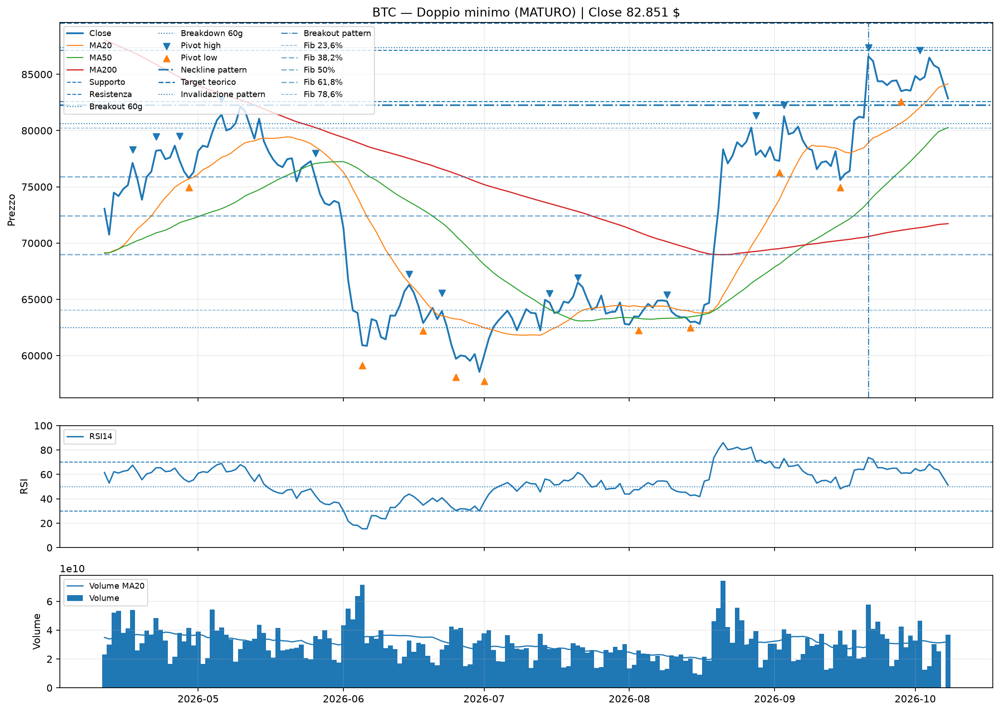

- Pattern principale: **Doppio minimo**
- Stato pattern: **CONFERMATO RECENTE** (+2)
- Famiglia: **rialzista**
- Confidenza lifecycle: **TECHNICAL STRUCTURE**
- Formazione: **2026-09-02 -> 2026-09-15**
- Età formazione: **17 giorni**
- Breakout pattern: **2026-09-21**
- Età breakout: **11 giorni**
- Neckline: **82.262 $**
- Target teorico: **89.580 $**
- Progresso verso target: **62,55%**
- Distanza dalla neckline: **n/a**
- Fonte lifecycle: **technical_structure_metrics.csv**
- Fibonacci: **Fib 23,6% NON ATTIVO (0) @ 80.374 $** — Swing UP 2026-07-01 57.748 -> 2026-09-21 87.364; livello più vicino 23.6% a 80.374; stato NON ATTIVO; confluenza: invalidazione rialzista.
- Invalidazione: **80.617 $**
- Relazione prezzo/neckline: **sopra neckline**
- Dettaglio: Due minimi simili vicino a 74.945 tra 2026-09-02 e 2026-09-15. Neckline stimata: 82.262. Breakout neckline: 2026-09-21 (11 giorni fa). Stato: CONFERMATO RECENTE. Target teorico: 89.580; progresso corrente: 62,55%. Relazione prezzo/neckline: sopra neckline. Fonte lifecycle: technical_structure_metrics.csv.
- Candela più recente: **Nessuna candela forte**
- Stato prezzo: **NEL RANGE**
- Supporto: **82.571 $**
- Resistenza: **87.364 $**
- Breakout 60g: **87.364 $**
- Breakdown 60g: **62.227 $**
- RSI14: **69.57**
- ATR14: **2,59%**
- Volume ratio 20g: **1.28**
- Rendimento 30g: **+12,34%**
- Rendimento 90g: **+37,65%**

### Pattern trovati

| Pattern | Stato | Score | Famiglia | Neckline | Breakout | Età | Target | Progresso | Distanza neckline | Invalidazione | Dettaglio |
| --- | --- | --- | --- | --- | --- | --- | --- | --- | --- | --- | --- |
| Doppio minimo | CONFERMATO RECENTE | +2 | rialzista | 82.262 $ | 2026-09-21 | 11g | 89.580 $ | 62,55% | n/a | 80.617 $ | Due minimi simili a 76.248 $ e 74.945 $. Neckline circa 82.262 $. Breakout neckline: 2026-09-21 (11 giorni fa). Stato: CONFERMATO RECENTE. Target teorico: 89.580 $; progresso: 62,55%; prezzo sopra neckline. |
| Doppio massimo | CANDIDATO | 0 | ribassista | 62.227 $ | n/a | n/a | 58.946 $ | n/a | 39,55% | 63.471 $ | Due massimi simili a 65.508 $ e 65.402 $. Neckline circa 62.227 $. Stato: CANDIDATO; la neckline non è ancora stata rotta con un margine di almeno 0.50%. Età formazione: 54 giorni. |

## SOL

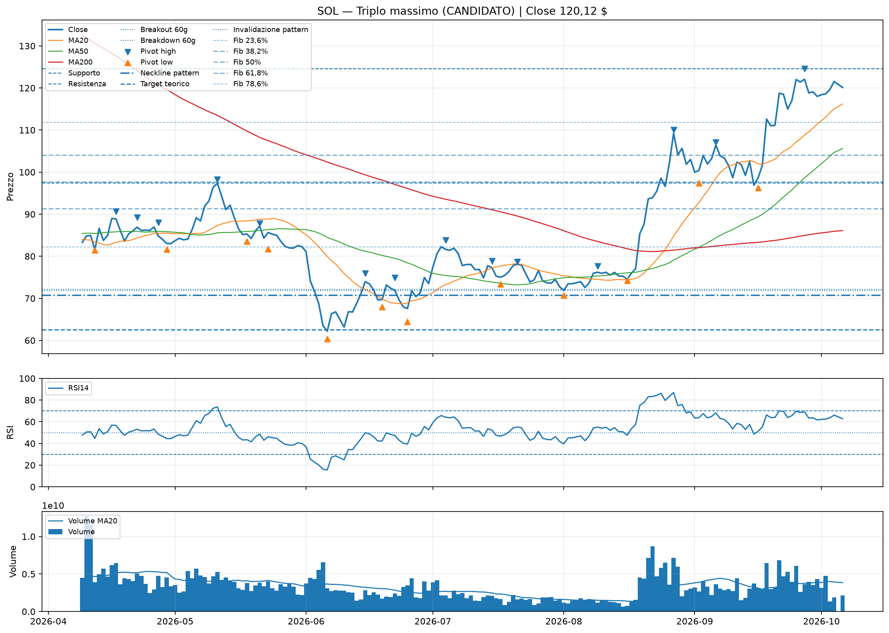

- Pattern principale: **Triplo massimo**
- Stato pattern: **CANDIDATO** (0)
- Famiglia: **ribassista**
- Confidenza lifecycle: **TECHNICAL STRUCTURE**
- Formazione: **2026-07-15 -> 2026-08-09**
- Età formazione: **54 giorni**
- Breakout pattern: **n/a**
- Età breakout: **n/a**
- Neckline: **70,69 $**
- Target teorico: **62,51 $**
- Progresso verso target: **n/a**
- Distanza dalla neckline: **73,18%**
- Fonte lifecycle: **technical_structure_metrics.csv**
- Fibonacci: **Fib 23,6% NON ATTIVO (0) @ 111,89 $** — Swing UP 2026-08-01 70,69 -> 2026-09-27 124,62; livello più vicino 23.6% a 111,89; stato NON ATTIVO; confluenza: nessuna confluenza indipendente.
- Invalidazione: **72,11 $**
- Relazione prezzo/neckline: **sopra neckline**
- Dettaglio: Tre massimi simili vicino a 78,88 dal 2026-07-15 al 2026-08-09. Neckline ribassista stimata: 70,69. Stato: CANDIDATO; la neckline non è ancora stata rotta con un margine di almeno 0.50%. Età della formazione: 54 giorni. Fonte lifecycle: technical_structure_metrics.csv.
- Candela più recente: **Nessuna candela forte**
- Stato prezzo: **NEL RANGE**
- Supporto: **97,45 $**
- Resistenza: **124,62 $**
- Breakout 60g: **124,62 $**
- Breakdown 60g: **70,69 $**
- RSI14: **66.59**
- ATR14: **3,96%**
- Volume ratio 20g: **1.11**
- Rendimento 30g: **+21,96%**
- Rendimento 90g: **+49,95%**

### Pattern trovati

| Pattern | Stato | Score | Famiglia | Neckline | Breakout | Età | Target | Progresso | Distanza neckline | Invalidazione | Dettaglio |
| --- | --- | --- | --- | --- | --- | --- | --- | --- | --- | --- | --- |
| Triplo massimo | CANDIDATO | 0 | ribassista | 70,69 $ | n/a | n/a | 62,51 $ | n/a | 73,18% | 72,11 $ | Tre massimi simili vicino a 78,88 dal 2026-07-15 al 2026-08-09. Neckline ribassista stimata: 70,69. Stato: CANDIDATO; la neckline non è ancora stata rotta con un margine di almeno 0.50%. Età della formazione: 54 giorni. Fonte lifecycle: technical_structure_metrics.csv. |
| Doppio massimo | CANDIDATO | 0 | ribassista | 70,69 $ | n/a | n/a | 62,66 $ | n/a | 73,18% | 72,11 $ | Due massimi simili a 78,73 $ e 77,62 $. Neckline circa 70,69 $. Stato: CANDIDATO; la neckline non è ancora stata rotta con un margine di almeno 0.50%. Età formazione: 54 giorni. |
| Doppio minimo | TARGET RAGGIUNTO | 0 | rialzista | 107,12 $ | 2026-09-18 | 14g | 118,01 $ | 140,61% | n/a | 104,97 $ | Due minimi simili a 97,45 $ e 96,23 $. Neckline circa 107,12 $. Breakout neckline: 2026-09-18 (14 giorni fa). Stato: TARGET RAGGIUNTO. Target teorico: 118,01 $; progresso: 140,61%; prezzo sopra neckline. |
| Testa e spalle inverso | TARGET RAGGIUNTO | 0 | rialzista | 78,17 $ | 2026-08-19 | 44g | 85,65 $ | 591,91% | n/a | 76,61 $ | Spalla sinistra 73,40 $, testa 70,69 $, spalla destra 74,20 $. Neckline circa 78,17 $. Breakout neckline: 2026-08-19 (44 giorni fa). Stato: TARGET RAGGIUNTO. Target teorico: 85,65 $; progresso: 591,91%; prezzo sopra neckline. |

## DOGE

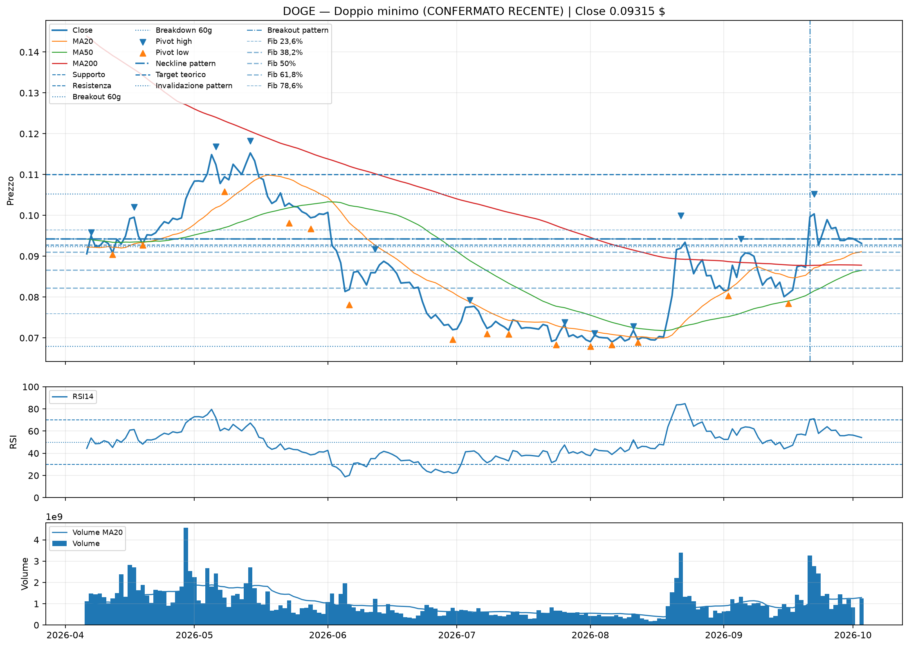

- Pattern principale: **Doppio minimo**
- Stato pattern: **CONFERMATO RECENTE** (+2)
- Famiglia: **rialzista**
- Confidenza lifecycle: **TECHNICAL STRUCTURE**
- Formazione: **2026-09-02 -> 2026-09-16**
- Età formazione: **16 giorni**
- Breakout pattern: **2026-09-21**
- Età breakout: **11 giorni**
- Neckline: **0.09421 $**
- Target teorico: **0.11001 $**
- Progresso verso target: **18,10%**
- Distanza dalla neckline: **n/a**
- Fonte lifecycle: **technical_structure_metrics.csv**
- Fibonacci: **Fib 23,6% TESTATO (0) @ 0.09648 $** — Swing UP 2026-08-01 0.06797 -> 2026-09-22 0.10528; livello più vicino 23.6% a 0.09648; stato TESTATO; confluenza: neckline rialzista, invalidazione rialzista.
- Invalidazione: **0.09232 $**
- Relazione prezzo/neckline: **sopra neckline**
- Dettaglio: Due minimi simili vicino a 0.07841 tra 2026-09-02 e 2026-09-16. Neckline stimata: 0.09421. Breakout neckline: 2026-09-21 (11 giorni fa). Stato: CONFERMATO RECENTE. Target teorico: 0.11001; progresso corrente: 18,10%. Relazione prezzo/neckline: sopra neckline. Fonte lifecycle: technical_structure_metrics.csv.
- Candela più recente: **Nessuna candela forte**
- Stato prezzo: **NEL RANGE**
- Supporto: **0.09675 $**
- Resistenza: **0.09772 $**
- Breakout 60g: **0.10528 $**
- Breakdown 60g: **0.06797 $**
- RSI14: **60.10**
- ATR14: **5,96%**
- Volume ratio 20g: **0.87**
- Rendimento 30g: **+18,91%**
- Rendimento 90g: **+25,11%**

### Pattern trovati

| Pattern | Stato | Score | Famiglia | Neckline | Breakout | Età | Target | Progresso | Distanza neckline | Invalidazione | Dettaglio |
| --- | --- | --- | --- | --- | --- | --- | --- | --- | --- | --- | --- |
| Doppio minimo | CONFERMATO RECENTE | +2 | rialzista | 0.09421 $ | 2026-09-21 | 11g | 0.11001 $ | 18,10% | n/a | 0.09232 $ | Due minimi simili a 0.08028 $ e 0.07841 $. Neckline circa 0.09421 $. Breakout neckline: 2026-09-21 (11 giorni fa). Stato: CONFERMATO RECENTE. Target teorico: 0.11001 $; progresso: 18,10%; prezzo sopra neckline. |
| Doppio massimo | CANDIDATO | 0 | ribassista | 0.07841 $ | n/a | n/a | 0.05153 $ | n/a | 23,81% | 0.07997 $ | Due massimi simili a 0.09998 $ e 0.10528 $. Neckline circa 0.07841 $. Stato: CANDIDATO; la neckline non è ancora stata rotta con un margine di almeno 0.50%. Età formazione: 10 giorni. |

## Stati del ciclo di vita

- **CANDIDATO**: geometria presente, ma neckline non ancora rotta; score 0.
- **ATTIVO**: breakout avvenuto da 0 a 3 giorni; score prudente ±1.
- **CONFERMATO RECENTE**: breakout da 4 a 14 giorni; score ±2.
- **MATURO**: breakout più vecchio di 14 giorni e ancora valido; score ridotto ±1.
- **TARGET RAGGIUNTO**: movimento teorico già completato; score 0.
- **INVALIDATO**: due chiusure consecutive oltre la soglia opposta; score 0.

## Come leggerlo

- Il grafico in alto mostra prezzo, MA20, MA50, MA200, supporti, resistenze, neckline, target, invalidazione e livelli Fibonacci.
- Il pannello centrale mostra RSI14.
- Il pannello basso mostra volume e media volume 20 giorni.
- Un pattern CANDIDATO non è un segnale operativo: il progresso target resta n/a e viene mostrata soltanto la distanza dalla neckline.
- TARGET RAGGIUNTO e INVALIDATO restano visibili per memoria storica, ma valgono 0.
- Il pattern principale usa come fonte autorevole il lifecycle di technical_structure_metrics.csv; il detector visuale resta di supporto grafico.
- Fibonacci non crea un segnale autonomo: pesa al massimo ±1 nel Technical Structure solo con una confluenza indipendente.

Nota: questi pattern sono riconosciuti con regole algoritmiche semplici. Sono utili per visualizzare il grafico, ma vanno sempre controllati a occhio.
<!-- CLASSIC_TECHNICAL_VISUAL_END -->

</details>
<!-- COMPACT_SECTION_END:classic_visual -->

<!-- COMPACT_SECTION_START:fractal_path -->
<details>
<summary><strong>🛤️ Tracking percorso frattale SOL/BTC</strong></summary>

<!-- FRACTAL_PATH_TRACKER_START -->
# Tracking percorso frattale SOL/BTC

Generato: 2026-10-02 14:07 UTC

Questo modulo separa due percorsi che prima potevano essere confusi:

- **percorso ancorato al bottom**: continua la scala originale BTC 2022 -> SOL 2026 e misura l'aderenza reale;
- **scenario riancorato oggi**: parte dal prezzo SOL corrente e replica solo i movimenti futuri di BTC; e uno scenario condizionale, non una conferma del frattale.

## Stato letto dal frattale principale

- Fonte metadati: **structured_csv**
- Data corrente: **2026-10-02**
- Bottom SOL usato: **2026-06-06**
- Bottom BTC equivalente: **2022-11-21**
- Giorno BTC equivalente: **2023-03-19**
- Inizio programma/scanner: **2026-07-03**
- Prezzo SOL corrente: **122,43 $**
- Verdetto principale: **STRUTTURA ANALOGA, PREZZO NON ADERENTE**
- Somiglianza strutturale: **+71,48%**
- Aderenza live principale: **+68,14%**
- Errore medio live principale: **15,93%**
- Peso operativo suggerito: **0**
- Fase: **FRATTALE NON CONFERMATO DAL PREZZO**
- Rischio fase: **ALTO**

## Aderenza del percorso ancorato

- Giorno corrente dal bottom: **118**
- Osservazioni inclusive dal bottom: **119**
- Osservazioni da inizio programma/scanner: **92**
- Errore assoluto medio dal bottom: **13,68%**
- Errore assoluto medio da inizio programma: **15,93%**
- Gap firmato medio ultimi 7 giorni: **+18,36%**
- Errore assoluto medio ultimi 7 giorni: **18,36%**
- Gap ultimo giorno: **+10,85%**
- Stato aderenza: **IN DEVIAZIONE**

## Grafico completo: due percorsi distinti


La linea **ancorata al bottom** serve a verificare il frattale originale. La linea **riancorata oggi** serve soltanto come scenario futuro condizionale.

## Grafico backtest dal bottom


## Grafico gap SOL vs BTC scalato


### Lettura rapida gap

- Ultimo gap firmato: **+10,85%**
- Gap firmato medio 7g: **+18,36%**
- Errore assoluto medio 7g: **18,36%**
- Variazione recente gap: **-9,79%**
- Stato gap: **SOPRA IL FRATTALE**
- Trend gap: **SOL resta sopra il percorso ancorato, ma sta riducendo il distacco**

Soglie operative del grafico:

- entro **±5%**: percorso vicino;
- tra **±5% e ±12%**: deviazione gestibile;
- oltre **±12%**: frattale non abbastanza aderente per conferma operativa;
- oltre **±18%**: disallineamento marcato.

## Ultimi giorni del confronto ancorato

|   Giorno | Data SOL   | Data BTC eq.   | SOL reale   | Percorso ancorato   | Gap firmato   | Fase                |
|---------:|:-----------|:---------------|:------------|:--------------------|:--------------|:--------------------|
| 109 | 2026-09-23 | 2023-03-10 | 114,98 $ | 79,52 $ | +44,58% | da inizio programma |
| 110 | 2026-09-24 | 2023-03-11 | 117,01 $ | 81,28 $ | +43,97% | da inizio programma |
| 111 | 2026-09-25 | 2023-03-12 | 122,01 $ | 87,31 $ | +39,74% | da inizio programma |
| 112 | 2026-09-26 | 2023-03-13 | 121,43 $ | 95,32 $ | +27,39% | da inizio programma |
| 113 | 2026-09-27 | 2023-03-14 | 122,06 $ | 97,48 $ | +25,21% | da inizio programma |
| 114 | 2026-09-28 | 2023-03-15 | 118,84 $ | 96,02 $ | +23,76% | da inizio programma |
| 115 | 2026-09-29 | 2023-03-16 | 119,06 $ | 98,69 $ | +20,64% | da inizio programma |
| 116 | 2026-09-30 | 2023-03-17 | 117,99 $ | 108,03 $ | +9,22% | da inizio programma |
| 117 | 2026-10-01 | 2023-03-18 | 118,40 $ | 106,22 $ | +11,46% | da inizio programma |
| 118 | 2026-10-02 | 2023-03-19 | 122,43 $ | 110,45 $ | +10,85% | da inizio programma |

## Proiezione futura salvata

| Orizzonte   | Data target   | Percorso ancorato   | Scenario riancorato oggi   | Min/max riancorato   | Controllato   | Prezzo reale   | Errore riancorato   | Errore ancorato   |
|:------------|:--------------|:--------------------|:---------------------------|:---------------------|:--------------|:---------------|:--------------------|:------------------|
| 7g | 2026-10-09 | 110,28 $ | 122,24 $ | 119,24 $ / 123,72 $ | no | n/a | n/a | n/a |
| 14g | 2026-10-16 | 111,08 $ | 123,13 $ | 118,51 $ / 124,35 $ | no | n/a | n/a | n/a |
| 21g | 2026-10-23 | 111,61 $ | 123,72 $ | 118,51 $ / 124,35 $ | no | n/a | n/a | n/a |
| 28g | 2026-10-30 | 119,42 $ | 132,37 $ | 118,51 $ / 133,11 $ | no | n/a | n/a | n/a |
| 35g | 2026-11-06 | 108,69 $ | 120,48 $ | 118,51 $ / 133,11 $ | no | n/a | n/a | n/a |
| 42g | 2026-11-13 | 115,30 $ | 127,80 $ | 118,51 $ / 133,11 $ | no | n/a | n/a | n/a |
| 49g | 2026-11-20 | 112,09 $ | 124,25 $ | 118,51 $ / 133,11 $ | no | n/a | n/a | n/a |
| 56g | 2026-11-27 | 106,09 $ | 117,59 $ | 116,95 $ / 133,11 $ | no | n/a | n/a | n/a |
| 63g | 2026-12-04 | 105,39 $ | 116,82 $ | 116,82 $ / 133,11 $ | no | n/a | n/a | n/a |
| 70g | 2026-12-11 | 110,64 $ | 122,64 $ | 114,99 $ / 133,11 $ | no | n/a | n/a | n/a |
| 77g | 2026-12-18 | 106,83 $ | 118,41 $ | 114,99 $ / 133,11 $ | no | n/a | n/a | n/a |
| 84g | 2026-12-25 | 102,18 $ | 113,27 $ | 112,48 $ / 133,11 $ | no | n/a | n/a | n/a |
| 91g | 2027-01-01 | 103,74 $ | 115,00 $ | 109,71 $ / 133,11 $ | no | n/a | n/a | n/a |
| 98g | 2027-01-08 | 120,07 $ | 133,09 $ | 109,71 $ / 134,03 $ | no | n/a | n/a | n/a |
| 105g | 2027-01-15 | 120,62 $ | 133,70 $ | 109,71 $ / 134,03 $ | no | n/a | n/a | n/a |
| 112g | 2027-01-22 | 118,85 $ | 131,74 $ | 109,71 $ / 136,04 $ | no | n/a | n/a | n/a |
| 119g | 2027-01-29 | 119,16 $ | 132,08 $ | 109,71 $ / 137,44 $ | no | n/a | n/a | n/a |
| 126g | 2027-02-05 | 118,51 $ | 131,36 $ | 109,71 $ / 137,44 $ | no | n/a | n/a | n/a |

La colonna **Percorso ancorato** continua la scala dal bottom. La colonna **Scenario riancorato oggi** riparte dal prezzo corrente e non cancella, nei controlli, il gap gia accumulato.

## Accuratezza storica della proiezione futura

| Orizzonte   |   Controlli | Dentro banda riancorata   | Errore ass. riancorato   | Errore ass. ancorato   |
|:------------|------------:|:--------------------------|:-------------------------|:-----------------------|
| 7g | 74 | 39,19% | 11,91% | 14,82% |
| 14g | 70 | 24,29% | 17,07% | 15,11% |
| 21g | 64 | 23,44% | 22,52% | 16,47% |
| 28g | 57 | 19,30% | 23,94% | 16,69% |
| 35g | 50 | 32,00% | 25,17% | 16,59% |
| 42g | 43 | 46,51% | 23,93% | 15,45% |
| 49g | 36 | 55,56% | 23,99% | 18,26% |
| 56g | 31 | 51,61% | 21,24% | 19,13% |
| 63g | 24 | 45,83% | 14,24% | 22,48% |
| 70g | 17 | 52,94% | 10,85% | 28,23% |
| 77g | 10 | 30,00% | 10,63% | 21,03% |
| 84g | 3 | 100,00% | 5,32% | 10,85% |
| 91g | 0 | n/a | n/a | n/a |
| 98g | 0 | n/a | n/a | n/a |
| 105g | 0 | n/a | n/a | n/a |
| 112g | 0 | n/a | n/a | n/a |
| 119g | 0 | n/a | n/a | n/a |
| 126g | 0 | n/a | n/a | n/a |

## Regola di lettura

- La somiglianza strutturale descrive la forma.
- Il gap ancorato descrive la distanza reale dal percorso.
- Lo scenario riancorato non dimostra che il frattale sia valido.
- Prima di pesare il modulo servono milestone maturate e un errore ancorato accettabile.
<!-- FRACTAL_PATH_TRACKER_END -->

</details>
<!-- COMPACT_SECTION_END:fractal_path -->

<!-- COMPACT_SECTION_START:exchange_microstructure -->
<details>
<summary><strong>🏦 Dati exchange, liquidità e leva</strong></summary>

<!-- EXCHANGE_MICROSTRUCTURE_START -->
# Dati exchange, liquidità e leva

Generato: 2026-10-02 14:08 UTC

Questo modulo legge Kraken Futures, Bitget Futures e KuCoin Futures come nucleo derivati. OKX e Coinbase vengono raccolti come fonti ausiliarie non pesate.
Non modifica la formula matematica di RSI, Fibonacci o Wyckoff: controlla se quei segnali sono sostenuti da acquisti, vendite, OI, funding e liquidità.

**Limite importante:** questo nucleo non assume disponibile un feed pubblico completo delle liquidazioni. La componente liquidazioni resta neutrale; le zone future restano stime di pressione, non dati certi delle singole posizioni.

Diagnostica completa: [exchange_source_diagnostics.md](exchange_source_diagnostics.md)

## Sintesi

| Asset | Prezzo | Exchange | Segnale candidato | Peso Global | Bias exchange | Confidenza | Copertura | Funding 8h eq. | OI 24h | Taker flow (campione/4h) | Book 0,5% | Liq long campione | Liq short campione |
| --- | --- | --- | --- | --- | --- | --- | --- | --- | --- | --- | --- | --- | --- |
| BTC | 86.562 $ | 3 | +1 | 0 | POSITIVA / CANDIDATA, ANCORA NON PESATA | ALTA | 100% | +0,0039% | +2,46% | 2,47 | +2,36% | 0 $ | 0 $ |
| SOL | 121,84 $ | 3 | 0 | 0 | LEGGERMENTE POSITIVA / NON PESATA | BASSA | 100% | +0,0078% | +0,44% | 2,91 | +6,60% | 0 $ | 0 $ |
| DOGE | 0.09653 $ | 3 | 0 | 0 | LEGGERMENTE POSITIVA / NON PESATA | MEDIA | 100% | +0,0101% | +5,66% | 1,68 | -11,25% | 0 $ | 0 $ |

Il segnale candidato è limitato a **±1**, ma il peso nel Global resta **0** finché il tracker a 7 giorni non raggiunge 30 controlli, almeno 55% di accuratezza e return corretto direzione positivo. Un singolo muro o funding non basta.

La colonna taker usa un campione recente nel primo run. Dopo almeno 3 fotografie distribuite su almeno 45 minuti viene sostituita automaticamente dalla media intraday 4h.

## Dati separati per exchange

| Asset | Exchange | Stato | Funding 8h eq. | Open interest | Taker flow | Book 0,5% |
| --- | --- | --- | --- | --- | --- | --- |
| BTC | Kraken | OK | -0,0020% | 204,09 mln $ | 5,28 | +4,92% |
| BTC | Bitget | OK | +0,0046% | 2,80 mld $ | 6,12 | +70,58% |
| BTC | Kucoin | OK | +0,0005% | 1,02 mld $ | 1,38 | -2,34% |
| SOL | Kraken | OK | -0,0011% | 34,31 mln $ | 1,38 | +5,55% |
| SOL | Bitget | OK | +0,0100% | 480,84 mln $ | 0,28 | +5,88% |
| SOL | Kucoin | OK | +0,0100% | 145,92 mln $ | 0,71 | -2,60% |
| DOGE | Kraken | OK | -0,0054% | 4,82 mln $ | 0,82 | +22,62% |
| DOGE | Bitget | OK | +0,0100% | 124,08 mln $ | 0,27 | +12,81% |
| DOGE | Kucoin | OK | +0,0100% | 65,54 mln $ | 0,84 | -5,32% |

Kraken, Bitget e KuCoin contribuiscono a funding normalizzato, open interest, trade aggressivi e order book. Non viene inventato un long/short ratio pubblico né un feed completo delle liquidazioni.

## Conferme per indicatori tecnici

### BTC

- Score grezzo exchange: **+3,25**; candidato: **+1**; peso Global: **0**.
- Attivazione Global: **LOCKED / RACCOLTA 7G** — controlli 7g 8, accuratezza +37,50%.
- Fonti disponibili: Kraken **SI**, Bitget **SI**, KuCoin **SI**.
- Consenso multi-exchange: bull 1, bear 0, divergenze 0.
- Flusso taker/order book: **+1,75**.
- OI/funding/basis: **+1,00**.
- Affollamento long/short: **+0,00**.
- Liquidazioni: **NON PESATE / FEED COMPLETO NON ASSUNTO DISPONIBILE**.
- **Wyckoff:** Fase Wyckoff non abbastanza chiara per una conferma exchange.
- **Fibonacci:** Fibonacci non_attivo; nessuna conferma exchange netta. Confluenza tecnica dichiarata: invalidazione rialzista.
- **RSI:** RSI alto ma sostenuto da acquisti e leva non estrema: momentum ancora credibile.
- **Pattern:** I pattern candidati restano non operativi: i dati exchange possono solo preparare la conferma.
- **Breakout/breakdown:** Resistenza vicina con acquisti aggressivi: breakout più credibile, ma serve chiusura sopra il livello.
- **Mappa liquidità attuale:** muro bid: n/a; muro ask: n/a

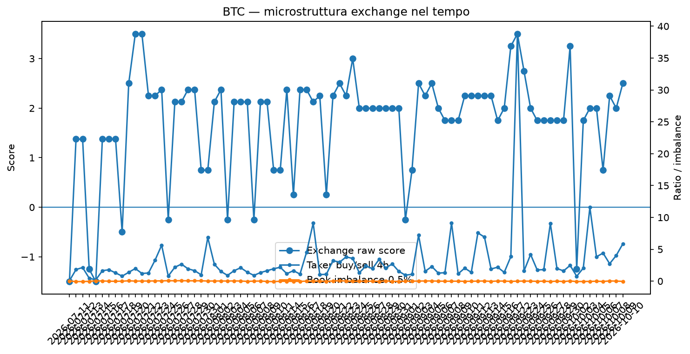

### SOL

- Score grezzo exchange: **+2,00**; candidato: **0**; peso Global: **0**.
- Attivazione Global: **LOCKED / RACCOLTA 7G** — controlli 7g 5, accuratezza +60,00%.
- Fonti disponibili: Kraken **SI**, Bitget **SI**, KuCoin **SI**.
- Consenso multi-exchange: bull 1, bear 2, divergenze 0.
- Flusso taker/order book: **+1,75**.
- OI/funding/basis: **+0,00**.
- Affollamento long/short: **+0,00**.
- Liquidazioni: **NON PESATE / FEED COMPLETO NON ASSUNTO DISPONIBILE**.
- **Wyckoff:** Fase Wyckoff non abbastanza chiara per una conferma exchange.
- **Fibonacci:** Fibonacci non_attivo; nessuna conferma exchange netta.
- **RSI:** RSI alto ma sostenuto da acquisti e leva non estrema: momentum ancora credibile.
- **Pattern:** I pattern candidati restano non operativi: i dati exchange possono solo preparare la conferma.
- **Breakout/breakdown:** Prezzo non abbastanza vicino a un livello chiave o flusso non netto.
- **Mappa liquidità attuale:** muro bid: n/a; muro ask: n/a

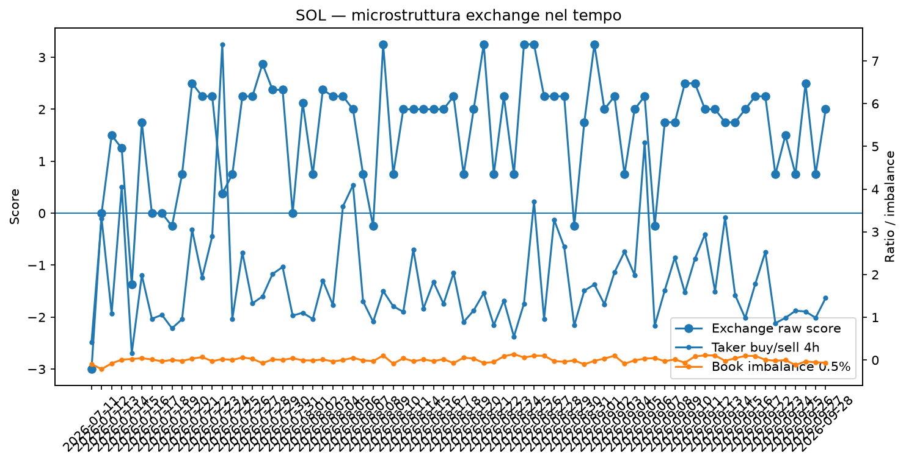

### DOGE

- Score grezzo exchange: **+1,75**; candidato: **0**; peso Global: **0**.
- Attivazione Global: **LOCKED / RACCOLTA 7G** — controlli 7g 11, accuratezza +45,45%.
- Fonti disponibili: Kraken **SI**, Bitget **SI**, KuCoin **SI**.
- Consenso multi-exchange: bull 1, bear 2, divergenze 0.
- Flusso taker/order book: **+0,75**.
- OI/funding/basis: **+1,00**.
- Affollamento long/short: **+0,00**.
- Liquidazioni: **NON PESATE / FEED COMPLETO NON ASSUNTO DISPONIBILE**.
- **Wyckoff:** Fase Wyckoff non abbastanza chiara per una conferma exchange.
- **Fibonacci:** Livello Fibonacci soltanto testato: order book e taker flow non bastano ancora per dichiararlo tenuto o perso. Confluenza tecnica dichiarata: neckline rialzista, invalidazione rialzista.
- **RSI:** RSI in zona non estrema o flusso exchange non abbastanza netto.
- **Pattern:** I pattern candidati restano non operativi: i dati exchange possono solo preparare la conferma.
- **Breakout/breakdown:** Prezzo non abbastanza vicino a un livello chiave o flusso non netto.
- **Mappa liquidità attuale:** muro bid: n/a; muro ask: n/a

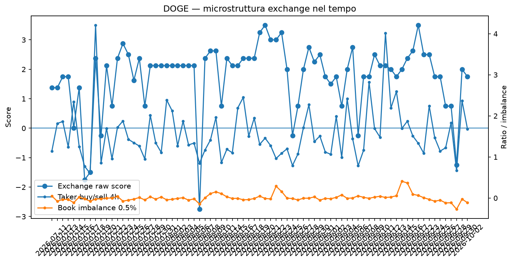

## Overlay sulle previsioni a 30 giorni

La previsione storica grezza dello scanner resta intatta. L'overlay exchange può correggerla solo dopo almeno 30 controlli maturati a 30 giorni e solo se il modulo dimostra accuratezza direzionale almeno del 55%.

| Asset | Prob. grezza salita | Return p50 grezzo | Controlli 30g | Accuratezza exchange | Stato overlay | Peso | Prob. corretta | Return corretto |
| --- | --- | --- | --- | --- | --- | --- | --- | --- |
| BTC | +52,50% | +2,84% | 3 | +66,67% | RACCOLTA DATI | 0,00 | +52,50% | +2,84% |
| SOL | +35,00% | -6,09% | 5 | +100,00% | RACCOLTA DATI | 0,00 | +35,00% | -6,09% |
| DOGE | +37,50% | -4,21% | 8 | +75,00% | RACCOLTA DATI | 0,00 | +37,50% | -4,21% |

## Dati salvati

- `exchange_market_data_snapshot.json`: fotografia derivata Kraken + Bitget + KuCoin, con OKX e Coinbase ausiliari.
- `exchange_market_data_intraday.csv`: memoria operativa mobile degli ultimi 180 giorni, ripristinata da due copie ridondanti su GitHub Releases.
- `exchange_intraday_YYYY-MM.csv.gz`: archivio mensile permanente dei dati intraday, creato dopo la chiusura del mese.
- `exchange_microstructure_metrics.csv`: score e conferme correnti lette dal Global.
- `exchange_microstructure_history.csv`: prima fotografia giornaliera congelata, usata per valutare le previsioni.
- `exchange_signal_tracker_metrics.csv`: accuratezza a 1/3/7/14/30 giorni.
- `exchange_prediction_overlay.csv`: confronto scanner grezzo vs overlay calibrato.

## Regole di prudenza

- Un muro dell'order book può essere cancellato: non è un supporto garantito.
- Funding, OI e flusso misurano pressione/affollamento, non direzione certa.
- OI in aumento conta soltanto insieme alla direzione del prezzo e al taker flow.
- La componente liquidazioni resta neutrale finché non esiste un feed pubblico completo e verificato.
- Prima dei 30 controlli a 7g il modulo non pesa nel Global; prima dei 30 controlli a 30g l'overlay non altera le previsioni.

Salute fonti: **OK** — coppie exchange/asset disponibili: 9/9. Kraken OK; Bitget OK; KuCoin OK.
Fonti ausiliarie non pesate: OKX OK; Coinbase PARZIALE. Copertura ausiliaria: 3/6.
Storage persistente: **OK** — ultimo asset: exchange_state_A.tar.gz.
<!-- EXCHANGE_MICROSTRUCTURE_END -->

</details>
<!-- COMPACT_SECTION_END:exchange_microstructure -->

<!-- COMPACT_SECTION_START:exchange_signal_tracker -->
<details>
<summary><strong>🧠 Accuratezza segnali exchange</strong></summary>

<!-- EXCHANGE_SIGNAL_TRACKER_START -->
# Accuratezza dati exchange e microstruttura

Generato: 2026-10-02 14:08 UTC

Questo tracker verifica se il segnale candidato exchange ±1 anticipa correttamente la direzione del prezzo a 1/3/7/14/30 giorni.
Il peso Global resta 0 finché l'orizzonte 7g non ha almeno 30 controlli, accuratezza almeno 55% e return corretto direzione positivo. L'overlay a 30g ha un gate separato.

Controlli maturati completati in questa esecuzione: **24**.

## Ultime fotografie giornaliere

| Data | Asset | Prezzo | Versione | Calibrazione | Candidato | Peso Global | Score raw | Confidenza | Taker 4h | OI 24h | Book 0,5% |
| --- | --- | --- | --- | --- | --- | --- | --- | --- | --- | --- | --- |
| 2026-10-02 | BTC | 86.562,08 | V2.1.3 | OK | 1 | 0 | 3,25 | ALTA | 2,47 | +2,46% | +2,36% |
| 2026-10-02 | DOGE | 0.09653 | V2.1.3 | OK | 0 | 0 | 1,75 | MEDIA | 1,68 | +5,66% | -11,25% |
| 2026-10-02 | SOL | 121,84 | V2.1.3 | OK | 0 | 0 | 2,00 | BASSA | 2,91 | +0,44% | +6,60% |
| 2026-09-30 | BTC | 83.279,00 | V2.1.3 | OK | 0 | 0 | 1,75 | BASSA | 1,61 | +0,70% | -4,93% |
| 2026-09-30 | DOGE | 0.09353 | V2.1.3 | OK | 0 | 0 | 2,00 | BASSA | 2,36 | -1,27% | -2,56% |
| 2026-09-30 | SOL | 118,75 | V2.1.3 | OK | 0 | 0 | 2,00 | BASSA | 1,83 | -0,28% | +1,81% |
| 2026-09-29 | BTC | 83.170,54 | V2.1.3 | OK | 0 | 0 | 1,75 | BASSA | 1,99 | +3,24% | -0,62% |
| 2026-09-29 | DOGE | 0.09305 | V2.1.3 | OK | 0 | 0 | -1,25 | BASSA | 0,67 | -1,10% | -27,14% |
| 2026-09-29 | SOL | 117,58 | V2.1.3 | OK | 0 | 0 | 2,00 | BASSA | 1,54 | -3,41% | -5,65% |

## Accuratezza direzionale

| Asset | Orizzonte | Controlli | Accuratezza | Return corretto direzione | Drawdown medio | Max gain medio | Stato |
| --- | --- | --- | --- | --- | --- | --- | --- |
| BTC | 1g | 8 | +37,50% | -0,37% | -1,23% | +0,83% | FEEDBACK RAPIDO |
| BTC | 3g | 8 | +37,50% | -0,46% | -2,47% | +1,78% | FEEDBACK RAPIDO |
| BTC | 7g | 8 | +37,50% | -1,56% | -3,39% | +2,06% | FEEDBACK RAPIDO |
| BTC | 14g | 5 | +40,00% | +0,20% | -4,71% | +3,32% | FEEDBACK RAPIDO |
| BTC | 30g | 3 | +66,67% | +5,24% | -4,15% | +8,48% | FEEDBACK RAPIDO |
| SOL | 1g | 5 | +60,00% | +0,93% | +0,43% | +3,39% | FEEDBACK RAPIDO |
| SOL | 3g | 5 | +60,00% | +2,75% | -3,02% | +7,77% | FEEDBACK RAPIDO |
| SOL | 7g | 5 | +60,00% | +3,63% | -3,62% | +9,63% | FEEDBACK RAPIDO |
| SOL | 14g | 5 | +80,00% | +8,45% | -4,32% | +14,61% | FEEDBACK RAPIDO |
| SOL | 30g | 5 | +100,00% | +22,07% | -4,32% | +25,38% | FEEDBACK RAPIDO |
| DOGE | 1g | 11 | +54,55% | +1,55% | -0,29% | +2,68% | FEEDBACK RAPIDO |
| DOGE | 3g | 11 | +36,36% | +1,63% | -3,44% | +6,33% | FEEDBACK RAPIDO |
| DOGE | 7g | 11 | +45,45% | -0,13% | -4,83% | +9,23% | FEEDBACK RAPIDO |
| DOGE | 14g | 10 | +40,00% | +1,75% | -5,70% | +14,70% | FEEDBACK RAPIDO |
| DOGE | 30g | 8 | +75,00% | +12,16% | -6,15% | +30,59% | FEEDBACK RAPIDO |

## Regole

- Sotto 30 controlli: solo raccolta dati; il segnale candidato non pesa nel Global.
- Da 30 controlli a 7g: il peso Global può attivarsi soltanto con accuratezza almeno 55% e return corretto direzione positivo.
- Da 30 controlli a 30g: l'overlay può attivarsi soltanto con accuratezza almeno 55%.
- Da 60 controlli: la lettura diventa più utile.
- Da 100 controlli: possibile revisione seria del peso ±1.
- Se l'accuratezza scende sotto 45%, l'overlay viene sospeso, non invertito automaticamente.
<!-- EXCHANGE_SIGNAL_TRACKER_END -->

</details>
<!-- COMPACT_SECTION_END:exchange_signal_tracker -->

<!-- COMPACT_SECTION_START:liquidations -->
<details>
<summary><strong>💥 Futures e liquidazioni</strong></summary>

<!-- LIQUIDATION_SUMMARY_START -->

---

# Sintesi semplice futures / liquidazioni

Report separato completo: [liquidation_report.md](liquidation_report.md)

**BTC** — BTC: i futures non danno una lettura chiara. Non si vede uno sbilanciamento forte né long né short. Qui pesa di più il report frattale.

**SOL** — SOL: i futures sembrano più vulnerabili verso una discesa improvvisa. Non significa che deve scendere, ma se rompe sotto può accelerare. Per un long a leva: prudenza alta. Guarda bene liquidazione e drawdown del report frattale.

**DOGE** — DOGE: i futures sembrano più vulnerabili verso una discesa improvvisa. Non significa che deve scendere, ma se rompe sotto può accelerare. Per un long a leva: prudenza alta. Guarda bene liquidazione e drawdown del report frattale.

| Asset | Prezzo | Funding | OI 24h | Long/Short | Lettura futures | Forza |
| --- | --- | --- | --- | --- | --- | --- |
| BTC | 86.839 $ | +0.0052% | n/d | 1.29 | Misto | 1/5 |
| SOL | 122,43 $ | +0.0100% | n/d | 2.00 | Rischio sotto | 2/5 |
| DOGE | 0.09707 $ | +0.0100% | n/d | 4.15 | Rischio sotto | 2/5 |

## Come usarla insieme al frattale

- Frattale ribassista + futures con rischio sotto = prudenza alta.
- Frattale rialzista + futures con rischio sopra = segnale più interessante.
- Frattale e futures opposti = situazione sporca, meglio non forzare.
- Per posizioni a leva, il futures report serve soprattutto a capire se può arrivare una pulizia violenta prima dei 30 giorni.

<!-- LIQUIDATION_SUMMARY_END -->

</details>
<!-- COMPACT_SECTION_END:liquidations -->

<!-- RSI_MULTI_TIMEFRAME_DIVERGENCE_START -->
# Divergenze RSI multi-timeframe — diagnostica

Generato: 2026-10-02 14:08 UTC

Il modulo confronta prezzo e RSI 14 sui pivot confermati **daily e weekly**. Riconosce divergenze regolari e nascoste, segnali in formazione, invalidazioni e semplice conferma del momentum.

**Peso operativo: 0.** Non modifica il Global Confluence, non cambia le soglie del Paper Trading e non apre né blocca operazioni. I risultati vengono misurati prima di qualsiasi futura decisione sul peso.

## Sintesi corrente

| Asset   | Daily                      | Stato D   | Weekly             | Stato W    | Lettura weekly                                                                                                              |   Peso |
|:--------|:---------------------------|:----------|:-------------------|:-----------|:----------------------------------------------------------------------------------------------------------------------------|-------:|
| BTC     | Conferma rialzista         | CONTESTO  | Conferma rialzista | CONTESTO   | Prezzo e RSI stanno salendo insieme: momentum rialzista confermato.                                                         |      0 |
| SOL     | Misto / nessuna divergenza | CONTESTO  | Conferma rialzista | CONTESTO   | Prezzo e RSI stanno salendo insieme: momentum rialzista confermato.                                                         |      0 |
| DOGE    | Conferma rialzista         | CONTESTO  | Hidden bearish     | CONFERMATA | Hidden bearish confermata sui due pivot del prezzo e dell'RSI. Contesto diagnostico: nessun punto operativo viene aggiunto. |      0 |

## Dettaglio dei pivot

| Asset   | TF   | Tipo                       | Stato      | Prezzo / RSI      | Pivot confrontati                                                   | Δ prezzo contesto   | Δ RSI contesto   |   Peso |
|:--------|:-----|:---------------------------|:-----------|:------------------|:--------------------------------------------------------------------|:--------------------|:-----------------|-------:|
| BTC     | 1D   | Conferma rialzista         | CONTESTO   | 86.571 $ / 68,99  | n/a                                                                 | +7,01%              | 5,40             |      0 |
| BTC     | 1W   | Conferma rialzista         | CONTESTO   | 86.571 $ / 63,29  | n/a                                                                 | +11,34%             | 6,64             |      0 |
| SOL     | 1D   | Misto / nessuna divergenza | CONTESTO   | 121,92 $ / 66,09  | n/a                                                                 | +8,28%              | -0,19            |      0 |
| SOL     | 1W   | Conferma rialzista         | CONTESTO   | 121,92 $ / 65,38  | n/a                                                                 | +27,74%             | 10,85            |      0 |
| DOGE    | 1D   | Conferma rialzista         | CONTESTO   | 0.09654 $ / 59,43 | n/a                                                                 | +10,44%             | 2,61             |      0 |
| DOGE    | 1W   | Hidden bearish             | CONFERMATA | 0.09654 $ / 52,29 | 2026-05-17 0.11825 $ / RSI 44,25 → 2026-08-23 0.09998 $ / RSI 49,72 | n/a                 | n/a              |      0 |

### BTC

- **1D — Conferma rialzista / CONTESTO**: Prezzo e RSI stanno salendo insieme: momentum rialzista confermato.
- **1W — Conferma rialzista / CONTESTO**: Prezzo e RSI stanno salendo insieme: momentum rialzista confermato.

### SOL

- **1D — Misto / nessuna divergenza / CONTESTO**: Misto / nessuna divergenza. Non esiste una divergenza confermata sugli ultimi pivot.
- **1W — Conferma rialzista / CONTESTO**: Prezzo e RSI stanno salendo insieme: momentum rialzista confermato.

### DOGE

- **1D — Conferma rialzista / CONTESTO**: Prezzo e RSI stanno salendo insieme: momentum rialzista confermato.
- **1W — Hidden bearish / CONFERMATA**: Hidden bearish confermata sui due pivot del prezzo e dell'RSI. Contesto diagnostico: nessun punto operativo viene aggiunto.

## Tracker live delle divergenze confermate

Viene salvato un solo evento per combinazione di asset, timeframe, tipo e coppia di pivot. Gli esiti vengono controllati dopo 30, 60, 90 e 180 giorni.

- Eventi indipendenti salvati: **9**.
- Soglie di lettura: **30 / 60 / 100 controlli**.
- Anche oltre le soglie il peso resta **0** finché non viene presa una decisione esplicita.

| Asset   | TF   | Tipo             |   Orizzonte |   Controlli | Accuratezza   | Return corretto   | Stato         |   Peso |
|:--------|:-----|:-----------------|------------:|------------:|:--------------|:------------------|:--------------|-------:|
| BTC     | 1D   | Bullish regolare |          30 |           1 | 0,00%         | -1,52%            | RACCOLTA DATI |      0 |
| BTC     | 1D   | Bullish regolare |          60 |           1 | +100,00%      | +21,03%           | RACCOLTA DATI |      0 |
| BTC     | 1D   | Hidden bearish   |          30 |           1 | 0,00%         | -1,37%            | RACCOLTA DATI |      0 |
| BTC     | 1D   | Hidden bearish   |          60 |           1 | 0,00%         | -23,44%           | RACCOLTA DATI |      0 |
| BTC     | 1D   | Hidden bullish   |          30 |           1 | +100,00%      | +25,83%           | RACCOLTA DATI |      0 |
| BTC     | 1W   | Bullish regolare |          30 |           1 | +100,00%      | +1,03%            | RACCOLTA DATI |      0 |
| BTC     | 1W   | Bullish regolare |          60 |           1 | +100,00%      | +22,85%           | RACCOLTA DATI |      0 |
| DOGE    | 1D   | Bullish regolare |          30 |           1 | +100,00%      | +22,35%           | RACCOLTA DATI |      0 |
| DOGE    | 1D   | Hidden bearish   |          30 |           2 | +50,00%       | -8,18%            | RACCOLTA DATI |      0 |
| DOGE    | 1D   | Hidden bearish   |          60 |           2 | 0,00%         | -25,06%           | RACCOLTA DATI |      0 |
| DOGE    | 1W   | Hidden bearish   |          30 |           1 | 0,00%         | -13,35%           | RACCOLTA DATI |      0 |
| SOL     | 1W   | Hidden bearish   |          30 |           1 | +100,00%      | +1,11%            | RACCOLTA DATI |      0 |
| SOL     | 1W   | Hidden bearish   |          60 |           1 | 0,00%         | -30,59%           | RACCOLTA DATI |      0 |

## Regole di prudenza

- Una divergenza **in formazione** può scomparire prima che il pivot sia confermato.
- Una divergenza weekly può anticipare il prezzo di diverse settimane.
- Prezzo in calo e RSI in calo non è bullish divergence: è conferma ribassista.
- Le divergenze restano dentro la famiglia tecnica e non vengono sommate come prova indipendente.
- Nessuna statistica di questo modulo autorizza automaticamente il trading reale.
<!-- RSI_MULTI_TIMEFRAME_DIVERGENCE_END -->

<!-- COMPACT_SECTION_START:technical_structure -->
<details>
<summary><strong>🧱 Struttura tecnica completa e Fibonacci</strong></summary>

<!-- TECHNICAL_STRUCTURE_START -->
# Report struttura tecnica

Generato: 2026-10-02 14:08 UTC

Questo report aggiunge al tuo scanner una lettura classica di analisi tecnica.

Moduli inclusi:

- Struttura trend con MA20 / MA50 / MA200
- Massimi e minimi crescenti oppure decrescenti
- Doppio minimo, triplo minimo, doppio massimo, triplo massimo
- Pattern Adam and Eve Bottom / Top
- Ciclo di vita pattern: candidato, attivo, confermato recente, maturo, target raggiunto, invalidato
- Data breakout, età, target teorico, progresso e recupero della neckline
- Divergenze RSI e divergenze RSI nascoste
- Momentum MACD
- Conferma volume con OBV / CMF
- Candidato fase Wyckoff
- Fibonacci automatico su swing pivot, con lifecycle e confluenza
- Punteggio tecnico di confluenza

Regola anti-pattern-zombie: un pattern vecchio non resta indefinitamente confermato. Dopo il target vale 0; se viene recuperata stabilmente la neckline viene invalidato; se resta valido ma invecchia passa a MATURO con peso ridotto.

## Sintesi

| Asset   | Prezzo   |   Punteggio | Verdetto                      | Trend           | Momentum                  | Struttura                                          |   Pattern score | Fibonacci      | Pattern rialzista                  | Pattern ribassista         | Supporto   | Resistenza   |
|:--------|:---------|------------:|:------------------------------|:----------------|:--------------------------|:---------------------------------------------------|----------------:|:---------------|:-----------------------------------|:---------------------------|:-----------|:-------------|
| BTC | 86.839 $ | 12 | RIALZISTA TECNICO | Trend rialzista | Momentum in miglioramento | Struttura rialzista con massimi e minimi crescenti | +2 | 0 / NON ATTIVO | Doppio minimo / CONFERMATO RECENTE | Doppio massimo / CANDIDATO | 82.571 | 87.364 |
| SOL | 122,43 $ | 5 | COSTRUTTIVO MA NON CONFERMATO | Trend rialzista | Momentum debole | Volatilità in espansione | 0 | 0 / NON ATTIVO | Doppio minimo / TARGET RAGGIUNTO | Triplo massimo / CANDIDATO | 96,23 | 124,62 |
| DOGE | 0.09707 $ | 7 | RIALZISTA TECNICO | Trend rialzista | Momentum debole | Volatilità in espansione | +2 | 0 / TESTATO | Doppio minimo / CONFERMATO RECENTE | Doppio massimo / CANDIDATO | 0.07841 | 0.10528 |

## Riepilogo ciclo di vita pattern

| Asset   | Doppio minimo      | Triplo minimo    | Adam/Eve Bottom                          | Doppio massimo   | Triplo massimo   | Adam/Eve Top                 |   Punteggio pattern |
|:--------|:-------------------|:-----------------|:-----------------------------------------|:-----------------|:-----------------|:-----------------------------|--------------------:|
| BTC | CONFERMATO RECENTE | TARGET RAGGIUNTO | Eve and Adam Bottom — CONFERMATO RECENTE | CANDIDATO | CANDIDATO | Adam and Eve Top — CANDIDATO | 2 |
| SOL | TARGET RAGGIUNTO | TARGET RAGGIUNTO | Adam and Eve Bottom — TARGET RAGGIUNTO | INVALIDATO | CANDIDATO | ASSENTE | 0 |
| DOGE | CONFERMATO RECENTE | TARGET RAGGIUNTO | Adam and Eve Bottom — CONFERMATO RECENTE | CANDIDATO | CANDIDATO | Adam and Eve Top — CANDIDATO | 2 |

## Indicatori tecnici

| Asset   |   RSI 14 |   Istogramma MACD | MA20    | MA50    | MA200   | Pendenza MA50 20g   | Pendenza MA200 60g   | Rendimento 30g   | Rendimento 90g   |
|:--------|---------:|------------------:|:--------|:--------|:--------|:--------------------|:---------------------|:-----------------|:-----------------|
| BTC | 69.57 | 8.605 | 82.163 | 78.170 | 71.383 | 9,85% | 0,81% | 6,85% | 36,65% |
| SOL | 66.59 | -0.0922 | 113,25 | 102,96 | 85,69 | 17,10% | 0,79% | 17,75% | 50,36% |
| DOGE | 60.1 | -5e-05 | 0.09130 | 0.08662 | 0.08783 | 10,44% | -6,10% | 10,58% | 24,87% |

## Dettaglio asset

### BTC

- Prezzo: **86.839 $**
- Punteggio tecnico: **12 / 12**
- Verdetto: **RIALZISTA TECNICO**
- Trend: **Trend rialzista** (3)
- Momentum: **Momentum in miglioramento** (2)
- Volume: **Volume da accumulazione** (2)
- Struttura: **Struttura rialzista con massimi e minimi crescenti** (2)
  - Dettaglio struttura: Ultimi minimi: 7.494e+04 -> 8.257e+04. Ultimi massimi: 8.226e+04 -> 8.736e+04.
- Divergenza: **Nessuna** (0)
- Fase Wyckoff candidata: **Markup / fase rialzista** (2)
  - Dettaglio Wyckoff: Prezzo sopra MA200, MA50 in salita e trend a 30 giorni positivo.
- Fibonacci automatico: **NON ATTIVO** (0)
  - Swing UP 2026-07-01 57.748 -> 2026-09-21 87.364; livello più vicino 23.6% a 80.374; stato NON ATTIVO; confluenza: invalidazione rialzista.
- Punteggio pattern: **+2**
  - rialzista dominante: Doppio minimo (CONFERMATO RECENTE, +2); ribassista dominante: Doppio massimo (CANDIDATO, 0).
- Supporto più vicino: **82.571**
- Resistenza più vicina: **87.364**

Pattern classici e ciclo di vita:

- Doppio minimo: **CONFERMATO RECENTE** (+2)
  - Due minimi simili vicino a 74.945 tra 2026-09-02 e 2026-09-15. Neckline stimata: 82.262. Breakout neckline: 2026-09-21 (11 giorni fa). Stato: CONFERMATO RECENTE. Target teorico: 89.580; progresso corrente: 62,55%. Relazione prezzo/neckline: sopra neckline.
  - neckline 82.262; target 89.580; breakout 2026-09-21 (11g); progresso 62,55%; prezzo sopra neckline.
- Triplo minimo: **TARGET RAGGIUNTO** (0)
  - Tre minimi simili vicino a 58.076 dal 2026-06-25 al 2026-08-14. Neckline stimata: 66.910. Breakout neckline: 2026-08-19 (44 giorni fa). Stato: TARGET RAGGIUNTO. Target teorico: 75.744; progresso corrente: 225,59%. Relazione prezzo/neckline: sopra neckline.
  - neckline 66.910; target 75.744; breakout 2026-08-19 (44g); progresso 225,59%; prezzo sopra neckline.
- Eve and Adam Bottom: **CONFERMATO RECENTE** (+2)
  - Pattern Eve and Adam Bottom vicino a 74.945 dal 2026-09-02 al 2026-09-15. Un minimo è più appuntito e l'altro più arrotondato. Neckline stimata: 82.262. Breakout neckline: 2026-09-21 (11 giorni fa). Stato: CONFERMATO RECENTE. Target teorico: 89.580; progresso corrente: 62,55%. Relazione prezzo/neckline: sopra neckline.
  - neckline 82.262; target 89.580; breakout 2026-09-21 (11g); progresso 62,55%; prezzo sopra neckline.
- Doppio massimo: **CANDIDATO** (0)
  - Due massimi simili vicino a 87.364 tra 2026-09-03 e 2026-09-21. Neckline ribassista stimata: 74.945. Stato: CANDIDATO; la neckline non è ancora stata rotta con un margine di almeno 0.50%. Età della formazione: 11 giorni.
  - neckline 74.945; target 62.525; distanza dalla neckline 15,87%; prezzo sopra neckline.
- Triplo massimo: **CANDIDATO** (0)
  - Tre massimi simili vicino a 65.544 dal 2026-06-22 al 2026-08-09. Neckline ribassista stimata: 57.748. Stato: CANDIDATO; la neckline non è ancora stata rotta con un margine di almeno 0.50%. Età della formazione: 54 giorni.
  - neckline 57.748; target 49.952; distanza dalla neckline 50,38%; prezzo sopra neckline.
- Adam and Eve Top: **CANDIDATO** (0)
  - Pattern Adam and Eve Top vicino a 87.364 dal 2026-09-03 al 2026-09-21. Un massimo è più appuntito e l'altro più arrotondato. Neckline ribassista stimata: 74.945. Stato: CANDIDATO; la neckline non è ancora stata rotta con un margine di almeno 0.50%. Età della formazione: 11 giorni.
  - neckline 74.945; target 62.525; distanza dalla neckline 15,87%; prezzo sopra neckline.

### SOL

- Prezzo: **122,43 $**
- Punteggio tecnico: **5 / 12**
- Verdetto: **COSTRUTTIVO MA NON CONFERMATO**
- Trend: **Trend rialzista** (3)
- Momentum: **Momentum debole** (-2)
- Volume: **Volume da accumulazione** (2)
- Struttura: **Volatilità in espansione** (0)
  - Dettaglio struttura: Ultimi minimi: 97.45 -> 96.23. Ultimi massimi: 107.1 -> 124.6.
- Divergenza: **Nessuna** (0)
- Fase Wyckoff candidata: **Markup / fase rialzista** (2)
  - Dettaglio Wyckoff: Prezzo sopra MA200, MA50 in salita e trend a 30 giorni positivo.
- Fibonacci automatico: **NON ATTIVO** (0)
  - Swing UP 2026-08-01 70,69 -> 2026-09-27 124,62; livello più vicino 23.6% a 111,89; stato NON ATTIVO; confluenza: nessuna confluenza indipendente.
- Punteggio pattern: **0**
  - rialzista dominante: Doppio minimo (TARGET RAGGIUNTO, 0); ribassista dominante: Triplo massimo (CANDIDATO, 0).
- Supporto più vicino: **96,23**
- Resistenza più vicina: **124,62**

Pattern classici e ciclo di vita:

- Doppio minimo: **TARGET RAGGIUNTO** (0)
  - Due minimi simili vicino a 96,23 tra 2026-09-02 e 2026-09-16. Neckline stimata: 107,12. Breakout neckline: 2026-09-18 (14 giorni fa). Stato: TARGET RAGGIUNTO. Target teorico: 118,01; progresso corrente: 140,61%. Relazione prezzo/neckline: sopra neckline.
  - neckline 107,12; target 118,01; breakout 2026-09-18 (14g); progresso 140,61%; prezzo sopra neckline.
- Triplo minimo: **TARGET RAGGIUNTO** (0)
  - Tre minimi simili vicino a 70,69 dal 2026-07-17 al 2026-08-16. Neckline stimata: 78,73. Breakout neckline: 2026-08-19 (44 giorni fa). Stato: TARGET RAGGIUNTO. Target teorico: 86,76; progresso corrente: 544,14%. Relazione prezzo/neckline: sopra neckline.
  - neckline 78,73; target 86,76; breakout 2026-08-19 (44g); progresso 544,14%; prezzo sopra neckline.
- Adam and Eve Bottom: **TARGET RAGGIUNTO** (0)
  - Pattern Adam and Eve Bottom vicino a 96,23 dal 2026-09-02 al 2026-09-16. Un minimo è più appuntito e l'altro più arrotondato. Neckline stimata: 107,12. Breakout neckline: 2026-09-18 (14 giorni fa). Stato: TARGET RAGGIUNTO. Target teorico: 118,01; progresso corrente: 140,61%. Relazione prezzo/neckline: sopra neckline.
  - neckline 107,12; target 118,01; breakout 2026-09-18 (14g); progresso 140,61%; prezzo sopra neckline.
- Doppio massimo: **INVALIDATO** (0)
  - Due massimi simili vicino a 110,04 tra 2026-08-27 e 2026-09-06. Neckline ribassista stimata: 97,45. Breakout neckline: 2026-09-15 (17 giorni fa). Stato: INVALIDATO. Target teorico: 84,86; progresso corrente: -198,43%. Relazione prezzo/neckline: sopra neckline.
  - neckline 97,45; target 84,86; breakout 2026-09-15 (17g); progresso -198,43%; prezzo sopra neckline.
- Triplo massimo: **CANDIDATO** (0)
  - Tre massimi simili vicino a 78,88 dal 2026-07-15 al 2026-08-09. Neckline ribassista stimata: 70,69. Stato: CANDIDATO; la neckline non è ancora stata rotta con un margine di almeno 0.50%. Età della formazione: 54 giorni.
  - neckline 70,69; target 62,51; distanza dalla neckline 73,18%; prezzo sopra neckline.
- Adam/Eve Top: **ASSENTE** (0)

### DOGE

- Prezzo: **0.09707 $**
- Punteggio tecnico: **7 / 12**
- Verdetto: **RIALZISTA TECNICO**
- Trend: **Trend rialzista** (3)
- Momentum: **Momentum debole** (-2)
- Volume: **Volume da accumulazione** (2)
- Struttura: **Volatilità in espansione** (0)
  - Dettaglio struttura: Ultimi minimi: 0.08028 -> 0.07841. Ultimi massimi: 0.09421 -> 0.1053.
- Divergenza: **Nessuna** (0)
- Fase Wyckoff candidata: **Markup / fase rialzista** (2)
  - Dettaglio Wyckoff: Prezzo sopra MA200, MA50 in salita e trend a 30 giorni positivo.
- Fibonacci automatico: **TESTATO** (0)
  - Swing UP 2026-08-01 0.06797 -> 2026-09-22 0.10528; livello più vicino 23.6% a 0.09648; stato TESTATO; confluenza: neckline rialzista, invalidazione rialzista.
- Punteggio pattern: **+2**
  - rialzista dominante: Doppio minimo (CONFERMATO RECENTE, +2); ribassista dominante: Doppio massimo (CANDIDATO, 0).
- Supporto più vicino: **0.07841**
- Resistenza più vicina: **0.10528**

Pattern classici e ciclo di vita:

- Doppio minimo: **CONFERMATO RECENTE** (+2)
  - Due minimi simili vicino a 0.07841 tra 2026-09-02 e 2026-09-16. Neckline stimata: 0.09421. Breakout neckline: 2026-09-21 (11 giorni fa). Stato: CONFERMATO RECENTE. Target teorico: 0.11001; progresso corrente: 18,10%. Relazione prezzo/neckline: sopra neckline.
  - neckline 0.09421; target 0.11001; breakout 2026-09-21 (11g); progresso 18,10%; prezzo sopra neckline.
- Triplo minimo: **TARGET RAGGIUNTO** (0)
  - Tre minimi simili vicino a 0.06835 dal 2026-07-13 al 2026-08-12. Neckline stimata: 0.07380. Breakout neckline: 2026-08-19 (44 giorni fa). Stato: TARGET RAGGIUNTO. Target teorico: 0.07926; progresso corrente: 426,51%. Relazione prezzo/neckline: sopra neckline.
  - neckline 0.07380; target 0.07926; breakout 2026-08-19 (44g); progresso 426,51%; prezzo sopra neckline.
- Adam and Eve Bottom: **CONFERMATO RECENTE** (+2)
  - Pattern Adam and Eve Bottom vicino a 0.07841 dal 2026-09-02 al 2026-09-16. Un minimo è più appuntito e l'altro più arrotondato. Neckline stimata: 0.09421. Breakout neckline: 2026-09-21 (11 giorni fa). Stato: CONFERMATO RECENTE. Target teorico: 0.11001; progresso corrente: 18,10%. Relazione prezzo/neckline: sopra neckline.
  - neckline 0.09421; target 0.11001; breakout 2026-09-21 (11g); progresso 18,10%; prezzo sopra neckline.
- Doppio massimo: **CANDIDATO** (0)
  - Due massimi simili vicino a 0.10528 tra 2026-08-22 e 2026-09-22. Neckline ribassista stimata: 0.07841. Stato: CANDIDATO; la neckline non è ancora stata rotta con un margine di almeno 0.50%. Età della formazione: 10 giorni.
  - neckline 0.07841; target 0.05153; distanza dalla neckline 23,81%; prezzo sopra neckline.
- Triplo massimo: **CANDIDATO** (0)
  - Tre massimi simili vicino a 0.07923 dal 2026-07-04 al 2026-08-11. Neckline ribassista stimata: 0.06797. Stato: CANDIDATO; la neckline non è ancora stata rotta con un margine di almeno 0.50%. Età della formazione: 52 giorni.
  - neckline 0.06797; target 0.05671; distanza dalla neckline 42,81%; prezzo sopra neckline.
- Adam and Eve Top: **CANDIDATO** (0)
  - Pattern Adam and Eve Top vicino a 0.07380 dal 2026-07-26 al 2026-08-11. Un massimo è più appuntito e l'altro più arrotondato. Neckline ribassista stimata: 0.06797. Stato: CANDIDATO; la neckline non è ancora stata rotta con un margine di almeno 0.50%. Età della formazione: 52 giorni.
  - neckline 0.06797; target 0.06214; distanza dalla neckline 42,81%; prezzo sopra neckline.

## Fibonacci automatico

Il modulo seleziona uno swing recente tramite pivot confermati. Un semplice tocco vale 0: Fibonacci pesa al massimo ±1 soltanto quando il livello è tenuto, perso, recuperato o respinto e coincide con almeno un livello tecnico indipendente.

| Asset   | Swing                       | 23,6%   | 38,2%   | 50,0%   | 61,8%   | 78,6%   | Livello vicino   | Stato      | Confluenza                                  |   Score |
|:--------|:----------------------------|:--------|:--------|:--------|:--------|:--------|:-----------------|:-----------|:--------------------------------------------|--------:|
| BTC | UP 2026-07-01 -> 2026-09-21 | 80.374 | 76.050 | 72.556 | 69.061 | 64.086 | 23.6% / 80.374 | NON ATTIVO | invalidazione rialzista | 0 |
| SOL | UP 2026-08-01 -> 2026-09-27 | 111,89 | 104,02 | 97,66 | 91,29 | 82,23 | 23.6% / 111,89 | NON ATTIVO | nessuna confluenza indipendente | 0 |
| DOGE | UP 2026-08-01 -> 2026-09-22 | 0.09648 | 0.09103 | 0.08663 | 0.08222 | 0.07596 | 23.6% / 0.09648 | TESTATO | neckline rialzista, invalidazione rialzista | 0 |

## Stati del ciclo di vita

- **CANDIDATO**: geometria presente, ma neckline non ancora rotta; punteggio 0.
- **ATTIVO**: breakout avvenuto da 0 a 3 giorni; peso prudente ±1.
- **CONFERMATO RECENTE**: breakout da 4 a 14 giorni; peso massimo prudente ±2.
- **MATURO**: breakout più vecchio di 14 giorni e ancora valido; peso ridotto ±1.
- **TARGET RAGGIUNTO**: movimento teorico già sviluppato; punteggio 0.
- **INVALIDATO**: recupero stabile della neckline contro il pattern; punteggio 0.

Per evitare doppio conteggio, nel punteggio entra soltanto il miglior pattern rialzista e il miglior pattern ribassista. Doppio, triplo e Adam/Eve che descrivono la stessa struttura non vengono più sommati tutti insieme.

## Come leggere il punteggio

- Da +7 a +12: forte confluenza tecnica rialzista.
- Da +3 a +6: struttura costruttiva, ma serve ancora conferma.
- Da -2 a +2: situazione mista / neutrale.
- Da -6 a -3: struttura tecnica debole.
- Da -12 a -7: forte confluenza tecnica ribassista.

Nota importante: questo report non è una previsione da solo. È un filtro tecnico da leggere insieme a scanner frattale, market regime, futures e RSI.
<!-- TECHNICAL_STRUCTURE_END -->

</details>
<!-- COMPACT_SECTION_END:technical_structure -->

<!-- COMPACT_SECTION_START:calibration_readable -->
<details>
<summary><strong>🎯 Stato leggibile accuratezza / calibrazione</strong></summary>

<!-- CALIBRATION_READABLE_START -->

---

# Stato leggibile accuratezza / calibrazione

Report dettagliati:
- [accuracy_report.md](accuracy_report.md)
- [calibration_report.md](calibration_report.md)

## Riassunto semplice

- **BTC**: 32/30 previsioni controllate su 85 fatte. Stato: **ATTIVA**.
- **SOL**: 32/30 previsioni controllate su 85 fatte. Stato: **ATTIVA**.
- **DOGE**: 32/30 previsioni controllate su 85 fatte. Stato: **ATTIVA**.

| Asset | Previsioni fatte | Controllate | Progresso | In attesa | Stato | Prossimo controllo |
| --- | --- | --- | --- | --- | --- | --- |
| BTC | 85 | 32 | 30/30 [██████████] | 53 | ATTIVA | 2026-10-03 / tra 1 giorno |
| SOL | 85 | 32 | 30/30 [██████████] | 53 | ATTIVA | 2026-10-03 / tra 1 giorno |
| DOGE | 85 | 32 | 30/30 [██████████] | 53 | ATTIVA | 2026-10-03 / tra 1 giorno |

## Traduzione

- **0/30** significa: lo scanner sta ancora raccogliendo dati.
- **30/30** significa: la calibrazione comincia ad attivarsi.
- **60+** significa: la calibrazione diventa più solida.
- L'email non c'entra con la calibrazione: conta solo che il workflow giri e salvi il diario delle previsioni.

<!-- CALIBRATION_READABLE_END -->

</details>
<!-- COMPACT_SECTION_END:calibration_readable -->

<!-- COMPACT_SECTION_START:data_quality -->
<details>
<summary><strong>✅ Controllo qualità e coerenza dati</strong></summary>

<!-- DATA_QUALITY_COHERENCE_START -->
# Data quality / coherence check

Generato: 2026-10-02 14:08 UTC

Questo controllo non modifica punteggi o decisioni. Verifica che tutti i moduli usino lo stesso prezzo corrente e che le nuove regole Technical/Classic Visual siano integre.

## Stato finale: **WARN**

## Avvisi

- 3 campi prezzo superano la tolleranza specifica del modulo.

## Prezzo unico per modulo

| Modulo                  | Asset   | Campo             | Stato   | Prezzo snapshot   | Prezzo modulo   | Differenza   |
|:------------------------|:--------|:------------------|:--------|:------------------|:----------------|:-------------|
| Scanner                 | BTC     | current_price     | OK      | 86.839 $          | 86.839 $        | +0,0000%     |
| Scanner                 | DOGE    | current_price     | OK      | 0.09707 $         | 0.09707 $       | -0,0000%     |
| Scanner                 | SOL     | current_price     | OK      | 122,43 $          | 122,43 $        | +0,0000%     |
| Scanner Forecast        | BTC     | current_price     | OK      | 86.839 $          | 86.839 $        | +0,0000%     |
| Scanner Forecast        | SOL     | current_price     | OK      | 122,43 $          | 122,43 $        | +0,0000%     |
| Scanner Forecast        | DOGE    | current_price     | OK      | 0.09707 $         | 0.09707 $       | -0,0000%     |
| Technical Structure     | BTC     | price             | OK      | 86.839 $          | 86.839 $        | +0,0000%     |
| Technical Structure     | SOL     | price             | OK      | 122,43 $          | 122,43 $        | +0,0000%     |
| Technical Structure     | DOGE    | price             | OK      | 0.09707 $         | 0.09707 $       | -0,0000%     |
| Classic Technical       | BTC     | price             | OK      | 86.839 $          | 86.839 $        | +0,0000%     |
| Classic Technical       | SOL     | price             | OK      | 122,43 $          | 122,43 $        | +0,0000%     |
| Classic Technical       | DOGE    | price             | OK      | 0.09707 $         | 0.09707 $       | -0,0000%     |
| Classic Visual          | BTC     | price             | OK      | 86.839 $          | 86.839 $        | +0,0000%     |
| Classic Visual          | SOL     | price             | OK      | 122,43 $          | 122,43 $        | +0,0000%     |
| Classic Visual          | DOGE    | price             | OK      | 0.09707 $         | 0.09707 $       | -0,0000%     |
| Exchange Microstructure | BTC     | price             | WARN    | 86.839 $          | 86.562 $        | -0,3189%     |
| Exchange Microstructure | SOL     | price             | WARN    | 122,43 $          | 121,84 $        | -0,4819%     |
| Exchange Microstructure | DOGE    | price             | WARN    | 0.09707 $         | 0.09653 $       | -0,5614%     |
| RSI top-cycle           | SOL     | current_price     | OK      | 122,43 $          | 122,43 $        | +0,0000%     |
| RSI top-cycle           | SOL     | current_price     | OK      | 122,43 $          | 122,43 $        | +0,0000%     |
| Frattale BTC/SOL        | SOL     | sol_current_price | OK      | 122,43 $          | 122,43 $        | +0,0000%     |
| Fractal path            | SOL     | current_price     | OK      | 122,43 $          | 122,43 $        | +0,0000%     |

## Integrità Technical / Classic Visual

- Fibonacci strutturato: **OK**
- Candidati senza falso progresso target: **OK**
- Classic Visual allineato al lifecycle Technical: **OK**

## Controllo codifica UTF-8

Nessun indicatore comune di mojibake trovato.

## File strutturati

- Snapshot condiviso completo: **OK**
- Scanner summary: **OK**
- Price coherence sync: **OK**
- Dati exchange / microstruttura: **OK**

Il workflow può continuare, ma gli avvisi sopra vanno verificati.
<!-- DATA_QUALITY_COHERENCE_END -->

</details>
<!-- COMPACT_SECTION_END:data_quality -->


<!-- SOL_LONG_TERM_CONE_HISTORY_START -->
## SOL Long-Term Cone History

[SOL Long-Term Cone History](sol_long_term_history/README.md)
<!-- SOL_LONG_TERM_CONE_HISTORY_END -->
