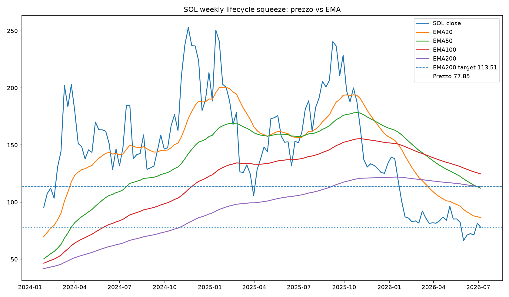

# Major alt lifecycle squeeze report - SOL

Generato: **2026-07-09 19:20:34 CEST**  
UTC: **2026-07-09 17:20:34 UTC**

Questo modulo confronta SOL con altre crypto storiche in fasi simili di ciclo.

Idea centrale: una EMA50 che scende verso EMA200 non è rialzista di per sé. Però, se arriva tardi dopo un forte bear market e il prezzo è molto sotto EMA200 weekly, può diventare un setup da **bear-market squeeze / mean reversion rally** verso EMA200.

> Nota fonte dati: il modulo usa **Yahoo Finance SOL-USD weekly**. KuCoin, CoinEx, Binance o altri exchange possono mostrare EMA leggermente diverse. Se EMA50/EMA200 sono dentro ±2%, il modulo non considera il cross come netto: lo classifica come medie sovrapposte / incrocio in corso.

## Sintesi

| Voce | Valore |
| --- | --- |
| Lifecycle squeeze score | 5 |
| Bias | SQUEEZE SETUP FORTE |
| Azione coerente | CONFLUENZA BUONA VERSO EMA200, MA SOLO CON CONFERME |
| Peso suggerito nel Global | 1 |
| Trend squeeze | STABILE / DA CONFERMARE |
| Trend squeeze score | 0 |
| Confronto precedente | 2026-07-08 |
| Target tecnico naturale | 113,51 $ |
| Upside verso EMA200 | +45,81% |
| Stato EMA50/EMA200 | EMA50/EMA200 SOVRAPPOSTE / INCROCIO IN CORSO |
| Gap EMA50/EMA200 | -1,22% |
| Probabilità storica hit EMA200 12w | 36,67% |
| Max gain mediano 12w analoghi | +22,68% |
| Drawdown mediano 12w analoghi | -22,63% |

## Autocontrollo setup

Trend squeeze: **STABILE / DA CONFERMARE**  
Score trend: **0**  
Confronto con: **2026-07-08**

| Controllo | Precedente | Attuale | Punti | Lettura |
| --- | --- | --- | --- | --- |
| Prezzo SOL | 77,46 $ | 77,85 $ | 0 | Prezzo quasi stabile rispetto al controllo precedente. |
| Distanza da EMA200 | -31,76% | -31,42% | 0 | Distanza da EMA200 quasi invariata. |
| Upside verso EMA200 | +46,54% | +45,81% | 0 | Upside verso EMA200 quasi invariato. |
| RSI weekly | 40,36 | 40,54 | 0 | RSI quasi stabile. |
| Lifecycle score | 5 | 5 | 0 | Score lifecycle stabile. |
| Analoghi hit EMA200 12w | 36,67% | 36,67% | 0 | Probabilità storica degli analoghi quasi invariata. |
| Drawdown mediano analoghi | -22,63% | -22,63% | 0 | Drawdown mediano degli analoghi quasi invariato. |

## SOL oggi

| Voce | Valore | Lettura |
| --- | --- | --- |
| Fonte prezzi | Yahoo Finance SOL-USD weekly | Può differire da KuCoin/CoinEx/Binance per chiusura candela e storico EMA. |
| Prezzo SOL | 77,85 $ | Prezzo weekly attuale. |
| EMA20 | 86,34 $ | Media breve. |
| EMA50 | 112,13 $ | Media intermedia. |
| EMA100 | 124,64 $ | Media lunga intermedia. |
| EMA200 | 113,51 $ | Target naturale del bear-market squeeze. |
| Distanza prezzo da EMA200 | -31,42% | Negativa = prezzo sotto EMA200. |
| Upside verso EMA200 | +45,81% | Quanto dovrebbe salire per tornare a EMA200. |
| Gap EMA50/EMA200 | -1,22% | Dentro ±2% = medie sovrapposte, non cross netto. |
| Stato incrocio | EMA50/EMA200 SOVRAPPOSTE / INCROCIO IN CORSO | Fase EMA50/EMA200. |
| RSI weekly | 40,54 | RSI basso/in recupero può aiutare il relief rally. |
| Cambio RSI 4w | 5,93 | Positivo = RSI in recupero. |
| Gain da minimo 26w | +28,86% | Misura se il primo spike è già partito. |
| Età asset | 6,3 anni | Calcolata da data reale di riferimento, non dal primo dato Yahoo. |
| Data riferimento età | 2020-03-16 | Genesis/mainnet/lancio pubblico o trading rilevante. |
| Prima conferma frattale | 106,08 $ | Livello letto dal report principale, se disponibile. |
| Seconda conferma frattale | 114,85 $ | Livello letto dal report principale, se disponibile. |
| Invalidazione soft | 74,03 $ | Sotto qui il setup si indebolisce. |
| Invalidazione forte | 62,19 $ | Sotto qui il setup si rompe quasi del tutto. |

## Componenti del punteggio

| Componente | Valore | Punti | Lettura |
| --- | --- | --- | --- |
| Prezzo vs EMA200 | -31,42% | +1 | SOL è sotto EMA200 weekly: possibile magnete tecnico. |
| Upside verso EMA200 | +45,81% | +1 | La EMA200 weekly è abbastanza lontana da essere un target tecnico rilevante. |
| EMA50/EMA200 | EMA50/EMA200 SOVRAPPOSTE / INCROCIO IN CORSO (-1,22%) | +1 | Le medie sono praticamente attaccate: fase compatibile con incrocio tardivo/squeeze. |
| RSI weekly | 40,54 / cambio 4w 5,93 | +1 | RSI basso ma in recupero: setup coerente con relief rally. |
| Età asset | 6,3 anni | +1 | SOL è in fascia giovane-matura: abbastanza storica, ma ancora growth. |
| Analoghi storici | 36,67% hit EMA200 entro 12w | 0 | Gli analoghi storici sono misti. |

## Statistiche sugli analoghi crypto

| Metrica | Valore |
| --- | --- |
| Eventi storici trovati | 79 |
| Analoghi usati | 30 |
| Limite massimo per singolo asset | 3 |
| Hit EMA200 entro 4 settimane | 16,67% |
| Hit EMA200 entro 8 settimane | 23,33% |
| Hit EMA200 entro 12 settimane | 36,67% |
| Hit EMA200 entro 16 settimane | 36,67% |
| Max gain mediano 12w | +22,68% |
| Drawdown mediano 12w | -22,63% |
| Settimane mediane per toccare EMA200 | 12,0 |

## Top analoghi storici più simili a SOL oggi

| Data | Asset | Ticker | Similarità | Età | Ref. età | Prezzo | Dist. EMA200 | Gap EMA50/200 | Stato cross | RSI | Hit EMA200 12w | Max gain 12w | Drawdown 12w |
| --- | --- | --- | --- | --- | --- | --- | --- | --- | --- | --- | --- | --- | --- |
| 2022-10-24 | Maker | MKR-USD | 90,16% | 4,9 anni | 2017-11-25 | 909,81 $ | -34,78% | -0,07% | EMA50/EMA200 SOVRAPPOSTE / INCROCIO IN CORSO | 43,16 | no | +1,30% | -44,63% |
| 2023-05-29 | Ethereum Classic | ETC-USD | 86,32% | 6,9 anni | 2016-07-20 | 18,22 $ | -23,71% | -3,84% | DEATH CROSS CONFERMATO DA POCO | 42,38 | no | +26,83% | -26,32% |
| 2022-10-03 | Chainlink | LINK-USD | 85,59% | 5,0 anni | 2017-09-20 | 7,63 $ | -38,17% | +0,30% | EMA50/EMA200 SOVRAPPOSTE / INCROCIO IMMINENTE | 43,12 | no | +22,87% | -29,01% |
| 2025-03-31 | Maker | MKR-USD | 85,49% | 7,3 anni | 2017-11-25 | 1.147 $ | -25,84% | +3,66% | EMA50 SOPRA EMA200 MA IN AVVICINAMENTO | 42,90 | sì | +99,36% | -8,48% |
| 2025-02-03 | Theta | THETA-USD | 85,08% | 7,0 anni | 2018-01-17 | 1,28 $ | -27,61% | -2,89% | EMA50 SOTTO EMA200 / CROSS GIÀ AVVENUTO | 41,40 | no | +14,29% | -52,78% |
| 2025-05-26 | Ethereum Classic | ETC-USD | 84,58% | 8,8 anni | 2016-07-20 | 17,09 $ | -24,41% | -6,89% | DEATH CROSS CONFERMATO DA POCO | 43,50 | sì | +50,28% | -15,11% |
| 2024-08-26 | Ethereum Classic | ETC-USD | 84,46% | 8,1 anni | 2016-07-20 | 17,63 $ | -24,31% | +0,76% | EMA50/EMA200 SOVRAPPOSTE / INCROCIO IMMINENTE | 38,70 | sì | +76,98% | -4,66% |
| 2022-08-01 | XRP | XRP-USD | 82,68% | 10,2 anni | 2012-06-01 | 0,372506 $ | -33,07% | +11,50% | EMA50 ANCORA SOPRA EMA200 | 35,52 | no | +48,26% | -15,19% |
| 2020-06-22 | Litecoin | LTC-USD | 82,66% | 8,7 anni | 2011-10-13 | 41,41 $ | -29,01% | -5,42% | DEATH CROSS CONFERMATO DA POCO | 42,21 | sì | +65,47% | -1,82% |
| 2022-11-21 | XRP | XRP-USD | 82,14% | 10,5 anni | 2012-06-01 | 0,396821 $ | -25,80% | -2,39% | DEATH CROSS RECENTE / APPENA CONFERMATO | 45,27 | no | +8,64% | -18,95% |
| 2023-05-29 | Decentraland | MANA-USD | 82,06% | 5,7 anni | 2017-09-18 | 0,504748 $ | -36,75% | -5,60% | DEATH CROSS CONFERMATO DA POCO | 42,70 | no | +5,27% | -43,64% |
| 2022-10-10 | Stellar | XLM-USD | 82,03% | 8,2 anni | 2014-07-31 | 0,113487 $ | -39,79% | -8,44% | DEATH CROSS CONFERMATO DA POCO | 40,85 | no | +2,45% | -37,58% |
| 2022-08-08 | Chainlink | LINK-USD | 81,75% | 4,9 anni | 2017-09-20 | 8,77 $ | -31,18% | +11,86% | EMA50 ANCORA SOPRA EMA200 | 42,65 | no | +2,98% | -28,96% |
| 2022-11-28 | Chainlink | LINK-USD | 81,34% | 5,2 anni | 2017-09-20 | 7,45 $ | -37,56% | -8,55% | DEATH CROSS CONFERMATO DA POCO | 46,18 | no | +11,97% | -27,30% |
| 2021-11-29 | Bitcoin Cash | BCH-USD | 80,97% | 4,3 anni | 2017-08-01 | 453,49 $ | -24,22% | -5,66% | EMA50 SOTTO EMA200 / CROSS GIÀ AVVENUTO | 42,25 | no | +10,28% | -42,37% |

## Grafico SOL

## Storico ultimi salvataggi

| Data | SOL | EMA200 | Upside EMA200 | Stato cross | RSI | Hit EMA200 12w | Score | Bias | Trend squeeze |
| --- | --- | --- | --- | --- | --- | --- | --- | --- | --- |
| 2026-07-08 | 77,46 $ | 113,51 $ | +46,54% | EMA50/EMA200 SOVRAPPOSTE / INCROCIO IN CORSO | 40,36 | 36,67% | 5 | SQUEEZE SETUP FORTE | n/a |
| 2026-07-09 | 77,85 $ | 113,51 $ | +45,81% | EMA50/EMA200 SOVRAPPOSTE / INCROCIO IN CORSO | 40,54 | 36,67% | 5 | SQUEEZE SETUP FORTE | STABILE / DA CONFERMARE |

## Come leggerlo

- **Prezzo molto sotto EMA200 weekly**: aumenta lo spazio per un rally di ritorno alla media.
- **EMA50 vicina a EMA200 / medie sovrapposte**: spesso è una fase tardiva del bear market, non necessariamente un nuovo short pulito.
- **RSI basso ma in recupero**: migliora la possibilità di relief rally.
- **Asset giovane-maturo**: non è più una microcoin appena nata, ma può ancora avere squeeze più forti di un asset molto maturo.
- **Hit EMA200 12w**: quante volte gli analoghi storici hanno toccato EMA200 entro circa 3 mesi.
- **Autocontrollo setup**: confronta il controllo attuale con l'ultimo controllo precedente e dice se il setup verso EMA200 sta migliorando o peggiorando.

## Lettura pratica

Target tecnico naturale: **113,51 $**.

Conferme: **106,08 $ / 114,85 $**.

Invalidazioni: **74,03 $ / 62,19 $**.

Questo modulo non dice che SOL deve per forza arrivare alla EMA200. Dice se il setup attuale assomiglia a vecchie fasi crypto dove il prezzo ha fatto uno squeeze verso la media lunga.
