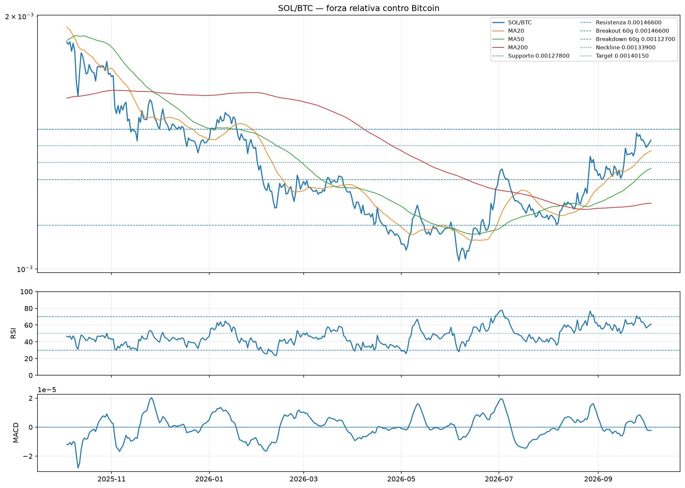
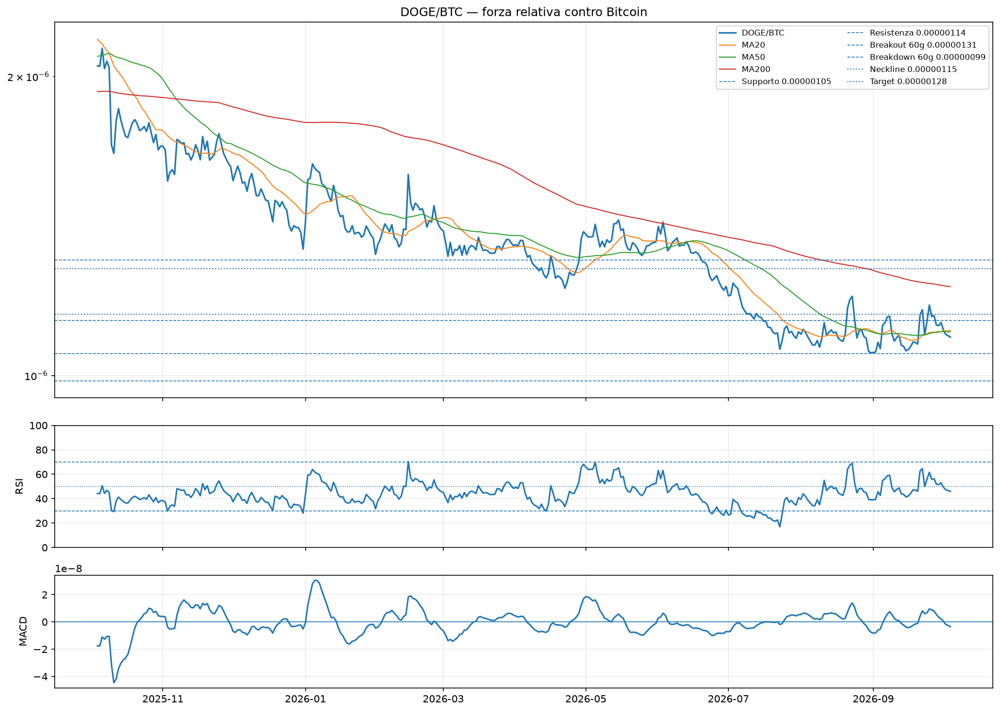

# Forza relativa SOL/BTC e DOGE/BTC

Generato: 2026-10-04 05:32 UTC

Questo modulo controlla se SOL e DOGE stanno davvero battendo Bitcoin. Una salita in USD accompagnata da una coppia ALT/BTC ribassista è spesso soltanto trascinamento di BTC.

**Protezione iniziale:** il candidato relativo è limitato a -1/0/+1, ma il peso nel Global resta **0**. La coppia BTC conferma o indebolisce il tecnico USD; non viene sommata come secondo modulo indipendente.

## Sintesi

| Asset | Coppia | Prezzo | Score raw | Candidato | Peso Global | Forza vs BTC | Confidenza | 30g | Tecnico USD | Lettura combinata |
| --- | --- | --- | --- | --- | --- | --- | --- | --- | --- | --- |
| SOL | SOL/BTC | 0.00142320 | +5 | +1 | 0 | SOVRAPERFORMA BTC | MEDIA | +11,27% | RIALZISTA | CONFERMA FORTE: sale in USD e batte BTC |
| DOGE | DOGE/BTC | 0.00000109 | -4 | -1 | 0 | SOTTOPERFORMA BTC | BASSA | +1,20% | RIALZISTA | SALE SOLO IN USD: BTC resta più forte |

## Matrice di lettura

| ALT/USD | ALT/BTC | Interpretazione |
| --- | --- | --- |
| Rialzista | Rialzista | Conferma migliore: sale e batte BTC |
| Rialzista | Ribassista | Sale soprattutto perché BTC trascina il mercato |
| Ribassista | Rialzista | Forza relativa nascosta / possibile rotazione futura |
| Ribassista | Ribassista | Debolezza completa |

## SOL/BTC

- **Verdetto relativo:** SOVRAPERFORMA BTC (+5)
- **Candidato futuro:** +1; **peso attuale Global: 0**
- **Lettura combinata USD/BTC:** CONFERMA FORTE: sale in USD e batte BTC
- **Struttura:** MASSIMI E MINIMI CRESCENTI
- **Rendimenti relativi:** 7g -1,03%; 30g +11,27%; 90g +11,19%; 180g +22,27%
- **Daily:** RSI 61.35; MA50 0.00131684; MA200 0.00119734
- **Weekly:** MA30 0.00120467; RSI 63.13
- **Livelli:** supporto 0.00127800; resistenza 0.00146600; breakout 60g 0.00146600; breakdown 60g 0.00112700
- **Pattern:** DOPPIO MINIMO / TARGET RAGGIUNTO; neckline 0.00133900; target 0.00140150
- **Fibonacci:** NON ATTIVO — 23.6% a 0.00135815
- **Fonte:** Yahoo Finance SOL-BTC (coppia diretta)
- **Motivi score:** prezzo sopra MA50 daily; prezzo sopra MA200 daily; MA50 daily in salita; prezzo sopra MA30 weekly; struttura con massimi/minimi crescenti; RSI relativo forte; MACD relativo negativo

## DOGE/BTC

- **Verdetto relativo:** SOTTOPERFORMA BTC (-4)
- **Candidato futuro:** -1; **peso attuale Global: 0**
- **Lettura combinata USD/BTC:** SALE SOLO IN USD: BTC resta più forte
- **Struttura:** MASSIMI E MINIMI CRESCENTI
- **Rendimenti relativi:** 7g -4,65%; 30g +1,20%; 90g -10,64%; 180g -16,92%
- **Daily:** RSI 46.02; MA50 0.00000111; MA200 0.00000123
- **Weekly:** MA30 0.00000123; RSI 40.90
- **Livelli:** supporto 0.00000105; resistenza 0.00000114; breakout 60g 0.00000131; breakdown 60g 0.00000099
- **Pattern:** DOPPIO MINIMO / TARGET RAGGIUNTO; neckline 0.00000115; target 0.00000128
- **Fibonacci:** NON ATTIVO — 23.6% a 0.00000112
- **Fonte:** Rapporto sintetico DOGE-USD / BTC-USD (sintetica)
- **Motivi score:** prezzo sotto MA50 daily; prezzo sotto MA200 daily; prezzo sotto MA30 weekly; MA30 weekly in discesa; struttura con massimi/minimi crescenti; MACD relativo negativo

## Backtest storico diagnostico

Il backtest usa soltanto indicatori disponibili alla data del segnale e campiona una volta a settimana. È utile subito, ma non sostituisce il tracker live: le soglie sono state definite prima di vedere il risultato.

| Asset | Orizzonte | Controlli | Accuratezza | Return corretto direzione | Return futuro mediano |
| --- | --- | --- | --- | --- | --- |
| SOL | 7g | 211 | 52,61% | +1,96% | -1,04% |
| SOL | 30g | 207 | 47,83% | +4,57% | +0,63% |
| SOL | 90g | 202 | 52,97% | +9,80% | +3,12% |
| DOGE | 7g | 296 | 55,41% | +1,80% | -1,66% |
| DOGE | 30g | 295 | 52,88% | +1,96% | -3,48% |
| DOGE | 90g | 289 | 54,33% | +6,90% | -9,23% |

## Tracker live e gate futuro

| Asset | Orizzonte | Controlli | Accuratezza | Return corretto | Stato | Peso Global |
| --- | --- | --- | --- | --- | --- | --- |
| SOL | 1g | 46 | 56,52% | +0,29% | LOCKED / RACCOLTA LIVE | 0 |
| SOL | 3g | 44 | 52,27% | +0,70% | LOCKED / RACCOLTA LIVE | 0 |
| SOL | 7g | 41 | 46,34% | +0,71% | LOCKED / RACCOLTA LIVE | 0 |
| SOL | 14g | 35 | 45,71% | +0,59% | LOCKED / RACCOLTA LIVE | 0 |
| SOL | 30g | 32 | 53,12% | -0,41% | LOCKED / RACCOLTA LIVE | 0 |
| DOGE | 1g | 55 | 67,27% | -0,00% | LOCKED / RACCOLTA LIVE | 0 |
| DOGE | 3g | 54 | 57,41% | +0,01% | LOCKED / RACCOLTA LIVE | 0 |
| DOGE | 7g | 54 | 53,70% | -0,56% | LOCKED / RACCOLTA LIVE | 0 |
| DOGE | 14g | 54 | 50,00% | -0,66% | LOCKED / RACCOLTA LIVE | 0 |
| DOGE | 30g | 45 | 51,11% | -0,65% | LOCKED / RACCOLTA LIVE | 0 |

Gate prudente: almeno 30 controlli live a 7 giorni, accuratezza almeno 55% e return corretto direzione positivo. Anche dopo il gate, il contributo futuro non dovrà superare ±1 e dovrà restare dentro la famiglia tecnica.

## File prodotti

- `reports/relative_strength_btc_metrics.csv`
- `reports/relative_strength_btc_history.csv`
- `reports/relative_strength_btc_tracker_metrics.csv`
- `reports/relative_strength_btc_backtest.csv`
