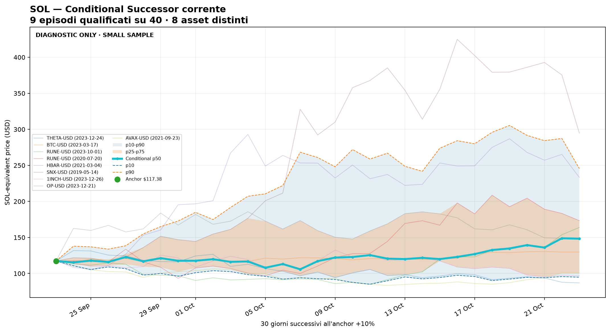
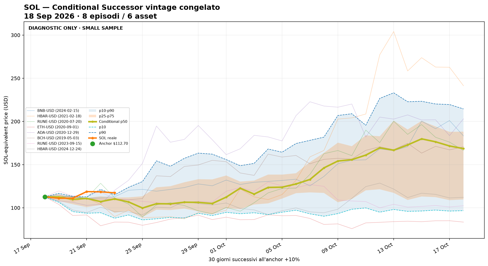

<!-- SCANNER_FORECAST_TRACKER_START -->
# Scanner forecast path / cono probabilistico

Generato: 2026-09-23 10:18:01 UTC

## Snapshot effettivamente usato

| Asset   | Snapshot prezzo   | Generazione snapshot prezzo   | Snapshot match scanner   |
|:--------|:------------------|:------------------------------|:-------------------------|
| BTC | 2026-09-23 | 2026-09-23T10:16:27Z | 2026-09-23 10:16:28 |
| SOL | 2026-09-23 | 2026-09-23T10:16:27Z | 2026-09-23 10:16:28 |
| DOGE | 2026-09-23 | 2026-09-23T10:16:27Z | 2026-09-23 10:16:28 |

La data di generazione del report non sostituisce la data degli input: se gli snapshot locali sono più vecchi, i valori restano riferiti agli snapshot indicati in tabella.

Questo report trasforma i 40 casi simili dello scanner in un cono previsionale leggibile.

Per ogni asset crea:

- banda larga p10-p90
- banda centrale p25-p75
- scenario centrale p50
- prezzo reale sovrapposto quando sono disponibili dati successivi

Correzione importante: il cono ora viene calcolato dai percorsi reali dei match storici, non solo dai percentili finali a 30 giorni. Quindi il grafico non deve più mostrare solo due puntini.

## Ultimo cono previsionale salvato

| Asset   | Data       | Prezzo iniziale   | Direzione scanner   | Casi positivi   | P10 30g     | P25 30g     | P50 30g     | P75 30g      | P90 30g      |
|:--------|:-----------|:------------------|:--------------------|:----------------|:------------|:------------|:------------|:-------------|:-------------|
| BTC | 2026-09-23 | 85.837 $ | SALITA | 70,00% | 68.467,07 $ | 82.823,74 $ | 95.744,10 $ | 105.198,07 $ | 141.546,16 $ |
| SOL | 2026-09-23 | 117,38 $ | INCERTO | 52,50% | 78,36 $ | 94,82 $ | 119,46 $ | 147,86 $ | 197,95 $ |
| DOGE | 2026-09-23 | 0.09968 $ | DISCESA | 32,50% | 0.04922 $ | 0.07406 $ | 0.09372 $ | 0.10620 $ | 0.15465 $ |

## Confronto raw / regime-adjusted

Il cono raw continua a usare i 40 casi dello scanner. Il cono regime-adjusted sceglie una sola coorte nella gerarchia SAME_BTC_AND_ASSET_REGIME → SAME_ASSET_REGIME → SAME_BTC_REGIME. Ogni livello richiede almeno 5 match; le coorti non vengono mai combinate e ogni fallback è dichiarato.

| Asset   | Stato adjusted              | selected_regime_group   |   full_regime_matches |   same_asset_regime_matches |   same_btc_regime_matches |   selected_sample_size |   minimum_required | fallback_level   | selection_reason            | Raw p50 30g   | Adjusted p50 30g   | Raw p90 30g   | Adjusted p90 30g   |
|:--------|:----------------------------|:------------------------|----------------------:|----------------------------:|--------------------------:|-----------------------:|-------------------:|:-----------------|:----------------------------|:--------------|:-------------------|:--------------|:-------------------|
| BTC | INSUFFICIENT_REGIME_MATCHES | NONE | 0 | 1 | 0 | 0 | 5 | NONE | INSUFFICIENT_REGIME_MATCHES | 95.744,10 $ | n/a | 141.546,16 $ | n/a |
| SOL | INSUFFICIENT_REGIME_MATCHES | NONE | 1 | 3 | 1 | 0 | 5 | NONE | INSUFFICIENT_REGIME_MATCHES | 119,46 $ | n/a | 197,95 $ | n/a |
| DOGE | INSUFFICIENT_REGIME_MATCHES | NONE | 0 | 2 | 0 | 0 | 5 | NONE | INSUFFICIENT_REGIME_MATCHES | 0.09372 $ | n/a | 0.15465 $ | n/a |

## Grafici

### BTC

#### Verifica storica e discrepanza

- Cono congelato il **2026-08-24**; verificato fino al **2026-09-23**; stato **COMPLETO 30/30g**.
- Reale **85.825,61 $**; p50 previsto **81.546,42 $**; scarto **5,25%**.
- Errore medio assoluto **2,34%**; massimo **6,21%**; DENTRO p10-p90; DENTRO p25-p75.

#### Cono regime-adjusted

Gruppo selezionato: **NONE**; fallback: **NONE**; motivo: **INSUFFICIENT_REGIME_MATCHES**.

Non disponibile: INSUFFICIENT_REGIME_MATCHES (campione selezionato 0/5 match).

### SOL

<!-- SOL_CONDITIONAL_ANALYSES_START -->
#### SOL — Analisi condizionata -5% → +10%

Queste analisi sono **separate dal cono SOL originale**. Il cono sopra continua a usare normalmente i **40 analoghi più simili a SOL**.

Il filtro condizionato parte proprio da quei 40 casi e conserva soltanto gli episodi che hanno toccato **prima -5%** dal proprio baseline e **successivamente +10% entro 30 giorni**.

##### A. Conditional Successor corrente — dinamico

Questo campione viene ricostruito ad ogni run dai **40 analoghi SOL correnti**. Di conseguenza il numero di episodi qualificati e gli asset possono cambiare giorno per giorno.

**Campione corrente:** 9 episodi qualificati su 40 · 8 asset distinti.

**SMALL SAMPLE / DIAGNOSTIC ONLY:** le frequenze empiriche non sono probabilità calibrate.

###### Confronto diretto a 30 giorni

| Modello | Vintage | N | Target | P10 | P25 | P50 | P75 | P90 |
| --- | --- | ---: | --- | ---: | ---: | ---: | ---: | ---: |
| Cono standard | 2026-09-23 | 40 | 2026-10-23 | 78.36 $ | 94.82 $ | 119.46 $ | 147.86 $ | 197.95 $ |
| Conditional corrente | 2026-09-23 | 9 | 2026-10-23 | 94.81 $ | 100.55 $ | 148.30 $ | 173.31 $ | 245.54 $ |

###### Struttura successiva dei casi correnti

| Classe | Episodi | Frequenza empirica |
| --- | ---: | ---: |
| DIRECT_CONTINUATION | 5 | 55.56% |
| SHALLOW_PULLBACK_THEN_CONTINUATION | 1 | 11.11% |
| DEEP_PULLBACK_THEN_RECOVERY | 1 | 11.11% |
| FAILURE | 2 | 22.22% |
| UNRESOLVED | 0 | 0.00% |

###### Episodi qualificati oggi

| Asset | Match window | -5% hit | +10% anchor | Classe 60d |
| --- | --- | --- | --- | --- |
| THETA-USD | 2023-08-28 → 2023-12-05 | 2023-12-06 | 2023-12-24 | DIRECT_CONTINUATION |
| BTC-USD | 2022-11-10 → 2023-02-17 | 2023-02-24 | 2023-03-17 | DIRECT_CONTINUATION |
| RUNE-USD | 2023-06-11 → 2023-09-18 | 2023-09-21 | 2023-10-01 | FAILURE |
| RUNE-USD | 2020-04-02 → 2020-07-10 | 2020-07-13 | 2020-07-20 | DIRECT_CONTINUATION |
| HBAR-USD | 2020-11-09 → 2021-02-16 | 2021-02-23 | 2021-03-04 | DEEP_PULLBACK_THEN_RECOVERY |
| SNX-USD | 2019-02-01 → 2019-05-11 | 2019-05-12 | 2019-05-14 | DIRECT_CONTINUATION |
| 1INCH-USD | 2023-08-31 → 2023-12-08 | 2023-12-11 | 2023-12-26 | SHALLOW_PULLBACK_THEN_CONTINUATION |
| OP-USD | 2023-08-30 → 2023-12-07 | 2023-12-09 | 2023-12-21 | DIRECT_CONTINUATION |
| AVAX-USD | 2021-06-11 → 2021-09-18 | 2021-09-20 | 2021-09-23 | FAILURE |

##### B. Vintage originale 18 settembre — congelato

Questo invece **non cambia più**. Conserva gli 8 episodi / 6 asset della nostra analisi originale e serve per verificare fuori campione se quella specifica previsione descrive bene SOL.

Anchor della chat: circa **$112.70** il **2026-09-18**.

**SMALL SAMPLE · SENSITIVITY UNSTABLE · DIAGNOSTIC ONLY.**

###### Percentili congelati a 30 giorni

| Modello | Vintage | N | Target | P10 | P25 | P50 | P75 | P90 |
| --- | --- | ---: | --- | ---: | ---: | ---: | ---: | ---: |
| Conditional vintage | 2026-09-18 | 8 | 2026-10-18 | 96.70 $ | 109.70 $ | 168.54 $ | 188.19 $ | 214.50 $ |

###### Verifica contro SOL reale

- Ultimo close disponibile: **2026-09-23** · SOL **117.36 $**.
- Giorno del vintage: **5/30**.
- P50 condizionato previsto per quel giorno: **110.28 $**.
- SOL reale: **FUORI p10-p90** · **FUORI p25-p75**.

###### Parità con l'analisi originale

| Giorno | Mediana return riprodotta |
| ---: | ---: |
| 7 | -11.51% |
| 14 | 8.85% |
| 21 | 36.80% |
| 30 | 49.55% |

###### Gli 8 episodi congelati

| Asset | Match window | -5% hit | +10% anchor |
| --- | --- | --- | --- |
| BNB-USD | 2023-10-13 → 2024-01-20 | 2024-01-23 | 2024-02-15 |
| HBAR-USD | 2020-11-04 → 2021-02-11 | 2021-02-14 | 2021-02-18 |
| RUNE-USD | 2020-03-28 → 2020-07-05 | 2020-07-06 | 2020-07-20 |
| ETH-USD | 2020-05-11 → 2020-08-18 | 2020-08-21 | 2020-09-01 |
| ADA-USD | 2020-09-08 → 2020-12-16 | 2020-12-21 | 2020-12-29 |
| BCH-USD | 2019-01-17 → 2019-04-26 | 2019-04-29 | 2019-05-03 |
| RUNE-USD | 2023-06-01 → 2023-09-08 | 2023-09-11 | 2023-09-15 |
| HBAR-USD | 2024-09-04 → 2024-12-12 | 2024-12-18 | 2024-12-24 |

**Come leggere la differenza:** il cono standard risponde a "cosa hanno fatto i 40 casi più simili?". Il Conditional Successor risponde a una domanda più stretta: "tra quei casi, cosa è successo dopo che avevano già completato -5% → +10%?". Per questo il secondo può risultare più rialzista ma anche molto più fragile statisticamente.

I due modelli **non vengono mediati**, non sostituiscono l'uno l'altro e non modificano Global Confluence, segnali o decisioni.

<!-- SOL_CONDITIONAL_ANALYSES_END -->

#### Verifica storica e discrepanza

- Cono congelato il **2026-08-24**; verificato fino al **2026-09-23**; stato **COMPLETO 30/30g**.
- Reale **117,36 $**; p50 previsto **95,58 $**; scarto **22,79%**.
- Errore medio assoluto **11,29%**; massimo **26,07%**; DENTRO p10-p90; FUORI p25-p75.

#### Cono regime-adjusted

Gruppo selezionato: **NONE**; fallback: **NONE**; motivo: **INSUFFICIENT_REGIME_MATCHES**.

Non disponibile: INSUFFICIENT_REGIME_MATCHES (campione selezionato 0/5 match).

### DOGE

#### Verifica storica e discrepanza

- Cono congelato il **2026-08-24**; verificato fino al **2026-09-23**; stato **COMPLETO 30/30g**.
- Reale **0.09962 $**; p50 previsto **0.09383 $**; scarto **6,17%**.
- Errore medio assoluto **9,36%**; massimo **15,85%**; DENTRO p10-p90; DENTRO p25-p75.

#### Cono regime-adjusted

Gruppo selezionato: **NONE**; fallback: **NONE**; motivo: **INSUFFICIENT_REGIME_MATCHES**.

Non disponibile: INSUFFICIENT_REGIME_MATCHES (campione selezionato 0/5 match).

## Accuratezza percorso scanner

| Asset   | Giorno   |   Controlli | Dentro p10-p90   | Dentro p25-p75   | Errore medio abs vs p50   | Errore medio vs p50   |
|:--------|:---------|------------:|:-----------------|:-----------------|:--------------------------|:----------------------|
| BTC | 1g | 68 | 92,65% | 67,65% | 2,07% | 0,59% |
| BTC | 3g | 65 | 92,31% | 73,85% | 3,29% | 0,97% |
| BTC | 7g | 60 | 91,67% | 68,33% | 5,04% | 2,24% |
| BTC | 14g | 46 | 97,83% | 71,74% | 5,56% | 3,47% |
| BTC | 30g | 23 | 100,00% | 91,30% | 8,90% | 3,16% |
| SOL | 1g | 68 | 80,88% | 60,29% | 2,85% | 1,12% |
| SOL | 3g | 65 | 90,77% | 70,77% | 4,23% | 1,92% |
| SOL | 7g | 60 | 90,00% | 71,67% | 5,82% | 3,89% |
| SOL | 14g | 46 | 84,78% | 71,74% | 8,16% | 7,14% |
| SOL | 30g | 23 | 91,30% | 47,83% | 15,48% | 14,92% |
| DOGE | 1g | 68 | 86,76% | 61,76% | 3,17% | 0,82% |
| DOGE | 3g | 65 | 90,77% | 64,62% | 4,86% | 1,85% |
| DOGE | 7g | 60 | 75,00% | 73,33% | 8,91% | 6,32% |
| DOGE | 14g | 46 | 84,78% | 54,35% | 10,40% | 8,57% |
| DOGE | 30g | 23 | 91,30% | 34,78% | 17,34% | 17,34% |

## Tail / outlier audit

I casi di coda restano nel calcolo. L'audit leave-one-out quantifica la sensibilità dei percentili senza trasformare l'analisi in un filtro discrezionale.

Dettaglio completo: [scanner_forecast_tail_outlier_audit.md](scanner_forecast_tail_outlier_audit.md).

## Calibratore shadow

Il cono ufficiale resta grezzo e invariato. Il calibratore usa soltanto previsioni passate già mature, campionate una volta a settimana per ridurre la falsa indipendenza. Ogni orizzonte si attiva a 30 controlli indipendenti: parte al 25% della correzione stimata e cresce gradualmente fino al 100% a 100 controlli.

| Asset   | Orizzonte   |   Controlli indipendenti |   Soglia | Stato                  | Forza correzione   | Shift p50   |   Scala p10-p90 |
|:--------|:------------|-------------------------:|---------:|:-----------------------|:-------------------|:------------|----------------:|
| BTC | 1g | 12 | 30 | RACCOLTA (18 mancanti) | 0,0% | 0,00% | 1,000 |
| BTC | 3g | 11 | 30 | RACCOLTA (19 mancanti) | 0,0% | 0,00% | 1,000 |
| BTC | 7g | 11 | 30 | RACCOLTA (19 mancanti) | 0,0% | 0,00% | 1,000 |
| BTC | 14g | 10 | 30 | RACCOLTA (20 mancanti) | 0,0% | 0,00% | 1,000 |
| BTC | 30g | 8 | 30 | RACCOLTA (22 mancanti) | 0,0% | 0,00% | 1,000 |
| SOL | 1g | 12 | 30 | RACCOLTA (18 mancanti) | 0,0% | 0,00% | 1,000 |
| SOL | 3g | 11 | 30 | RACCOLTA (19 mancanti) | 0,0% | 0,00% | 1,000 |
| SOL | 7g | 11 | 30 | RACCOLTA (19 mancanti) | 0,0% | 0,00% | 1,000 |
| SOL | 14g | 10 | 30 | RACCOLTA (20 mancanti) | 0,0% | 0,00% | 1,000 |
| SOL | 30g | 8 | 30 | RACCOLTA (22 mancanti) | 0,0% | 0,00% | 1,000 |
| DOGE | 1g | 12 | 30 | RACCOLTA (18 mancanti) | 0,0% | 0,00% | 1,000 |
| DOGE | 3g | 11 | 30 | RACCOLTA (19 mancanti) | 0,0% | 0,00% | 1,000 |
| DOGE | 7g | 11 | 30 | RACCOLTA (19 mancanti) | 0,0% | 0,00% | 1,000 |
| DOGE | 14g | 10 | 30 | RACCOLTA (20 mancanti) | 0,0% | 0,00% | 1,000 |
| DOGE | 30g | 8 | 30 | RACCOLTA (22 mancanti) | 0,0% | 0,00% | 1,000 |

### Confronto fuori campione: grezzo vs shadow

| Asset   | Orizzonte   |   Controlli OOS | MAE grezzo   | MAE shadow   | Miglioramento   | Shadow vince   | Copertura larga grezza   | Copertura larga shadow   |
|:--------|:------------|----------------:|:-------------|:-------------|:----------------|:---------------|:-------------------------|:-------------------------|
| BTC | 1g | 0 | n/a | n/a | n/a | n/a | n/a | n/a |
| BTC | 3g | 0 | n/a | n/a | n/a | n/a | n/a | n/a |
| BTC | 7g | 0 | n/a | n/a | n/a | n/a | n/a | n/a |
| BTC | 14g | 0 | n/a | n/a | n/a | n/a | n/a | n/a |
| BTC | 30g | 0 | n/a | n/a | n/a | n/a | n/a | n/a |
| DOGE | 1g | 0 | n/a | n/a | n/a | n/a | n/a | n/a |
| DOGE | 3g | 0 | n/a | n/a | n/a | n/a | n/a | n/a |
| DOGE | 7g | 0 | n/a | n/a | n/a | n/a | n/a | n/a |
| DOGE | 14g | 0 | n/a | n/a | n/a | n/a | n/a | n/a |
| DOGE | 30g | 0 | n/a | n/a | n/a | n/a | n/a | n/a |
| SOL | 1g | 0 | n/a | n/a | n/a | n/a | n/a | n/a |
| SOL | 3g | 0 | n/a | n/a | n/a | n/a | n/a | n/a |
| SOL | 7g | 0 | n/a | n/a | n/a | n/a | n/a | n/a |
| SOL | 14g | 0 | n/a | n/a | n/a | n/a | n/a | n/a |
| SOL | 30g | 0 | n/a | n/a | n/a | n/a | n/a | n/a |

## Come leggerlo

- Se il prezzo resta dentro p10-p90, lo scanner sta ancora descrivendo bene il range largo.
- Se il prezzo resta dentro p25-p75, lo scanner sta descrivendo bene anche il range centrale.
- Se il prezzo segue p50, il percorso reale è vicino allo scenario normale.
- Se il prezzo esce da p10-p90, il modello statistico dei 40 casi sta perdendo aderenza.
- Questo non sostituisce drawdown e max gain: serve soprattutto a vedere il percorso del return previsto.

Nota: servono almeno 5 controlli prima di dare un peso minimo al cono. Sotto 5 controlli resta solo osservazione.
<!-- SCANNER_FORECAST_TRACKER_END -->