<!-- SCANNER_FORECAST_TRACKER_START -->
# Scanner forecast path / cono probabilistico

Generato: 2026-10-04 14:39:39 UTC

## Snapshot effettivamente usato

| Asset   | Snapshot prezzo   | Generazione snapshot prezzo   | Snapshot match scanner   |
|:--------|:------------------|:------------------------------|:-------------------------|
| BTC | 2026-10-04 | 2026-10-04T14:38:06Z | 2026-10-04 14:38:07 |
| SOL | 2026-10-04 | 2026-10-04T14:38:06Z | 2026-10-04 14:38:07 |
| DOGE | 2026-10-04 | 2026-10-04T14:38:06Z | 2026-10-04 14:38:07 |

La data di generazione del report non sostituisce la data degli input: se gli snapshot locali sono più vecchi, i valori restano riferiti agli snapshot indicati in tabella.

Questo report trasforma i 40 casi simili dello scanner in un cono previsionale leggibile.

Per ogni asset crea:

- banda larga p10-p90
- banda centrale p25-p75
- scenario centrale p50
- prezzo reale sovrapposto quando sono disponibili dati successivi

Correzione importante: il cono ora viene calcolato dai percorsi reali dei match storici, non solo dai percentili finali a 30 giorni. Quindi il grafico non deve più mostrare solo due puntini.

## Ultimo cono previsionale salvato

| Asset   | Data       | Prezzo iniziale   | Direzione scanner   | Casi positivi   | P10 30g     | P25 30g     | P50 30g     | P75 30g      | P90 30g      |
|:--------|:-----------|:------------------|:--------------------|:----------------|:------------|:------------|:------------|:-------------|:-------------|
| BTC | 2026-10-04 | 85.128 $ | INCERTO | 52,50% | 71.907,43 $ | 79.018,12 $ | 85.792,18 $ | 103.670,09 $ | 118.458,49 $ |
| SOL | 2026-10-04 | 121,45 $ | DISCESA | 35,00% | 101,48 $ | 107,19 $ | 113,48 $ | 136,85 $ | 165,52 $ |
| DOGE | 2026-10-04 | 0.09358 $ | DISCESA | 35,00% | 0.07456 $ | 0.08136 $ | 0.08890 $ | 0.11396 $ | 0.13783 $ |

## Confronto raw / regime-adjusted

Il cono raw continua a usare i 40 casi dello scanner. Il cono regime-adjusted sceglie una sola coorte nella gerarchia SAME_BTC_AND_ASSET_REGIME → SAME_ASSET_REGIME → SAME_BTC_REGIME. Ogni livello richiede almeno 5 match; le coorti non vengono mai combinate e ogni fallback è dichiarato.

| Asset   | Stato adjusted   | selected_regime_group   |   full_regime_matches |   same_asset_regime_matches |   same_btc_regime_matches |   selected_sample_size |   minimum_required | fallback_level        | selection_reason              | Raw p50 30g   | Adjusted p50 30g   | Raw p90 30g   | Adjusted p90 30g   |
|:--------|:-----------------|:------------------------|----------------------:|----------------------------:|--------------------------:|-----------------------:|-------------------:|:----------------------|:------------------------------|:--------------|:-------------------|:--------------|:-------------------|
| BTC | AVAILABLE | SAME_BTC_REGIME | 1 | 1 | 13 | 13 | 5 | 2_SAME_BTC_FALLBACK | FALLBACK_TO_SAME_BTC_REGIME | 85.792,18 $ | 83.722,73 $ | 118.458,49 $ | 108.988,18 $ |
| SOL | AVAILABLE | SAME_ASSET_REGIME | 2 | 6 | 12 | 6 | 5 | 1_SAME_ASSET_FALLBACK | FALLBACK_TO_SAME_ASSET_REGIME | 113,48 $ | 124,19 $ | 165,52 $ | 183,11 $ |
| DOGE | AVAILABLE | SAME_BTC_REGIME | 0 | 1 | 9 | 9 | 5 | 2_SAME_BTC_FALLBACK | FALLBACK_TO_SAME_BTC_REGIME | 0.08890 $ | 0.09075 $ | 0.13783 $ | 0.11864 $ |

## Grafici

### BTC

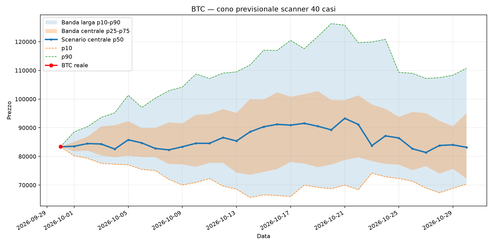

#### Verifica storica e discrepanza

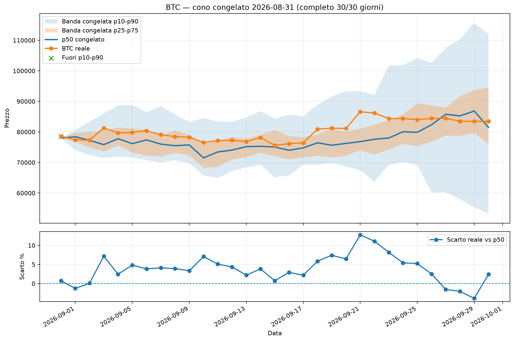

- Cono congelato il **2026-09-04**; verificato fino al **2026-10-04**; stato **COMPLETO 30/30g**.
- Reale **85.124,64 $**; p50 previsto **91.365,78 $**; scarto **-6,83%**.
- Errore medio assoluto **3,30%**; massimo **9,24%**; DENTRO p10-p90; DENTRO p25-p75.

#### Cono regime-adjusted

Gruppo selezionato: **SAME_BTC_REGIME**; fallback: **2_SAME_BTC_FALLBACK**; motivo: **FALLBACK_TO_SAME_BTC_REGIME**.

**WARNING:** coorte fallback meno stringente rispetto a SAME_BTC_AND_ASSET_REGIME.

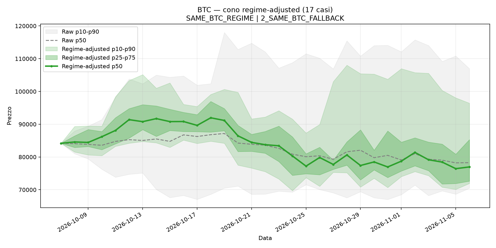

### SOL

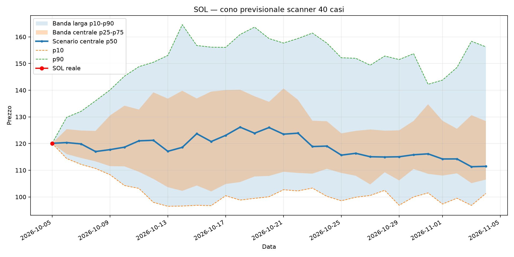

<!-- SOL_CONDITIONAL_ANALYSES_START -->
#### SOL — Analisi condizionata -5% → +10%

Queste analisi sono **separate dal cono SOL originale**. Il cono sopra continua a usare normalmente i **40 analoghi più simili a SOL**.

Il filtro condizionato parte proprio da quei 40 casi e conserva soltanto gli episodi che hanno toccato **prima -5%** dal proprio baseline e **successivamente +10% entro 30 giorni**.

##### A. Conditional Successor corrente — dinamico

Questo campione viene ricostruito ad ogni run dai **40 analoghi SOL correnti**. Di conseguenza il numero di episodi qualificati e gli asset possono cambiare giorno per giorno.

**Campione corrente:** 8 episodi qualificati su 40 · 8 asset distinti.

**SMALL SAMPLE / DIAGNOSTIC ONLY:** le frequenze empiriche non sono probabilità calibrate.

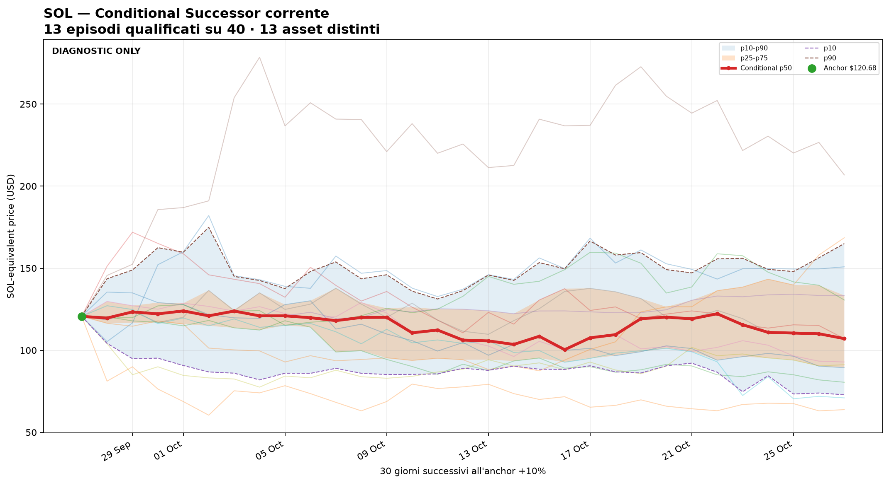

###### Confronto diretto a 30 giorni

| Modello | Vintage | N | Target | P10 | P25 | P50 | P75 | P90 |
| --- | --- | ---: | --- | ---: | ---: | ---: | ---: | ---: |
| Cono standard | 2026-10-04 | 40 | 2026-11-03 | 101.48 $ | 107.19 $ | 113.48 $ | 136.85 $ | 165.52 $ |
| Conditional corrente | 2026-10-04 | 8 | 2026-11-03 | 93.46 $ | 106.78 $ | 127.74 $ | 156.41 $ | 244.79 $ |

###### Struttura successiva dei casi correnti

| Classe | Episodi | Frequenza empirica |
| --- | ---: | ---: |
| DIRECT_CONTINUATION | 4 | 50.00% |
| SHALLOW_PULLBACK_THEN_CONTINUATION | 0 | 0.00% |
| DEEP_PULLBACK_THEN_RECOVERY | 1 | 12.50% |
| FAILURE | 3 | 37.50% |
| UNRESOLVED | 0 | 0.00% |

###### Episodi qualificati oggi

| Asset | Match window | -5% hit | +10% anchor | Classe 60d |
| --- | --- | --- | --- | --- |
| RUNE-USD | 2023-06-21 → 2023-09-28 | 2023-10-06 | 2023-10-23 | DIRECT_CONTINUATION |
| BTC-USD | 2022-11-21 → 2023-02-28 | 2023-03-08 | 2023-03-17 | DIRECT_CONTINUATION |
| KSM-USD | 2023-09-06 → 2023-12-14 | 2023-12-15 | 2023-12-21 | DIRECT_CONTINUATION |
| EOS-USD | 2023-09-08 → 2023-12-16 | 2023-12-19 | 2023-12-27 | FAILURE |
| KAVA-USD | 2023-09-08 → 2023-12-16 | 2023-12-18 | 2023-12-26 | FAILURE |
| XTZ-USD | 2023-09-08 → 2023-12-16 | 2023-12-18 | 2023-12-25 | FAILURE |
| ETC-USD | 2023-09-08 → 2023-12-16 | 2023-12-19 | 2024-01-10 | DIRECT_CONTINUATION |
| AVAX-USD | 2021-06-21 → 2021-09-28 | 2021-10-10 | 2021-10-25 | DEEP_PULLBACK_THEN_RECOVERY |

##### B. Vintage originale 18 settembre — congelato

Questo invece **non cambia più**. Conserva gli 8 episodi / 6 asset della nostra analisi originale e serve per verificare fuori campione se quella specifica previsione descrive bene SOL.

Anchor della chat: circa **$112.70** il **2026-09-18**.

**SMALL SAMPLE · SENSITIVITY UNSTABLE · DIAGNOSTIC ONLY.**

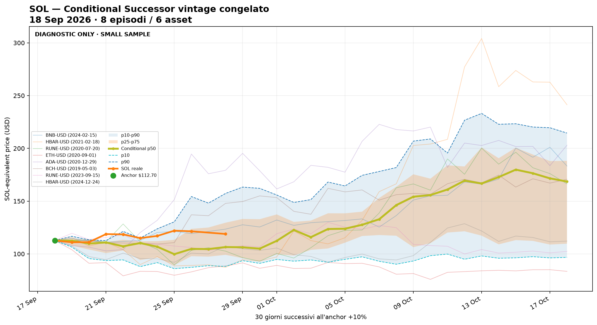

###### Percentili congelati a 30 giorni

| Modello | Vintage | N | Target | P10 | P25 | P50 | P75 | P90 |
| --- | --- | ---: | --- | ---: | ---: | ---: | ---: | ---: |
| Conditional vintage | 2026-09-18 | 8 | 2026-10-18 | 96.70 $ | 109.70 $ | 168.54 $ | 188.19 $ | 214.50 $ |

###### Verifica contro SOL reale

- Ultimo close disponibile: **2026-10-04** · SOL **121.45 $**.
- Giorno del vintage: **16/30**.
- P50 condizionato previsto per quel giorno: **123.57 $**.
- SOL reale: **DENTRO p10-p90** · **DENTRO p25-p75**.

###### Parità con l'analisi originale

| Giorno | Mediana return riprodotta |
| ---: | ---: |
| 7 | -11.51% |
| 14 | 8.85% |
| 21 | 36.80% |
| 30 | 49.55% |

###### Gli 8 episodi congelati

| Asset | Match window | -5% hit | +10% anchor |
| --- | --- | --- | --- |
| BNB-USD | 2023-10-13 → 2024-01-20 | 2024-01-23 | 2024-02-15 |
| HBAR-USD | 2020-11-04 → 2021-02-11 | 2021-02-14 | 2021-02-18 |
| RUNE-USD | 2020-03-28 → 2020-07-05 | 2020-07-06 | 2020-07-20 |
| ETH-USD | 2020-05-11 → 2020-08-18 | 2020-08-21 | 2020-09-01 |
| ADA-USD | 2020-09-08 → 2020-12-16 | 2020-12-21 | 2020-12-29 |
| BCH-USD | 2019-01-17 → 2019-04-26 | 2019-04-29 | 2019-05-03 |
| RUNE-USD | 2023-06-01 → 2023-09-08 | 2023-09-11 | 2023-09-15 |
| HBAR-USD | 2024-09-04 → 2024-12-12 | 2024-12-18 | 2024-12-24 |

**Come leggere la differenza:** il cono standard risponde a "cosa hanno fatto i 40 casi più simili?". Il Conditional Successor risponde a una domanda più stretta: "tra quei casi, cosa è successo dopo che avevano già completato -5% → +10%?". Per questo il secondo può risultare più rialzista ma anche molto più fragile statisticamente.

I due modelli **non vengono mediati**, non sostituiscono l'uno l'altro e non modificano Global Confluence, segnali o decisioni.

<!-- SOL_CONDITIONAL_ANALYSES_END -->

#### Verifica storica e discrepanza

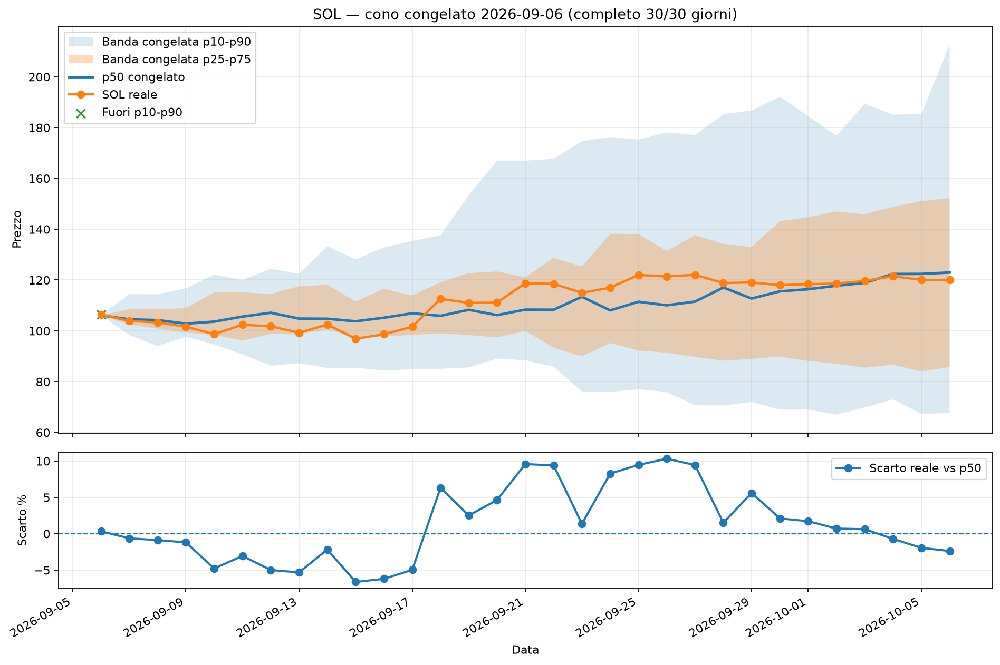

- Cono congelato il **2026-09-04**; verificato fino al **2026-10-04**; stato **COMPLETO 30/30g**.
- Reale **121,45 $**; p50 previsto **118,15 $**; scarto **2,79%**.
- Errore medio assoluto **4,21%**; massimo **15,54%**; DENTRO p10-p90; DENTRO p25-p75.

#### Cono regime-adjusted

Gruppo selezionato: **SAME_ASSET_REGIME**; fallback: **1_SAME_ASSET_FALLBACK**; motivo: **FALLBACK_TO_SAME_ASSET_REGIME**.

**WARNING:** coorte fallback meno stringente rispetto a SAME_BTC_AND_ASSET_REGIME.

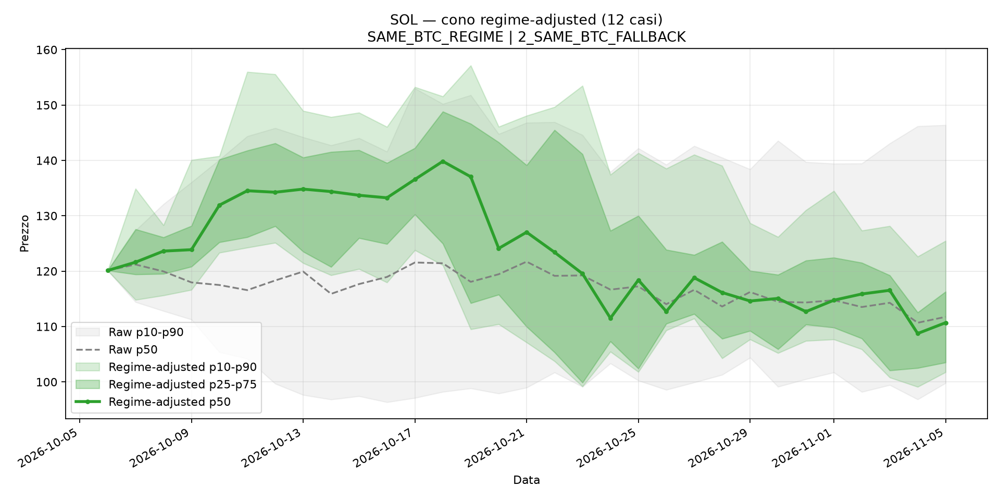

### DOGE

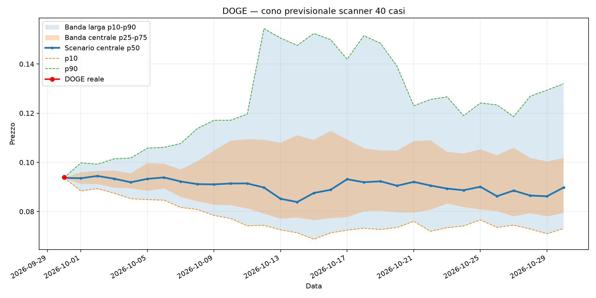

#### Verifica storica e discrepanza

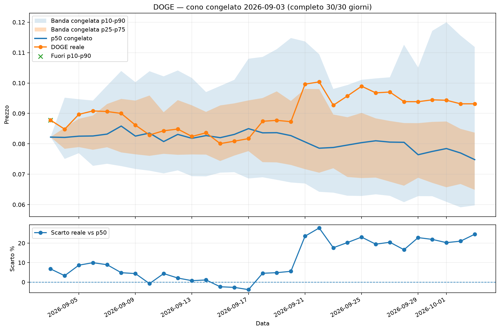

- Cono congelato il **2026-09-04**; verificato fino al **2026-10-04**; stato **COMPLETO 30/30g**.
- Reale **0.09364 $**; p50 previsto **0.07929 $**; scarto **18,10%**.
- Errore medio assoluto **9,34%**; massimo **20,13%**; DENTRO p10-p90; FUORI p25-p75.

#### Cono regime-adjusted

Gruppo selezionato: **SAME_BTC_REGIME**; fallback: **2_SAME_BTC_FALLBACK**; motivo: **FALLBACK_TO_SAME_BTC_REGIME**.

**WARNING:** coorte fallback meno stringente rispetto a SAME_BTC_AND_ASSET_REGIME.

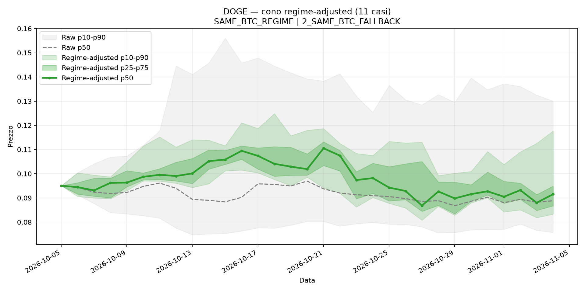

## Accuratezza percorso scanner

| Asset   | Giorno   |   Controlli | Dentro p10-p90   | Dentro p25-p75   | Errore medio abs vs p50   | Errore medio vs p50   |
|:--------|:---------|------------:|:-----------------|:-----------------|:--------------------------|:----------------------|
| BTC | 1g | 78 | 93,59% | 69,23% | 1,97% | 0,42% |
| BTC | 3g | 74 | 93,24% | 75,68% | 3,36% | 0,69% |
| BTC | 7g | 67 | 92,54% | 68,66% | 4,88% | 1,75% |
| BTC | 14g | 54 | 98,15% | 72,22% | 5,57% | 2,13% |
| BTC | 30g | 27 | 100,00% | 92,59% | 8,20% | 2,71% |
| SOL | 1g | 78 | 83,33% | 64,10% | 2,68% | 0,88% |
| SOL | 3g | 74 | 91,89% | 74,32% | 3,92% | 1,76% |
| SOL | 7g | 67 | 91,04% | 73,13% | 5,48% | 3,75% |
| SOL | 14g | 54 | 87,04% | 75,93% | 8,04% | 7,16% |
| SOL | 30g | 27 | 92,59% | 55,56% | 14,43% | 13,95% |
| DOGE | 1g | 78 | 88,46% | 61,54% | 3,05% | 0,52% |
| DOGE | 3g | 74 | 91,89% | 63,51% | 4,68% | 1,45% |
| DOGE | 7g | 67 | 76,12% | 74,63% | 8,50% | 5,88% |
| DOGE | 14g | 54 | 83,33% | 46,30% | 11,35% | 9,79% |
| DOGE | 30g | 27 | 92,59% | 33,33% | 17,78% | 17,78% |

## Tail / outlier audit

I casi di coda restano nel calcolo. L'audit leave-one-out quantifica la sensibilità dei percentili senza trasformare l'analisi in un filtro discrezionale.

Dettaglio completo: [scanner_forecast_tail_outlier_audit.md](scanner_forecast_tail_outlier_audit.md).

## Calibratore shadow

Il cono ufficiale resta grezzo e invariato. Il calibratore usa soltanto previsioni passate già mature, campionate una volta a settimana per ridurre la falsa indipendenza. Ogni orizzonte si attiva a 30 controlli indipendenti: parte al 25% della correzione stimata e cresce gradualmente fino al 100% a 100 controlli.

| Asset   | Orizzonte   |   Controlli indipendenti |   Soglia | Stato                  | Forza correzione   | Shift p50   |   Scala p10-p90 |
|:--------|:------------|-------------------------:|---------:|:-----------------------|:-------------------|:------------|----------------:|
| BTC | 1g | 13 | 30 | RACCOLTA (17 mancanti) | 0,0% | 0,00% | 1,000 |
| BTC | 3g | 13 | 30 | RACCOLTA (17 mancanti) | 0,0% | 0,00% | 1,000 |
| BTC | 7g | 12 | 30 | RACCOLTA (18 mancanti) | 0,0% | 0,00% | 1,000 |
| BTC | 14g | 11 | 30 | RACCOLTA (19 mancanti) | 0,0% | 0,00% | 1,000 |
| BTC | 30g | 9 | 30 | RACCOLTA (21 mancanti) | 0,0% | 0,00% | 1,000 |
| SOL | 1g | 13 | 30 | RACCOLTA (17 mancanti) | 0,0% | 0,00% | 1,000 |
| SOL | 3g | 13 | 30 | RACCOLTA (17 mancanti) | 0,0% | 0,00% | 1,000 |
| SOL | 7g | 12 | 30 | RACCOLTA (18 mancanti) | 0,0% | 0,00% | 1,000 |
| SOL | 14g | 11 | 30 | RACCOLTA (19 mancanti) | 0,0% | 0,00% | 1,000 |
| SOL | 30g | 9 | 30 | RACCOLTA (21 mancanti) | 0,0% | 0,00% | 1,000 |
| DOGE | 1g | 13 | 30 | RACCOLTA (17 mancanti) | 0,0% | 0,00% | 1,000 |
| DOGE | 3g | 13 | 30 | RACCOLTA (17 mancanti) | 0,0% | 0,00% | 1,000 |
| DOGE | 7g | 12 | 30 | RACCOLTA (18 mancanti) | 0,0% | 0,00% | 1,000 |
| DOGE | 14g | 11 | 30 | RACCOLTA (19 mancanti) | 0,0% | 0,00% | 1,000 |
| DOGE | 30g | 9 | 30 | RACCOLTA (21 mancanti) | 0,0% | 0,00% | 1,000 |

### Confronto fuori campione: grezzo vs shadow

| Asset   | Orizzonte   |   Controlli OOS | MAE grezzo   | MAE shadow   | Miglioramento   | Shadow vince   | Copertura larga grezza   | Copertura larga shadow   |
|:--------|:------------|----------------:|:-------------|:-------------|:----------------|:---------------|:-------------------------|:-------------------------|
| BTC | 1g | 0 | n/a | n/a | n/a | n/a | n/a | n/a |
| BTC | 3g | 0 | n/a | n/a | n/a | n/a | n/a | n/a |
| BTC | 7g | 0 | n/a | n/a | n/a | n/a | n/a | n/a |
| BTC | 14g | 0 | n/a | n/a | n/a | n/a | n/a | n/a |
| BTC | 30g | 0 | n/a | n/a | n/a | n/a | n/a | n/a |
| DOGE | 1g | 0 | n/a | n/a | n/a | n/a | n/a | n/a |
| DOGE | 3g | 0 | n/a | n/a | n/a | n/a | n/a | n/a |
| DOGE | 7g | 0 | n/a | n/a | n/a | n/a | n/a | n/a |
| DOGE | 14g | 0 | n/a | n/a | n/a | n/a | n/a | n/a |
| DOGE | 30g | 0 | n/a | n/a | n/a | n/a | n/a | n/a |
| SOL | 1g | 0 | n/a | n/a | n/a | n/a | n/a | n/a |
| SOL | 3g | 0 | n/a | n/a | n/a | n/a | n/a | n/a |
| SOL | 7g | 0 | n/a | n/a | n/a | n/a | n/a | n/a |
| SOL | 14g | 0 | n/a | n/a | n/a | n/a | n/a | n/a |
| SOL | 30g | 0 | n/a | n/a | n/a | n/a | n/a | n/a |

## Come leggerlo

- Se il prezzo resta dentro p10-p90, lo scanner sta ancora descrivendo bene il range largo.
- Se il prezzo resta dentro p25-p75, lo scanner sta descrivendo bene anche il range centrale.
- Se il prezzo segue p50, il percorso reale è vicino allo scenario normale.
- Se il prezzo esce da p10-p90, il modello statistico dei 40 casi sta perdendo aderenza.
- Questo non sostituisce drawdown e max gain: serve soprattutto a vedere il percorso del return previsto.

Nota: servono almeno 5 controlli prima di dare un peso minimo al cono. Sotto 5 controlli resta solo osservazione.
<!-- SCANNER_FORECAST_TRACKER_END -->