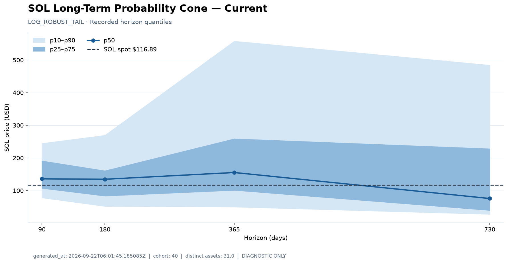
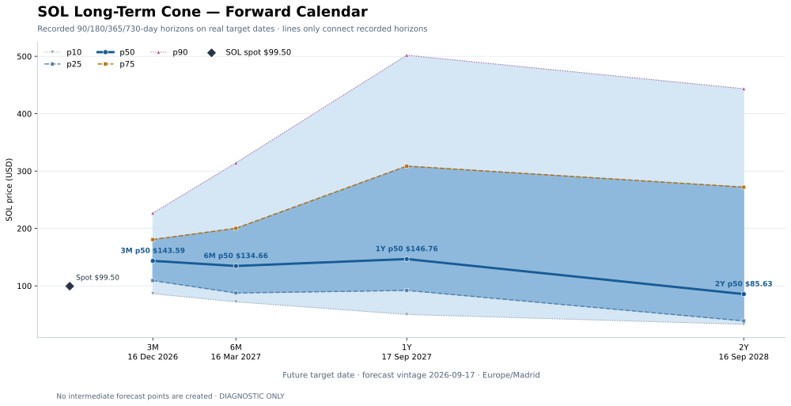
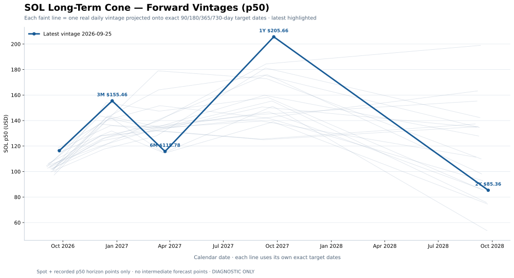
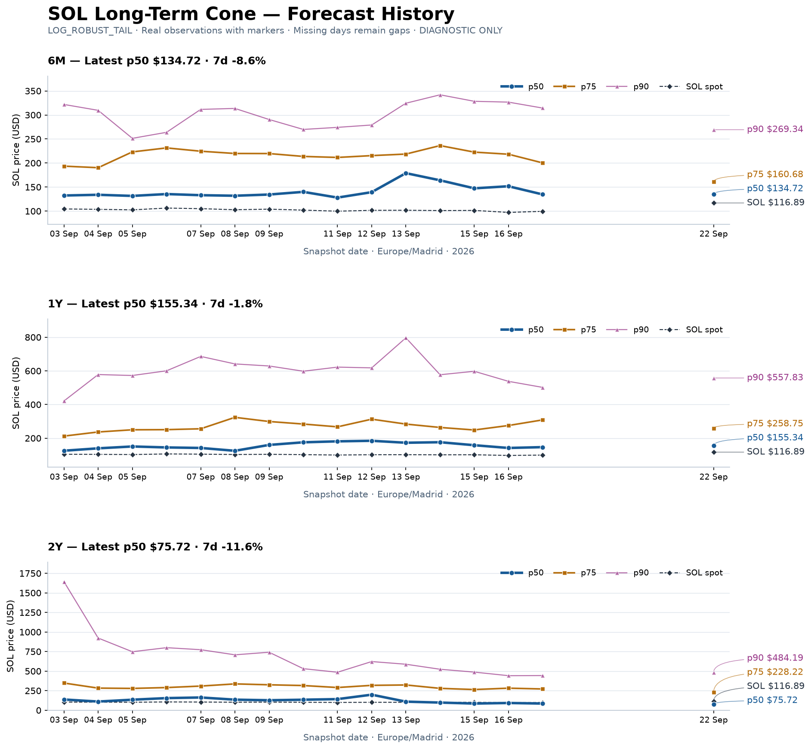
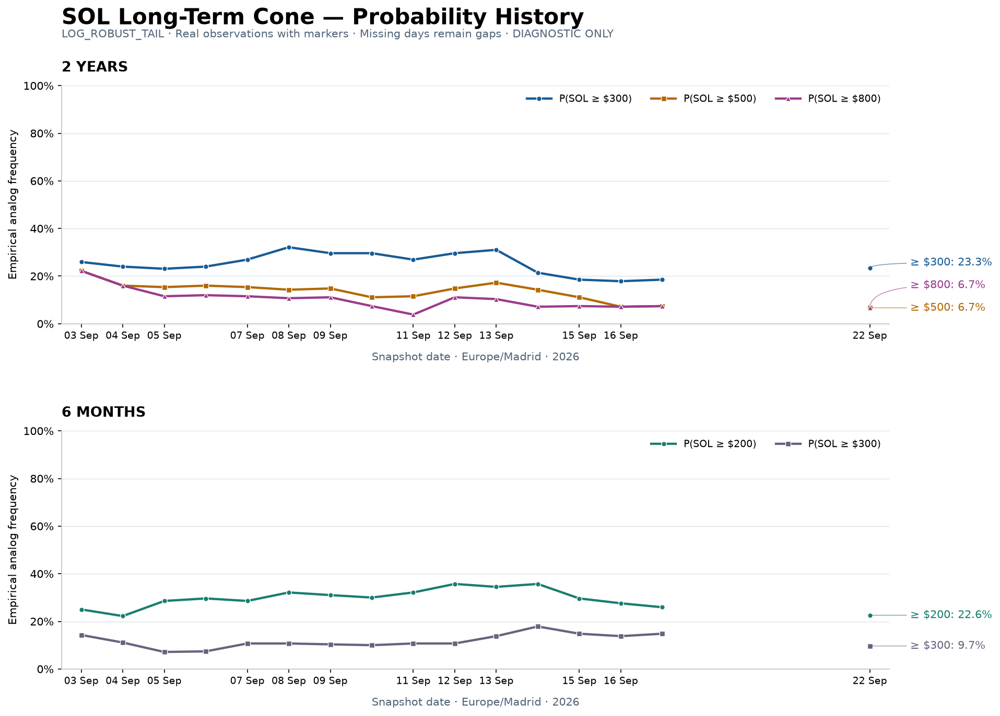

# SOL Long-Term Cone History

Ultimo aggiornamento: **2026-09-22T06:01:45.185085Z**  
SOL spot: **$116.89**  
Cohort: **40** analoghi / **31.0** distinct assets  
**LOG_ROBUST_TAIL · DIAGNOSTIC ONLY**

## Current cone

<!-- SOL_FORWARD_VIEWS_START -->
## Forward calendar

Asse X = date future reali. Le linee mostrano esplicitamente p10, p25, p50, p75 e p90 ai soli orizzonti registrati 90/180/365/730 giorni; i segmenti collegano i punti per leggibilità e non creano previsioni intermedie.

| Horizon | Target date | p10 | p25 | p50 | p75 | p90 |
| --- | --- | ---: | ---: | ---: | ---: | ---: |
| 3M | 2026-12-21 | $78.19 | $107.30 | $136.00 | $191.04 | $244.59 |
| 6M | 2027-03-21 | $52.05 | $83.62 | $134.72 | $160.68 | $269.34 |
| 1Y | 2027-09-22 | $50.08 | $101.17 | $155.34 | $258.75 | $557.83 |
| 2Y | 2028-09-21 | $27.74 | $39.69 | $75.72 | $228.22 | $484.19 |

## Forward vintages

Ogni linea è un vero snapshot giornaliero proiettato sulle sue date target esatte. La linea più marcata è l'ultimo vintage; sono usati spot e p50 registrati, senza punti sintetici.

<!-- SOL_FORWARD_VIEWS_END -->

## Forecast history

Linee tra osservazioni reali consecutive, con marker; i giorni mancanti restano gap.

- p50 = mediana degli analoghi
- p75 = 25% degli analoghi sopra questo livello
- p90 = 10% degli analoghi sopra questo livello
- SOL spot = prezzo osservato nel giorno dello snapshot

## Probability history

Le percentuali rappresentano la frequenza empirica degli analoghi che terminano sopra la soglia all'orizzonte indicato.

## Latest snapshot

| Horizon | p50 | p75 | p90 | P≥300 | P≥500 |
| --- | ---: | ---: | ---: | ---: | ---: |
| 6M | $134.72 | $160.68 | $269.34 | 9.68% | 9.68% |
| 1Y | $155.34 | $258.75 | $557.83 | 19.35% | 12.90% |
| 2Y | $75.72 | $228.22 | $484.19 | 23.33% | 6.67% |

## Recent drift

Ultime 7 daily observations reali (non necessariamente consecutive).

| Date | Spot | 6M p50 | 1Y p50 | 2Y p50 | 2Y P≥300 | 2Y P≥500 |
| --- | ---: | ---: | ---: | ---: | ---: | ---: |
| 2026-09-12 | $101.61 | $139.40 | $184.43 | $198.98 | 29.63% | 14.81% |
| 2026-09-13 | $101.78 | $178.95 | $172.81 | $109.93 | 31.03% | 17.24% |
| 2026-09-14 | $101.11 | $164.06 | $175.95 | $98.11 | 21.43% | 14.29% |
| 2026-09-15 | $101.41 | $147.38 | $158.14 | $85.66 | 18.52% | 11.11% |
| 2026-09-16 | $97.26 | $151.69 | $141.78 | $92.83 | 17.86% | 7.14% |
| 2026-09-17 | $99.50 | $134.66 | $146.76 | $85.63 | 18.52% | 7.41% |
| 2026-09-22 | $116.89 | $134.72 | $155.34 | $75.72 | 23.33% | 6.67% |

## 30-day stability

Finestra: 16 osservazioni reali disponibili negli ultimi 30 giorni di calendario; i giorni mancanti non vengono interpolati.

**storico <30 giorni**: statistiche sullo storico disponibile. Campione insufficiente per interpretare lo status come prova di stabilità duratura.

| Metric | Median | Min | Max | range_pct | Range (pp) |
| --- | ---: | ---: | ---: | ---: | ---: |
| 6M p50 | $134.69 | $128.08 | $178.95 | 37.77% | — |
| 1Y p50 | $153.00 | $124.98 | $184.43 | 38.86% | — |
| 2Y p50 | $131.20 | $75.72 | $198.98 | 93.95% | — |
| 2Y P≥300 | 24.96% | 17.86% | 32.14% | — | 14.29 |
| 2Y P≥500 | 14.55% | 6.67% | 22.22% | — | 15.56 |

**FORECAST_DRIFT_STATUS=VOLATILE**

`range_pct = 100 × (max − min) / median` per i prezzi. Le variazioni delle probabilità sono punti percentuali (pp).

- **STABLE**: 2Y p50 range_pct <20% e 2Y P≥300 range <10 pp.
- **VOLATILE**: 2Y p50 range_pct ≥40% oppure 2Y P≥300 range ≥20 pp.
- **CAUTION**: gli altri casi, inclusi dati insufficienti per classificare.

Indicatore diagnostico; non va usato per decisioni operative. Una sola osservazione ha range zero e non dimostra stabilità temporale.

## Methodology

- Stesso cohort canonico Legacy, con massimo 40 analoghi; il cohort non viene modificato.
- Vista LOG_ROBUST_TAIL e asset-level robustification già prodotte dal Long-Term Cone.
- Probabilities = empirical analog frequencies, espresse in percentuale; non probabilità calibrate.
- Diagnostic only. Nessun modello ricalcolato per questa pagina, nessun segnale o decisione operativa.
- Daily observation in Europe/Madrid: all'importazione iniziale si sceglie l'ultimo snapshot qualificante disponibile per ogni data locale. Alla prima pubblicazione la riga diventa immutabile: i successivi run non la sostituiscono e non duplicano la giornata.
- I giorni senza snapshot reale restano assenti; i valori mancanti sono indicati con —, senza stime o interpolazione.
- Ogni osservazione produce forecast vintages con target_date = forecast_date + target_horizon_days. Nessun outcome futuro viene inventato o maturato anticipatamente.

## Data availability

FIRST_REAL_SNAPSHOT=2026-09-03T17:03:34.597672Z  
FIRST_AVAILABLE_LONG_TERM_SNAPSHOT=2026-09-03T17:03:34.597672Z  
LATEST_SNAPSHOT=2026-09-22T06:01:45.185085Z  
DAILY_ROWS=16

Fonti autoritative: `sol_long_term_probability_cone.json`, `sol_long_term_probability_cone_history.jsonl` e snapshot immutabili in `sol_long_term_probability_cone_history/` nel publisher canonico.

Download: [daily observation ledger](sol_long_term_daily_history.csv) · [forecast vintages](forecast_vintages.csv).
