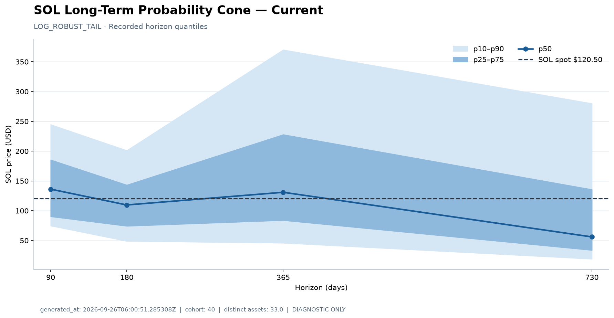
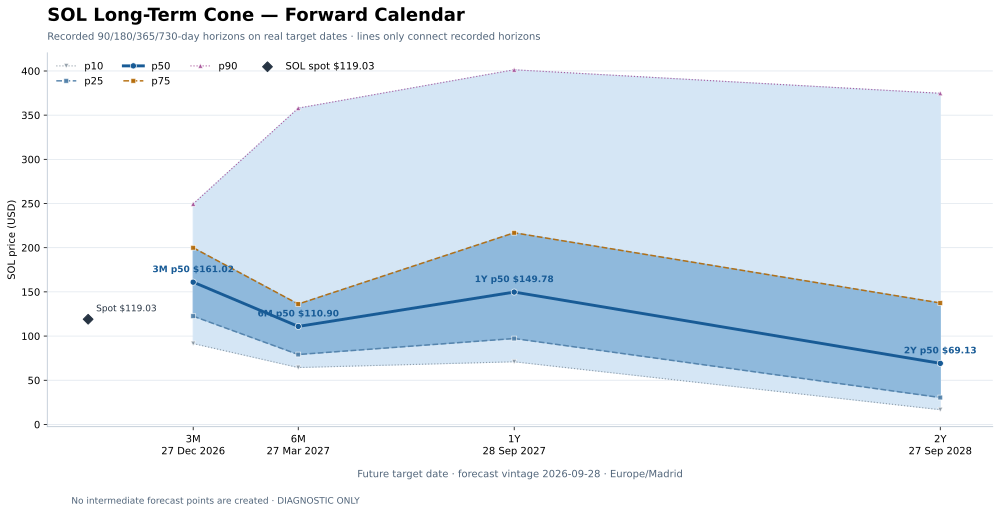
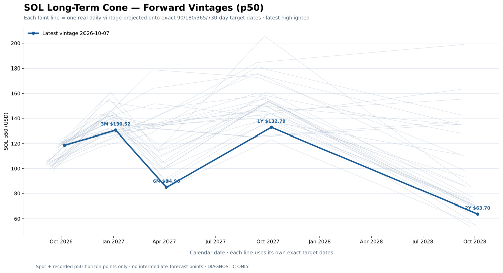
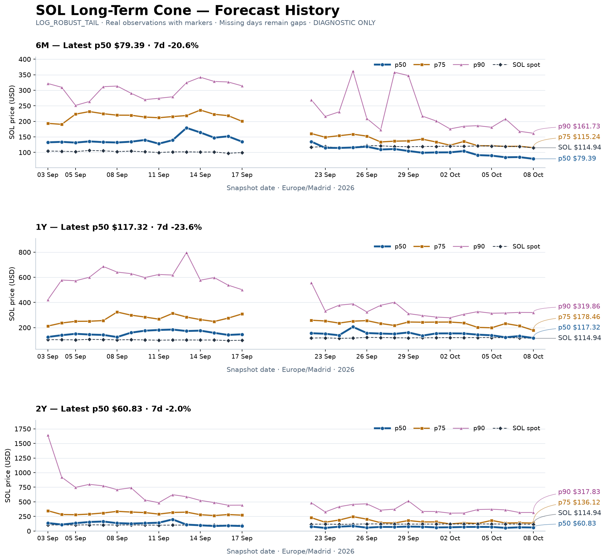
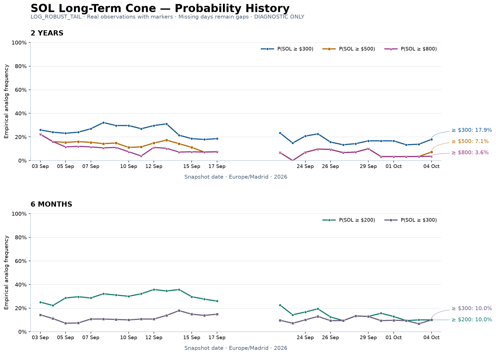

# SOL Long-Term Cone History

Ultimo aggiornamento: **2026-10-09T06:02:19.292155Z**  
SOL spot: **$110.26**  
Cohort: **40** analoghi / **32.0** distinct assets  
**LOG_ROBUST_TAIL · DIAGNOSTIC ONLY**

## Current cone

<!-- SOL_FORWARD_VIEWS_START -->
## Short-term context (30 giorni)

Questa pagina resta il **Long-Term Cone** (3M/6M/1Y/2Y). Il blocco seguente riporta, senza ricalcolarli o mescolarli, gli ultimi output dello scanner SOL a 30 giorni.

Dati short-term non disponibili in questo snapshot; il Long-Term Cone resta invariato.

[Apri il report short-term](../latest_report.md)

## Forward calendar

Asse X = date future reali. Le linee mostrano esplicitamente p10, p25, p50, p75 e p90 ai soli orizzonti registrati 90/180/365/730 giorni; i segmenti collegano i punti per leggibilità e non creano previsioni intermedie.

| Horizon | Target date | p10 | p25 | p50 | p75 | p90 |
| --- | --- | ---: | ---: | ---: | ---: | ---: |
| 3M | 2027-01-07 | $73.67 | $91.98 | $113.02 | $142.91 | $181.10 |
| 6M | 2027-04-07 | $43.44 | $57.11 | $74.24 | $104.65 | $140.42 |
| 1Y | 2027-10-09 | $55.31 | $65.40 | $100.10 | $155.67 | $253.04 |
| 2Y | 2028-10-08 | $15.49 | $25.19 | $66.03 | $164.87 | $384.06 |

## Forward vintages

Ogni linea è un vero snapshot giornaliero proiettato sulle sue date target esatte. La linea più marcata è l'ultimo vintage; sono usati spot e p50 registrati, senza punti sintetici.

<!-- SOL_FORWARD_VIEWS_END -->

## Forecast history

Linee tra osservazioni reali consecutive, con marker; i giorni mancanti restano gap.

- p50 = mediana degli analoghi
- p75 = 25% degli analoghi sopra questo livello
- p90 = 10% degli analoghi sopra questo livello
- SOL spot = prezzo osservato nel giorno dello snapshot

## Probability history

Le percentuali rappresentano la frequenza empirica degli analoghi che terminano sopra la soglia all'orizzonte indicato.

## Latest snapshot

| Horizon | p50 | p75 | p90 | P≥300 | P≥500 |
| --- | ---: | ---: | ---: | ---: | ---: |
| 6M | $74.24 | $104.65 | $140.42 | 3.12% | 0.00% |
| 1Y | $100.10 | $155.67 | $253.04 | 6.25% | 0.00% |
| 2Y | $66.03 | $164.87 | $384.06 | 18.52% | 3.70% |

## Recent drift

Ultime 7 daily observations reali (non necessariamente consecutive).

| Date | Spot | 6M p50 | 1Y p50 | 2Y p50 | 2Y P≥300 | 2Y P≥500 |
| --- | ---: | ---: | ---: | ---: | ---: | ---: |
| 2026-10-03 | $119.62 | $104.33 | $153.21 | $69.35 | 13.79% | 3.45% |
| 2026-10-04 | $120.80 | $91.28 | $144.00 | $70.28 | 17.86% | 7.14% |
| 2026-10-05 | $120.56 | $89.69 | $138.91 | $69.89 | 18.52% | 7.41% |
| 2026-10-06 | $119.47 | $84.37 | $123.03 | $54.57 | 13.79% | 6.90% |
| 2026-10-07 | $118.63 | $84.96 | $132.79 | $63.70 | 10.34% | 3.45% |
| 2026-10-08 | $114.94 | $79.39 | $117.32 | $60.83 | 10.71% | 3.57% |
| 2026-10-09 | $110.26 | $74.24 | $100.10 | $66.03 | 18.52% | 3.70% |

## 30-day stability

Finestra: 26 osservazioni reali disponibili negli ultimi 30 giorni di calendario; i giorni mancanti non vengono interpolati.

**storico <30 giorni**: statistiche sullo storico disponibile. Campione insufficiente per interpretare lo status come prova di stabilità duratura.

| Metric | Median | Min | Max | range_pct | Range (pp) |
| --- | ---: | ---: | ---: | ---: | ---: |
| 6M p50 | $112.67 | $74.24 | $178.95 | 92.94% | — |
| 1Y p50 | $152.92 | $100.10 | $205.66 | 69.03% | — |
| 2Y p50 | $71.59 | $53.69 | $198.98 | 202.93% | — |
| 2Y P≥300 | 17.86% | 10.34% | 31.03% | — | 20.69 |
| 2Y P≥500 | 7.14% | 0.00% | 17.24% | — | 17.24 |

**FORECAST_DRIFT_STATUS=VOLATILE**

`range_pct = 100 × (max − min) / median` per i prezzi. Le variazioni delle probabilità sono punti percentuali (pp).

- **STABLE**: 2Y p50 range_pct <20% e 2Y P≥300 range <10 pp.
- **VOLATILE**: 2Y p50 range_pct ≥40% oppure 2Y P≥300 range ≥20 pp.
- **CAUTION**: gli altri casi, inclusi dati insufficienti per classificare.

Indicatore diagnostico; non va usato per decisioni operative. Una sola osservazione ha range zero e non dimostra stabilità temporale.

## Methodology

- Stesso cohort canonico Legacy, con massimo 40 analoghi; il cohort non viene modificato.
- Vista LOG_ROBUST_TAIL e asset-level robustification già prodotte dal Long-Term Cone.
- Probabilities = empirical analog frequencies, espresse in percentuale; non probabilità calibrate.
- Diagnostic only. Nessun modello ricalcolato per questa pagina, nessun segnale o decisione operativa.
- Daily observation in Europe/Madrid: all'importazione iniziale si sceglie l'ultimo snapshot qualificante disponibile per ogni data locale. Alla prima pubblicazione la riga diventa immutabile: i successivi run non la sostituiscono e non duplicano la giornata.
- I giorni senza snapshot reale restano assenti; i valori mancanti sono indicati con —, senza stime o interpolazione.
- Ogni osservazione produce forecast vintages con target_date = forecast_date + target_horizon_days. Nessun outcome futuro viene inventato o maturato anticipatamente.

## Data availability

FIRST_REAL_SNAPSHOT=2026-09-03T17:03:34.597672Z  
FIRST_AVAILABLE_LONG_TERM_SNAPSHOT=2026-09-03T17:03:34.597672Z  
LATEST_SNAPSHOT=2026-10-09T06:02:19.292155Z  
DAILY_ROWS=33

Fonti autoritative: `sol_long_term_probability_cone.json`, `sol_long_term_probability_cone_history.jsonl` e snapshot immutabili in `sol_long_term_probability_cone_history/` nel publisher canonico.

Download: [daily observation ledger](sol_long_term_daily_history.csv) · [forecast vintages](forecast_vintages.csv).
